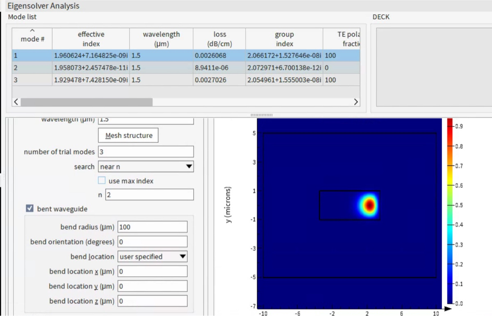
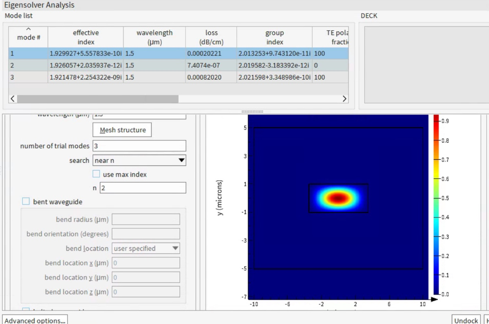
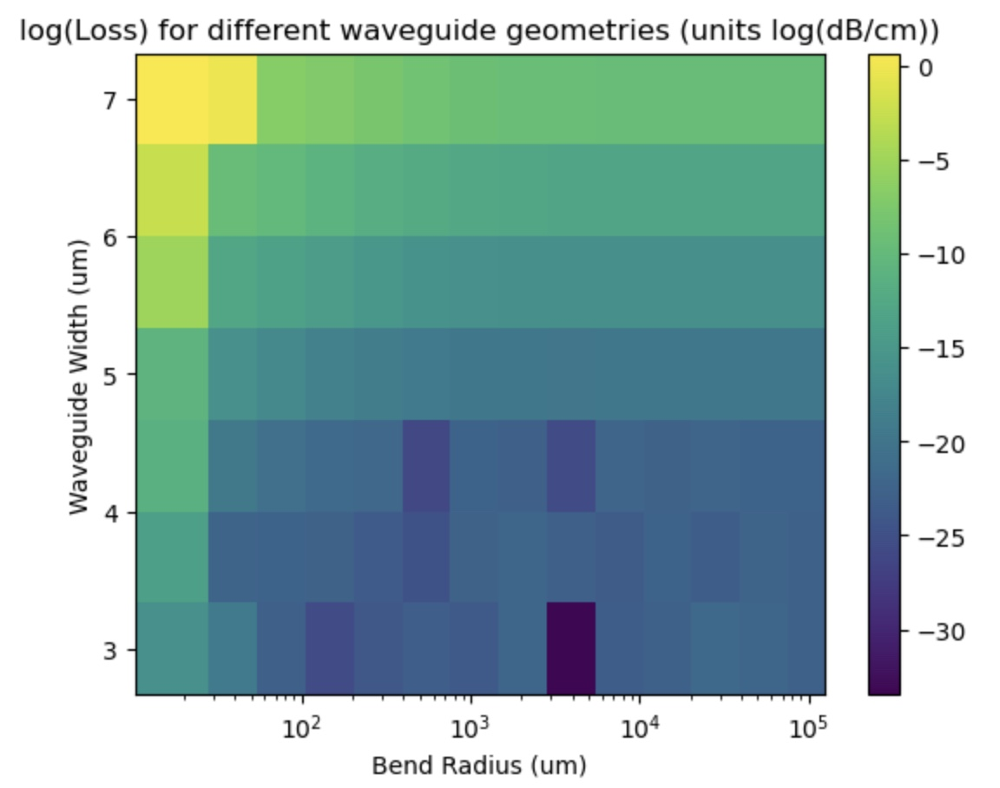

# 2024-10-02 bent waveguide loss
This has been a long time coming (I think I am three weeks late on doing this)?  The purpose of this document is to describe how I calculated the loss of my bent waveguide modes.  The videos below are what I used:

[Bend Analysis with Lumerical Mode — Lesson 3](https://www.youtube.com/watch?v=U-v1ySEDZ08)

For mode overlap loss (as bent modes will have slightly differnet propagation constants).  

With 100 um bend radius

With no bend

So the bend of 100 um caused loss to go up by 10X.  Now we have all we need for a sweep.  

Now lets do a quick scan of different etch depths.  Generally, I would expect some incomplete etching to increase the loss, as the confinement is worse.  Below is the full plots for a lossless core of bend waveguide losses

We are probably going to use a sidewall height of ~1um, so anything above a 100 um bending radius is good.  Because our features are huge anyway, I say we use a 400 um bend radius just to be safe.