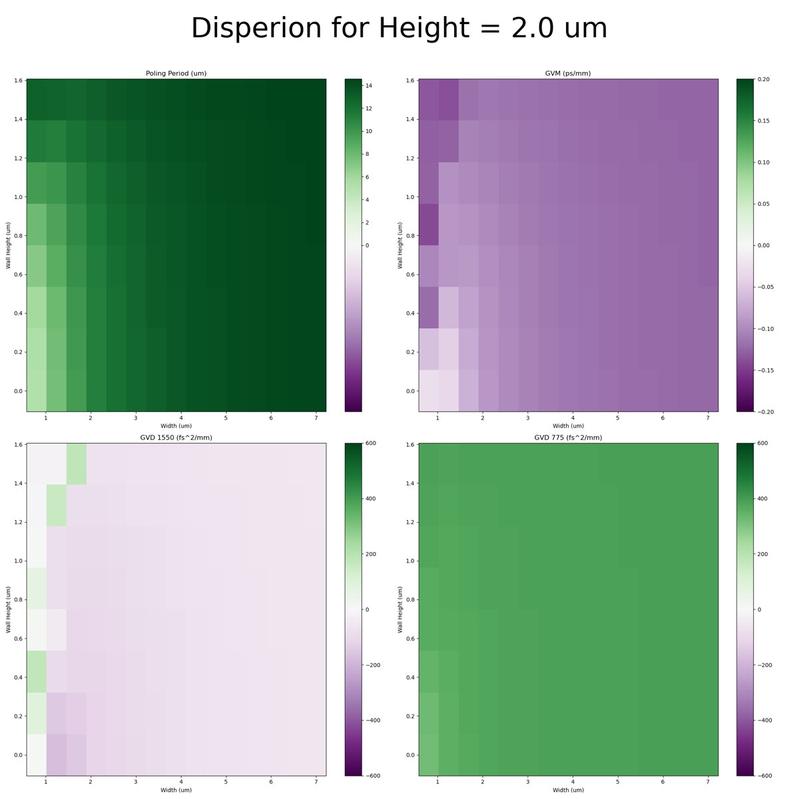

# 2024-10-04 gds file design for first etched svm waveguides
I have written the code to generate a GDS file for the etched waveguides.  Now, I need to give some thought to what I want to generate. Below is the dispersion plot that is relevant for us

In reality, it does not matter a tonne what we use.  There should be a slight modificaiton here for the fact that we will be using RTA annealed SiNx, but that will only help us.  Anyway, below are the relevant loss plots

I will probably go for a sidewall height of ~1um.  I want to go deep enough that we limit bend loss (in case I am really wrong) but not so deep that I screw up the TEOS filling.  I really want to keep my aspect ratio below 1.  Oscar says he uses 3um of buffer on each side, so lets do that (which, for a 1um oxide, means reasonable etching and aspect ratio).  Based on our dispersion diagram, lets scan between a waveguide width of 3um to 8um.  Lets do 10 waveguides in that range.

Now, for the pads we want to create.  I say two pads with our straight waveguides.  Each waveguide should be 2.5 cm long just to give us lots of room for cleaving.  For the curved structures, lets do two pads with 4 curved waveguides, each with a radius of 400 um.  Lets make each pad here have a width of 1cm.  This means, we should probably put 4 curved strcutures (with 3 switch backs).  We should probably do 4 to 7 as the width there.

Below is a screenshot of the parameters I used

Below is the GDS file I produced

[pad1 pass1.gds](https://resv2.craft.do/user/full/c10b6666-b4fd-53a0-9177-1696a144b2d8/doc/59231E6B-F90B-4063-BA7E-63E3926DC82E/645EFF32-A9B3-4FC7-B420-8A2768BD3173_2/0dtyJUf2KoXTjsFaggvhHxORViwEIwoaViDvZqtp61Ez/pad1%20pass1.gds)

And the drawing below shows where I want to claeve

Below is also evidence that the joints are fine

Comment by [`Ryotatsu Yanagimoto`](craftdocs://users?id=aa2c0de3-4c5f-8aaf-eaf7-3b949f6279ad) 

By using the “local poling trick”, we can map the distribution of the light on waveguide pretty reliably, which should give us an accurate estimate for the loss of the waveguide. It is worth thinking what are other things we can learn by using such programmability, and what are the set of structures that let us extract greatest amount of information.

