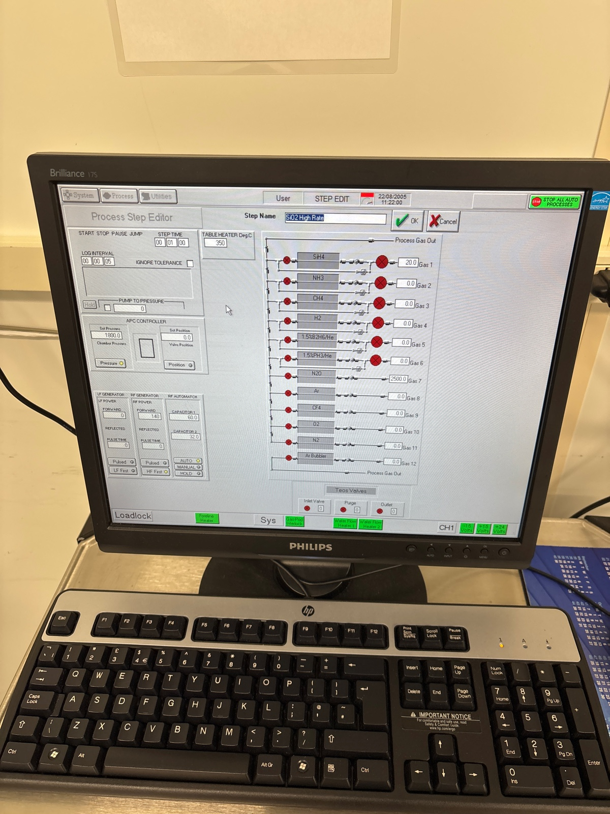
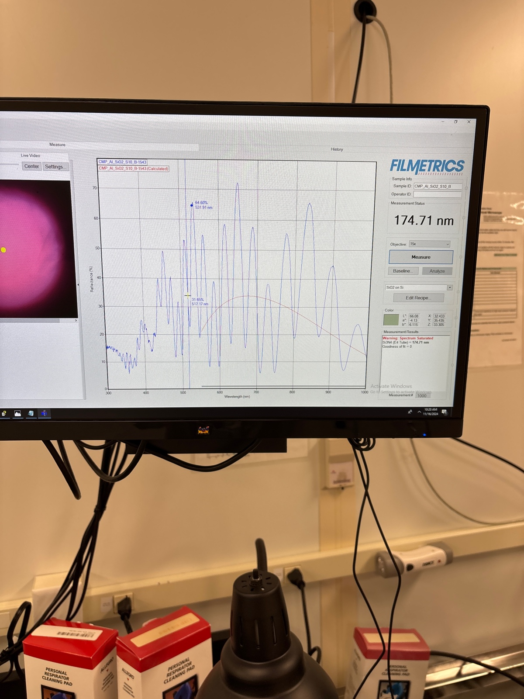
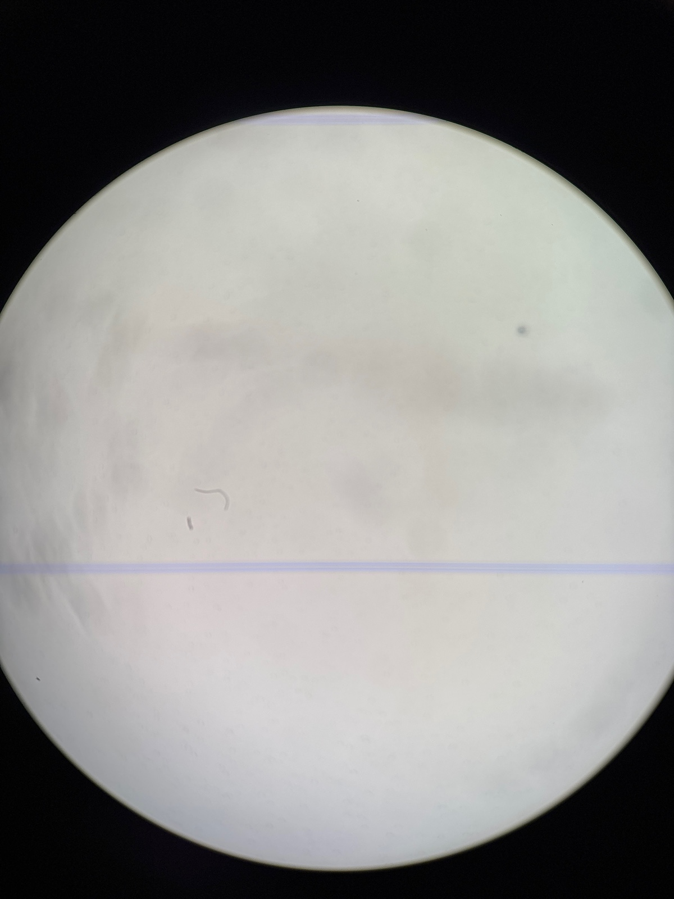
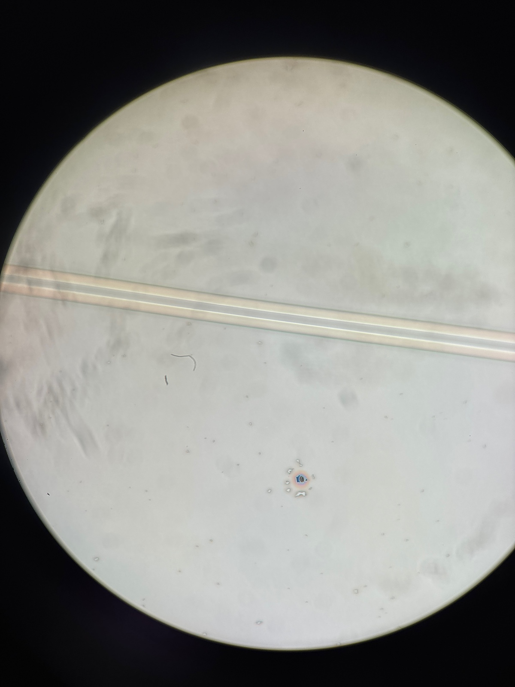

# 2024-11-16 depositing electrical layers on first fully etched sinx waveguides
Ryo and I previously etched our first low loss SiNx waveguides for dispersion engineering (which is pretty exciting that we were so good on the first try).  Today, we will be wet etching our Cr mask off and depositing TEOS, SRN, and ITO.  Put together, this will be our first overpowerered waveguide.  I cleaved half the remaining wafer (so we have some chip with both straight and bent waveguides.  I am saving some waveguides as well in case something goes wrong today or we want to try something different in the future.  We should have plenty of test structures for this first go as long as we don’t pump them too hard.

I am currently leaving the waveguides in the Cr etching solution for 10 minutes.  This is a fresh batch of Cr etchant, so it should go fairly fast.  I will then do 15 seconds dip in HF and look under the microscope.  In the meantime, I am going a 7 minute preclean and 1 minute high rate oxide season of the PECVD chamber.  We currently have ~250 nm of pad oxide.  I clocked the TEOS dep rate at 50 nm/min, Oscar found it to be 40.  I say we do 20 minutes, as we will get plenty of film that way (keeping in mind that we are depositing ontop of an existing pad oxide layer.  

Before season

After wet etching

There is a bit of dust, so I am going to spin clean

That did not remove dust

Let’s do a few more mins of Cr etch 

I think we should always just default to 20 mins Cr etch

Mostly no more dust

Before TEOS

In the future, don’t mix Cr etch and Hf.  In totaly, I did a bit over 20 minutes of Cr etch and 30 seconds HF dip.  In the future, don’t do HF dip until you see all the particles rae gone (though I don’t think this should matter a tonne).

After TEOS

# Note added by [`Ryotatsu Yanagimoto`](craftdocs://users?id=aa2c0de3-4c5f-8aaf-eaf7-3b949f6279ad) 

11:54 PECVD plasma looked weird, we don’t proceed. Reporting the issue to Jeremy.

The PECVD broke, but I am back a couple days layer to resume.  First, I am going to do a 5 minute preclean of PECVD and spin clean the piece.  I am also going to add witness sample to the mix

Before SRN 1 season

According to Ryo’s instructions, he would like me to deposit 3 um of SRN.  This corresponds to 2 depositions of SRN8 for 26 minutes each!

Before deposition 

During deposition 

Before season 2

Before deposition 

Ellipsometer of witness sample after 1 deposition 

More than expected. Either way, more is not worse 

During deposition 2

After deposition

waveguides look good, I just see a lot of dust 

Might be free bad Cr etch. Either way, thinks generally look ok

I am now running ITO room temp deposition

I will zero the sensor before the crucible opens (as the plasma will give us a fake detection) 

End of deposition

We got 20 nm.