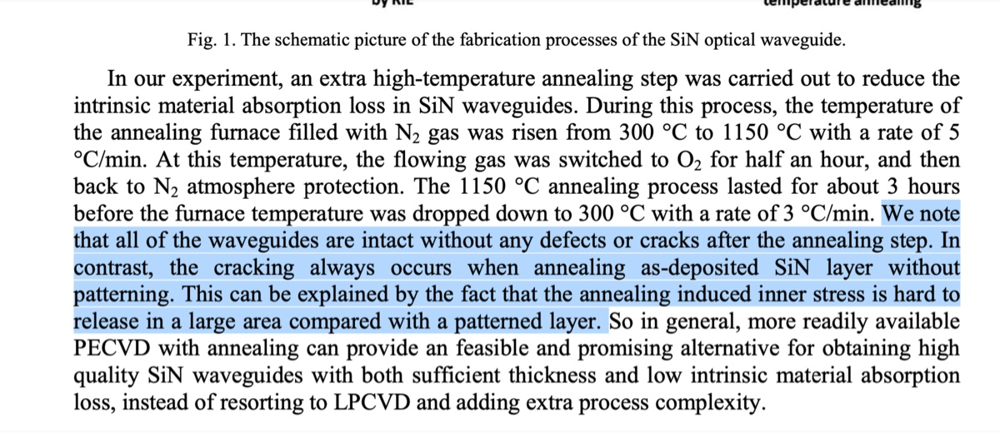
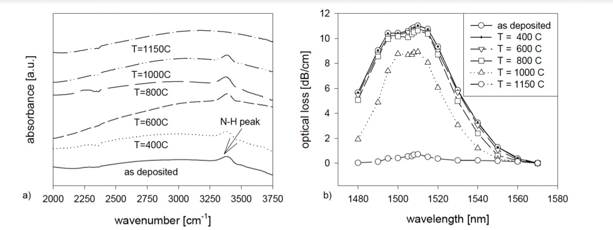
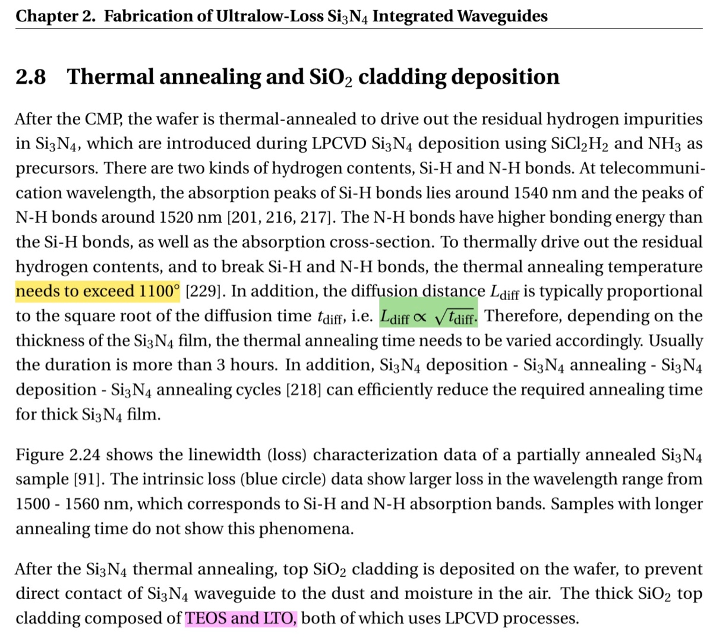
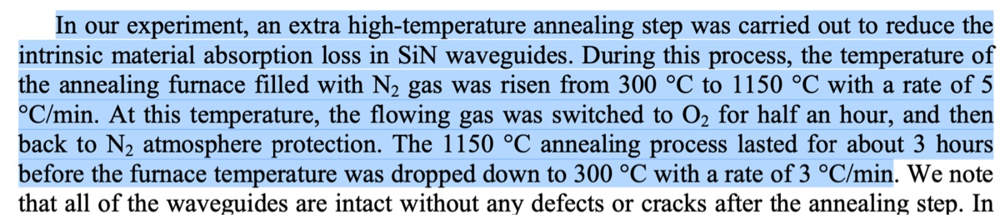

# 2024-11-17 svm annealing at 1100
According to Ryo, it seems that we can anneal SiNx at roughly 1100 C and get rid of N-H bonds.  Below are some excerpts that seem to suggest why we need to go to these tempuratures.

At some level, I am a bit skeptical of whether we will see a huge loss reduction, because of the thickness of our waveguides.  I just don’t think all the hydrogen will diffuse out.  Then again, we should see some loss reduction.  Moreover, stress might be an issue.  It seems that other people use much thinner waveguides.  It is also not ideal that we don’t have more etched trenches to take the stress cracks either.  The hope basically is that the waveguides don’t crack even if the rest of the film starts to crack.  Our annealing recipe is below

Gas: N2

Load: 300

Ramp: 160 mins (300 → 1100 at 5 C/min)

Anneal: 180 mins (3 hrs at 1100)

Ramp down: A while (Overnight, I will just log off)

According to the CNF website, it seems that the furnace I want to use only goes to 1100 C ([https://www.cnfusers.cornell.edu/node/63](https://www.cnfusers.cornell.edu/node/63)).  We can manually set the tempurature setpoints in the software.

We are going to start by cleaving and wet etching our samples

# Wet etching

10:12 20 mins Cr etch

# Furnace

We use this tube

In files, we open

Open tube 3

Choose recipe. We then change the temperature and time.

Unload at 300

Load at 300

Ramp is 1100

Ramp time 160 mins

Anneal 180 mins

Unload at 300

120 mins

Go to files

Hit save

Overwrite the existing recipe

ITS onrhe desktop

Download

Begin download

Operate

Select recipe

Select the recipe

We hit run whenever is ready

10:41 Hitting run

We manually unload

Switch to auto mode. 2

Step lets you skip

Decreasing load speed

5 ipm 

After anneal

I then cracked it open and logged off

It’s hot

It seems to be cooling off

It is dropping a bit fast, but oh well

After 4 hours

Now time to unload at 3 inches per minute

During unload

Image of waveguides

Very close

Other piece

Top view

Observation a couple of days later to see if there is transient solution

More of those delamination center than I remember 

But cracks did stop where expected

