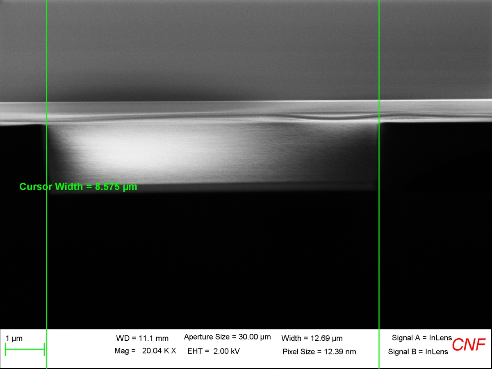
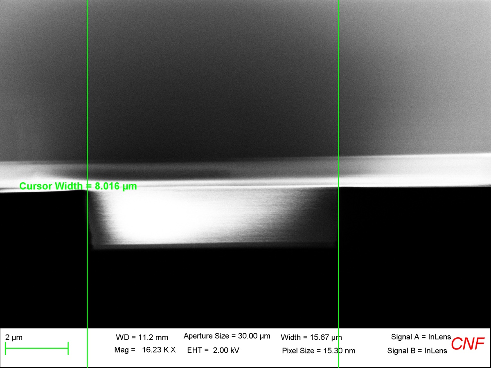
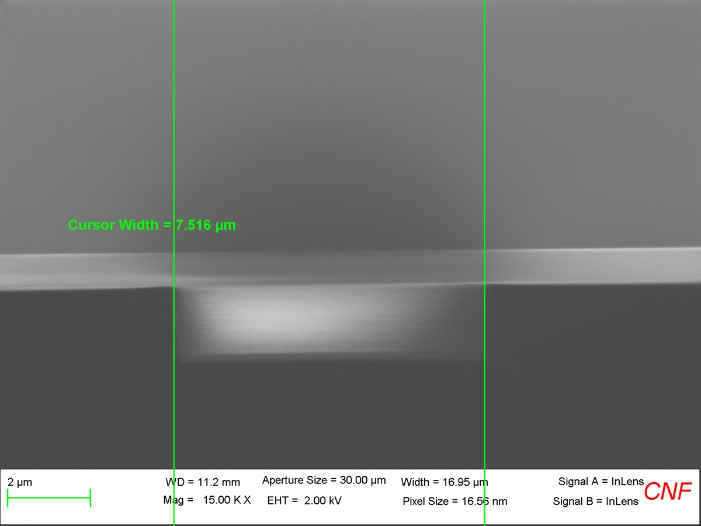
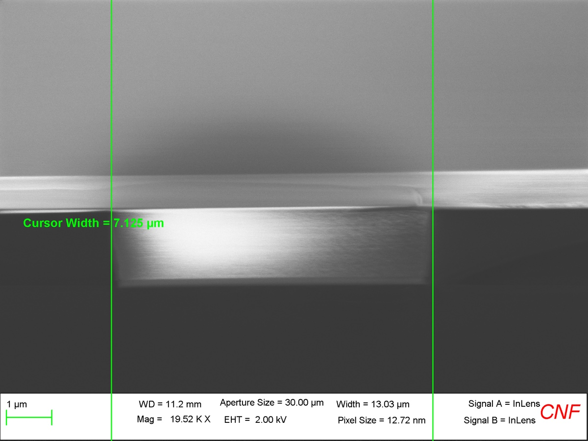

# 2024-11-26 dispersion calculation sanity check
From SEM images, we found the following below for the waveguide widths

8.575 um

8.016 um

7.516 um

7.125 um

6.442 um

6.023 um

5.407 um

4.873 um

4.287 um

3.774 um

3.206 um

2.628 um

Our conversion table is below (from expected to measured)

| Design Dimension (um) | Measured Dimension (um) | Fabrication Error (um) |
| --------------------- | ----------------------- | ---------------------- |
| 9                     | 8.58                    | 0.42                   |
| 8.45                  | 8.02                    | 0.43                   |
| 7.91                  | 7.52                    | 0.39                   |
| 7.36                  | 7.13                    | 0.23                   |
| 6.82                  | 6.44                    | 0.38                   |
| 6.27                  | 6.02                    | 0.25                   |
| 5.73                  | 5.41                    | 0.32                   |
| 5.1                   | 4.87                    | 0.23                   |
| 4.64                  | 4.29                    | 0.35                   |
| 4.09                  | 3.77                    | 0.32                   |
| 3.55                  | 3.21                    | 0.34                   |
| 3                     | 2.63                    | 0.37                   |

The error seems to average around 0.36 um (ish).

From our lab measurements, we same the profilometer below for the height of the etched region (which is a mesaurement I trust a lot)

It claims that we etched 2075 nm deep (at this point, the Cr mask was off).  We expect that the pad oxide as ~300 nm thick, so we etched 1775 nm deep into SRN (so a remaining sidewall height of 225 nm).  Lets annotate our dispersion graph for these waveguides

Keep in mind that there are 3 stars missing

Ryo measured the values below for our dispersion

He did this for the fattest waveguide (but we can kinda infer from our plots what we should see).  Everything agrees quite nicely