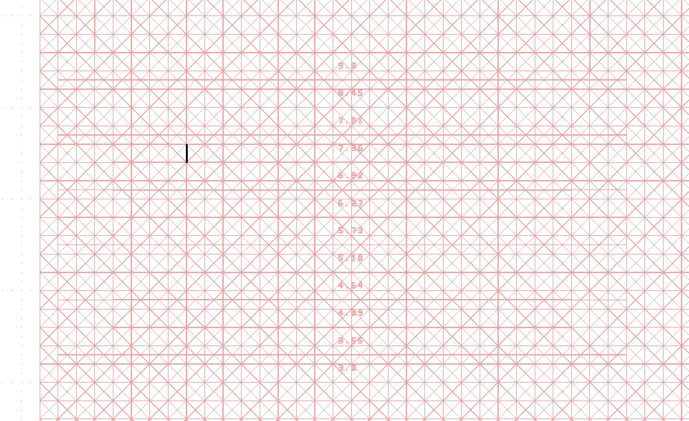
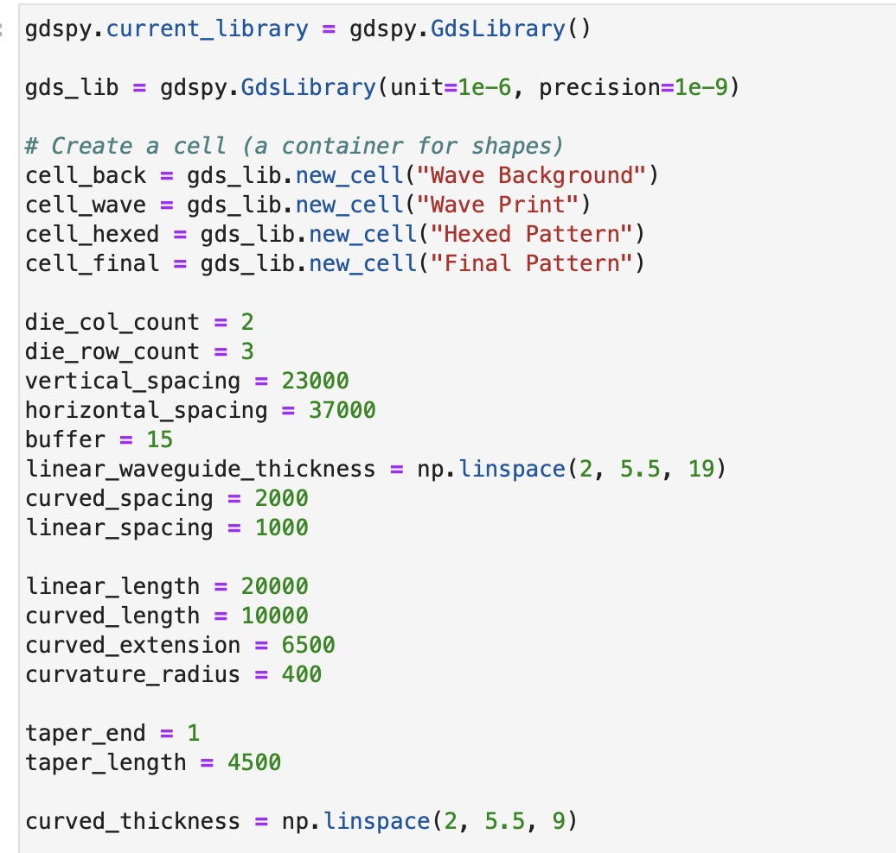
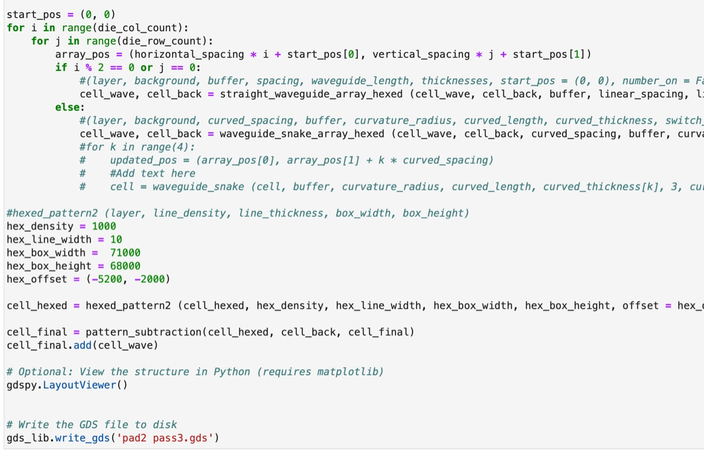

# 2024-12-3 annealing resistant gds file
Our previous devices seem to be performing up to expectation!  Now the goal is to device a new GDS file that will allow us to make devices that will not crack when we do a high temp (1100 C) annealing.  The idea here is that these high tempurature anneals will help us drive N-H and Si-H bonds out of the SiNx layer.  This will hopefully reduce loss at 1520.  It might also give us smoother sidewalls as an added benifit.  The general idea here is for us to get longer propagation distances, so we really want lower loss.  

The general approuch we are going to take is to etch trenches across the wafer that will help stop the stress cracks (which we found to work in earlier tests).  We will also try to anneal a larger piece, as it seems that all the weird effects happen at the edges.  A beta test version of this pattern is below

From Ryo, he would like us to use a waveguide width range of 3-5.  Because of the 0.5um broadening, I will do 3-5.5, which will really be 2.5. - 5.  I will do 12 iterations again. I will try to make the waveguides closer too so it is easier for Ryo to find them.  

After doing a bit more figiting, below is the final set of generating code I used

Below is a screenshot of the final centered, rotated GDS

Overall, turned out well.  Lets hope this works!!