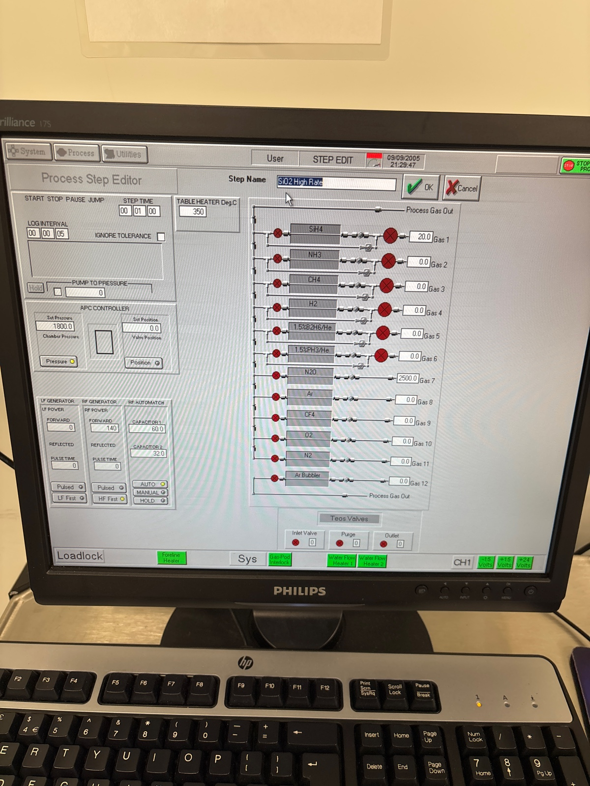
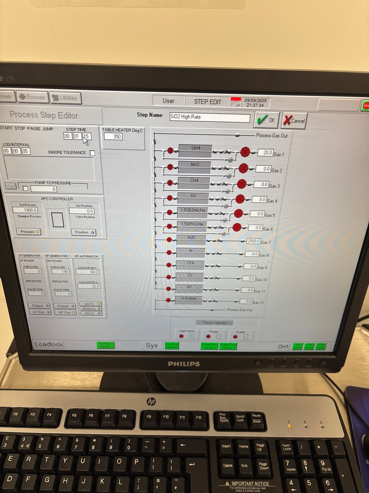
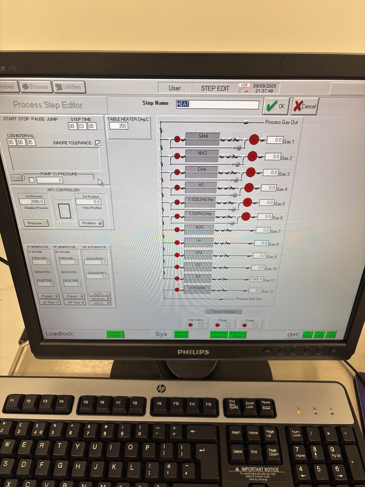
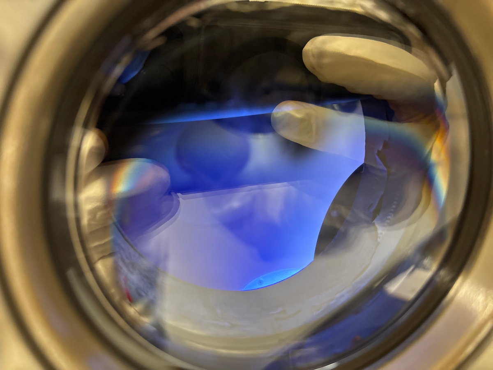
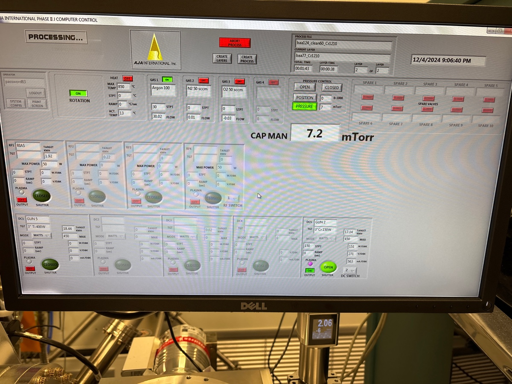

# 2024-12-6 second round svm etching for polishing and annealing
The purpose of this document is to show how I made the second round of etched SVM waveguides.  First, I RCA cleaned.  This is to improve adhesion between the pad oxide and SVM during the annealing step (hopefully this helps to prevent delimination).  I am then going to put 300 nm of pad oxide on and 100 nm of Cr (following the same recipe as before).

For PECVD, I previously did 1 minute high rate season, then a 1:15 deposition.  I heated for 5 mins and used the carrier wafer.

Before oxide season

Instead of 5 min pre heat, I will do 3. I will run the same recipe twice

Before deposition 

I just ran the recipe a second time for the second wafer (same thing with no cleaning or seasoning in the middle)

I set Cr sputter for 1210 and 7 mTorr pressure. I did a 1 min clean

During first sputter

The wafer was dropped.  I am going to try again a day later.  That wafer ended up shattering actually, so I am going to make another one following the same proceedure above (I will only make a commend if something goes dreadfully wrong)

We try second wafer sputter

During second sputter

Now vapor priming

Our etching pattern

During spin

We bake at 90 for 1 minute

Below is our first exposure 

Dose is again 60. I hit wait for conversion 

Before second exposure

We will do 726 for a minute development 

During development

I am running a 10 min oxygen clean of the 81 before i do descum

Dueing last wafer development

Last time I did a 1:15 descum.  I will do the same again

Before descum

Last time I did a 8:30 etch on the Cr etch.  I will do the same thing for season of the chamber and etch of each wafer

During descum

After descum

During edge bead removal, I spilled a small amount of resist

The vast majority of devices are fine, so I am still going to proceed with it (I will polish this one)

During first Cr etch

During second Cr etch

I am going to do a five min preclean on oxford 100. I am also doing this the next day, as the tool was not working when I first tried

I will do 1 minute season like last time.  I am then going to do an 8 minute etch.  I will clean and season between each wafer

During season

Before etch 1

During etch 1

Depth of first etch

A bit deep. I accidently did the wrong etch time.  Next time will be 8 mins.  That is on me.  Good thing it was on the wafer with a bit of acetone.  I will take pictures at the end, but the surface is not great.  It will be a good wafer to test polishing on

Before second season

Before second etch

During second etch

Pictures of first wafer

The acetone left some damage

Both wafers have this issue

Wafer 2

It looks like dust. It was not there before

I am also not incapable of believing this is micro masking (tho I did not see it before)

Spin cleaning seemed to remove a lot of dust from wafer 1

I am now going to do PECVD TEOS and high rate for the polishing wafer.  I am going to do a quick acid clean (30 seconds of the CR etch, 15 seconds of the BOE), just to get rid of a bit more dust.  I am doing a 4 min pre-clean of the PECVD and 1 min TEOS season.  I am going to not use the carrier wafer and do an 8 min pre-heat

Before season

After wet etch

Almost no dust!

Before dep

During dep

The reflected power is a touch high. The gas is flickering a bit. We will see what we get. For what it’s worth, because we are depositing so much later, I doubt that it matters. 

Etch depth of second wafer

Again, a bit deeper than expected 

After TEOS

We previously round that we get 1.5um of high rate oxide in 6.5 minutes.  I say we do two runs of that.  Each will have a 1 minute season and 8 minute clean.  We are also going to leave the carrier wafer inside like we did for the pad oxide.  I am also doing 3 min pre-heat.  My smallest trenches are 10 um.  I feel like in the future I should make the trecnhes wide, but whatever.  The main point is that, even if the deposition is not super conformal, I would be shocked if I get pinching, primarily because I am still only depositing 3.5 um on each side, so that gives me 3 um in the middle that should not be filled.  I would be curious to see a cross section though (unfort, I cant, because polishing really only likes wafers).

Before dep

During dep

After dep 1

Can’t say I see much

Before dep 2

During dep 2

After dep 2

Generally looks fine

Now, lets think back to when we did polishing on thermal oxide and doped oxynitride to try to guess what we think the polish time here is.  We are guessing that we have 3.5 um of oxide that we must polish through (which is an unfortunately high amount). Below are all of our previous recipe characterizations on the black pad (we never did a non-diluated slurry on the white pad)

I would start with the educated guess that high rate oxide will polish somewhere between a thermal oxide and DON (though probably closer to DON, as it is a PECVD film).  So, baseline, lets guess a polish rate of 300 (I am going to use a higher polish rate recipe).  The next thing is what effect the white pad will have over the black pad.  This is tricky, as I am truly just guessing a bit.  I would guess that the white pad will give us a polish rate of 400 nm/min (using the wafer 3 recipe). From there, I will estimate that we need to polish for 3500/400 = **8.75 mins**.  Lets break this up into runs of **2 mins and 50 seconds**.    This will slightly under polish, but I prefer that to overpolishing (we should need ~3 runs).  We will use the filmetrics to characterize things roughly.  The proceedure is to see how the number of squiggles goes down with each polish.  

If we use the black pad (which might also be the case) we should expect a polish rate of ~310 nm/min.  I would say we would then polish that in **11.3 mins**.  In that case, I would say we do **three runs of 3:50.**  

