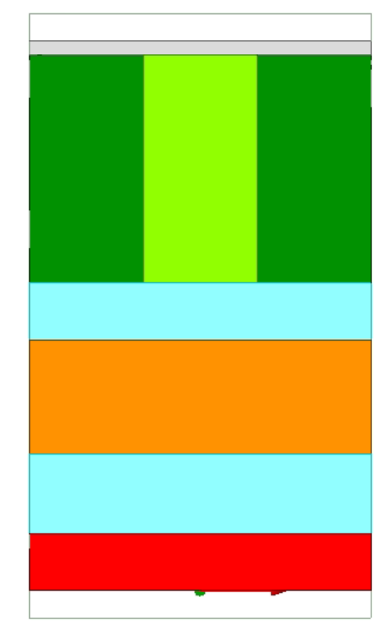
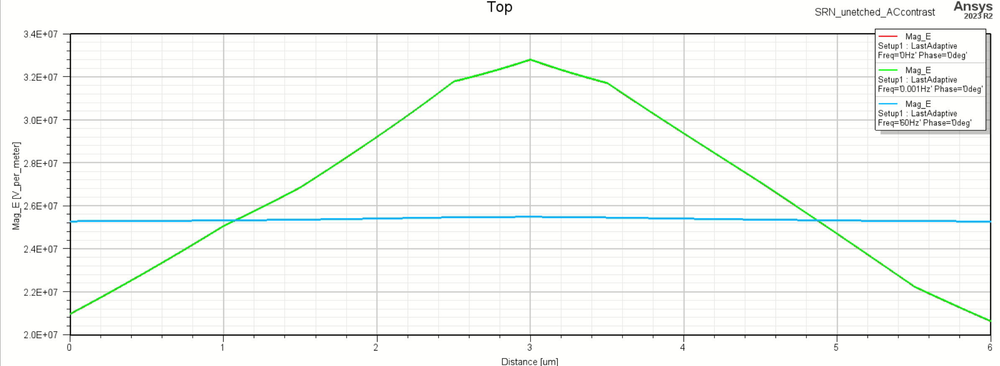
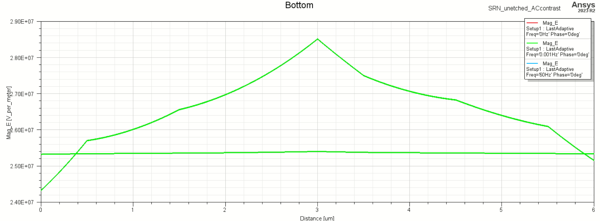
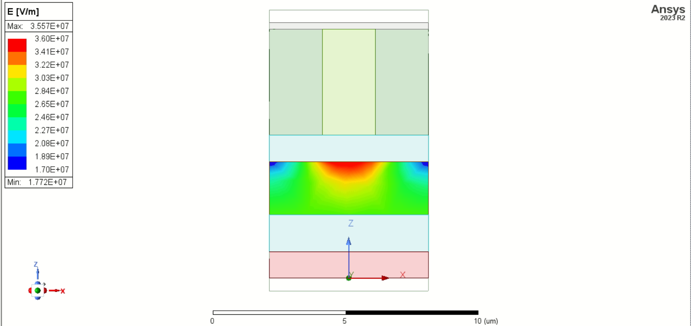
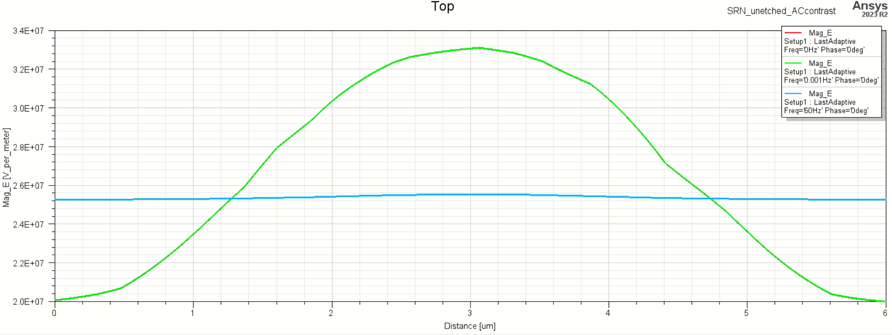
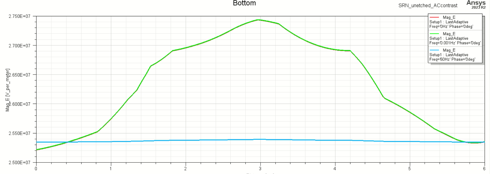
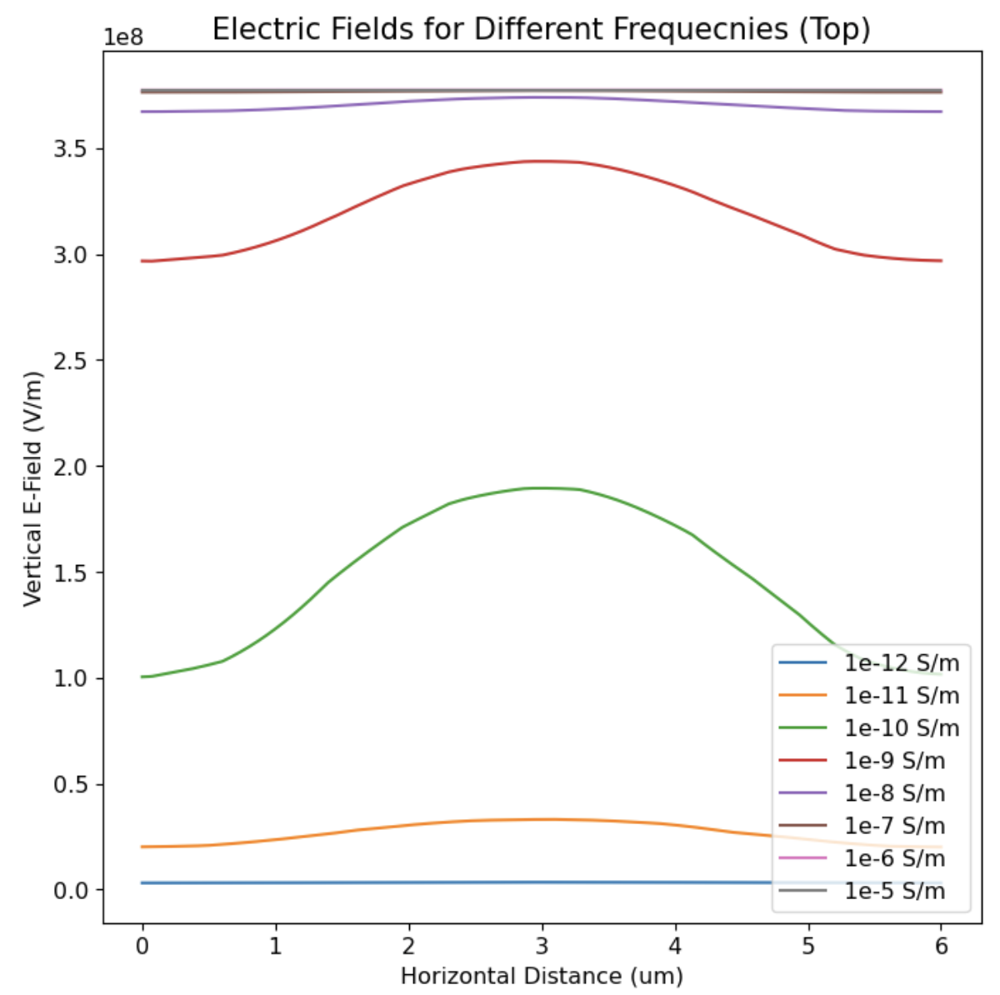
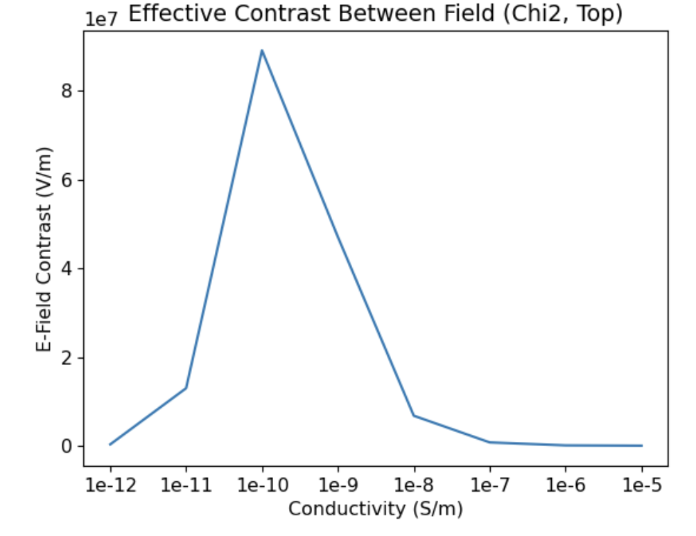
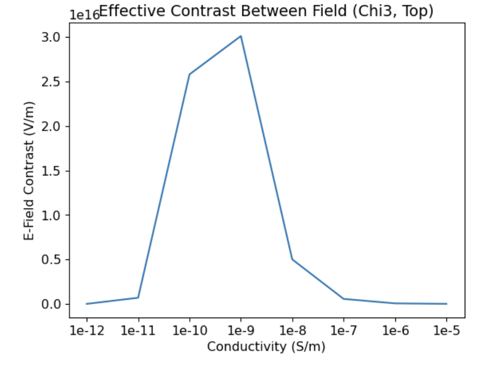
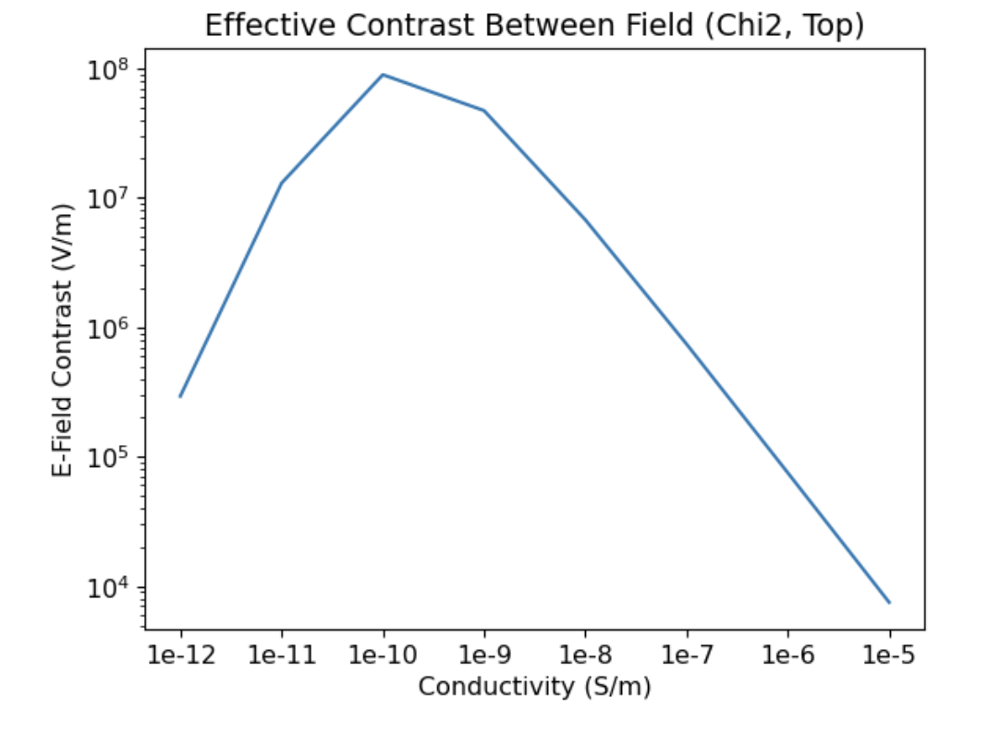

# 2024-3-10 cladding conductivity scan
The purpose of this document is to examine if there are any cladding conductivities for which we see the field contrast in the core have lower contrast.  Given our earlier results from our simulations for Ryo, I am going to do these simulations with an unetched device with a period of 6um.  I am going to use the following constant values for everything:

Core: cond = 1e-10, eps = 27

SRN_Dark: cond = 1e-11, eps = 8

SRN_Bright: cond = 1e-8, eps = 8

For cladding, we are going to use eps = 4.  I am going to use cond = 1e-11, 1e-10, 1e-9, 1e-8, 1e-7, 1e-6, 1e-5.  This should be a representitive sample.

For reference above is the device (bright in the middle)

I am getting some weird asymettry and discretization.  I maybe could refine my sovler a bit.

Above is what happens after I refine the pass structure a bit, and it looks pretty nice.

It is still annoying that there are some weird effects in the bottom, but there is also just a lot less contrast there for the simulation to work with.  The top looks nice, and we can analyze that.  I say this is good for 1e-11 and we will keep moving along.  The way we did this is increasing the number of convergence passes.

After going into the lab in-person after resetting the computer, I ran the simulations.  Below is what I see.

The basic take away is, indeed, we really do want the conductivity of the claddings to nearly match that of the core.  So this makes knowing the core’s conductivity a bit of an imperative.  For chi3 (so E**2) materials there is a bit more flexibility, but not a ton more.  We may also have some increased flexibility with the bottom cladding (as the fields are already flat there) but that does not fundamentally alter the picture of the top cladding.

When I plot in log scale, I see that I have a buit more flexibility (with 1e-11 and 1e-8 being possible).  We just don’t want too far away.