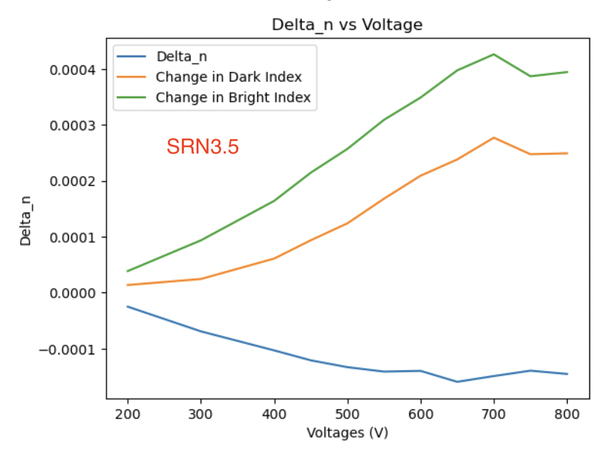
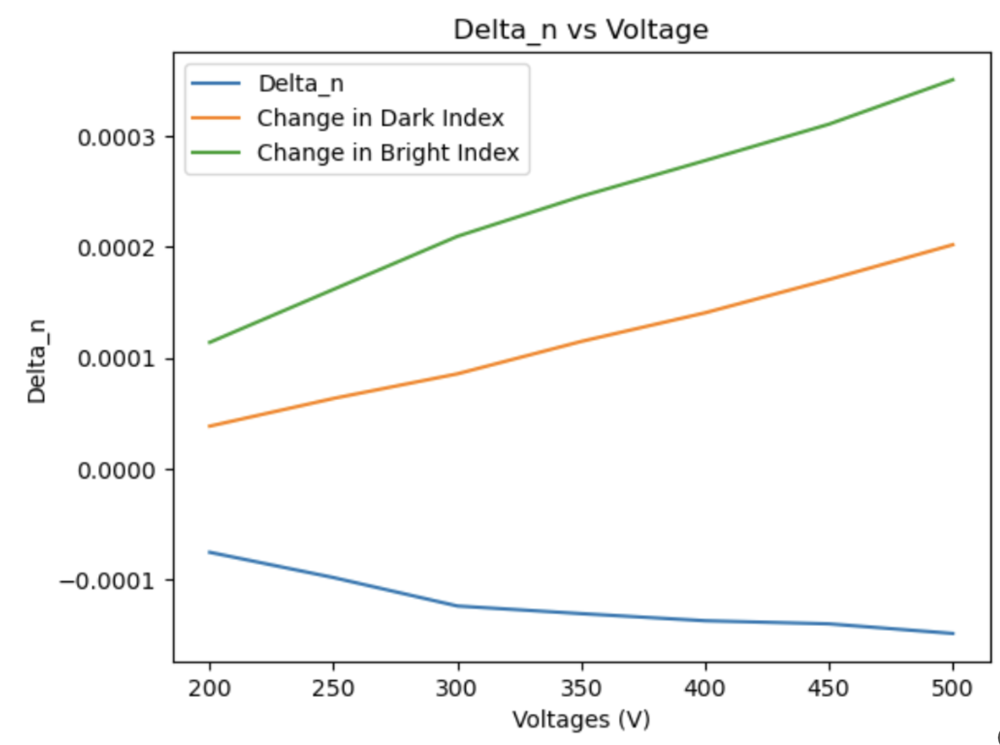
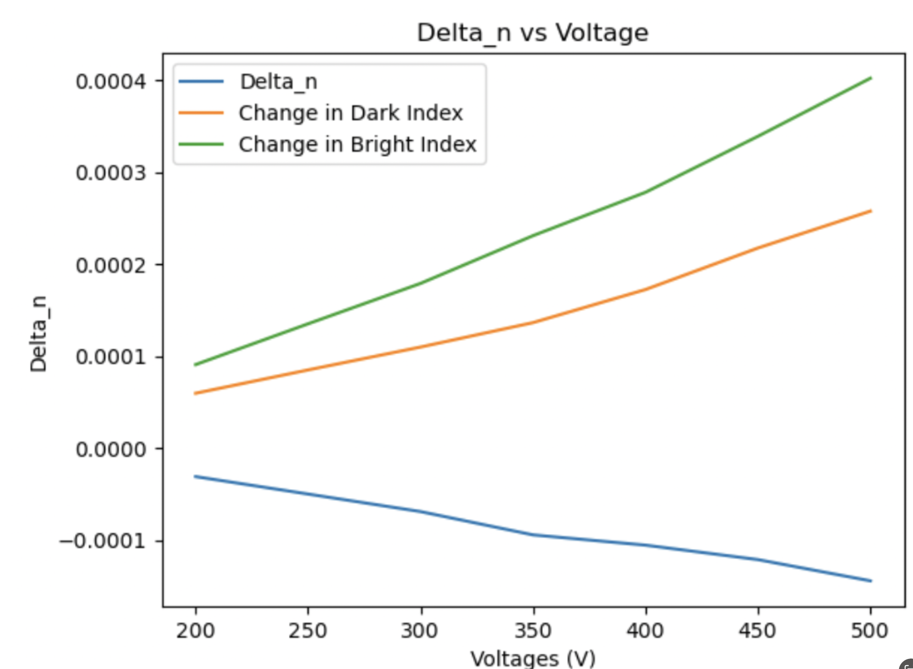
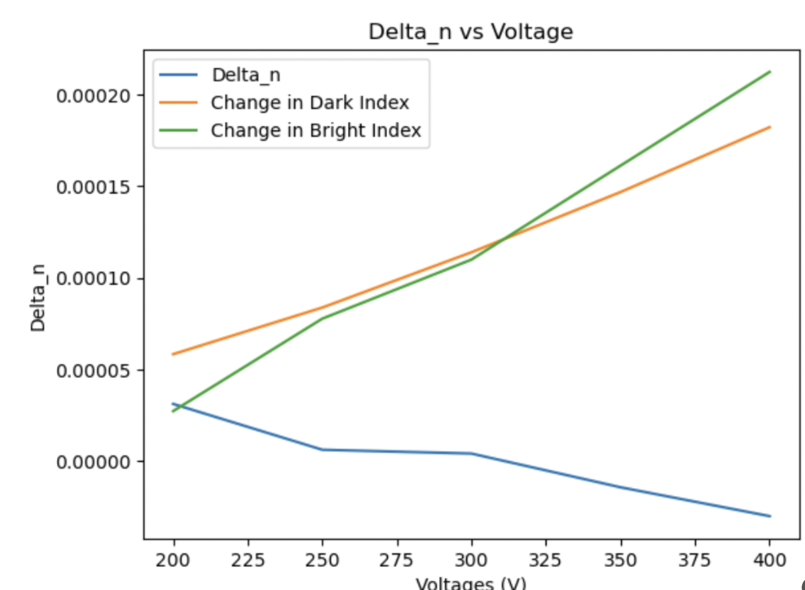
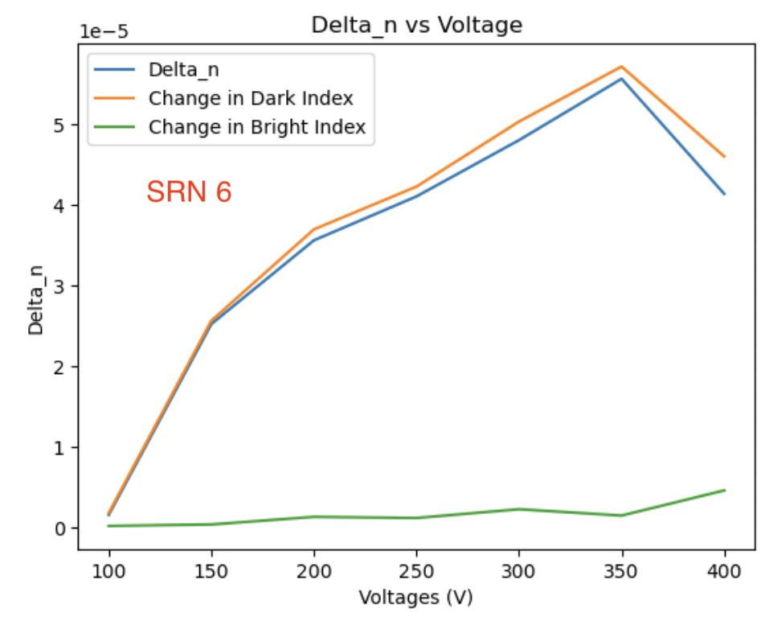
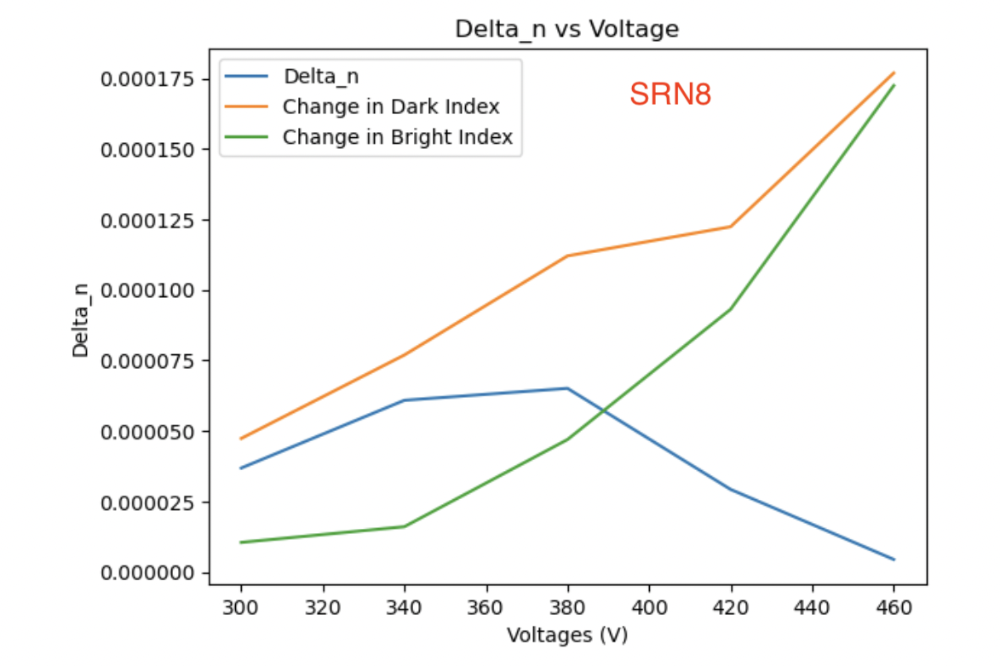

# 2024-7-29 srn dc device expected values
We have now done a tonne of characterizations of the delta_n of some of my SRN DC waveguides.  Now it would be nice to try to explain the results doing some conductivity sweeps.  The hope is that we can also do some conductivity characterizations of the SRN chips such that we have more data to work with (ie, data that is experimental), but we also have two data points and some rough estimates to get started with.  This might even help us estimate the chi3, as I genearlly trust our conductivity measurements.

Above is our predicted indexes for the DONs.  As I will show below, I get very good fits for the SRN values and index of DON to predict the conductivity.  The fits are below

We can insert the index and/or silane flow to get the predicted conductivity fits.  FWIW, I am not certain if the bright fits are perfect, but we will start with them and tone down the cond0 in case the fields seem too high

Below are our predicted fits

Bottom Oxide

Top Oxide

I just updated the values in my simulation

Now doing 3.5

Below are the results after simulating Thickness = [3, 2.5, 3]

Now for the experimental result

Not totally dissimilar, though these are really though fits as we don’t know the size of chi3

SRN4

Experimental Result

Simulation

SRN 4.5

Experiment

Simluation

SRN 5

Experiment

Simulation

SRN 5.5

Simulation

Experiment

SRN 6

Experiment

Simulation

SRN 6.5

Simulation

Experiment

SRN 7.5

Simulation

Experiment

SRN8

Experiment

Simulation

Some basic take aways are as follows:

1. For almost all of these, the bright state conductivity is just too small.  while I think bright state chi3 increases, not by this much.  We were predicting 10000-100000 times more conductive, which is ridiculous.
2. Around SRN 5.5, our dark state conductivities seem to show annoying kinks that we could not otherwise explain.  Either our simulation does not run long enough or (more likely), our predictions are too resistive.  There is something to be said here for just using the raw values we expect

After playing around a bit, it does seem possible for hte bright state to get slightly more field into the core.  Granted, we could just have some numerical BS going on now, but it seems legit

Conductivities that I used 

And I plotted the fields as a function of time, and there was no shorting