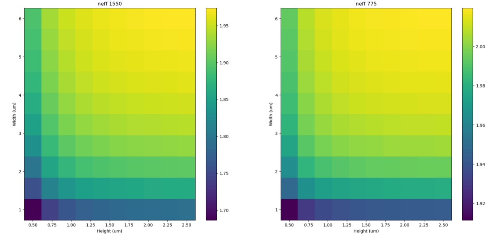
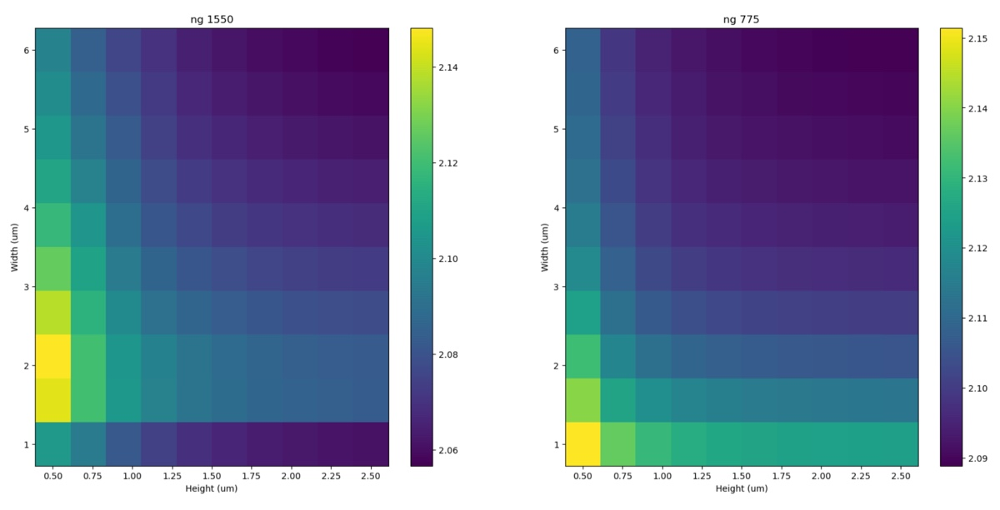
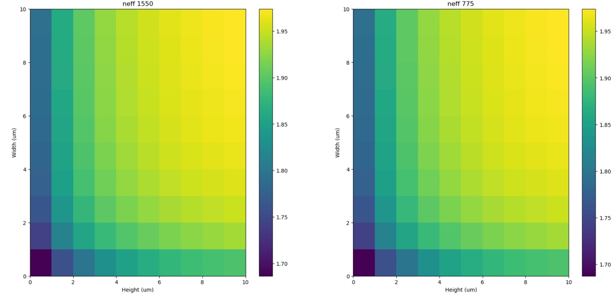
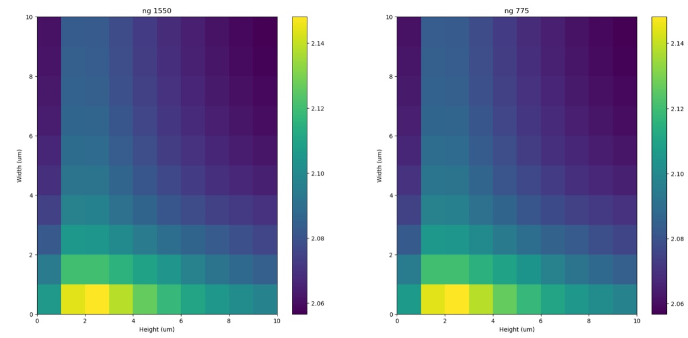

# 2024-8-22 automated dispersion scans with code
This document will likely be a bit more brief, and will act as a dumping ground when I want to compare results.  I am trying to create a code document that will automatically run my simulations for me.  In the long run, this is helpful because it will allow me to test different etch depths for etching of SiNx.  

Results for normal scan

Results for coded scan (ignore the axis scales, as I did not save the widths and heights)

It seems like all of these simulations were done at 1550, which is a bummer.  

If we transponse the group indexes, things do right

Now lets figure out why our 775 simulations failed

After running the 775 simulations again, we get the following (I forgot to transpose on the neff plots)

So it seems that the results are fairly reproducible.  Now lets see how we can save multiple keys together

Below is what the optimizaiton algorithm gives

After some extra work, below is what our code gives us

We need to make sure it is neff vs the other stuff (and get the order correct!!)

I got it working.  I am going to do a few new sweeps to check that everything is working and then move onto variable etch depth

The above image is for future reference, that I was simulating the TE mode.  Granted, it is a bit unclear which direction TE is in, so I think, in the future, I will save modes 1 and 2 just in case.  That being said, there is probably marginal difference between the two

I now successfully reproduced my previous results, showing that this is possible

Now it would be best to reverse the order of some of the way I am saving things, as I want to check that everything is saved correctly (I had to transponse neff and ng to get things right).  Now, we need to add the ability to get different etch depths, which will take some more time.

First thing we want to do here is to check that having these etched down sides does effect the mode.  I imagine this will require me to change the mesh a bit.  While we are at it, lets change the code to focus on mode2.

I have successfully added the feature where I have etched down regions on the side.  The main objective now is to make sure their geometry is set correctly.  I say we adjust the min and max in teh x and y, as that should be easiest.  

After programming in thickness variation and getting that to work, we unfortunantely see that we can’t save the etch depth matrix for all of this, which is unfortunate.  

Below are the effective indexes for different etch dpeths (the number itself is not important)

Index 0

Index 1

Index 2

While these graphes are a but non-obvious, stuff did change.  Igornre the 7 at hte top as well.  That is a function of 6 being the highest and only having 3 entries.  Now, we can easily figure out what the etch depth is by looking at the height.  At some level, what I have plotted here is actually suboptimal, in the sense that I should standardize everything to height and show width vs etch depth.  

We can also calculate etch depth by knowing that I defined etch depth as     

etch_depth_range = linspace(0, height * etch_percentage, etch_depth_iterations);

Where height is just the height of the waveguide and etch_percentage is 0.75.  I can also get etch_depth iterations directly from my matrix as the length of the last component.  So lets adjust our code accordingly.

Above is what we get.  I am generally pretty happy with this appearance, though it is a bit unfortunante that I can’t visualize stuff a bit better.  There may just have to be a tonne of looking in the future.  We will like a whole lot of these graphes, that is for sure. 

I think my plan for now is to create a tonne of these graphs and save them by their different heights.  I will then just do a huge scan of them by eye when we are done.  Not the best, but oh well for now.