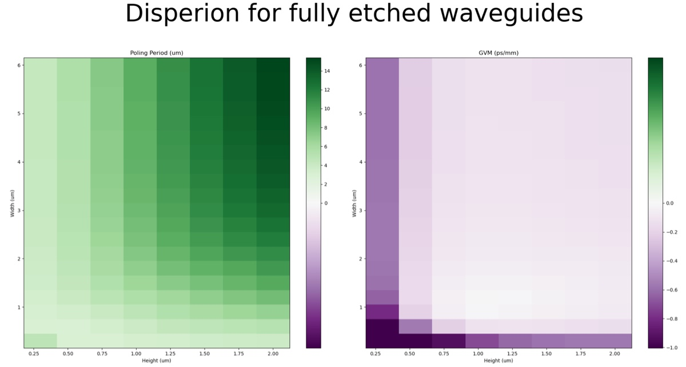
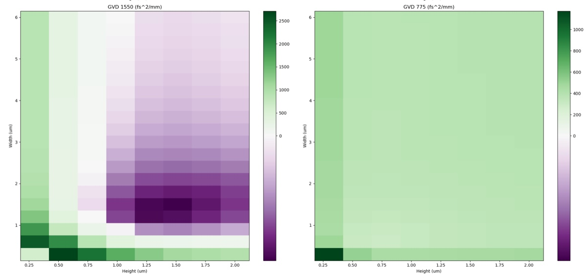
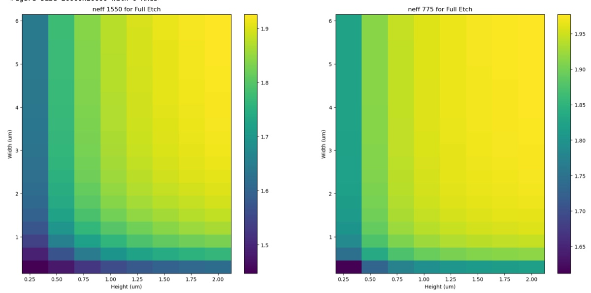
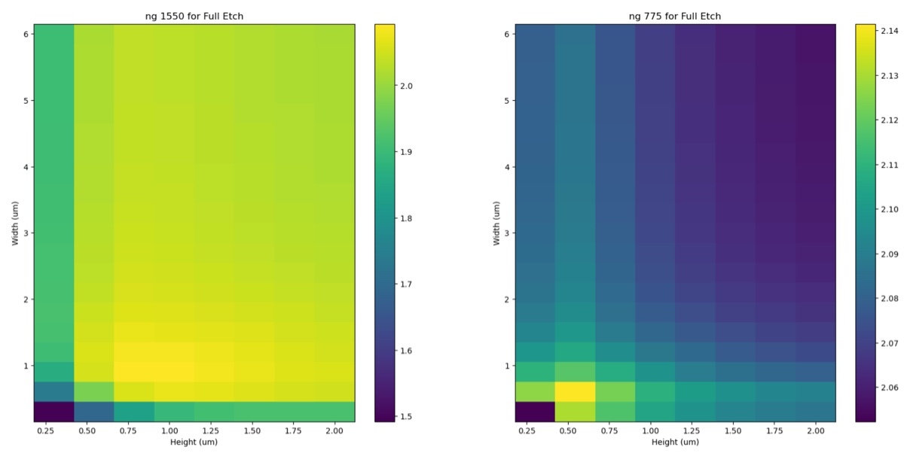

# 2024-8-23 big sweep of dispersion engineering on sinx waveguide
The purpose of this document is to show my efforts to do a large data sweep of etching for the nonlinear waveguide.  I now have code setup such that I can sweep height, width, and side wall thickness for my waveguide.  I now just need to put it all together.  I also want to simulate the effects on teh first two modes, as it is not quite clear what the conventino is for TE and TM in the simulation.  So I need to add a feature to the simulation to save the two highest order modes.  The other misc task is to enter our index data in for SiNx so I am not just using their data.

Last point.  I am going to scan 100 widths, 50 heights, and 60 etch depths.  I am just keeping it easy on myself.  I also want some varience so, if there are any dimension problems, I will find them.  I am also sticking to 3 frequencies.  

I am going to scan from 300 nm to 6 um for width, 300 nm to 2 um for height, and I am going to keep etch depth percentage at 75%

Mode 1 should be TE, and mode 2 should be TM.  We should be more interested in TM, as it seems to define the transverse direction in the x, not the y, direction

To put it mildly, the number of iterations above is just insane.  If we assume that each computation takes a second (and they take longer), then it would take 250 hours.  Not reasonable.

Lets try width = 20, height = 8, etch depths = 10.  This would give 20*8*10*3 = 4800

4800 / (60*60) = 1.8. hours.

The simulations finally finished!!  Below is the dispersion for full etching

And below is the index data for full etching

The index data does look a bit exotic.  Keep in mind, I did use the fit that Ryo provided for me

Below is the data from the default Ansys Lumerical SiNx model

So there is really quite differnce netween ng 1550 (with the ansys material having this higher).  The ansys material also had higher neff as well for both 1550 and 775.  So something with more Si is not bad.

Below is the origonal Disperion plots with Ansys material (Full etching)

Compared to Ryo’s SiNx, Ansys has slightly larger poling periods, lower GVM (though this might not be true if we zoom in a bit more) and lower GVD (though again, if we remove the very thin waveguides, that might not be the case).

Above is for the TE mode.  When looking at the TM mode, we get something a bit different (below is index data)

Below is dispersion

GVM looks similar to TE, same for poling period.  GVD for 1550 is really just a tonne larger (though it might just have an outlier). Ng 775 also looks a bit funny, but that might just be a nuance of the structure that I can’t understand.  Below is the full data for both modes

Mode 1

**Mode 2**

The general trends I notice for Mode 2.  

- As the waveguide gets thicker, wider, or less etching, the poling period becomes larger.
- GVM seems roughly equal everywhere, as long as etch depth is low of the waveguide is wide.  Being a bit thicker seems to help as well
- GVD 1550 seems to have a sweet spot around height = 0.8. Affter that, wider helps lower that value.
- GVD 775 seems to prefer thinner waveguide

I think it would be best to cap some of these values, as I feel like our understanding is being hampered by a few outliers blowing up our data.

After bounding the results, we get the graphes below

These are much more useful, and we can really see the sweet spot here.  We want to work with a waveguide that is a micron thick.  There seems to be an umbrella feature that opens up where we get reasonable GVD and GVM.  The only issue is that the poling period is a bit small.  For thicker waveguides, while GVD gets fine, the GVM gets a bit larger.  Maybe that would be good for pulse shaping?