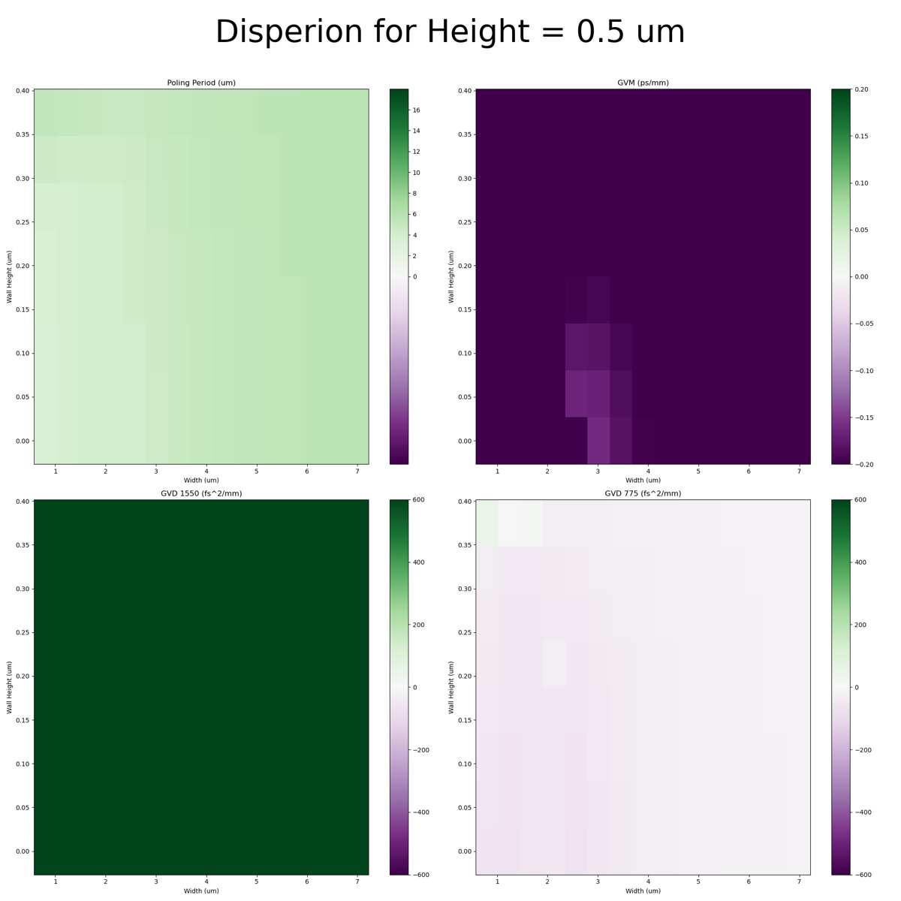
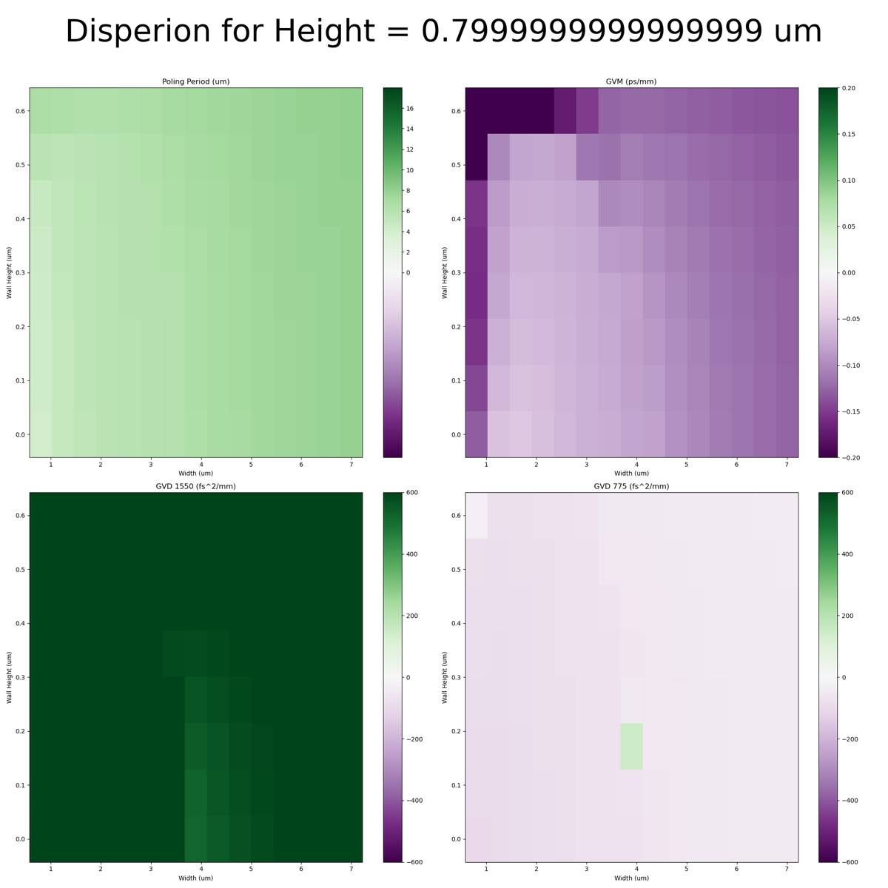
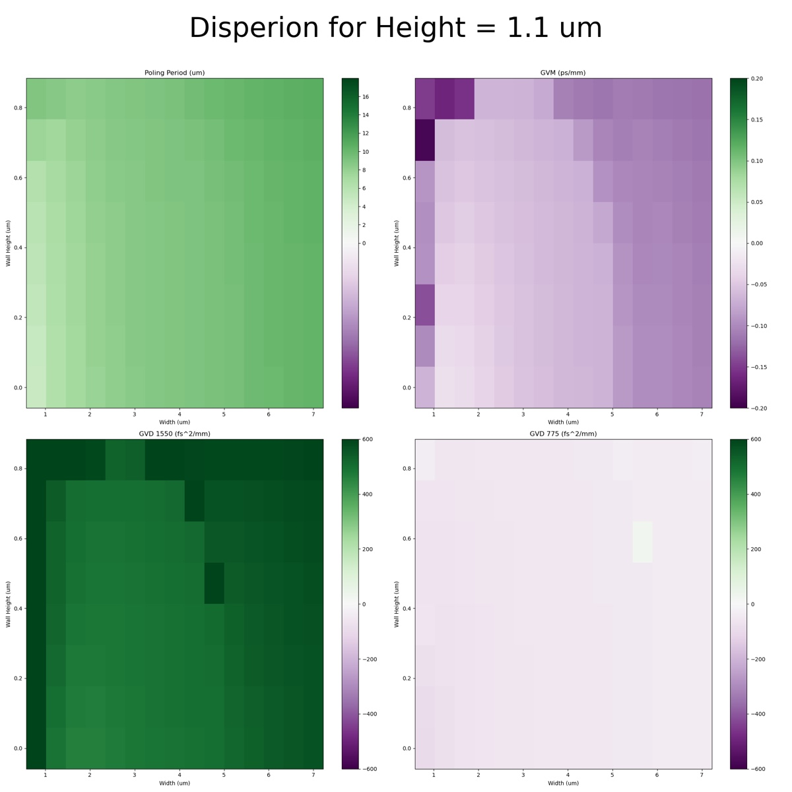
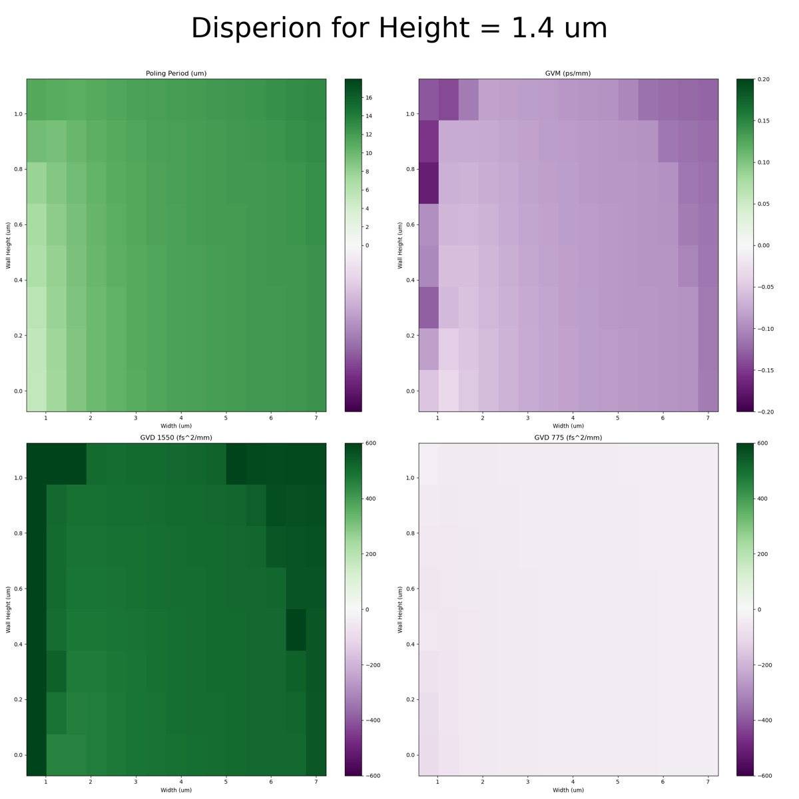
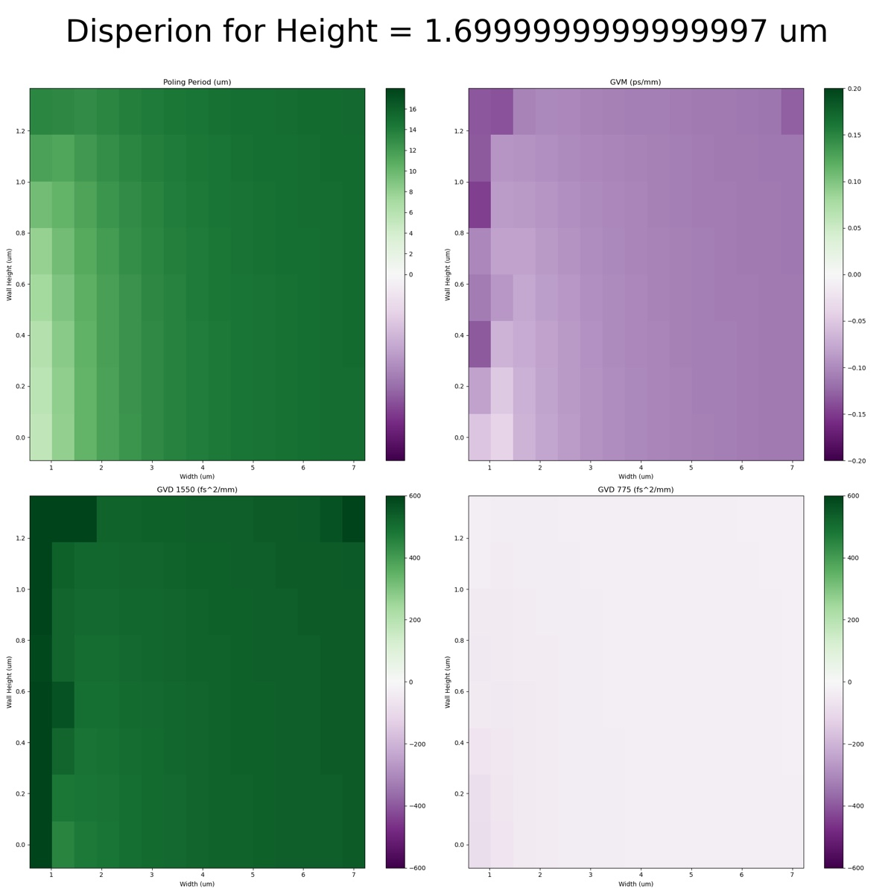
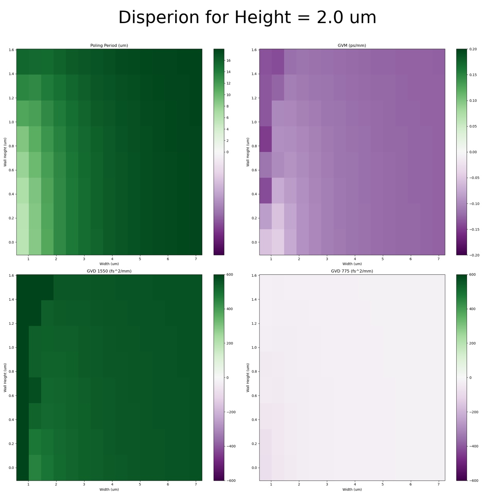

# 2024-8-26 core index variation for dispersion engineering
After doing the past dispersion sweep, I noticed that the index value of the SRN core is a huge deal.  The SVM wafers were a bit low, so I am going to explore a bit with in-house SRN recipes.  One of the nice advantages of this approuch is that we can deposit these films to the exact hieght we want and vary the index ourselves.

I am going to use SiH4 = 3 and SiH4 = 3.5 and I am using index data from this note ([https://tdwg.craft.me/SlL1X8PYN0DSHZ](https://tdwg.craft.me/SlL1X8PYN0DSHZ)).  Index files are below

[SiH4=3.5-n.txt](https://resv2.craft.do/user/full/c10b6666-b4fd-53a0-9177-1696a144b2d8/doc/53C25BB5-9ECA-4838-B240-6389D4CB0244/33AD40A9-49E6-4B0C-94BF-DCB3D8F32F25_2/nnmMPmVS9U8PTfiR0VpbEs8UPUNvD8d4cOIlo6BMmt4z/SiH43.5-n.txt)

[SiH4=3-n.txt](https://resv2.craft.do/user/full/c10b6666-b4fd-53a0-9177-1696a144b2d8/doc/53C25BB5-9ECA-4838-B240-6389D4CB0244/6BB8E20B-0692-4BB3-8CA2-7346A6430475_2/wlvEGafsdDP5RyLhQiz1QfV6i9qn6VQiGKzQ5sX8OaMz/SiH43-n.txt)

I am going to do slightly shorter sweeps in the interest of time.  Firstly, I am going to 7 height variations, 15 width variations, 8 etch depth variations, and 3 freq variations.  I am going to start with SiH4 = 3.5 at 1550 and move from there

Height 0.5 → 2

Width 0.8 → 7

Etch_depth is still 0.75%

As a side note, I checked the disperison of the ansys lumerical oxide layer, and it seems reasonable enough to me.  We might want to upload our own in the future, but no rush for this.

For future reference, 8-27 is SRN3.5 on the legion desktop.  1550 on 3.5 went well, so I am starting 775.  I saved 775 data, but accidentally overwrote some of my 1550 data.  I am redoing 1550.

Below are my results for the TM mode of SRN 3.5 (both for fundamental modes).  

So a really suprising results is that our GVD of 775 is very low.  The issue is that our GVD of 1550 is kinda high and there are no regions with high poling period and low GVM.  So SRN 3.5 is probably only useful with a height of 1.1 → 1.4 and the middle eidth and low etching

Below is the data for the TM mode of SRN 3.0

It seems that somewhere between a height of 1→1.4um is optimal.  Thicker will give easier poling period, but harder GVM.  I will probably want to do a more detailed sweep there, but it seems that SRN 3.0 is better.  

So now we enter the interesting question of what to simulate next.  We could either do a more systematic sweep of different SRN recipes.  While it feels like using a different silane flow than the ones we already used won’t make a huge difference, I just don’t know.  Maybe even a lower silane flow would be better.  

We could try to do a more targeted sweep at the areas of height, width, and etch depth that look best.  This would only be if we feel like we found a goodish final recipe to start with.  

Lastly, we could experiment with different claddings.  The only small issue is that I did not save the k-data, so I would probably need to recharacterize a few films.  Then again, that would not be super hard.  