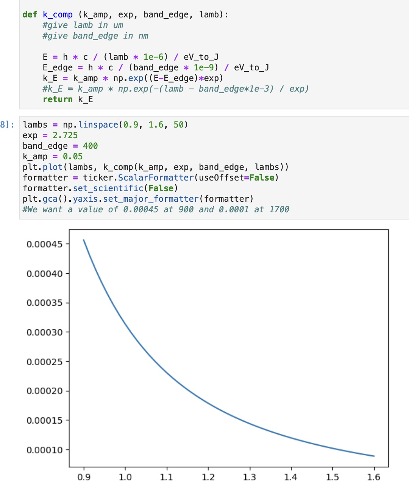

# 2024-9-1 dispersion with don cladding
We have done some previous simulations with normal oxide claddings, but so far nothing has been able to give us zero GVM.  I still think it would be cool if we could see that (even if GVD is a bit higher).  So I am going to scan over some conductive oxide claddings and see if any of them give us films with more useful dispersion.

First, I am going to start with B8 and see if this works

I got code working that gives me the correct Urbach tail (shown below)

Anyway, lets generate a txt file from this plot and export it to lumerical.  I am also going to generate a few more plots while I am at it, and all my plots will be for SRN 3.5 for the moment.

The material imported correcly and I get confined modes for SRN 3.5.  So my first simuations are with SRN 3.5 and DON B8

I am also going to import some more index sweeps just to get a broader understnading of how things work

B25:

For some reason the k did not fit here, so I am going to use the same k as B26 

B26

B27

**As a side note, we need to make sure our dispersion analysis only take the real part of all these indexes, as we might get some imaginary bs going on**

At some level, I am not sure how much to test the urbach fits on these, as I did not fit a wide enough of a range.  But we shall see I suppose.  I guess it just seems odd that hte k-cectors at almost 10X higher than B8, when that should just not happen.  We may end up nerfing that loss a bit more, or just resuing B8 loss.  If anything, lets just reuse B8 loss.  It is probably a good approximation

I reduced B25 as cladding for 10 widtsh and 5 etch depths, as the simulations kept crashing and having issues (I should also mention that these custom claddings take much longer to simulate)

Below are the results for B8 cladding

There is an annoying inverse relationship between GVM and GVD at 1550.  Fortuantley, the GVD at 775 is always zero

The one interesting note is that it should concievably be possible, at some point, to get the ng.  

Below is B25

Once more, we still have note moved GVM quite to where we want it, but we are starting to reduce the GVM for thicker waveguides.  At some point, once we start to get close to our desired GVM, I should just make the core stupid thick just to see what happens. GVD for 1550 is still going to be an issue though

We are also moving ng for 775 in the right direction.  If we can just make it make it a little smaller, that would be great.  It is a shame that we can’t go very wide, more like very thick.

Below is B26

Below is B27

Below is B27 with SRN 3 instead of SRN 3.5

So it really does seem that the cladding did not matter much, but the core matters a tonne!  We really want to push for lower index core, or even try to push the height of this device up (though there are some pretty severe drawbacks towards having thicker cores to maintain good field contrast).

