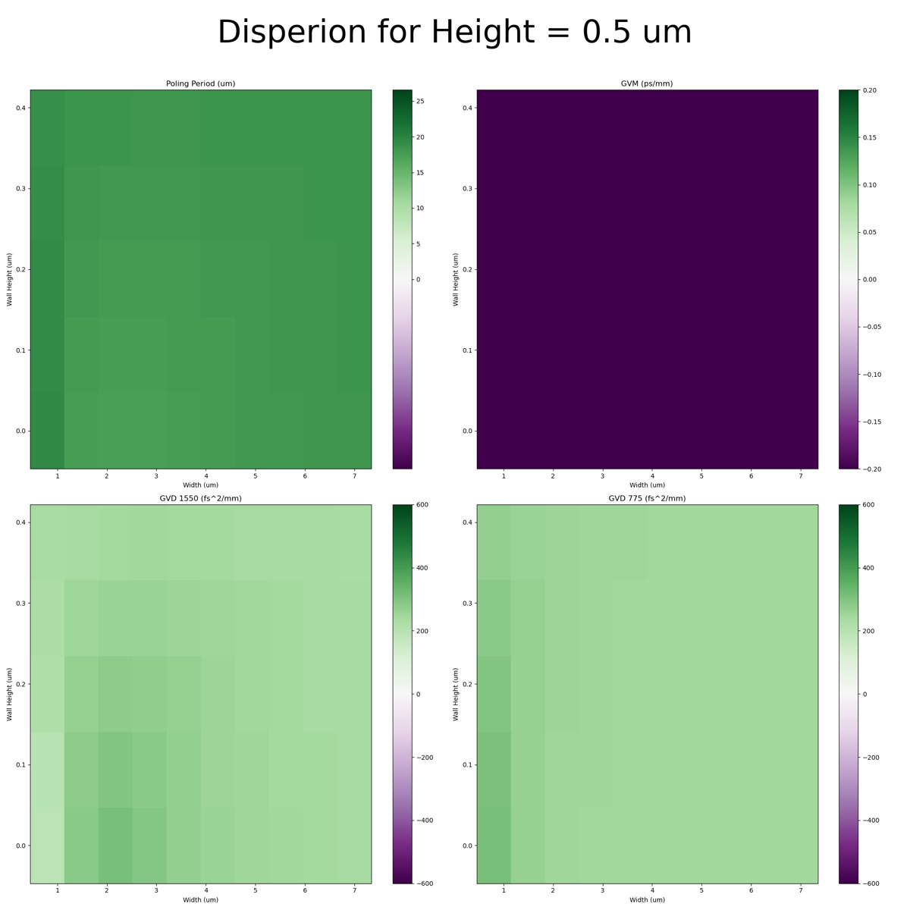
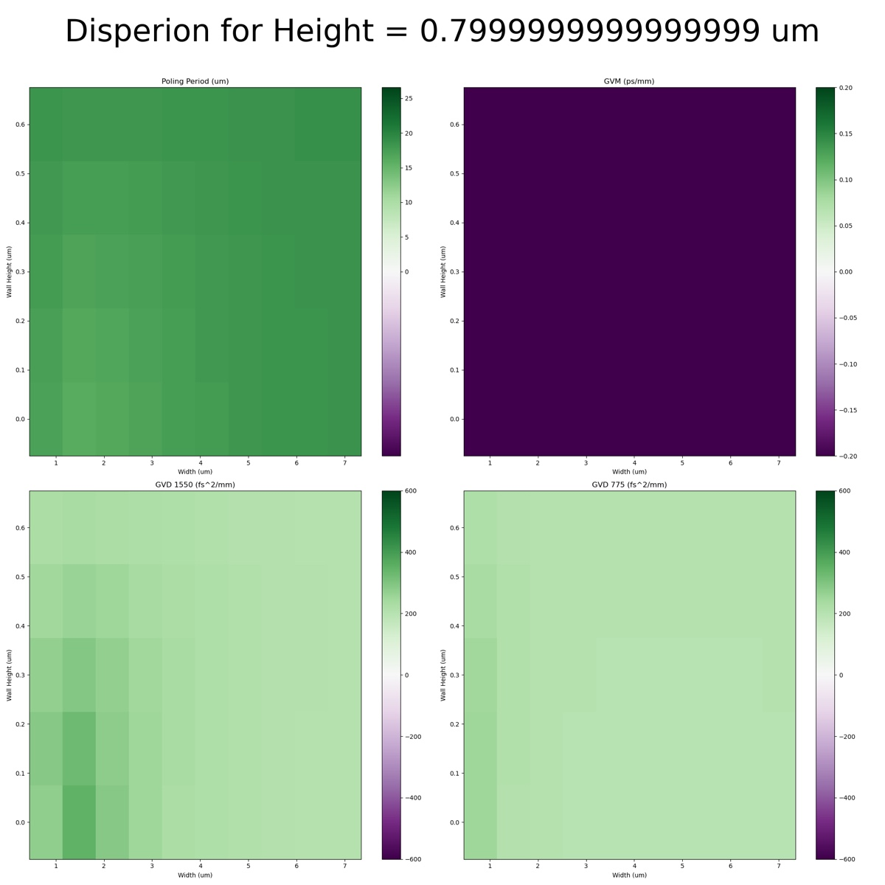
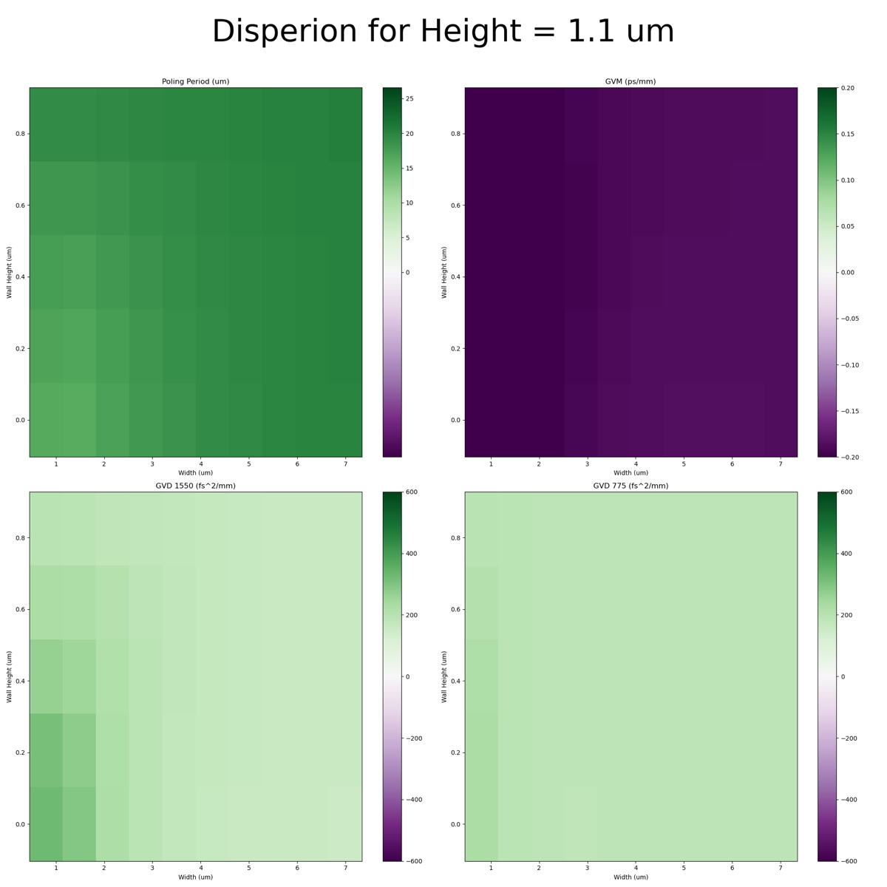
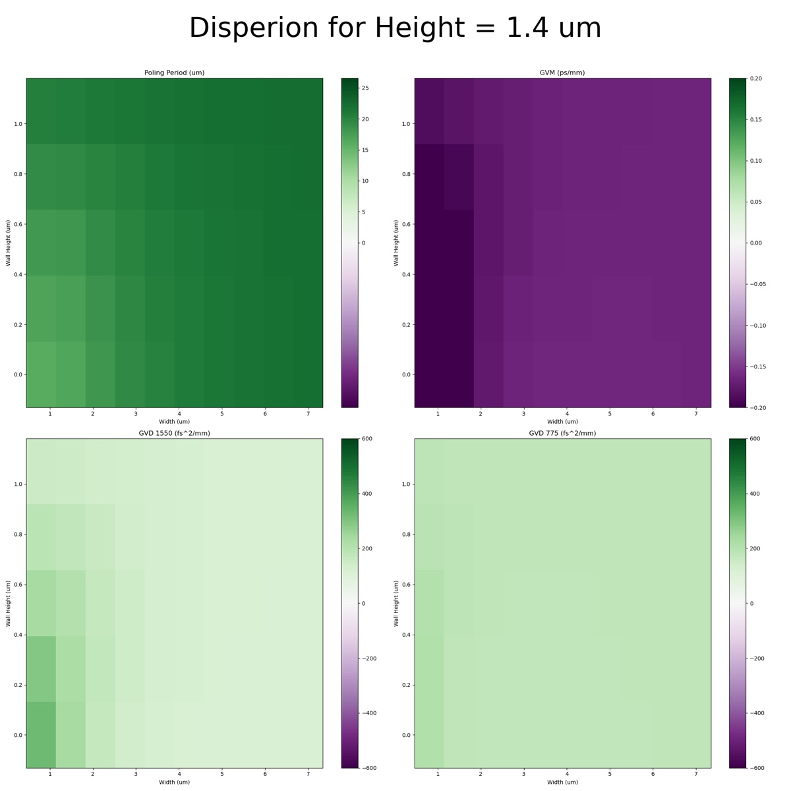
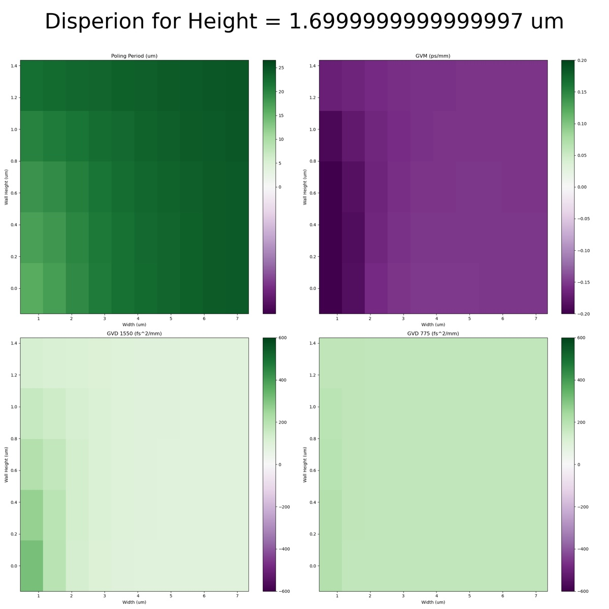
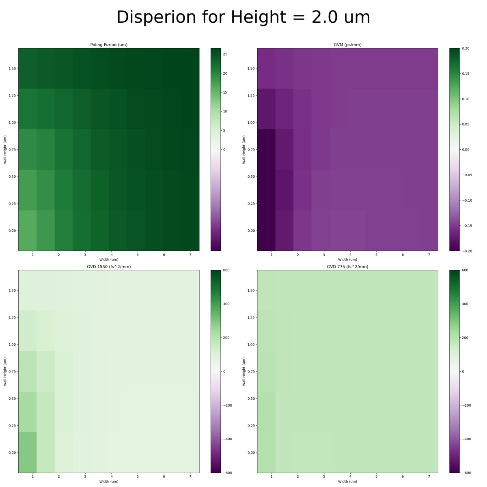
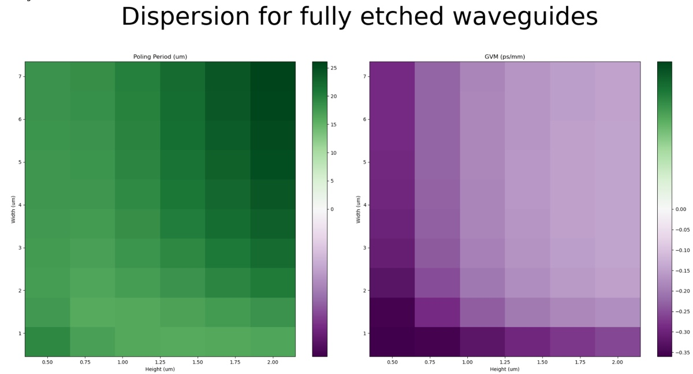
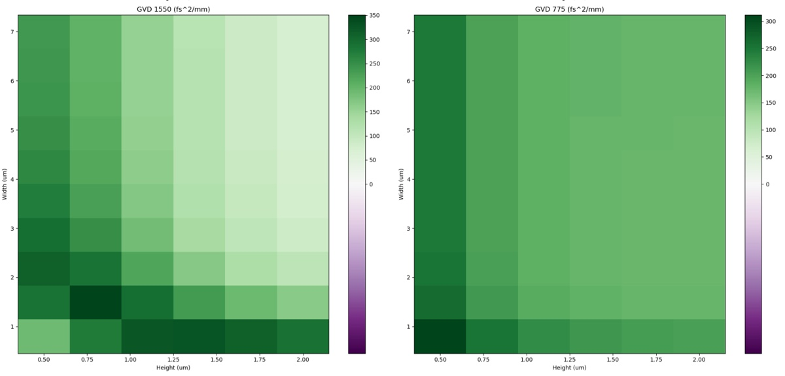

# 2024-9-14 low index core dispersion calculations
Based on previous calculations, it seems that fabricating low index cores dramatically helps with the dispersion of our waveguides.  A good heuristic is that we are pushing the bandgap further into the UV, meaning that the tail from a lorentz peak is not as strong at the wavelengths we care about.

The other day, I fabricated low-index cores.  The results below show the dispersion of these waveguides with DON claddings and oxide claddings

SRN 2.8, B27

Below is the dispersion of the fully etched version (which seems to show the best results)

Not bad, but not the type of dramatic improvement over SRN3 I was hoping for.  Maybe SRN2.6 will be better.  We can also test these SRN with oxide claddings

SRN 2.6

No serious improvement, so on doped oxynitirde, this is not useful