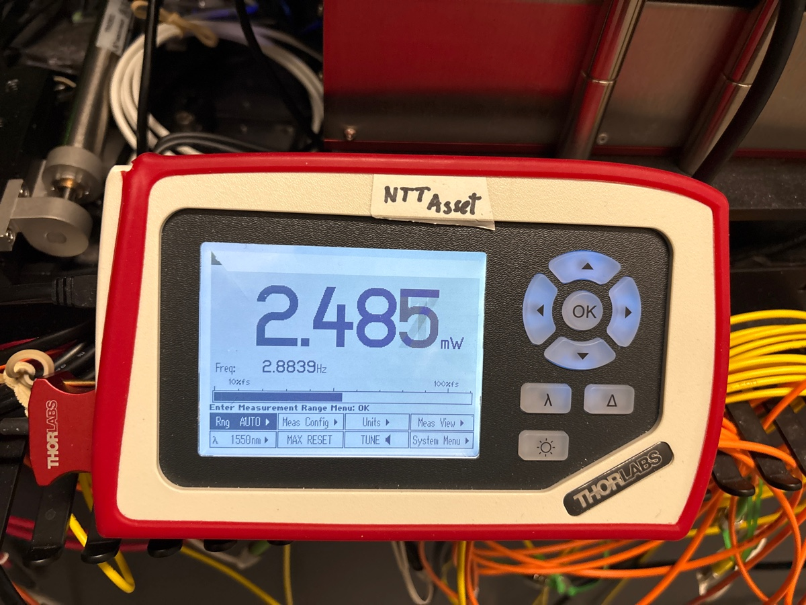
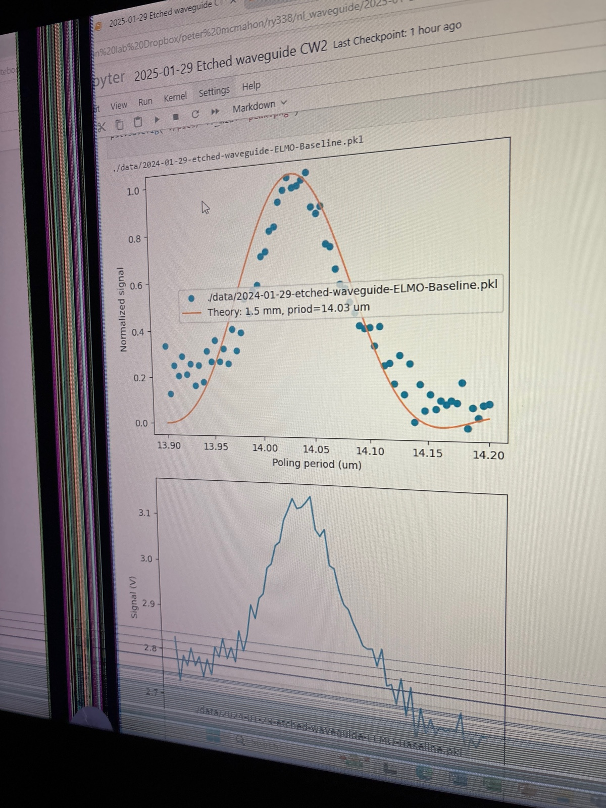
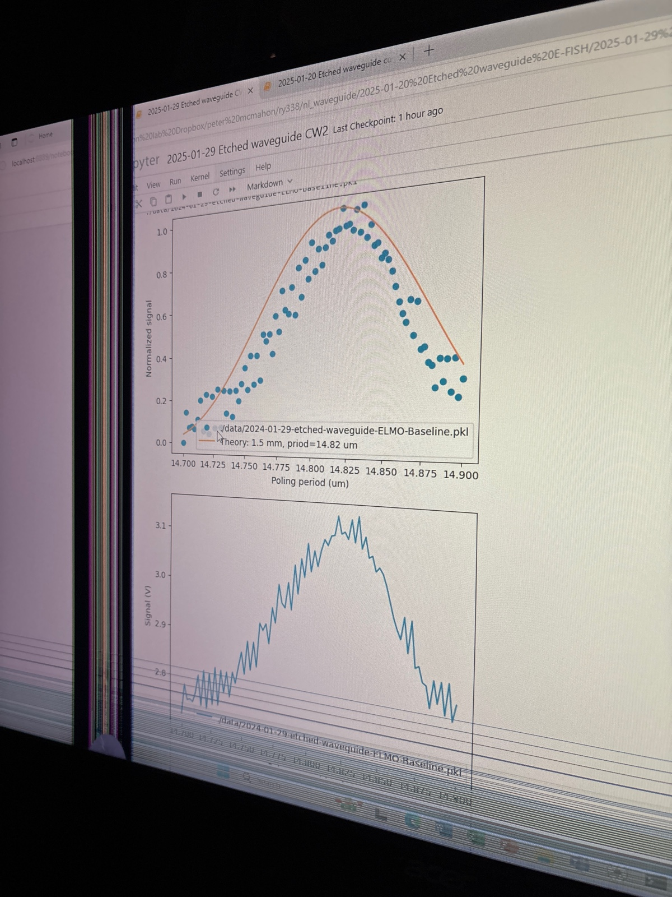
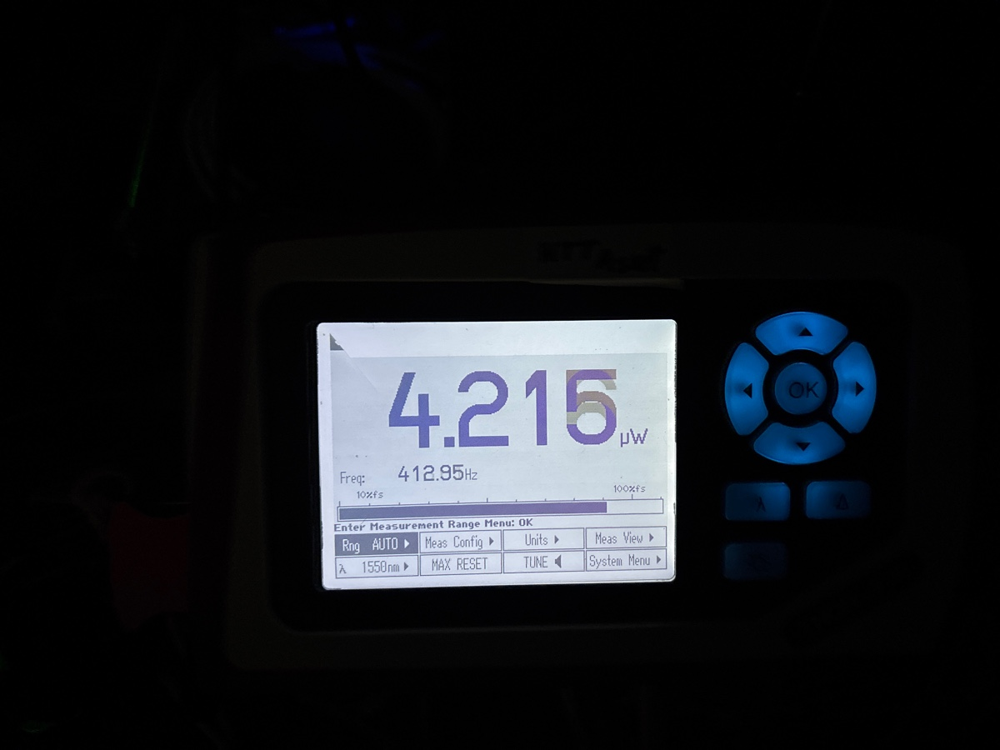

# 2025-01-29 straight etched waveguide cw shg as baseline
After aligning the pulsed laser, we get the power below

Tbh, it could be a few 0.1 mW higher, but I don’t want to mess with the back objective 

One peak that I found

Poling period is 14.03

Second peak

Centered at 14.82. PMT is 0.55

Both peaks seem to be the same height, so it is hard to say first is first vs second. Intuitively, shorter periods are for more mode mismatch, so I generally believe the longer one is what we want.

Below is the power with the Pulsed laser. This is with the fan running and everything

This is shockingly comparable to the bent waveguide case considering how much power power we should have

With CW laser in

First go with CW 1580, no dice

I am going to try with 1560, which is the center wavelength of the pulse

No dice again

Let’s try the other poling period for 1560

No more luck

Lets try a wavelength scan.  Below are Ryo’s previous results

Another option is to do a longer scan (with like 400 points). between 14 and 15.  What is surprising is that I don’t see anything in the spectrum of the pulse peak.  I really feel like I have enough power.  

Another thing we can do is an output power scan.  Maybe I did a bad job coupling things

Nope on longer scan

Let’s measure power

Seems a bit low. Let’s get this up a bit

Forgot to remove ND filter, we are now good

We are starting to have a signal

Let’s turn up the gain slightly and get rid of all pollution.  I put the black shield up and turned all monitors and lights off.  I made the PMT 0.7.  I may increase the voltage in the next iteration

Lets make the voltage higher as well (3.3 instead of 3).  I also zoomed in on the scope.  For ref, this is with 1580

strongest lock-in signal.  Below

It is just not very strong

So the peak is obviously higher, and I feel pretty strong that we are def seeing some signal.  The question now is how do we see more.  It is impossible to align to this by eye, so it still feels like I would need to plug the pulsed laser back in with this idea poling period and try to increase the power.  That is also kinda hard, as the sensitivity at this point is not great.  I am going to try the other poling period real quick.

This peak is def stronger.  I could just be off on which mode is which lol.  

Above is strongest SHG signal, which still is not great

As a more general point, it seems like CW light will always really struggle because the peak power is not high.  We know the bent waveguides work insofar as we know that we can pole pulsed light and see signal.  The issue comes down to loss.  I am generally of the opinion that we should not have poled any small sections of the waveguide, as poling the ending regions will suffer from loss of pump and the beginning will struggle from loss of the SHG.  Obviously I am not certain, but I am seeing slightly more than twice as much output pump power for these shorter waveguides.  

In theory, if we pole the bent waveguides correctly, I feel like we still should be able to see signal.  It really does seem like the ideal poling periods we measure for 1580 are very close to the correct poling periods.  Even though the waveguides are lossy, there is a longer interaction length.  The issues we will face are as follows:

1. Optimizing coupling
2. Getting the phase slip between different poling regions correct
3. Getting enough signal if the poling period is off by a bit

In general, some long-term solutions are as follow:

1. Annealing waveguides for loss
2. Using higher power CW light
3. Applying higher voltage to the setup (which feels very nessesary at this point)
4. Getting rid of all background noise.
5. More photoconductor

I am still a fan of the 3 layer device as more efficent.  I am just not sure if the photoconductor will still work after annealing.  Also, in the future, please remember to align the top objective a bit better

As a note, the above picture is with the correctly align projection pattern (by shifting the mirror.  It is really essential to do this.  We were doing it before on the bent waveguide, but we now have 3X more signal, which is quite important.  Above is with 3.3 Vpp

As a quick next step, I am going to see if the waveguide can withstand 4Vpp.  I don’t want to break this waveguide, but I really do need to apply as much as possible to the bent structure

Abobs is from Ryo.  I don’t think we have much more use for these waveguides, and once polishing is back, we can easily make more.  So lets push things up and keep taking data (though maybe with fewwer points)

Near peak

4 Vpp

5 Vpp

Near peak for above

6 Vpp

Near peak for above

Also, for all these measurements I used 0.7 on the PMT, which can also be increased

7 Vpp

Near peak

8 Vpp

Near peak

9 Vpp

10 Vpp

11 Vpp

Interesting that the ideal poling period seems to shift

12 Vpp (I also checked the Pylon camera, where the contact is in view.  There is no evidence of breakdown)

Near peak

13 Vpp

14 Vpp

We saw an unexpected drop-off.  Something may have broken.  We can go to 15 Vpp, and call it quits there.  There is no evidence on Pylon camera or current data of breakdown

15 Vpp

I think we are gretting shuntted at this point