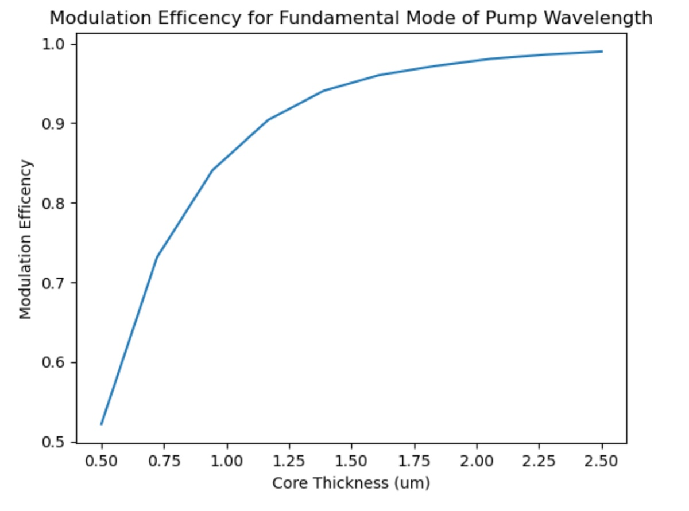
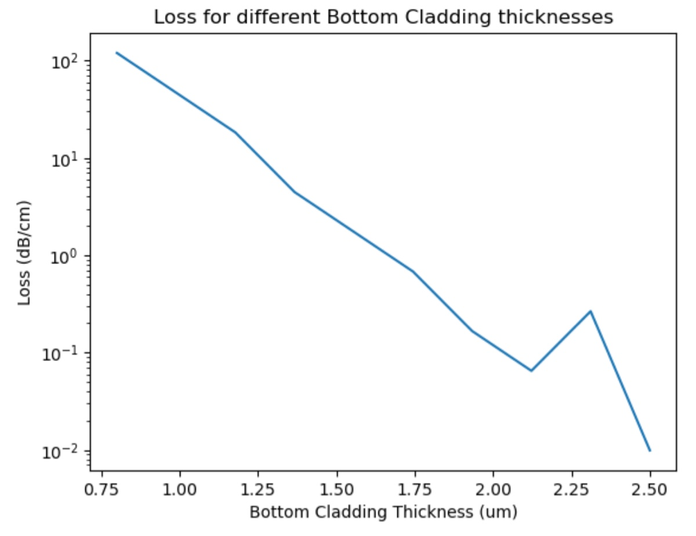
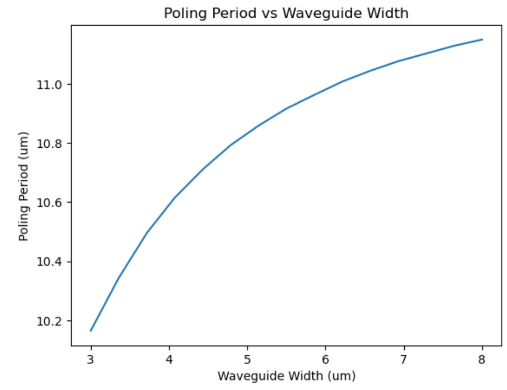
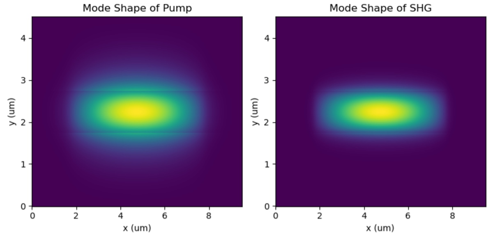

# 2025-02-21 three layer nonlinear etched nonlinear device deposition
This document will follow how I fabricate a three layer device for the etched nonlinear waveguide project.  This is a preliminary study to see if this style of device will be more efficent than the tradiational 4 layer version.  A rough design of my device is included below (for optical characterizations)

I have roughly decided upon SRN3.5 as the core layer and DON39 as the cladding.  I will have 1um of core and 1.75 um of bottom cladding.  Top cladding I can figure out later.  I am currently doing a CMOS clean.

For the films, below is the recipe for the cladding:

SiH4: 40 sccms

N2O: 500 sccms

Ar: 475 sccms

B2H6: 133 sccms

Temp: 375 C

Pressure: 1800 mTorr

Power: 10

Dep rate is 72nm/min and this was done with no carrier wafer

We then want main dep to be 1750/72 so 24 mins and 20 seconds

Before cladding season

During cladding dep

One small mistake I made was not increasing the time for heating, but oh well. So I did a 2 min pre heat

Ellipsometery of the cladding

For the core, in November, we did SRN 3.5 for 19.66 mins and got 751 nm of film.  So this means a dep rate of 38.2 nm/min.  So if we want 1000 nm, we dep for 27 mins (giving myself a bit of extra room)

I adjusted the recipe slightly down to be safe

Before season

For real dep, I am going to stick with 3.5 (changing it was stupid, I should trust my gut).  I will do 27.5 mins for security.  This also requires carrier wafer

Before core dep

During core dep

Core Ellipsometer

Core index

Clad index

Next, we will deposit another 300 nm of B39.  Given the deposition rate of 72 nm/min, we then want to deposit for 4 minutes and 10 seconds.  I will do a quick RCA clean before doing this, as the wafer has not been touched in a couple of days.  After that, we will want to put a Cr hard mask down. 

Before RCA clean

Front is an SiNx, back is the three layer one 

For the SiNx one (the four layer device), lets do 1:15 of oxide like before.  For the three layer device, we do B39 for 4 mins and 10 seconds.  We will do conductive oxide first, and use that as a season for the high rate stuff

Before cladding season

Before cladding dep

For the high rate oxide wafer on SiNx, we will add a longer heating period to make sure we dep at 350, and not 375

During cladding dep

During high rate dep on normal four layer device

The carrier is there too

During dep

Before sputter on three layer device (7mTorr for 1210 seconds)

During three layer sputter

During four layer sputter

After

In front, 1100 annealed, then Cr sputtered 4 layer. In back, half wafer, 4 layer polished, and 3 layer Cr sputtered