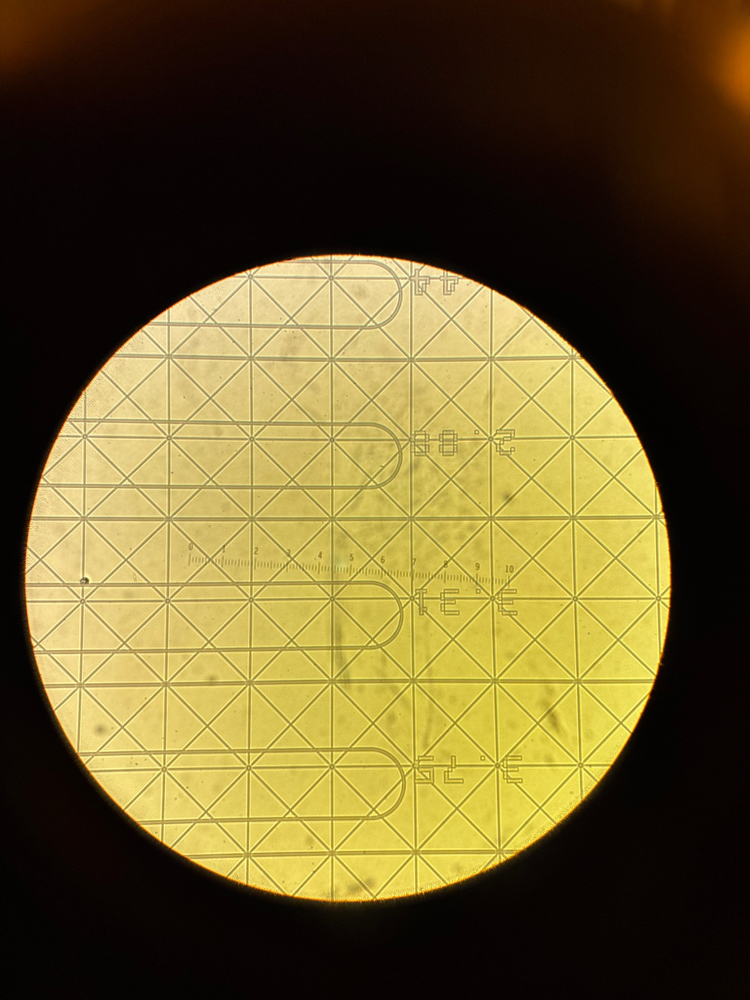
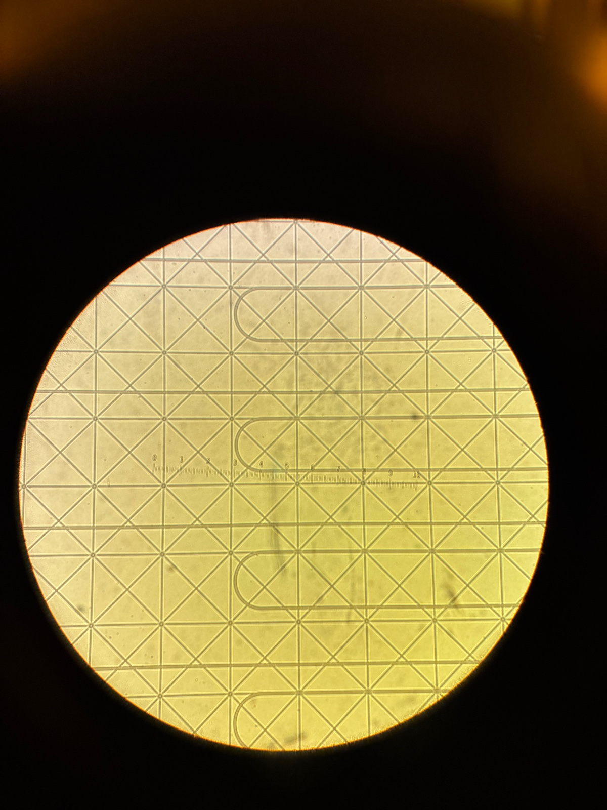
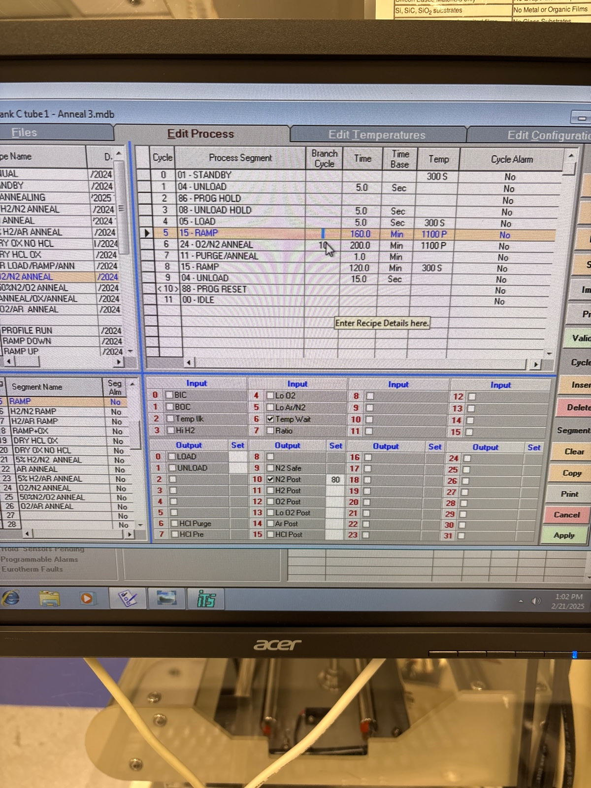

# 2025-02-21 waveguide annealing and packaging
Before Cr mask removal

I am now going to do a 20 minute Cr etch.  I will then do a 15 second BOE etch after.  I will check under dark-field microscope and filmetrics to make sure Cr is gone.  Last time, our anneal was using O2/N2 Anneal recipe

Last time, the editted recipe looked like

So we load and unload at 300 C.  We manually input the setpoint.  We ramped up for 160 mins and annealed for 180 mins.  I will increase anneal time to 200 mins.  We anneal at 1100 C.  Lets load and unload at 4 ipm.  

I edited the recipe accordingly

After first Cr etch, there were still some areas without total Cr removal. Will do another 15 mins

Second Cr etch did the job

Surface oxide has a bit of discoloration, but not too bad. 

I think we are ready to anneal

I am also doing a quick tumble dry and wash of the wafer 

Before anneal

Loading at 4ipm

Further during load

The tube is ramping

During anneal

The system is now ready for overnight cool off

Before unloading 

We unload at 4 ipm

During unload

So the edges do look as expected

Once out

Under microscope

Dark field

More bright

More bent waveguides survived in bottom right

It seems like the middle of the wafer has the most issues. Either way, let’s continue

Now lets Cr etch the other device and do some RTA

I am pre cleaning the PECVD with big wafer 

We willa slo RTA at 650 for 3 mins for the smaller piece

Smaller piece after Cr etch

No evidence of Cr flakes

Because the RTA is down, we will deal with TEOS later

Given this result, it seems clear that we either need a lot more trenching, or to use a negative tone pattern.  Negative tone either means using a negative resist or doing a flood exposure with a positive resist.  I am a bit biased towards using positive resist still, just because we know how that works.  We are going to get some serious feature distortion though.  We also know from the recent waveguide tests that we hvae a more limited field of view in the imaging setup than we previously believed.  So we need to account for that too.  In the next round, I say we get more ambitious than our current chips, and go all the way for 10 cm.  I also say that we should add a few ring structures just to see what happens.  I think we generally have too many straight structures at the moment, and we probably made the last useful straight structure in this anneal.

Before RTA

During calibration

During run

I am gonig to do a 1 minute season with TEOS

There was a comment on the PECVD recently that the TEOS dep rate was elevated (to 78 nm/min).  We really only need an extra 800 nm, so I say we do 12 mins and see what we get.  Before we thought it was 50 nm/min, so this would still give us like 600 nm.  We can always do a small cap with high rate.  I am putting witness sample in to be sure.  We also require 12 min preheat

Before dep

During dep

Witness sample thickness

Microscope after dep

Our dep rate with TEOS is about 56 nm/min.  We really would probably like a couple hundred nm more just to make sure of breakdown and no leakage of modes.  I way we deposit another 150 nm.  If we have a dep rate of 230 nm/min, this means we want to dep for an additional 38 seconds.  

Before second oxide

During second oxide

Another Ellipsometery of witness sample

Seems like what we want!!

Before first SRN season

We will now do 23.5 min depositions.  The right side of the LN box has the chips we want to use.  everything (including witness sample) was spin cleaned

Before dep 1

During dep 1

I think doing the fully 24 mins of cleaning is insane.  20 is definatley fine considering our dep rate is not super high anyway.

Ellipsometery of the first sample

---

# [`Ryotatsu Yanagimoto`](craftdocs://users?id=aa2c0de3-4c5f-8aaf-eaf7-3b949f6279ad) continuing the process [`Fri, Feb 28`](day://2025.02.28)

[`Ben Ash`](craftdocs://users?id=d9d2fbda-3d0b-154c-637c-be9f41830cae) did a first round of deposition. There is 1.5 um of SiN already.

Cleaved the witness samples. The main witness sample has 1.5 um of SRN.

## Seasoning 2nd round

12:51 Venting

12:53 Starting

13:02 Finished.

The color of the witness sample looks good and uniform. We’ll continue.

## Main 2nd round

13:06 start. 23.5 mins.

Same recipe for the same duration.

13:35 Finished.

Now doing characterizations

Quick characterizations with filmetrics. The thickness looks good.

## Cleaning 2nd round

We do 20 mins of cleaning.

13:39 Started.

14:02 Finished.

## Seasoning 3rd round

3 mins seasoning.

14:05 Seasoning started.

14:12 Finished.

14:13 Venting.

## Main run 3rd round

We do 23.5 mins of deposition.

14:17 loading

14:17 Started.

Remaining pieces in the box.

14:44 finished.

14:46 venting

## Cleaning 3rd round

20 mins cleaning.

14:50 Started.

15:11 Done.

## Seasoning 4th round

15:17 Seasoning started. 3 mins.

15:25 Done.

## Main run 4th round

15:29 Starting

Top left two are from this round

---

# [`Ben Ash`](craftdocs://users?id=d9d2fbda-3d0b-154c-637c-be9f41830cae)  continuing the process [`Fri, Feb 28`](day://2025.02.28)

## Cleaning 4th round

After taping

## ITO deposition

Skipped at 300 A.