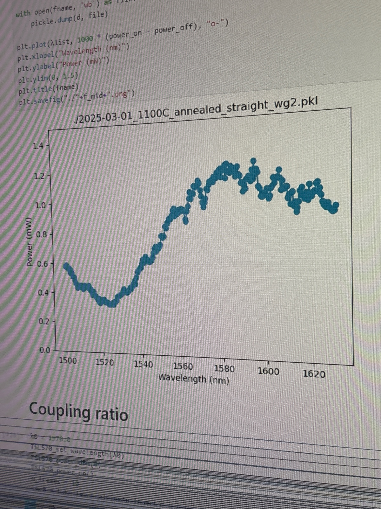
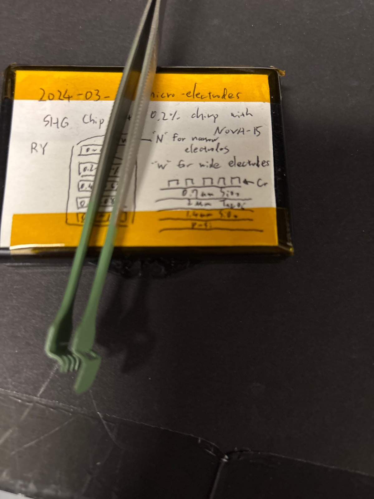
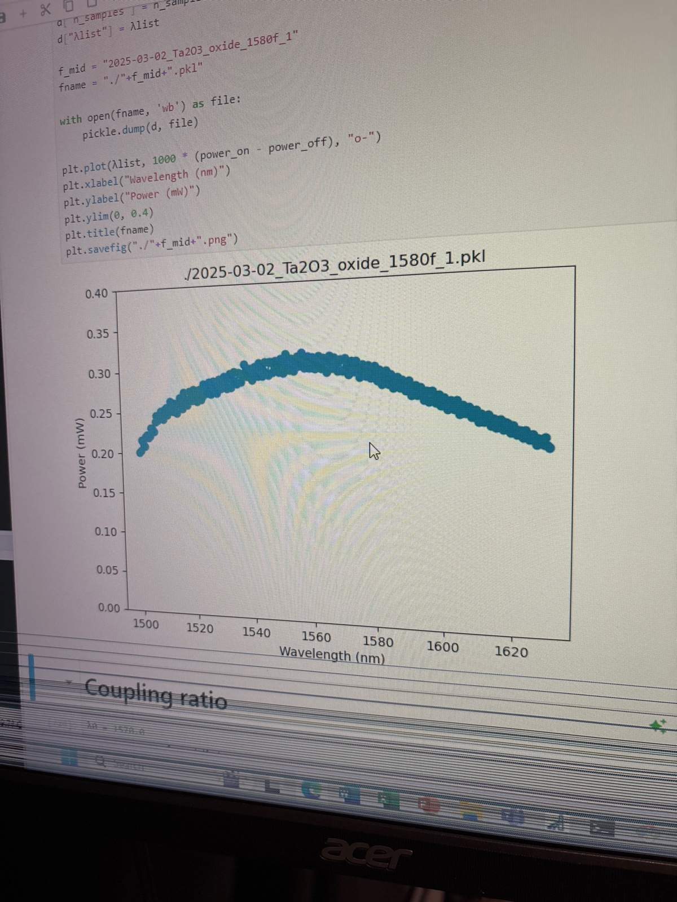

# 2025-03-02 annealed devices initial characterization 
The other day, Ryo and I finished making the etched SiNx waveguide devices.  I now want to test them.  I currently have the emlo in the setup.  Aligning the bent waveguides is nearly impossible, as we don’t have any slab modes thanks to all the extra stress etching.  I will start with the straight waveguides, which are comparitively much easier to setup.

As it turned out, the 1100C annealed straight waveguides did not seem to show any SHG, nor did they exhibit the lossless behavior at 1100C that we were hoping for.  The latter point will require a seperate literatuer search

Below is loss of annealed straight waveguide

Next, I am testing the loss of a Ta2O5 Pecvd oxide chip

Index should be similar

Focus was optimized for 1580. No loss dip, though granted this was slab and not etched, so it probably sees less of the cladding

Let’s try a thinner LN waveguide

Below is LN focused at 1630

Focused at 1520

Now we do air clad annealed devices

Interning that I don’t see the normal dip, though coupling is not fully optimized 

Try a bit of reoptimization, though I still feel like I am doing something very wrong

So there is still loss. I would say this is native to the waveguide.

Cleaved annealed air clad facets

By comparison to RTA

After re cleaving the straight waveguide, we get enough power to get a good measurement 

Re optimizing for 1580

For annealed 3cm waveguides optimized at 1520

Straight RTA at 1630

Straight RTA at 1580

When thinking about why we see so little power out of the waveguides, I think it comes down to the fact that the waveguides are very thin.  Below is the annealed waveguides expected stats (reality is more narrow, of course)

Below are the RTA waveguide states (from the first GDS)

The point is the annealed waveguides are just very small.  This probably means it is harder to get as much power inside.  So I would expect the general signal to be weaker.  We will also stop tapering, as that makes it even harder to couple in (as we just can’t focus the light to such a small point easily).  

I couples into annealed bent waveuigde that is around 5um thick. It is just very hard to get much power. Did this with Elmo 

Now let’s do Santec Sweep with emlo focus

Now let’s try optimizing focus for 1520z I think those later pumps are mostly a function of focal issues for very tight waveguide 

Optimized for 1520

Similar results, and there is definitely loss

Let’s do poling sweep, and below is re optimized emlo power

Still is impossible to see SHG in these devices

Let’s just do RTA bent 

With RTA waveguide, I still struggle to get as much power as I used to in bent structures

Was not able to see any SHG, so we are going to baseline on previously etched straight structures 

Below is coupled power with emlo

Last time I got like 2.5, but close enough

Even these don’t work

Ok, so the setup is broken.

We got it to work, though not sure how yet

Now onto RTA straight. An interring note is I had 2mW going in, but when I adjusted to maximize the output, I saw only 0.5 mW, maxing output means seeing lots of signal on the pmt

This waveguide was easy

The SNR here is kinda insane. Anyway. Let’s do straight annealed now. This was taken with 6 volts applied

Now annealed straight waveguides

Below is initial max  power I got

For annealed waveguide, I replaced NA filter and got backgroud SHG back. It seems that the delaminated parts back at 7.5 V. So I stay at 6 

I am now testing RTA bent waveguides. For some reason, I suck at getting power in, so I only have 250 rn

I am now realigning to the middle waveguide, which has better transmission

With lower NA filter

This waveguide still does not seem nonlinear. I don’t know what I am missing. My take is remove NA filter, kill it, and see what happens. We are also applying 6.5 V

Generally weird result

The next waveguide down we only got to 240

It seems that we finally have a winner

Done with 6 v and 4.5 A on green laser

After Ryo really perfected the coupling

Our joint feeling is that we were probably coupling to photoconductor earlier. It is interesting that these power measurements are quite deceptive

Loss is not great, but I think doing spectral engineering is a better future way to do this

With cw

Another go at pulsed poling in annealed straight waveguides, which new electrode and polish

I could believe something happens at 14.1

Current response is a bit funny

I would almost guess something is shorting a bit still

Still does nothing over time, and we are still getting a rather large transient even with large filter

Let’s do loss

Seems pretty bad, but again, we could simply be coupling to the wrong mode. We can try one more waveguide

Power on another waveguide

All of these were focused at 1520. I will do a long scan on this device, but I am not optimistic

Still nothing

