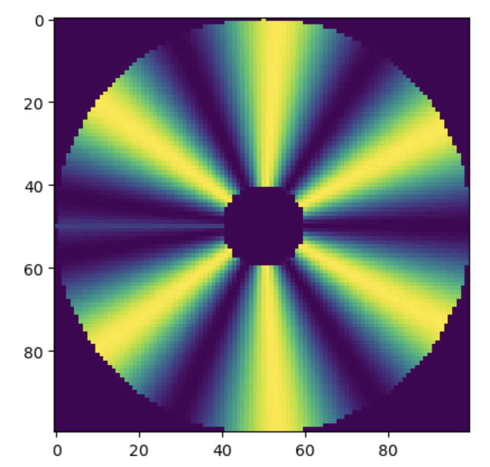
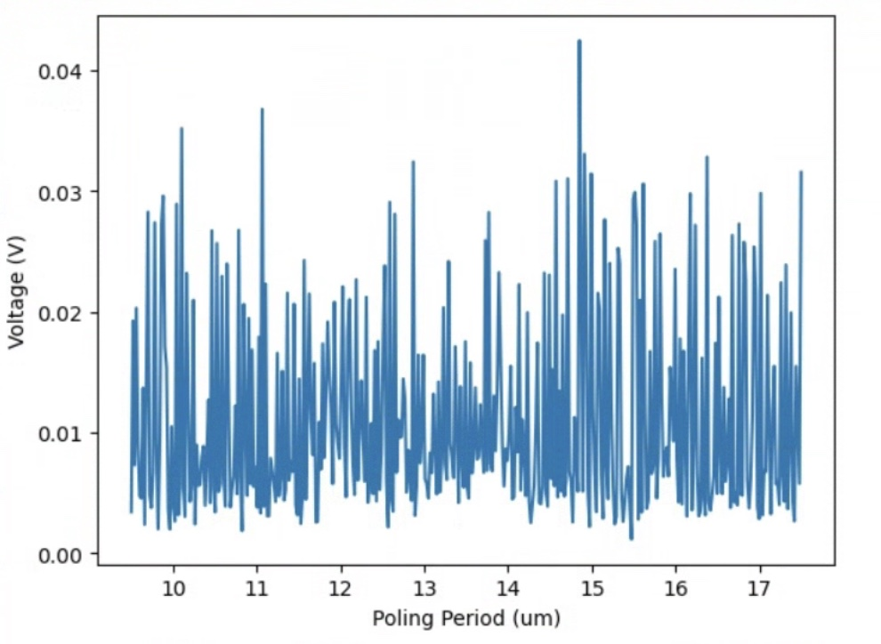
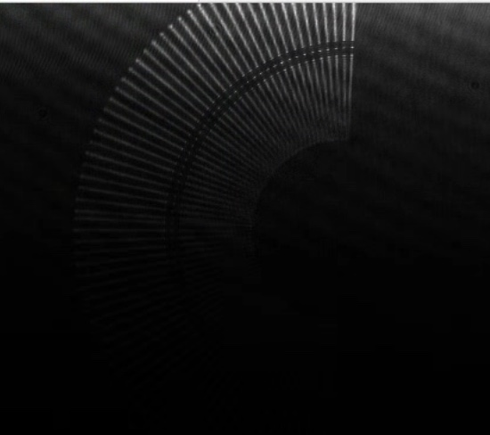
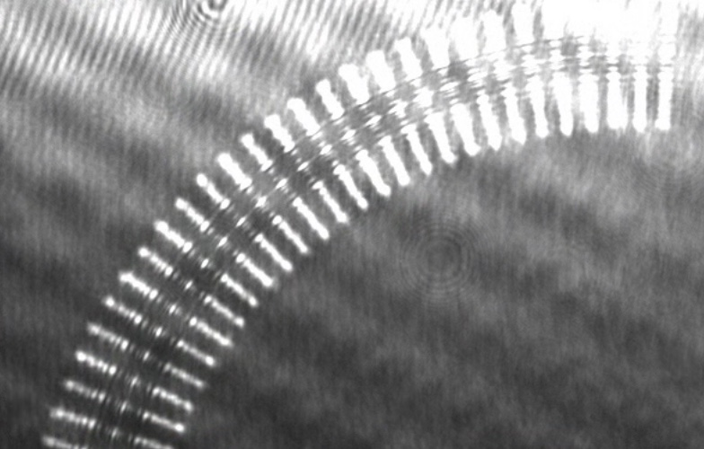
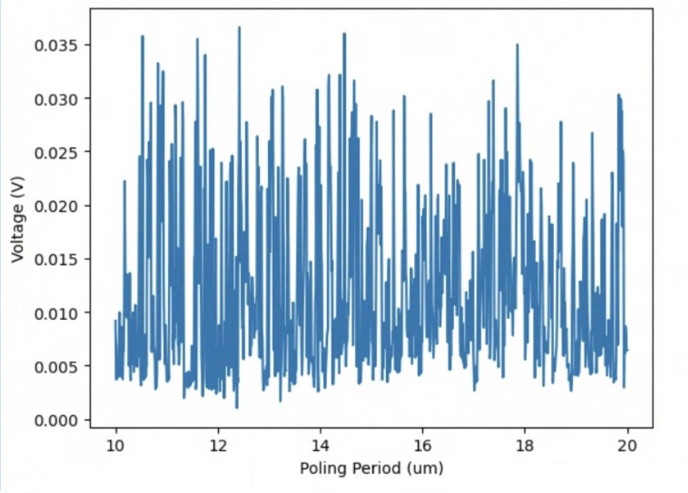
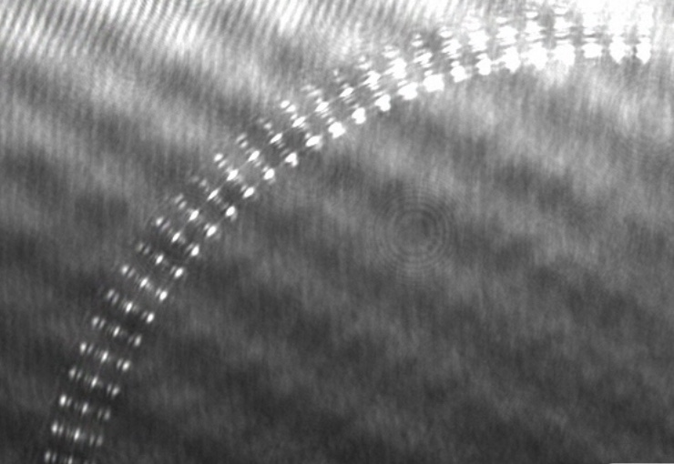

# 2025-03-10 curved structure poling
I currently have the snake etched RTA waveguides nicely aligned and producing quite a bit of SHG (the only thing I need to scan is the AC frequency to check that 5 Hz is right).  I have the EMLO pulsed laser installed right now because it will give me more signal.  My concern now is trying to pole the bent region, as the imaging setup is nicely aligned over it.  Below is a rough sketch of the poling I have for a curved structure (using sine, though I also have a sign function version)

The only downside is I don’t have a tilt of some variet in case that should be needed (basically, if our x and y axis are not aligned with the real x and y axis).  I generally feel like this is more solved by picking a differnet starting and ending angle, but that is just me.

First scan predicutably does not work.  Something that makes this a bit hard is we might not even share the same origon for both structures.  This could mean the poling period on the waveguide is effectively getting chirped.

Still no dice.  I can’t tell if we have the radii quite right

Reducing the width shows that we are pretty well aligned, so I am not sure what the problem is.  

Poling a similarly small straihgt region is above.  We sorta get a curve, but it is hard to say.  

We now do a straight section with a comparable length using sign

So now the signal is easy.  Either way, we really do expect something from the curved sectino, which we don’t see

Below is the same scan but using a sine (instead of sign) function

So we might just need to use the sign function.  FWIW, because the waveguide is bent, it could just be the case that the effective indexes are a bit lower.  I suppose we should bias our poling periods to be a bit longer.  If these continue to not work, I say we do a poling period scan on the two straight waveguides near the bend.

Below is with sign

That did not seem to work, which is a shame.  Though I will say that the signal is just annoyingly weak.  Anyway, I think the next best course of action is to slightly pole the beginning and exit straight sections into the bend.

The transmision lokos nice, so I think the period is consistent

Now lets do a quick poling scan of these two straight sections to figure out where their best poling periods are.  We will then probably remove some of the NA filters so we can take a look at the poling of the bend better.  As Ryo said, we just need a starting signal, and then we can align

Upper straight waveguide (in the middle of the 3 branch bend)

Not very strong, but the waveguide is only a mm long.  Lets make it longer.  Below is for a waveguide that is 1.5 mm long.  We expect the bottom branch to have a different poling period based on previous phi scans

An otherwise very similar shape, just a stronger signal.  Below is for the bottom waveguide (still using a straight poling length of ~1.5 mm)

Nothing, which is a bit strange.  I am going to make the waveguide longer (3.5 mm) and increase the poling range.  Also, wave propagtes in from top left of the image on the pylon camera

zooming back in

Something is happening, but it is hard to say what.  Lets make the poling distance longer (now 5 mm).  I want to make sure I have enough signal that I can then align the setup to it.  I think the image tilt it just a bit off.

Still not great, but I will try an alignment anyway

With a bit of relaignment (ignore first point).  Lets recheck the middle waveguide.  Objectively speaking, the waveguide is a bit long (at 5mm), but we get a rough sense of things this way.  It is also nice how broad the peak is, so hopefully there will be something to align to when the time comes.  We may also need to remove NA filter, but we will cross that bridge when we get there.

Interesting that this waveguide is more nonlinear.  In the future, this is definitely something we want to note.  This probably helps with the idea that a smaller device footprint is better as you get less imaging aberration.

Now lets try the bent section scan again

Seems to be roughly centered, and again, hopefully the peak is somewhat broad (though this boads a bit worse for CW, as that alignment will need to be really good).

Above is during scan.  Again, it would not surprise me if I need a bit more alignement here

If this is to be trusted, we want shorter.  Lets try again there

It works!!  But the amplitude is not insanely high.  I think the next thing to do is slighlty very some of the x and y offset terms such that we can get a more uniform poling.  Once we have optimized those parameters, we can go into lab and focus the entire setup.  Above was for y_offset_percent = 0.06 and x_center_percent = 0.2235

Below is y_offset_percent = 0.06 and x_center_percent = 0.2238.  The challenge with doing a scan of one geometry parameter is that the poling period is a function of geomerty, so we could just force ourselves into some weird local minimum

Tough to say if this is better.  The peak is mostly narrower but not higher.  Lets take X in the other direction (now 0.223

Really is quite hard to say that I am seeing much difference.  Lets return the x value to 0.2235 and scan y

above is 0.07.  This is comically bad.  Good to know you can go too far.  Lets try something more reasonable.  Below is 0.062

Worse, but we are moving.  Below is 0.0595

These are all worse.  I say we go back to baselien and just try to optimize focus more

Refocusing worked fairly well.  It is nice that you get such smooth control in x and y.  I focused optimally with the straight sections.  We do see decent signal from the bent section if you zoom in on oscilliscope, so it might be even better just to leave the straight sections out (in case there is some advantage in one direction).

Above is after realignment.  This is not a tonne more signal, but it is still a very well defined peak.  Lets do one of the straight waveguides (the bottom one) of the same poling length just to compare.  We can also do one huge poling scan to finish off the day just in case something is a bit wrong.

Bottom

Middle

good to see that they look similar.  We still get a lot more power out of the straight regions, which is tough to explain.  Let do a broader poling scan, and then change to the CW EDFA.  While I would noramlly blame focus for our issues, if we see such similar results for the two wavweguides that are vertically seperated, I would imagine we are fairly close to ideal here.  May we could adjust the hoizontal focus, but again, the waveguides would all notice that.

This scan makes me a believer.  It seems like there might be something at even loer areas or even higher areas.  I will scan from 10->13 and 17→ 20 for good measure

10 → 13

mostly seems like small peak around 13 um

17 → 21

So we do see another real peak.  Lets do scan from 13 → 19 where we can see both peaks.  From Ryo, it sounds like the next best idea is to do some chirping of the poling period, as the peaks are rather wide

This is quite interesting.  I am going to do a broad seach (say from 11 um to 21 um) of the straight poling period to see how many peaks we have.  I would like to know if the bend causes the period to go up or down.  It is interesting how wide these are, and rather not sharp or smooth at the top.

So it seems that the poling period goes down slightly

In the mean time, we should think about what we should do for the chirped poling period.  My general take is we should write some function should we can input into the circular sine pattern generator that is able to define the period for a specific angle.  We can have a linear and quadratic term.  It might also be a good idea to calculate the integral of the curves above, as this area should be conserved.  It is a nice sanity check

This is what we saw for linear chirp.  So there does seem to be a peak, but it is kinda isolated, so it could just be some noise bs.  There does seem to be some dependance on the linear chirp and poling period.  Small, but I feel like you could plot a linear line and see something.  We are now running a very large scan where the constant, linear, and quadratic chirp are all adjusted.  It is 23 by 24 by 25 respectiviely.  At this point, lets see what happens

The plot above is for varying the constant, linear, and quadratic chirp.  There is a peak, but hoenstly, I am so sure how much I believe in it.  The max value is around 0.02, and we got it with the following parameters:

Ok, now lets try Ryo’s idea of poling subsections of the waveguide.  The hope is that each section of the waveguide might have a better poling period so we can sort out this two peak business.  The advantage of pulsed light is the phase does not matter

Below is pi/2 → pi

Interesting that we have a rather broad conversion region, but we really only get a lot of conversoin at 14.75 (which is what we expect).  The other peak goes away

pi→ 3pi/2

Ok, so this is where the longer period comes.  Lets try narrowing search

pi → 5pi/4

5pi/4 → 3pi/2

pi/2->3pi/4

3pi/4 → pi

As summary, below is the plot from pi/2 → pi

Below are the subplots

We would expect the sum of these subplots to be the same as the total.  It it possible to see, but the issue is neither plot gives us one peak, which makes this tough

Below is same think for pi → 3pi/2

Subplots

Again, it is possible to see where things are coming from, but I feel like all these subplot scans basically return the same period at 14.76 (maybe with one exception).  It would almost be nicer to do a homodyne detection scheme, only that requires CW light and is phase sensitive.  It is not clear that the sum of these plots is exactly the same.   I feel like a perturbative approuch might be the best, but I am happy to move to CW light soon.  Maybe doing a mode simulation here is best

We are now running CW scan of top waveguide as baseline

A nice and large peak.  Now lets do the bent waveguide.  It is around the same poling period as before 15.77.

I moved the bend slighlty in space to try to center it better.  I will now do a large scan of the bent waveguide over the two poling periods we saw before.  If this does not work, we will need to do some homodyne detection with the large top waveguide

This plot is suggestive, but I can’t say I am seeing anything yet.  I will need to do homodyne detection for this, but poling the top waveguide and than varying phase and pp of the curved structure..  We are getting a suggestive peak somewhere between 14 and 15, as well as a suggestive peak between 17 and 18.  Lets do a homodyne detection scheme in those areas were we turn the poling on at the top and while scanning the phase.  I would be curious to see if the ideal phase is a functino of the poling period.

I think the main concern here is the scanning region was way too large

14→15

It seems that 14.6 might be it fols.  Lets zoom in.  We are really looking for these sin-like curve.  We should probably add in the middle branch too.  The lower branch might be hard just because the phase offset might be screwed up with the different poling in the bend.  This will give us extra power to homodyne onto.  For now, I will do the zoom-in scan

It seems like some peak exists.  Lets try the other domain from above

So I do think the optimal region is around 14.6ish

There seems to be two ideal poling periods.  Good to see that things are a bit reproducible.  The werid part is the poling period around 14.4 was not as bright last time.  Last do a quick scan on the middle waveguide.  We will probably want to do some type of homodyne detection with both the top and middle waveguide poled

Now for phase scan

Interesting that we really need the full 2pi.  Worth noting for the waveguide scan

Results

If the result is true, it seems like the ideal phase drifts a bit depending on the poling period

1d cross sections

It is just weird so see such asymettry around the peak, but this is very similar to before.  Lets zoom it and scan further.  We can sorta see stuff going on, but I want a bit more confirmation

Another one

I feel like its a moving target.  I am going to zoom around 14.5 +/- 0.05 and take some more points

Lets continue to do scans here.  I am still not convinced as to what we are seeing

I feel like each time we do this we just get a tonne of drift.  I will go into the lab later and make sure the oscilliscope resolution is good enough.  Below is zoomed in oscilliscope, though wider data

Ok, so I think we have taken enough scans of this region.  Lets do around 18 just to see if anyhting is up there (as something was there for pulsed light)

