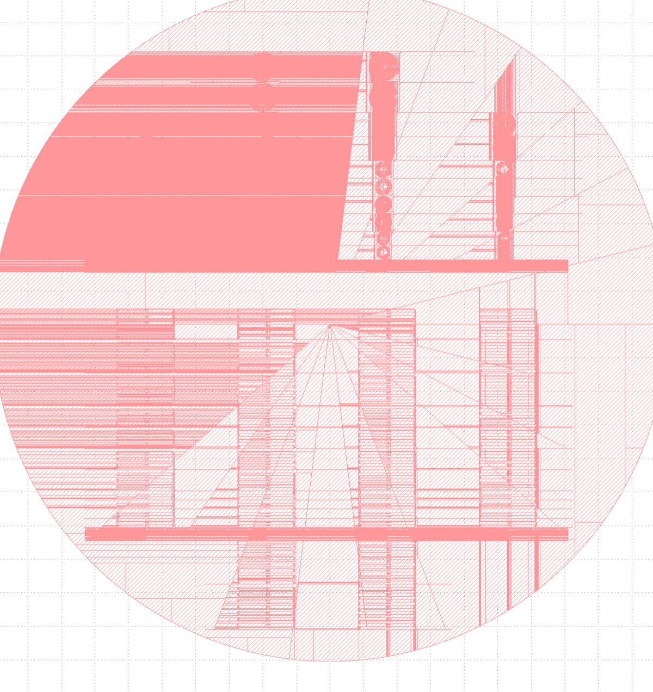
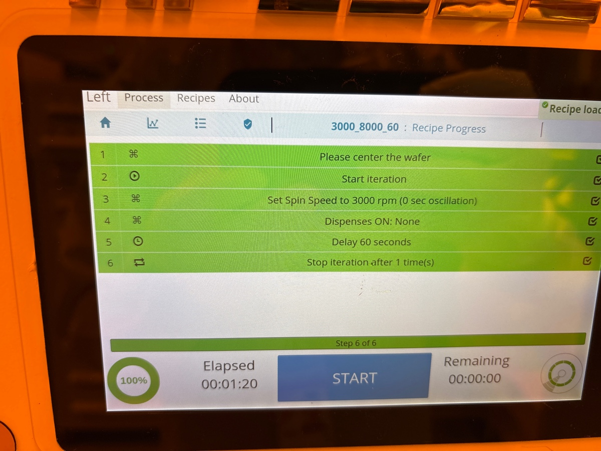

# 2025-03-16 etching with negative exposure file
This note documents the process by which we do the flood exposure of the wafer using the positive resist.  The reason we are doing it this way (instead of with hexing) is that we want to etch ALL the way through the SiNx layer.  This will allow us to get rid of any residual stress effects in the film that could lead to cracking (as I don’t expect oxides to be the issue).  The rough draft of the GDS file is below, though there are still a few touch-ups to do

[pad3 pass5.5.gds](https://resv2.craft.do/user/full/c10b6666-b4fd-53a0-9177-1696a144b2d8/doc/3246DCDE-1018-479C-9C4F-D0A892242D6C/005467B9-A95A-48C2-AE3A-AB4F1A74FCB3_2/GZl1YV78tQxMxJhxERFCX21HAFZRZW9B65KPbcJ7xx4z/pad3%20pass5.5.gds)

It does look a bit objectively insane.  I may end up recompiling it with higher resolution on the spirals.  There are also a few features that are pointy on the spirals that I would like to get rid of.  Either way, this is not bad.  Giovanni said the exposure might take a while.  This is fine, so long as it happens.  He also said to underexposue (between 50 and 55 as the dose).

We have two wafers in storage at the moment: Three layer device and the four layer device.  Both have Cr hard masks sputtered already, so we should be good to go.  Keep in mind, we want these devices so we can test whether three layer devices are better and if annealed in the CCMR can help.  These devices are already contaminated with Cr hard masks, so we can’t use the CNF’s high tempurature tube.  There is no huge parallel benefit to doing multiple wafers at once (as the tools can only take one wafer at a time and this mostly saves time on seasoning).  That being said, I can’t think of a good reason not to do both wafers.  So lets expose both wafers, and we can figure out cleaving later.  We will also want to cleave off a small part of each wafer as a straight waveguide test in the CCMR.

Below is rotated and centered GDS file 

[pad3 pass6.gds](https://resv2.craft.do/user/full/c10b6666-b4fd-53a0-9177-1696a144b2d8/doc/3246DCDE-1018-479C-9C4F-D0A892242D6C/FCE76732-79FE-4CFA-8E21-7C89D183E8B0_2/cuJQq6VKdxxhZZ8Dylwgf0HLt1oM9HxnPgMk0btRkCYz/pad3%20pass6.gds)

For resist, I will use 3000, 8000, 60.  I don’t feel a need to vapour prime.  I will just use normal primer.  I will also coat the wafer while it is centereing (so there is a bit of spin)

Before spin

I will also bake at 90 C for 1 minute

Below is mla before write. We use de focus of 0 and dose of 56

During exposure of four layer device

For development, we use program 4, which is 726 for 1 minute

Before second exposure

During second exposure

Below is first development program

After first development

Next, we want 50 second descum.  I am shortening this slightly.  We will also want to do a 5 minute season of the 81.  We will do a 10 minute season of the PT 770.  Then we will do 8:30 of Cr etching.  Sounds like a plan to me!

Before Cr season, it is the same as we left it

Before second development

After second development

Three layer on right

Before descum

During descum

During 3 layer Cr etch

During 4 layer Cr etch

After Cr etch of 3 layer

After Cr etch of 4 layer

Notice that the wafers have different colors.  This is a nice little confirmation that we did assign each wafer the right layer number (as the four layer device after oxide is purple).  We lost a bit of waveguide extension at the top because of the wafer clamp, so we will have to account for that in the future.  On the right side, this will make it very easy to see whether the Cr comes over during wet etch (as we now have a large and visable Cr region).

Next, lets think about the Oxford 100 dielectric etch.  On the four layer deivce, we have ~100 nm of Cr, 300 nm of oxide, and 2um of SiNx (the rest does not matter).  We want to etch all the way down.  This means we probably want to see at least 2.5 um on the profilometer.  We can also use the ellipsometer too, as we now have plenty of wide and exposed areas.  We etched 10 mins to get this depth before.  Lets do **10.5 mins** just to be safe.

For three layer device, we have 100 nm of Cr, 300 nm of DON, 1 um of core PECVD SiNx, and 1.8 um of DON.  We want to etch all the way down, so we went to see a depth of 3.2 um.  We previously found that our native oxford PECVD oxide etches at 150 nm per min and the SiNx etched at 170 nm per min (but this was over a year ago).  Our SVM nitride etches at 275 nm/min.  So pretty high.  Lets assume that rate.  This means we etch 11.6 mins, but lets make it 12.  We definately want to etch the four layer device first, as there is greater certainty there.

There is a bit of an arguement to be made that we should cleave off a piece of the 3 layer device and only etch through the 1 um thick core.  This would preserve a higher breakdown.  I think a large reason we are getting faster etch rates is because we are etching on full wafers.  At some level, I don’t expect us to need to etch all the way down yet, as I have no idea what kind of annealing proceedure I want to do.  So we really only want to etch 1.5 um down (to get through 300 nm top DON, 100 nm Cr mask, and 1 um SiNx layer).  So lets instead etch for **5.5 mins**.  

Before season 1

Before 4 layer etch 

During etch

After etch

Spin cleaning helps a bit with dust

No dust on other wafer

I am not sure what the dust is, but I want to finish etching.  It seems the oxford 100 just does this.  Based on that etch, we have a rate of 210 nm/min.  For the 3 layer device, where we want to etch 1.5 um down, this means **7:30 mins.**  We also need another 1 min 50 seconds for the 4 layer device.  

Before three layer etch

During etch

After three layer etch

So this dust is a bit mystifying.  I think it would also be good to take an ellipsometry measurement or two just to confirm the depth intuition.  I guess because more material is exposed, the etch rate is slower, as the chemical part is used more frequently.  From beforehand, it seems that acid cleans and spin cleaning seemed to help.  It seems that this dust just comes from using the oxford 100.  I am not sure if I am allowed to RTA clean these wafers, but at the very minimum, I can put them in HCl or something.  I will just need to check that it does not etch Cr.  This is not super urgent though.

We could also try sonicating in IPA, though I am a bit worried about damagining my etched structures (in case adhesion is mid or something)

# Note by [`Ryotatsu Yanagimoto`](craftdocs://users?id=aa2c0de3-4c5f-8aaf-eaf7-3b949f6279ad) on [`Mon, Mar 17`](day://2025.03.17)

This is the 4 layer device that could be washed. We will try acetone and IPA first.

14:43 Acetone bathing started

14:47 Moved to IPA now after 5 mins. We will inspect the surface under the microscope after this.

14:52 Taking it out

14:58 This did not clean off the dirt. We’re moving to sonic bath

