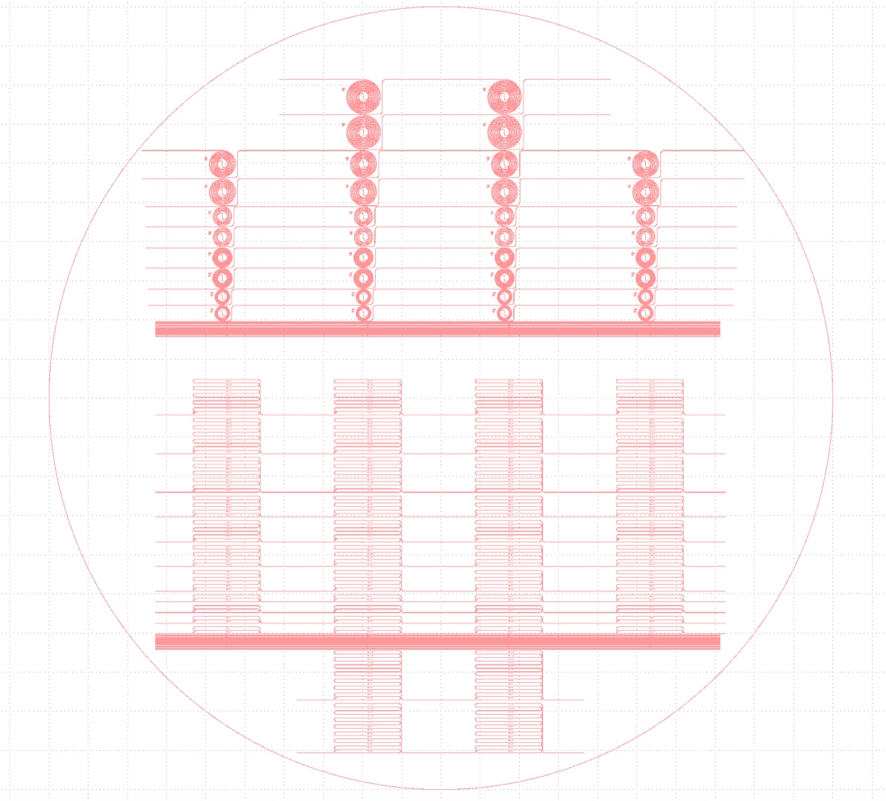
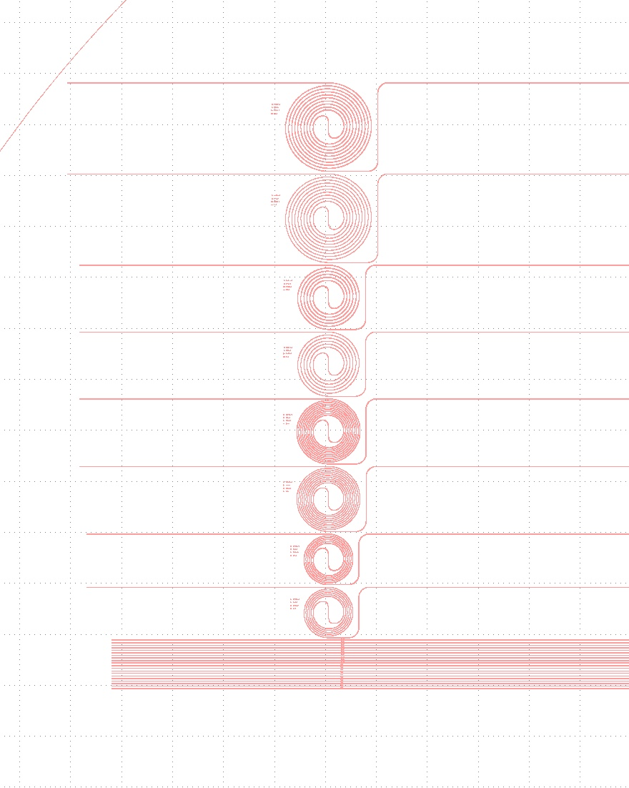
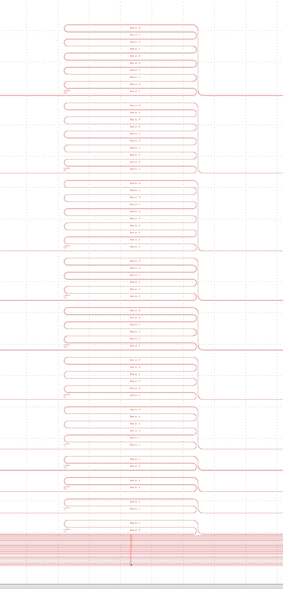

# 2025-03-20 rta and electrical capping of negative exposure 3 and 4 layer devices
In a previous note, I fabricate three layer devices and four layer devies and used a negative exposure pattern when lithographyically defining my features (which is shown below)

We also have some longer features than usual on this wafer (look in the middle rows).  First, we will want to Cr etch.  We have might smaller features, so it might make it hard to see when the Cr is gone.  For that reason, I say we Cr etch for ~20 mins and then do an HF dip.  I think the fact that we have much less Cr remaining means it will all etch away faster.  We will then do a 3 minute RTA at 650 C for 180 seconds with 20 C ramp on the 4 layer devices.  I say we conserve the chips that are three layer for now.  We still have a rather thick bottom oxide, so I don’t want to risk any cracking there.  I will handle this before any depositions.  We may also want to put the annealed quarter wafer into the Cr etch bath just to clean it off for later depositions (as it has not had protection for a bit and this will just get rid of BS).

For cleaving, I did make this wafer rather hard (and the dicing saw is down, so no dicing).  I would assume the easiest way to do this is cleave in the middle, try to then cleave the left quarter off.  If this does not look reasonable, then we can cleave in the middle and have a few 1/8 pieces.  Just make sure to cleave through the waveguides when doing this in the middle.  We can probably cleave the left side waveguides more easily once we have seperate pieces. There is a fair arguement that we want some of the middle pieces to get longer propagation distances.  I am against it mainly because I am assuming losses will be too high at the moment.  For first study, use the less valuable pieces.  So we should try to have the two pieces below for the 3 and 4 layer devices

I must say, I did not give myself a tonne of cleaving room on the bent waveguides here.  

After cleaving, Cr etch, and RTA, we will then need to deposit TEOS.  I would like 750 nm of TEOS.  Given the deposition rate we clocked a week or two ago, this means we deposit for **13.5 mins**.  We must use a 12 minute heating step as well.  This will be on the 1100 C annealed straight waveguides and our current RTA 4 layer negative devices.  We expect a bit over 700 nm of TEOS.

Next, we want 4.5-6 um of SRN8.  This means we deposit for **23.5 mins** 3-4 times.

For the three layer device, we want 1um of conductive oxide.  This means we want a **14 minute** deposition with the parameters below

For the films, below is the recipe for the cladding:

SiH4: 40 sccms

N2O: 500 sccms

Ar: 475 sccms

B2H6: 133 sccms

Temp: 375 C

Pressure: 1800 mTorr

Power: 10

I might do a few more simulations of three layer devices to quickly double check this is what I want, but it feels fine to me

I just cleaved. I am Cr etching for 20 mins and then doing an HF dip for 15 seconds. I am also warming up the RTA B

During calibration

During run

After spin clean and RTA

And the annealed one before deposition )I did a subsequent spin clean

Box

Even after hot HCl, nothing

# [`Thu, Mar 20`](day://2025.03.20) note added by [`Ryotatsu Yanagimoto`](craftdocs://users?id=aa2c0de3-4c5f-8aaf-eaf7-3b949f6279ad) 

## PECVD

### Seasoning TEOS

Samples

There’s a red alart

Talked with Jeremy. It’s fine to accept and go ahead. This is caused by the leak of the bulb.

1 min seasoning

15:08 Venting the load lock to load the carrier

15:11 TEOS seasoning 1 min started.

15:20 Seasoning finished.

### Main run

15:20 Venting

12 mins heat

13.5 min main dep

15:56 Finished.

### Cleaning TEOS

16:36 Plasma flickered. We skip the process.

Venting

## SRN deposition

### Seasoning

16:41 Seasoning started. SRN8 recipe

16:49 Finished. The color looks good.

### Main run 1

16:55 23 mins SRN

After dep 1

10 nm thinner than expected.  Lets just do 24 mins next time

Second season

I should also note that 18 mins was enough to clean 23.5 mins. So we can probably get away with even less cleaning

Before dep 2

During dep 2

Ellipsometery of 2

17.5 clean worked for 24

Before season 3

Before dep 3

During dep

16.5 worked as clean

Ellipsometery of witness sample

Before season 4

Before dep 4

During dep 4

Next, we need to do the conductive oxide deposition.  In general, a thicker film is better because this gets more field contrast as you switch the photoconductor.  The idea is you really want the photoconductor to not dominate the bright state total impedance.  So we could do thicker.  I say we do another 1.75 um, which means depositing for 24 mins.  Below is the recipe

SiH4: 40 sccms

N2O: 500 sccms

Ar: 475 sccms

B2H6: 133 sccms

Temp: 375 C

Pressure: 1800 mTorr

Power: 10

Keep in mind, we will be depositing using the carrier wafer, so the results will differ a bit.  It will probably be more insulating, so I will cut the N2O flow to 475 or 450.  We can throw a witness sample in to compare the index and dep rate to before.  We then want to use the Lesker to sputter onto all the pieces.  Please avoid any blow-up sights on the straight waveguides.  Fewer waveguides is ok.

I am running 5 min preclean and will spin clean the chips  

Before witness sample season

During season

Ellipsometery 

Below is what we got before

Index is quite a bit lower.  Lets flow 425 for 25 mins

Before deposition

During dep

After mourning

Before starting sputter

Ellipsometery of the DON top cladding

Index is a touch low, but oh well.  So we expect the top layer to take most of the votlage contrast, which is a bit rough.  This probably means we have a lower operation frequency.  

At end of sputter

After a little while longer (cool down)

After polishing the four layer snake

