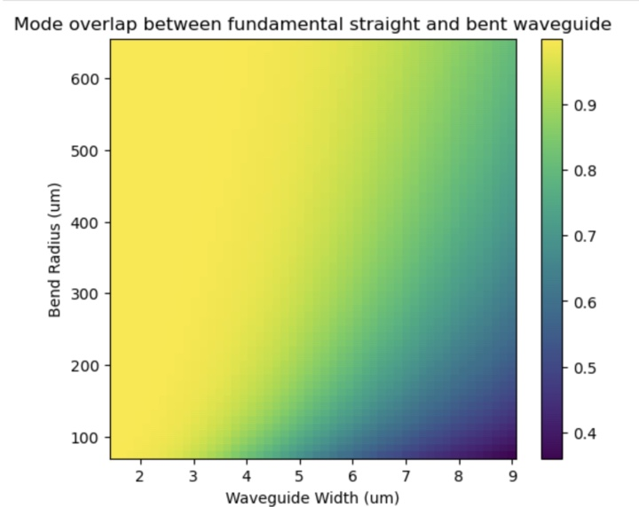

# 2025-04-07 improved insertion loss simulation for snake and snail waveguides
After discussion with Ryo, it sounds like our eigen mode simulation is not nessesarily the best approuch (as it does not maintain that the system will always be in the fundamental, but rather that the system will be in the funamnetal at two inputs and outputs).  One idea he has was to simply calculate the mode overlap between the bent and straight sections.  This is a bit more hacky, but the idea is that these overlaps should be as close to one as possible for the fundamental modes of both.  Again, it is a bit hacky, but oh well.  

Below is a colormap of the radius of curvature and waveguide width for the snake waveguides.  The heat map is for the mode projection for the fundamental of both the straight and curved region.  For the spiral, we will simply perform this calculation more adiabatically.  

As reference, below is the index data for annealed SVM at 650 C for 3 mins

I also centered this at a wavelength of 1.55 um and assumed full etching.  I also used the top fit functino for oxide here: [https://www.researchgate.net/figure/Best-fit-Cauchy-parameters-of-SiO2-films-as-de-termined-by-SE-Numbers-in-parenthesis_tbl3_323448403](https://www.researchgate.net/figure/Best-fit-Cauchy-parameters-of-SiO2-films-as-de-termined-by-SE-Numbers-in-parenthesis_tbl3_323448403)

The end result is that narrower waveguides and larger bend radii are better.  We can probably find some spot in the middle where the poling period is reasonable and we have safe insertion losses out of fundamental.  

Now for spirals.  This is a bit more tricky.  The way I am going to do this is to discretize the spiral and treat each discrete section as having one bending radius.  I will then just calculate several overlap integrals and multiply the product of all the overlaps.  I will also import the spiral functions with the sine to some power

Below is the first spiral result

Get so a simulation with 50 points and see if there is much change.  I effecvtively want to know when the simulation starts to converge.  Additionally, I will add a function to plot the snail, as it would be nice to have some idea of what we are dealing with.  All of these are done with mode resolutions of 512.

Higher discretization hurts the widths belwo cut off, but does not seem to matter a lot for the higher ones.  Lets do 100 points and call it a day on this scan

Leep in mind, these plots should be squared, but close enough.  Squared because these only account for half the spiral.  This 100 point plot actually shows a bit less loss.  Either way, lets do 30 points in the future.  That seems to be a decent enough of an approximation.  It basically seems there is a width after which the power stops to drop (and above which we are generally fine).

Now, for the meaning of the c, d, and e parameters. C is just a linear scaling factor.  D is the exponential on the sine function in the middle of the snail.  This sets the shape of the middle.  E is when the archimedes spiral picks up from the sined exponential.  I would generally say we leave D and E as 0.25.  I would do a scan where we adjust C and width.  

Above is a revised scan accounting for the full length.  At some level, the middle is still a bit odd, but I don’t think it is a huge deal.  Suffice to say, we roughly know 4-6 microns looks roughly safe.  I will let a longer simulation go while I try to setup a 2D scan, while below is a higher resolution scan I made while getting the 2D scan ready

It seems that more points just slighly increases the insertion loss.  Still, we are only loosing a dB or two.  6 um is looking a little suspect to be honest.  In the future, if we want an easier poling period, we may need to consider having a lower index core (though I am not totally certain what the relationship is between the core index and fundamental insertion loss).

2D scan

It is kinda funny, but is seems like hte C parameter kinda does not matter.  This is a tad surprising.  

Below is a baseline run

Now with an increased C

So it does seem to matter. I probably screwed up the code in the 2D scan

Above is updated 2D scan.  We would prefer the size of the image to be 3mm by 3mm.  Effectively, a larger C value is better (big surprise right).  Lets do a similar scan for e (as I am a bit hesitant to change d).

So it seems like a value around 0.25 is best.  This makes sense, and was already what we were using.  I will do a quick simulation for d, though I might end up ignoring it

Ya, really seems to like 0.25 huh