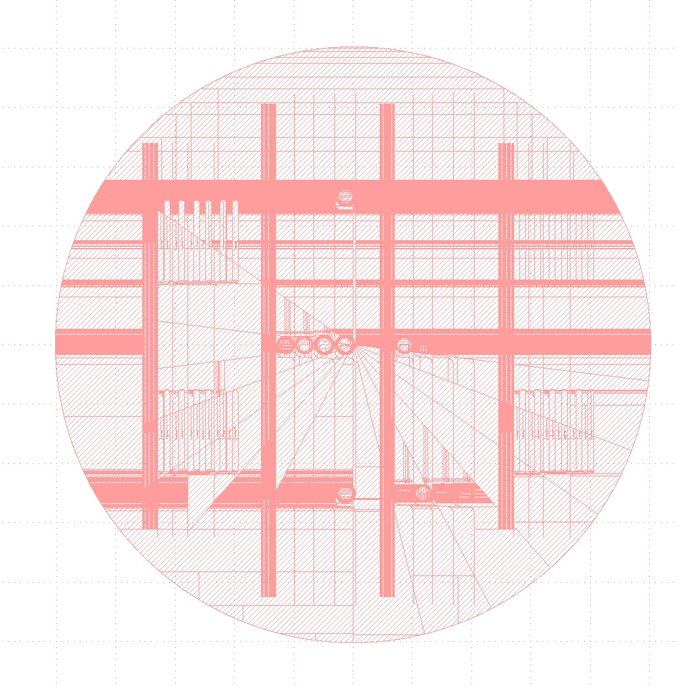
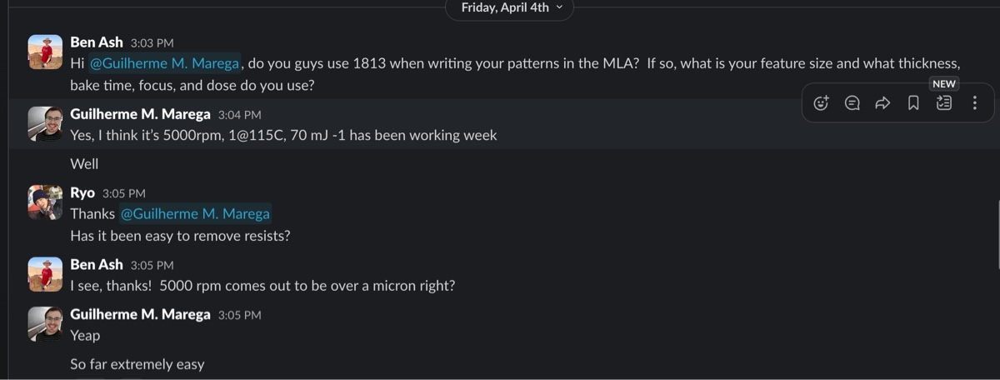
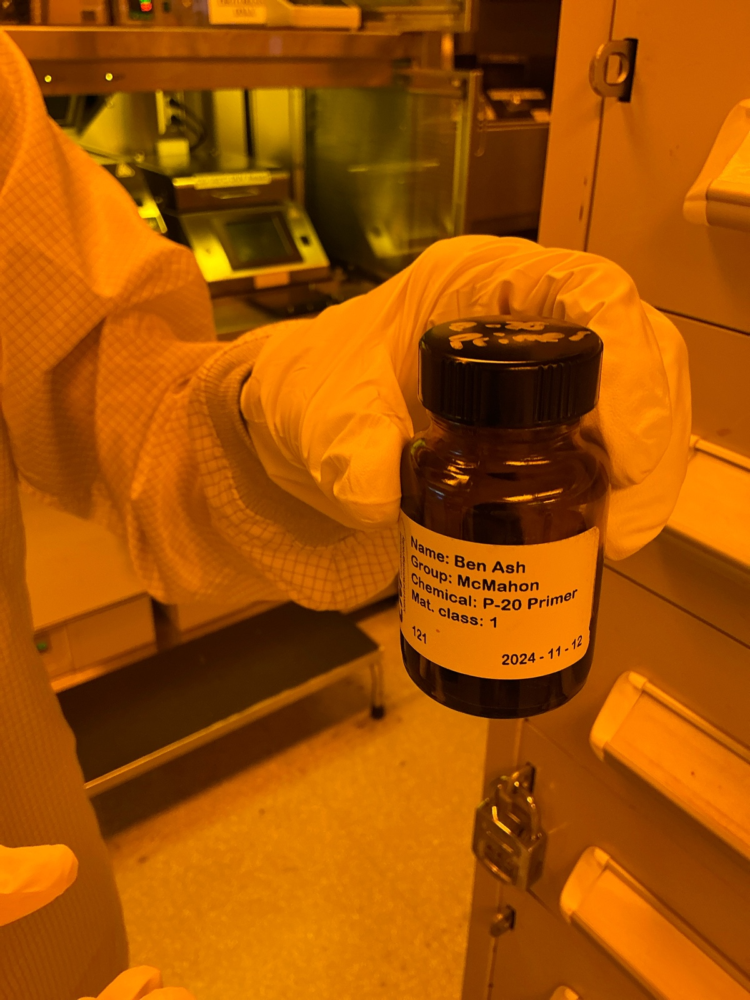
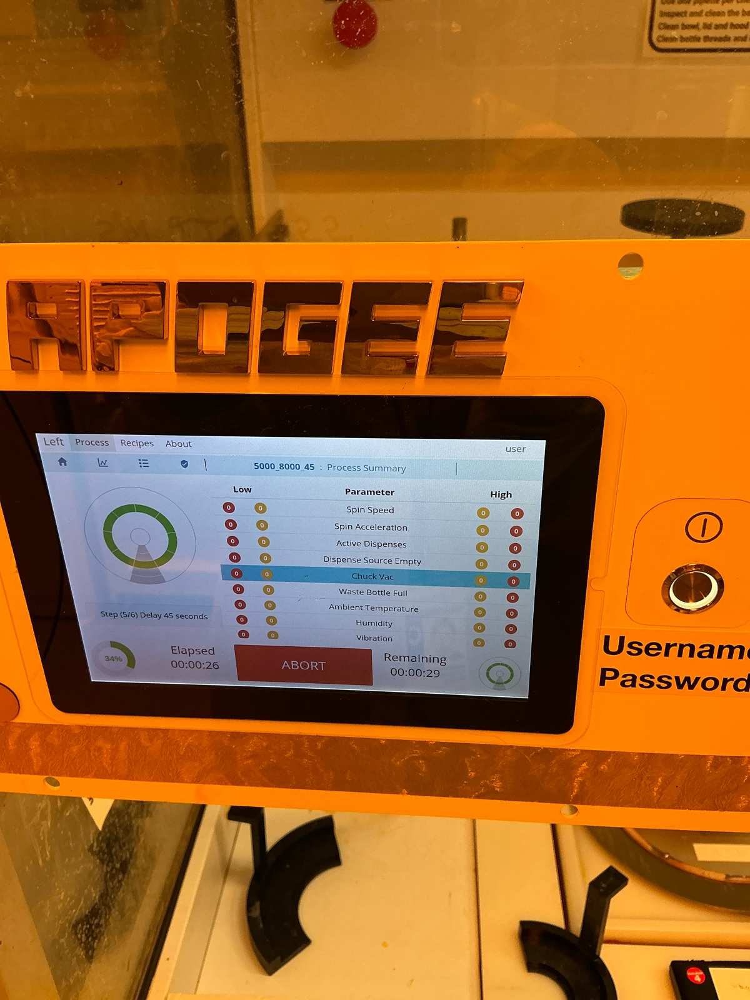

# 2025-04-08 negative narrow snake and sprial etching
We previously fabricated negative spiral and snake waveguides, but they were too wide.  This leads to loss to other modes from the fundamental, meaning these are not super useful.  So we designed a new GDS (attached below) that has much more and narrower spirals and snakes.  They are not quite as long (the max lenght is ~7 cm) but that is ok

[pad4 pass1.gds](https://resv2.craft.do/user/full/c10b6666-b4fd-53a0-9177-1696a144b2d8/doc/3FDDE500-85E2-4EA7-A013-774B7FE0B9E1/7A6A0695-9B23-46E5-8D67-B0D2B0AAED2B_2/8N3L95EOFCbZkfoKuRx2Z93fnely0z0xuRKOxnXOVdwz/pad4%20pass1.gds)

All rotated as well

We are also not going to use a Cr hard mask for this.  We will just spin clean, spin prime, and coat the wafer with 1813.  We are following a recipe Gui gave us, which is attached below

He claims this should give us a micron, but I am going to quickly check on a dummy piece.  The procedure is going to go as below

1. Spin clean, vapor prime, and spin coat 1813.  Use 5000 rpm, with 8000 ramp, and 45 second spin.  Bake at 1 min at 115 C
2. Expose on the MLA with 70 mJ dose and defocus of -1.
3. Develop the resist with MIF 726 for 1 minute in the hamatech
4. Descum the resist for 1 minute in the oxford 81 or 82
5. Etch the SiNx in the Oxford 100 for 9.5 mins (as we clocked the etch rate on these samples previously to have been 210 nm/min).  In the book, it says we should get 4:1 selectivity
6. Remove remaining resist with O2 plasma, resist strip, RCA.  This we will come to later

Now I will coat an Si piece using Gui’s recipe just to verifiy it works as he is telling us

115 C, 1 min baking.

It is a bit thinner than we want. We make the spin speed slower.

Coating done

# Development 

Program 6

# Oxford 82 for descum

21:37 Logging in

21:38 10 min oxygen cleaning

21:57 Venting

1.1 um left. We can do 90 sec of descum

22:04 Start

Descum eats photolresist by 90 nm per minute

22:09 Venting

# Oxford 100

Below is before season

Before etch

During etch

Cleaning

15 mins

We have the Si wafer inside

We have height of 2.5 um

# Oxford 82 again

22:47 Mild descum 10 mins

Finished

We saw roughly 2 um of height after the profilometer, roughly confirming the 4:1 selectivity (as the descum removed ~ 500 nm of resist).  I will also put the wafer in the resist strip bath just to make sure.

# Note added on [`Thu, Apr 10`](day://2025.04.10)

# PECVD for SRN

16:42 Cleanimg 5 mins

17:02 Done

23 mins for 1.5

23/1.5*2=30.667 

31 mins

### Main run

31 minutes

17:06 Started.

17:41 Done now.

Thickness came out mostly as expected

### Cleaning

---

# Note added on [`Fri, Apr 11`](day://2025.04.11)

We intend to perform PECVD deposition of smooth SiO2. See [2025-04-07 Special oxide deposition and etching for reduced bending losses](craftdocs://open?blockId=CC67967E-0650-4044-8C24-17BF920C8645&spaceId=c10b6666-b4fd-53a0-9177-1696a144b2d8).

Last time, we got 2.5 um of SiO2 after 15 mins 10 secs of SiO2 smooth recipe. Dep rate is 2.75 nm/s.

We aim at 1.5 um

546 secs=9 mins 6 secs for 1.5 um. We do this twice.

# PECVD

## Cleaning 5 mins

15:39 running

15:45 Finished.

## Seasoning 2 mins

15:46 Starting. We expect to see 330 nm after this.

### Main run 9 mins 6 secs

16:14 Finished.

### Cleaning 12 mins

16:17 Starting

16:34 Done

### Seasoning 2 mins

16:43 Done

Thickness good. May be a bit thinner.

### Main run 2 

Second run. 9 mins 6 secs.

16:45 Ｓｔａｒｔｉｎｇ．

16:59 Completed.

### Cleaning

24 mins

Started

# Oxford 100 etcher

- Clean 10 minutes
- Season for 1.5 minutes
- We aim at 1.9 um etching
- Last time, we got 143.3 nm/minute or 2.389 nm/sec. If we want to do 1900 nm, we should do 1900/2.389 = 795 secs=13 mins 15 seconds. 

- To keep some safety margin, we can do 12 mins 45 secs.

## Cleaning

I see a wafer inside already.

10 mins Cleaning

Because there’s already a wafer, we do the process on this one.

16:56 Started.

Plasma is on.

17:09 Wafer came back

### Seasoning

We use this one. 1.5 mins seasoning.

This is the same recipe as before

Wafer is loaded.

17:11 Started.

Flow is okay

Plasma on.

17:16 Finished. Venting.

### Main run

12 mins 45 sec.

17:21 Loading the wafer.

17:22 Started.

He flow seems okay

17:40Venting

### Cleaning

15 mins

Loading wafer

17:45 Starting

## Ellipsometry

The fit is pretty good. We might have left a bit too much SiN though. The oxide thickness is around 1.3 um. Again, we could have made this a bit thinner.

The fit does not change even after we enforce the pre-determined values of SiN index.

Now I am precleaning the PECVD for SRN deposition for 5 mins.  I also spin cleaned everything after cleaving

Before season

Lets do 3 deps of 32 minutes to get our 6 um of SRN.  I realized after the fact that the recipe I input was slightly off.  To be clear, below is the full recipe we want

Before first deposition

During deposition 

First witness sample

Looks good to me

24 mins of cleaning worked. 

Before second season

Before second deposition

During second deposition 

21 mins of cleaning worked

Before season 3

Before dep 3

During dep 3

# ITO

At end of sputter

---

[`Sat, Apr 12`](day://2025.04.12)

# Measurement of loss

## Oxide cladding device with no SRN

This waveguide has very low transmission. We measured only 4 uW at 1570 nm, out of 49 mW coupling.

## SRN device

We got a bit more transmission, e.g., 400 uW from the straight waveguide.

However, the mode is very messy. Also, the coupling is much less critical. This seems to indicate that the most of the power come from the photoconductor coupling, unfortunately.

Below is image of mla job

New one

