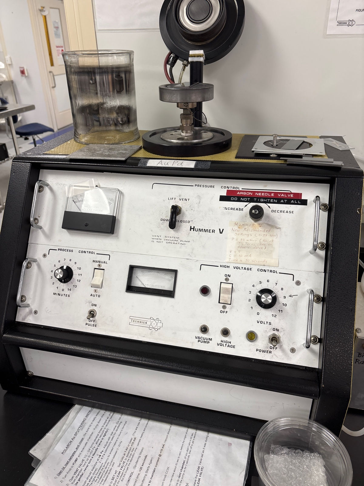
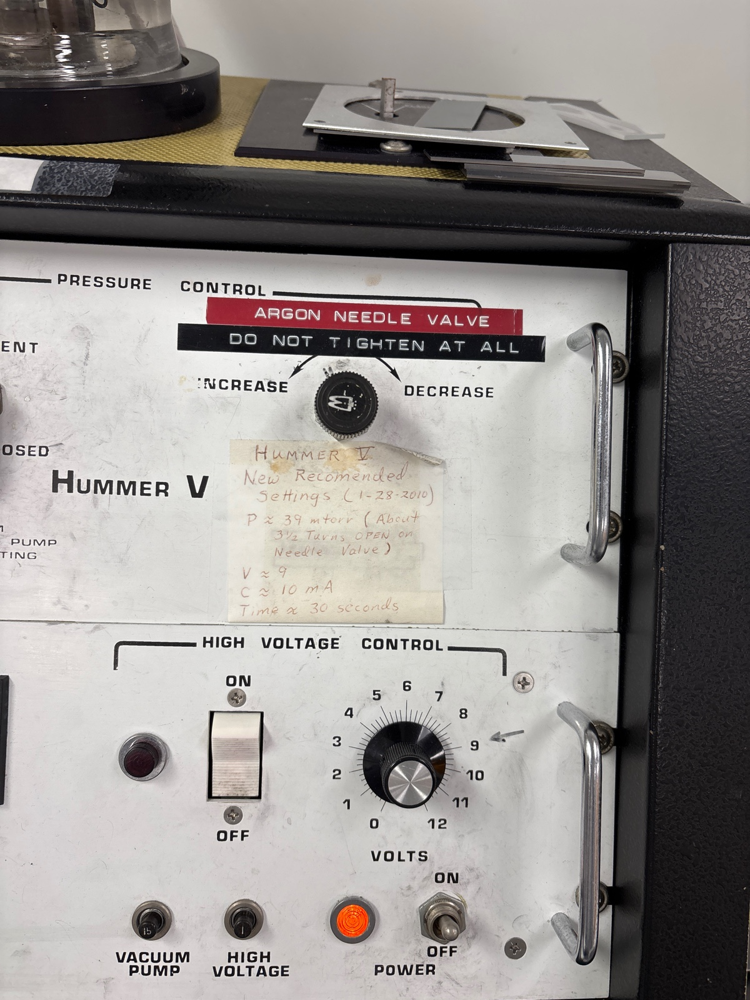
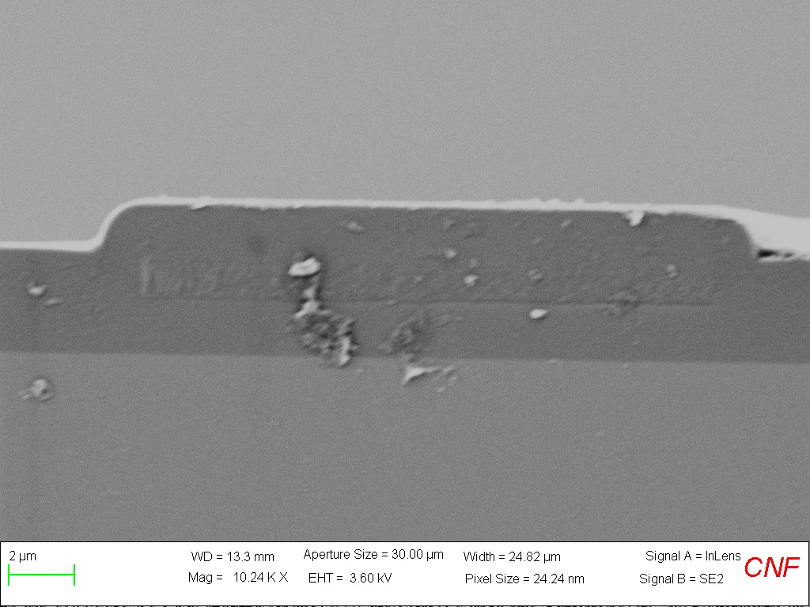
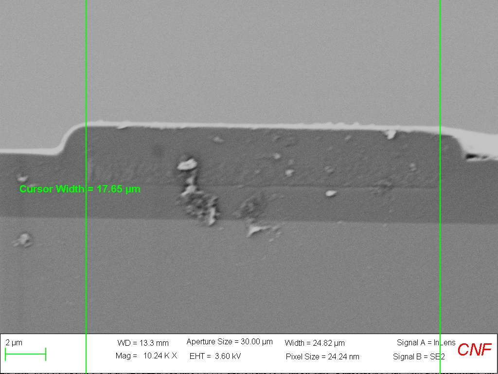
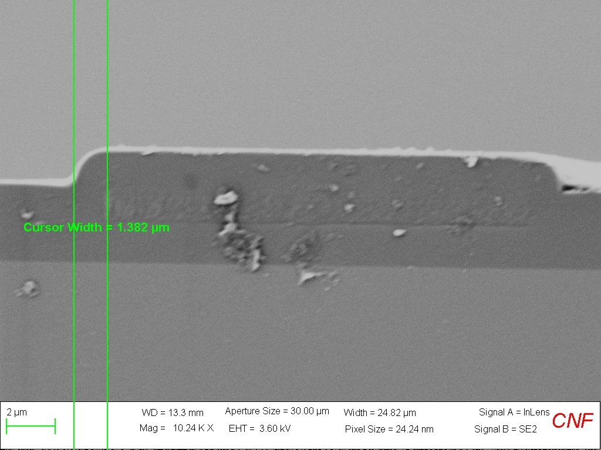
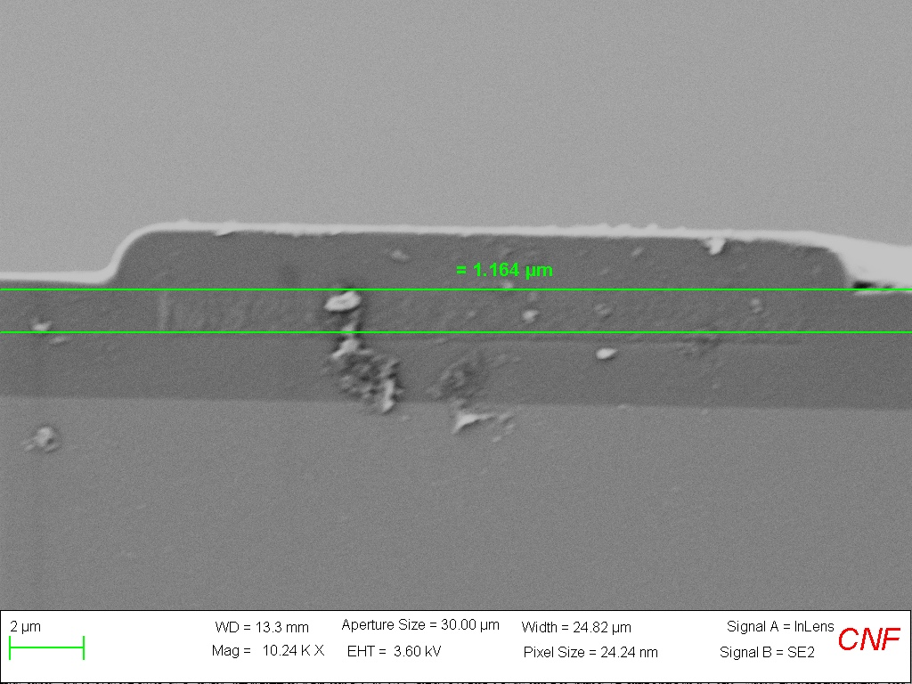
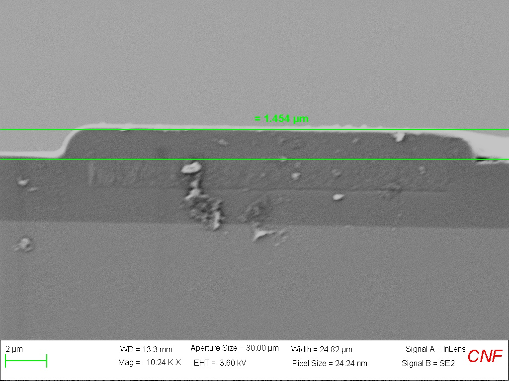
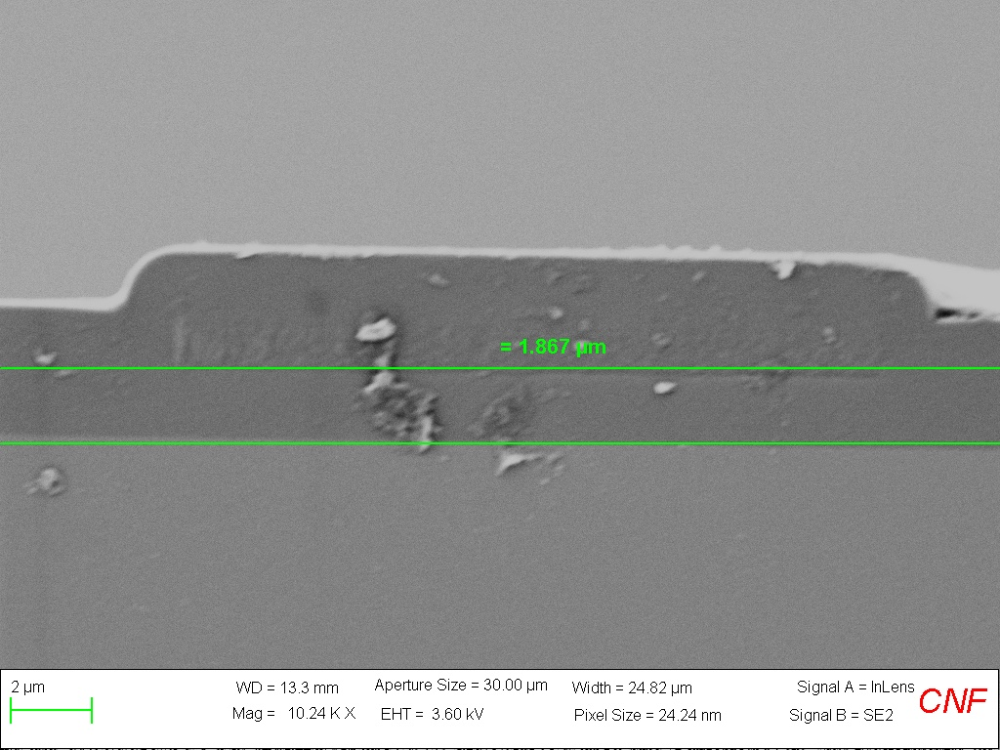

# 2025-04-11 sem images of etched waveguides
We have a lot of old etched waveguides.  The ones we would like to test are as follows:

1. Thick side oxide with no SRN
2. SRN capped four layer device
3. Full three layer device
4. Annealed 4 layer device

That is roughly the priority for testing as well.  I am specifically interested in checked etch depth and top/sidewall oxide coverage.  Before I get going, I need to clean off any residues iwth IPA, and then sputter Au to get better resolution for my images.  

This is the gold device

Center samples, and hit on. Use manual, and set 5 just in case. Hit lift vent to put Ar in to get faster pump. Don’t touch the Ar needle. Leave it here

When at 50 on pressure gauge you are good

Turn high voltage on. You want current at 10, and adjust voltage for that

Do 45 seconds. Slowly adjust voltage as needed

When done, hit off and turn voltage down

Hit lift vent to finish venting

I am also resist stripping 10 10 the new negative narrow wafer

Anyway, below are some of the SEM images

3 layer

18 um for a waveguide is kinda comically huge.  We have the dimensions we expect, and a nice amount of sidewall padding.  These images were really tough, as there was not a huge contrast between the SRN and oxide

4 Layer Annealed

It is nice to see we can make such small waveguides, but thin side cladding

Normal 4 layer device

Nice images.  The side oxide is just not very thick

Thick sidewall oxide

Interesting that we can also see pad oxide.  Basically, our thick sidewall etching and deposition proceedure seem to work quite well.