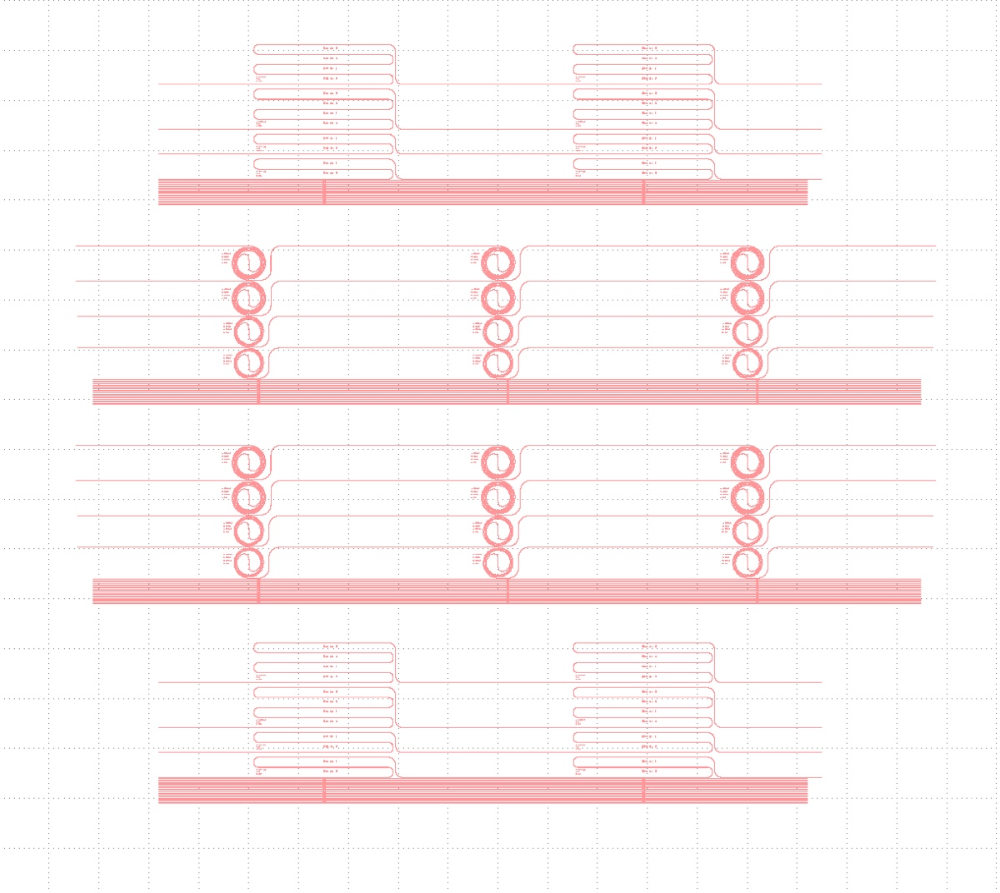

# 2025-04-13 cr hard mask sinx etching with negative, narrow gds and thick oxide sidewall
Despite many hours of hard labour, we have not totally perfected a device for bends.  We have roughly discovered the following:

1. We need thick sidewall oxides to prevent outcoupling from the sides at bends (in the form of radiative losses)
2. We need shallowing bend radii and narrower waveguides to prevent leakage out of the fundamental mode
3. We want to use a Cr hard mask for now, as I suspect that 1813 resist masks are tough to remove, and we would just like a working device

See [2025-04-08 Negative Narrow Snake and Sprial Etching](craftdocs://open?blockId=5D47CED5-2FA4-452E-8329-2745A412C448&spaceId=c10b6666-b4fd-53a0-9177-1696a144b2d8) and [2025-04-07 Special oxide deposition and etching for reduced bending losses](craftdocs://open?blockId=CC67967E-0650-4044-8C24-17BF920C8645&spaceId=c10b6666-b4fd-53a0-9177-1696a144b2d8)

Below is the GDS file we are going to use 

[pad4 pass1 (positive).gds](https://resv2.craft.do/user/full/c10b6666-b4fd-53a0-9177-1696a144b2d8/doc/584C0829-76D8-4C0C-8630-7D82F8DA350D/7B23CCF2-B6B5-4235-B49B-B37E97FF444A_2/kQQouzZimxAR5jyM8RtC44yh8LhCuLJNrrHJTowjpOcz/pad4%20pass1%20positive.gds)

[pad4 pass1.gds](https://resv2.craft.do/user/full/c10b6666-b4fd-53a0-9177-1696a144b2d8/doc/584C0829-76D8-4C0C-8630-7D82F8DA350D/3BA20ACA-285B-4A72-96E0-96CFE6E927AC_2/v20eG8FBcyZvziodJt7VTvzgCR8zWt20Lx3cwLmFfxwz/pad4%20pass1.gds)

The process steps are below:

1. RTA clean of the SiNx.  This improves adhesion for later and removes any dust that could cause loss
2. 300 nm pad oxide.  This is protect the SiNx from the hard mask (might be worthwhile for resist in the future too).  This requires 1:15 high rate oxide deposition
3. Cr hard mask sputter.  Requires Cr sputter for 1210 seconds at 7 mTorr of pressure
4. Resist coating.  Spin P20 and 1805.  Use 3000 rpm, 8000 ramp, and 45 seconds coat.  Bake at 90 C for 1 minute
5. Exposure on MLA (using the same GDS as before, attached above).  Use a dose of 53 and defocus of 1.  This is a bit of a guess, but we saw that our previous structures were 700 nm too narrow
6. Develop on hamatech, using 726 for 1 minute (recipe 4)
7. Resist descum.  Clean the 81 or 82 for 5 mins and do a 50 second descum
8. Cr etch.  Season the Pt 770 and etch for 8:30 using the Cr etch recipe
9. SiNx etch.  From the previous fabrication run with a full wafer, we guess that we should etch for 11:30 to get roughly all the way through the SiNx.  Of course, we don’t need to go all the way down.
10. Strip Cr hard mask.  Put in Cr etchant for 20 mins and do BOE dip for 15 seconds
11. Cleave out 2 pieces. Do RTA on the chips.  Do 650 C for 3 mins with 20 C ramp
12. Measure the loss of the waveguide
13. RTA wafer.  Do 650 C for 3 mins with 20 C ramp
14. Smooth oxide deposition for 3 um of oxide, and then oxide etch in Oxford 100 to thin the top
15. Measure the loss of the waveguide
16. SRN deposition
17. ITO sputtering
18. Measure the loss of the waveguide

---

# [`Sun, Apr 13`](day://2025.04.13) CNF process

# RCA cleaning

Temps when RCA got started

I am going to Cr hard mask two wafers in case anything goes a bit funny

# PECVD for pad oxide deposition

## Cleaning 

Previous user did some cleaning 

We do 10 mins cleaning to be sure

9:35 Done

## Seasoning

2 mins

9:38 Starting

9:44 Finished

## Main run 1

1 min 15 sec

Starting now

9:46 Start

9:52 Finished

## Main run 2

9:55 started

10:00 Finished.

## Cleaning

15 mins

# Cr deposition with AJA

## First run

Recipe for Cr depostion

Pressure when loading

During depostion

10:26 Finished

## Second run

Pumping load lock 

We wait till the pressure is below 5e-5

Cr in the target

Now the pressure is low enough

10:38 Closed

Error showed up, but this is not a real error.

10:41 Cleaning started.

11:05 Finished

Closed

Venting the load lock

11:10 Pumping

# Photolithography

Below is recipe we are using

Now baking

Now mla

We will use dose of 54 this time and defocus of 0

During run

# Development

# Oxford 82

5 mins pre cleaning

## Cleaning

11:40 Loggiing in

5 mins cleaning

11:47 Finished. Venting.

## Mild descum

11:53 50 seconds. Starting.

11:55 Finishes. venting.

# Microscope

# PT770

## Seasoning

During season

## Main run

During etch 

After

# Oxford 100

## Cleaning

Running 15.5 minute pre clean

During clean 

## Seasoning

We do 2 mins seasoning.

12:28 Starting.

The He flow is a bit high, but not going beyond 5

12:33 Finished. Venting.

## Main run

10 mins 30 secs

12:37 Starting.

12:53 Venting

## Cleaning

15 mins

12:58 Starting

# Microscope

Etching introduced quite some dusts. Hope they clean off by the Cr etch.

# Cleaving

# Cr etch

13:11 20 mins Cr etch

# Microscope

Dusts still around

# RTA

Calibration

Overshot a bit, but that’s fine

Main run

---

# Loss measurement

## No RTA

### First straight

2.7 mW / 49 mW= 2.7/49=0.0551 

### Second straight

4.1 mW/49mW = 4.1/49=0.0837 

### Third straight 

4.4 mW / 49 mW = 4.4/49=0.0898 

## RTA

### First straight

0.09 mW / 49 mW = 0.9/49=0.0184 

### Second straight

0.092 mW / 49 mW = 0.092/49=0.00188 

### Third straight

10.4 mW / 49 mW = 10.4/49=0.212 

The coupling is a bit more critical, but we can find good modes

### Fourth straight

10 mW / 49 mW = 10/49=0.204 

### Fifth straight

9.6 mW / 49 mW = 9.6/49=0.196 

### First snail

0.029 mW / 49 mW = 0.029/49=0.000592 

### Second snail

2.7 mW / 49 mW = 2.7/49=0.0551 

---

### Second RTA

Calibration run

During run

Small piece

During 800 calibration

During 800 run

# PECVD

## Cleaning

5 mins

Done

## Seasoning 1

2 mins

17:08 Starting.

17:15 Done

## Main run 1

As shown in [2025-04-08 Negative Narrow Snake and Sprial Etching](craftdocs://open?blockId=5D47CED5-2FA4-452E-8329-2745A412C448&spaceId=c10b6666-b4fd-53a0-9177-1696a144b2d8), we do 9 mins 6 secs to get 1.5 um of oxide.

17:18 Startng.

17:33 Finished.

We got 1.5 um of oxide. Almost as expected.

## Cleaning 1

17:36 Starting. 11 mins.

17:50 Done

## Seasoning 2

17:51 Starting.

17:58 Finished.

## Main run 2

9 mins 6 secs.

18:15 Finished.

We got 3 um pretty accurately.

## Cleaning 2

18:18 21 mins. Starting.

# Oxford 100 for oxide etch

## Cleaning

20:48 10 mins cleaning

## Seasoning 1

21:02 Starting. 2 mins.

21:07 Finished.

## Seasoning 1 redo

Just realized we did a seasoning on a wrong recipe. Doing it again.

21:14 starting.

21:21 Done.  Venting．

## Main run 1

Following [2025-04-08 Negative Narrow Snake and Sprial Etching](craftdocs://open?blockId=5D47CED5-2FA4-452E-8329-2745A412C448&spaceId=c10b6666-b4fd-53a0-9177-1696a144b2d8). We do 12 mins 45 secs etching.

We use witness samples to characterize the etch rate.

12 mins 45 sec

21:26 Starting.

He flow is high. There may be some He leak.

There’s some bad-looking mess

The etching seems successful though. We got away 1.7 um.

## Cleaning 1

Cleaning 17 mins．

21:48 Starting.

He flow is high again.

The He flow is a bit sketchy. We should stop here before sacrificing the main pieces. The issue is reported to Jeremy and NEMO.

---

# Loss measurement

## Top oxide chip

### First straight

2 mW / 49 mW = 2/49=0.0408 

### Second straight

3.4 mW / 49 mW = 3.4/49=0.0694 

### Third straight

4.7 mW / 49 mW = 4.7/49=0.0959 

### Fourth straight

7.3 mW / 49 mW = 7.3/49=0.149 

### Fifth straight

6.7 mW / 49 mW = 6.9/49=0.141 

### Second snail

Power not measurably low. Not sure why.

Overall, we find the signal from this chip to be pretty low. Hard to tell why. Is it possible that the RTA messed up the snail?

---

### [`Mon, Apr 14`](day://2025.04.14) 

### Loss measurement of oxide deposited waveguides 

This waveguide went through 650 C RTA. Oxide is deposited on top. 

### First straight

1.4 mW / 49 mW = 1.4/49=0.0286 

### Second straight

1.3 mW / 49 mW = 1.3/49=0.0265 

### Third straight

1.3 mW / 49 mW = 1.3/49=0.0265 

### Fourth straight

1.8 mW / 49 mW = 1.8/49=0.0367 

### Fifth straight

1.2 mW / 49 mW = 1.2/49=0.0245 

### Second snail

Not very bright. Less than 100 um.

We cannot couple light well into the snail.

## Air cladded no RTA chip

There is a finite chance that I messed up the RTA and non RTA waveguides in the previous measurement. Double checking the coupling to the non-RTA waveguides.

### Second snail

0.17 mW / 49 mW = 0.17/49=0.00347 

Double checking this number, the signal looks low.

### First straight

3.9 mW / 49 mW = 3.9/49=0.0796 

### Second straight

Coupling bad

## Oxide cladding chip 2

### First straight

2.1 mW / 49 mW = 2.1/49=0.0429 

### Second straight

2.4 mW / 49 mW = 2.4/49=0.049 

### Third straight 

2.5 mW / 49 mW = 2.5/49=0.051 

### Fourth straight

2.3 mW / 49 mW = 2.3/49=0.0469 

### Second snail

0.03 uW / 49 mW = 0.03/49=0.000612 

Second snail now working very well..

## Snake waveguide with oxide

### First straight

0.8 mW / 49 mW = 0.8/49=0.0163 

### Second straight

0.8 mW / 49 mW = 0.8/49=0.0163 

### Third straight

1 mW / 49 mW = 1/49=0.0204 

### Fourth straight

0.94 mW / 49 mW = 0.94/49=0.0192 

### Second snake

0.05 mW / 49 mW = 0.05/49=0.00102 

The loss of the snake is high..

## Air cladded chip 800 C

### Third straight 

0.8 mW / 49 mW = 0.8/49=0.0163 

### Fourth straight

0.8 mW / 49 mW = 0.8/49=0.0163 

### Tenth straight

4.4 mW / 49 mW = 4.4/49=0.0898 

It looks like that there is some visual difference in the amount of dusts on each waveguide.

## Summary

- So far, only one snail waveguide exhibited a reasonable transmission (2.4 mW/49 mW). This was a piece with RTA 650 C annealing and air cladding. This was also a chip with the best transmission on the straight waveguides.
- After annealing this chip at 800 C, we cannot recover the same level of transmission as before. The straight waveguides also have become a bit "weird"; It feels more waveguides do not work well.
- The no-RTA air-cladded device did not show good transmission through the snail. The same behavior was reproduced in the second measurement. This seems to suggest that we did not mistakenly mix the no-RTA and RTA chips; If they were swapped, we should see the same high transmission from the snail and the straight waveguides.
- After oxide deposition, no waveguide shows transmission as good as the air-cladded RTA device. 
- A hypothesis: The loss is caused by the "dust" thing on the surface of the chip. This is suported by we seeing visually less dusts on the piece of the air-cladded RTA chip [Photo from Library.jpeg](craftdocs://open?blockId=C2E59FE0-0506-4579-AD39-BDA89A8AEAD9&spaceId=c10b6666-b4fd-53a0-9177-1696a144b2d8). Because of this, only this chip showed low loss. Then, RTA at 800 C caused other damage on this chip, stopping us from reproducing the result.