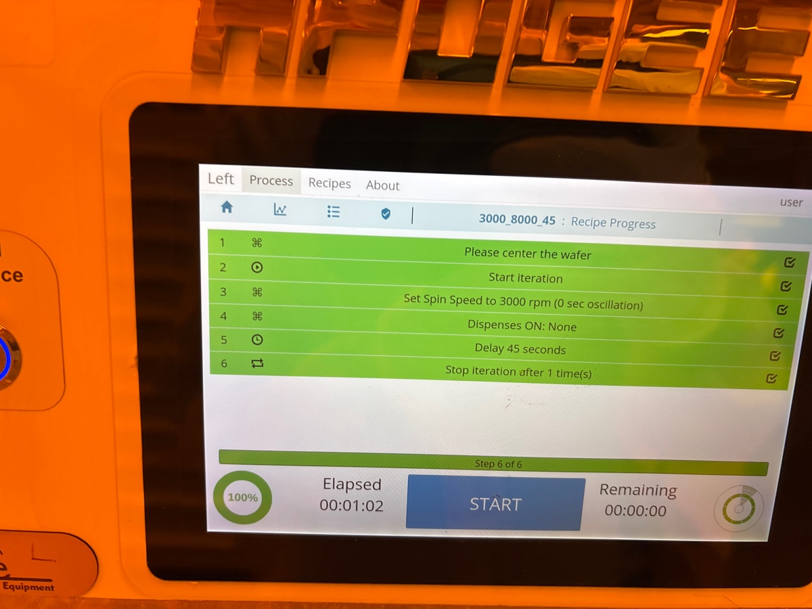
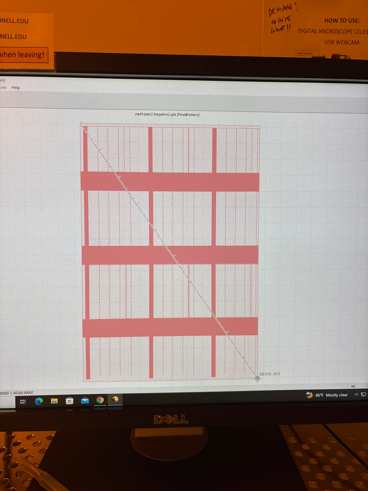
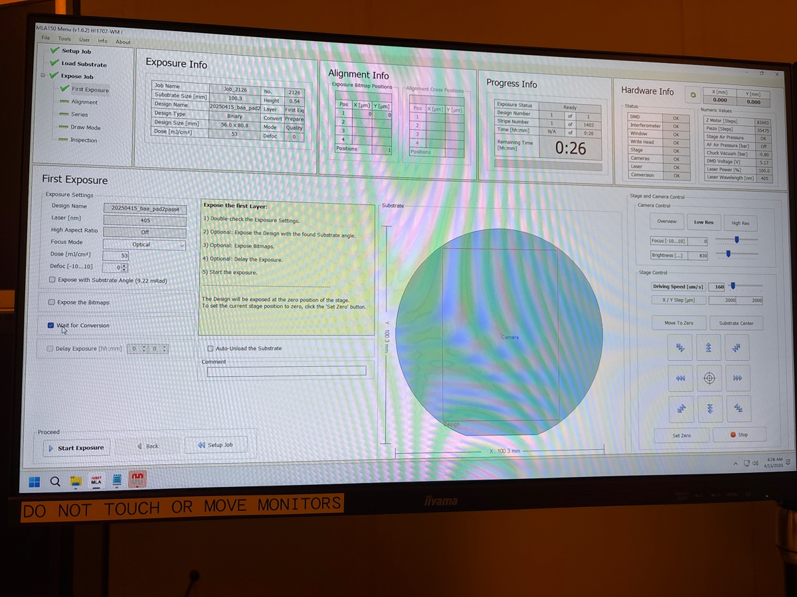

# 2025-04-15 wet etch negative narrow waveguides with cr hard mask
### Photolithography

For spinning

I then did 90 C for a minute

Our gds

[pad4 pass2 (positive).gds](https://resv2.craft.do/user/full/c10b6666-b4fd-53a0-9177-1696a144b2d8/doc/C2D5EF04-B5C8-43D2-A9A8-43D293B7AB92/EC3B6689-1CB6-462C-8DE4-153F67AD685A_2/WqSAhsM0q4qUyFPrNt08xxFgjjOJrUan5gLXQNxjCMIz/pad4%20pass2%20positive.gds)

[pad4 pass2 (negative).gds](https://resv2.craft.do/user/full/c10b6666-b4fd-53a0-9177-1696a144b2d8/doc/C2D5EF04-B5C8-43D2-A9A8-43D293B7AB92/DA27B3B2-BBA0-433E-960E-7EA31AE586EF_2/UOyt4UaZjPkS4hQsZqrxXtVdXR9YNszmHsW3dflQzx4z/pad4%20pass2%20negative.gds)

Before MLA run

End of run

For development

After development 

### Descum

I ran a 5 min preclean of the oxford 82 chamber.  I will descum for 90 seconds.  This will remove 180 nm of resist.  I am ok descuming for a bit longer because I want to make sure all the resist is gone after the oxford 100 etch.

Before descum

During descum

After

### Cr Hard Mask Etch

For this, I am simply going to look for a color change.  I will have the timer going just so I get a sense of how long it takes

After 30 seconds (and what I thought was a color change

It seems that I etched through pretty fast

The amplitude and fitting here is a bit hard. I say another 30 seconds. The after also looking a tad discolored 

So I did roughly another 2.5 mins. Everything looks much better now

There was a second color change 

Notice how the amplitude is higher

Now I have a great fit

Under microscope

# Cr etch

We do extra 20 seconds of Cr wet etch

# Descum to strip resist 

## Cleaning

We use Oxford 82

9:19 10 mins oxygen cleaning.

9:29 Venting

## Main run

Descum 10 mins

9:34 Starting.

9:45 Finished.

# Microscope

10:01 Oxford 100 is down now. We will wait until Jeremy fixes it.

# Oxford 100

Issues are gone now.

## Cleaning

Jeremy fixed the tool.

15:58 10 mins cleaning

He flow is low!

16:11 Finished.

## Seasoning

16:12 2 mins seasoning. Starting.

He flow is close to 2 sccm. Low enough.

16:17 Finished.

## Main run

Before oxide etch

He flow is low!

[Video from Library.mov](https://resv2.craft.do/user/full/c10b6666-b4fd-53a0-9177-1696a144b2d8/doc/C2D5EF04-B5C8-43D2-A9A8-43D293B7AB92/E632A0E2-9A76-4ECB-93B7-18EE1F713D59_2/VSm4StM9Nh4Xyx8oFu5FLwWUn93yoQ3RsN5FMXfzGvwz/Video%20from%20Library.mov)

[Video from Library.mov](https://resv2.craft.do/user/full/c10b6666-b4fd-53a0-9177-1696a144b2d8/doc/C2D5EF04-B5C8-43D2-A9A8-43D293B7AB92/A70006BC-CDBD-4FF9-8FD6-38AC13380373_2/A2Rmaky2L4z9WPlaVDYP7CMUsTmRO6zrQx5jKHUT1i0z/Video%20from%20Library.mov)

About one in a minute, the plasma turns off．

16:39 Finished.

## Cleaning　

Jumping through the process as we forgot to load a wafer.

This time, we place a wafer.

# Inspection

Etch is 2um deep, but there is a lot of gunk on the wafer

Microscope

# Cleaving

---

# Loss measurement [`Tue, Apr 15`](day://2025.04.15)

We measure the transmission of the chip with no-RTA and air cladding using 1570 nm light.

### First straight 

6.9 mW / 49 mW = 6.9/49=0.141 

### Second straight

7 mW / 49 mW= 7/49=0.143 

### Third straight

7.3 mW / 49 mW = 7.3/49=0.149 

### First snail

0.4 mW / 49 mW = 0.4/49=0.00816 

### Second snail

0.58 mW / 49 mW = 0.58/49=0.0118 

### Third snail

0.38 mW / 49 mW = 0.38/49=0.00776 

---

This is a frustrating result to put it mildly, but we will still test different RTA recipes with the straight waveguides we have.  The two we first want to test (each on two dies) are below:

1. 3 mins at 650 C
2. 5 mins at 800 C

We will still have some left-over dies for future runs

### RTA

800 C

Calibration

During run

650 C

Calibration

During run

---

# Loss measurement of the RTA

## 650 C chip #1

### First straight

10 mW / 49 mW = 10/49=0.204 

### Second straight

9.2 mW / 49 mW = 9.2/49=0.188 

### Third straight

8.8 mW / 49 mW = 8.8/49=0.18 

### First snail

1.6 mW / 49 mW = 1.6/49=0.0327 

### Second snail

1.6 mW / 49 mW = 1.6/49=0.0327 

### Third snail

1.85 mW / 49 mW = 1.85/49=0.0378 

## 800 C chip #1

### First straight

12.0 mW / 49 mW = 12.3/49=0.251 

### Second straight

12.3 mW / 49 mW = 12.3/49=0.251 

### Third straight

12 mW / 49 mW = 12/49=0.245 

### First snail

2.9 mW / 49 mW = 2.9/49=0.0592 

### Second snail 

3.7 mW / 49 mW = 3.7/49=0.0755 

### Third snail

3 mW / 49 mW = 3/49=0.0612 

So it definately seems like this got lower loss than our later waveguides from 4-16