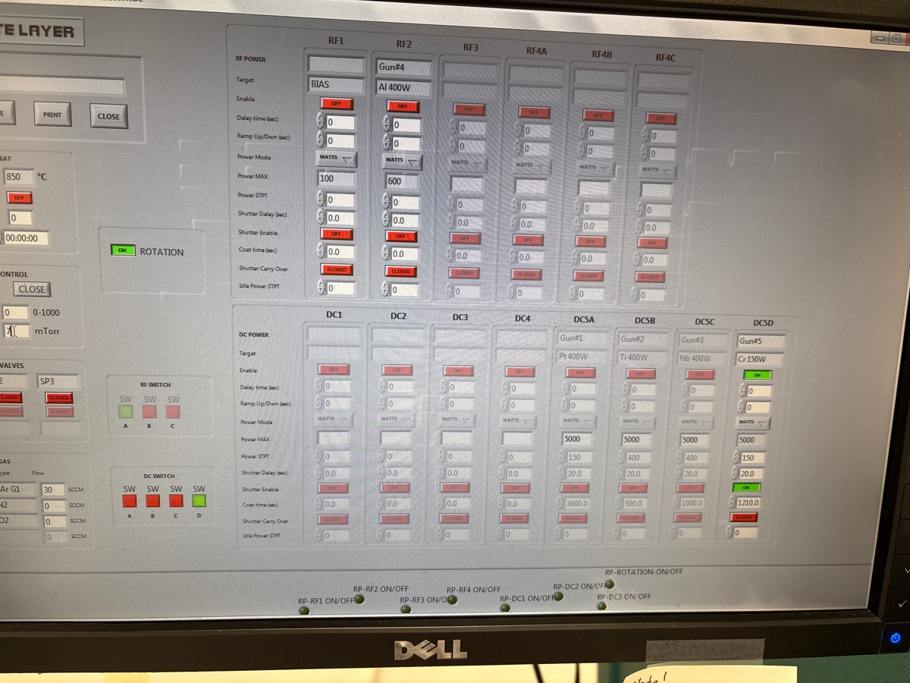
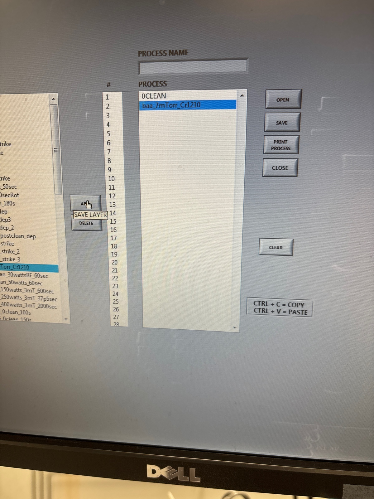
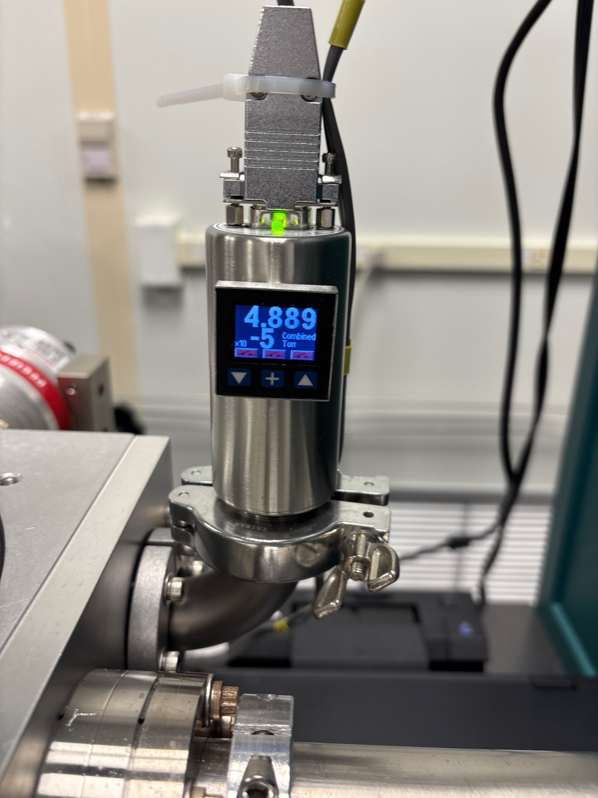
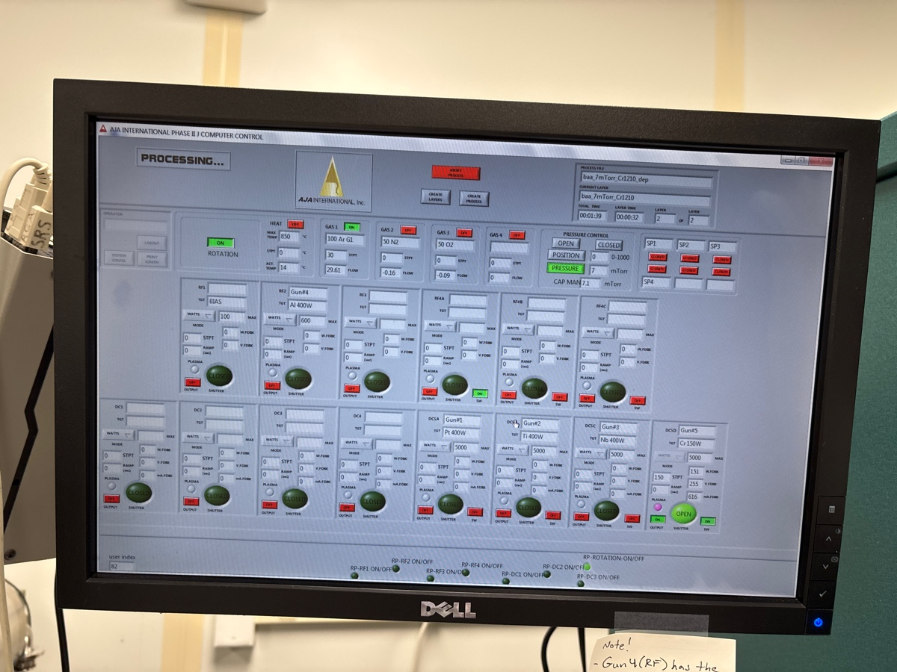
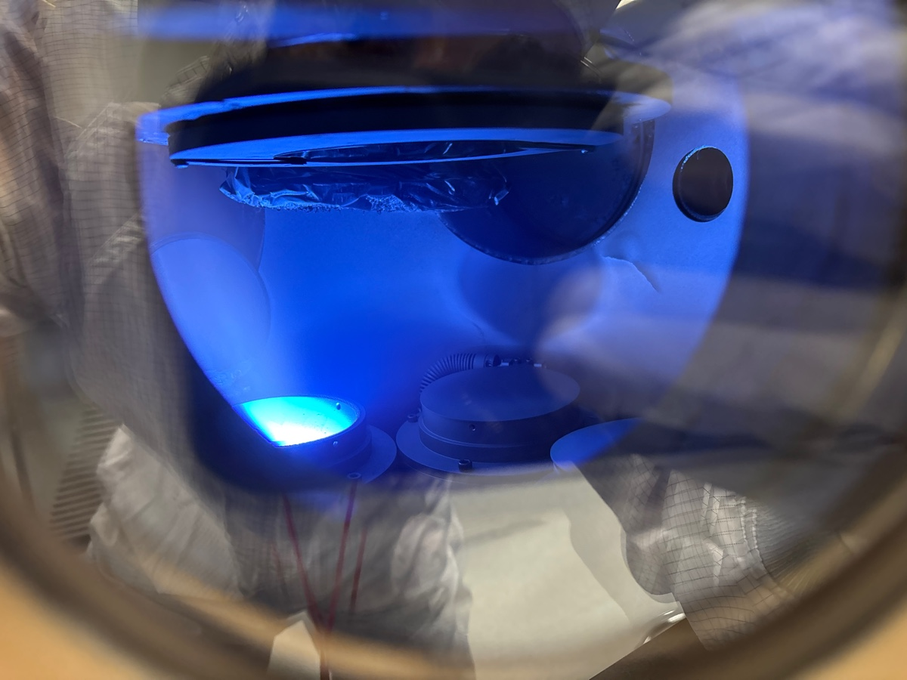

# 2025-04-25 follow up material exploration waveguide patterning
We previously fabricated waaveguides with the PECVD and Takachi to test differnet SiNx deposition recipes.  We will use previous GDS files to explose three rows of 3 dies so we can test material loss on these waveguides.  We will then save two of the three rows to test RTA on different chips.  Right now, we have the following:

1. SRN3.5 on 1.75 um of oxide.  840 nm of waveguide and 450 nm of top pad oxide
2. SRN2.7 on 1.75 of oxide.  830 nm of waveguide and 450 nm of top pad oxide
3. Baseline Takachi on 1um of oxide.  1190 nm of waveguide and 450 nm of top pad oxide

First, we will use our normal Cr hard mask recipe of 1210 seconds of Cr sputtering at 7 mTorr.  We will then do lithography and etching after.  Before putting the Cr hard mask on, I will spin clean the wafers

### Aja sputter

Main recipe

Pressure when loading 3.5

During 3.5 dep

Pressure when loading 2.7

During 2.7 dep

Pressure when loading takachi

During takachi dep

### Photolith recipe

Then 90 C for 1 min

For MLA

Before 3.5 exposure

During

I am going to start a system where I process these wafers in parallel. 

Before 2.7 exposure

Before development of 3.5

Before takachi exposure

Before 2.7 development

Before takachi development

### Descum and Cr wet etch

I am running 7 min pre clean on 82

We use 50 seconds for all

Before 3.5 

I only needed 2.5 mins to wet etch, mostly because this was a fresh batch of Cr etch

We can use the clamp regions as baseline for filmetrics

Before 2.7 descum

Side of 3.5

Middle

They are a bit differently

Let’s check ellipsometer

Fitting pretty much works. I will put in Cr etch for another 15 seconds to make sure 

2.7 took 2 mins to etch the Cr. 

Before takachi descum

Ellipsometery of 2.7

Fits good, I say we are good there

Takachi took a bit over 2 mins to finish

Observation after etch

Ellipsometer 

It’s extremely close, so I think we are fine

I say we run takachi wafer for 5.5 mins

### Oxford 100 etch

Season for 5 mins, was already cleaned

During season

3.5 before etch

2.7 before etch

I will dip and wash 2.7 for an extra 15 seconds before etching it.  We should probably etch 5 minutes on the SRN 2.7 and SRN 3.5 recipes

Before 3.5 etch

During 

After etch

Perfectly depth, we will do it again

Minimal dust

Before 2.7 etch

After etch

Looks clean and good

Before takachi etch

During

After takachi etch

We run 25 min post clean. This will now go in acid bath

### PECVD cap

I am doing a 1 min of smooth season

3.5 after Cr strip

Before 3.5 cap

During deposition 

2.7 after Cr strip

Corners are a bit more dirty

3.5 after cap oxide

Before 2.7 season

Before 2.7 deposition

During

Takachi after Cr strip

Before season 3

Before takachi dep

During deposition 

## Loss measurement 

All measurements taken at 1570 with dichroic mirror and no EDFA

### SRN 2.7

Straight one

41.5 uW with 9.5 mW in

Straight two

40 uW with 9.6 mW in

Straight three

44 uW with 9.5 mW in

Snail 1

Could not find it or any other snails

I double checked these numbers at the end. They are repeatable

### SRN 3.5

Straight one

1.3 mW with 9.2 mW in

Straight two

1.25 mW with 9.2 mW in

Straight three

1.2 mW with 9.2 mW in

Snail one

150 uW with 9.2 mW in

Snail two

180 uW with 9.2 mW in

Snail three

130 uW with 9.2 mW in

Snail four

I think I ran out of room, so I could not find it

### Takachi

Straight one

161 uW with 8.8 mW in

Straight two

170 uW with 8.8 mW in

Straight three

170 uW with 8.8 mW in

Snail one

21 uW with 8.8 mW in

Snail two

24 uW with 9.3 mW in

Snail three

1 uW, it was really tough

The reason the above was so low is I used the 10X objective, not the aspheric below are two waveguides I already did with aspheric

Straight three redo

1.128 mW

Snail one redo

150 uW

It seems that SRN2.7 is a bust.  Takachi and SRN3.5 are good.  Lets do 800 C RTA next with the two pieces of the bottom die remaining.

## First RTA 

We are going to do the two dies at 800 C for 5 mins. Doing all recipes at the same time

Calibration

I am now going to spin clean our chips

Before

SRN 3.5 on top, SRN 2.7, takachi at bottom

During

After

## Loss #2

### SRN 3.5

Straight first 

1.8 mW for 9.6 mW in

Straight second

1.63 mW for 9.6 mW in

Straight third

2 mW for 9.6 mW in

Snail one

582 uW for 9.6 MW in

Snail two

680 uW for 9.6 mW in

Snail three

741 uW for 9.6 mW in

### Takachi

Seems that the straight ones are dead, only 40 uW on several waveguides

### SRN 2.7

Straight one

177 uW for 9.5 mW in

Straight two

150 uW for 9.5 mW in

Straight three

190 uW for 9.6 mW in

Straight four

228 uW for 9.5 mW in

Snail one 

Could not find it

I would still say the loss here is quite high 

## Second RTA

Given the results above, it seems that Takachi was broken by 800 C RTA.  This could be because of the high ramp or the tempurature.  Either way, I don’t think we suffer my lowering ramp to 5 C/s, so lets do that in general.  I say we try Takachi at 600 C.  Given that SRN 3.5 survived at 800 C and had a decent loss reduction, we should continue to try to push that loss number down.  The best way to do this right now is to continue increasing the RTA annealding tempurature.  I say we try to do 925 C.  I don’t want to push the tempurature too high, as we might start to break stuff.  

Below is the calibration of Takachi (we will use lower ramp during real run)

After spin cleaning, below is the takachi run

I have been checking on the N2 as well lol

Unload at 350.

Calibration of 925

During

Starting off a bit warm. Took a minute to get to right temp

Later on

Unload at 450

## Loss #3

This was done on second setup with santec at 1570

Power before front objective is 10 mW. Generally the coupling efficiency is lower, but all we care about is the relative number

### SRN 3.5 925 C

Straight one

53 uW

Straight two

38 uW 

Straight three

38 uW

Straight four

38 uW

Straight five

54 uW

Given some of my results below, I think 54 is more reliable 

Snail one

16.3 uW

Snail two

16 uW

Snail three

15.2 uW

Snail four

6.9 uW

### Takachi 600 C

Straight one

14.5 uW

Straight two

15.3 uW

Straight three

14 uW

Straight four

15 uW

Snail one

While I can see it on camera, it’s a bit too dim for power meter. So the loss is still quite high

The general high level idea is we did not see some large decrease in loss.  While there is a bit of error in this measurement, we should have noticed if the loss was half as large.  So same order as before. It is possible loss went up be a slight amount