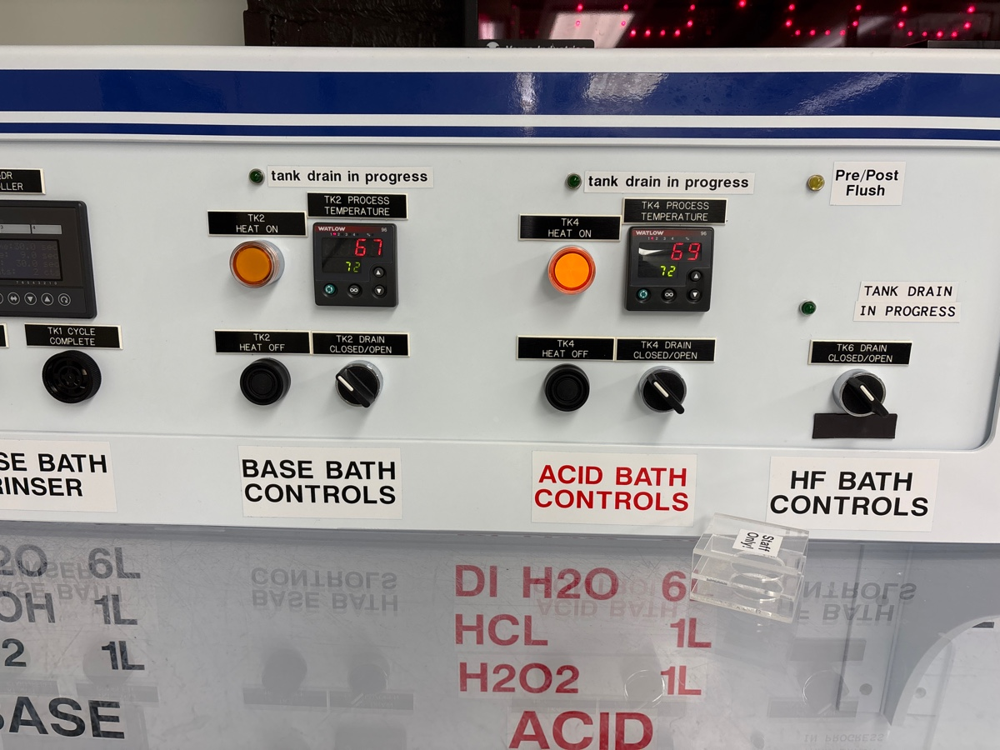
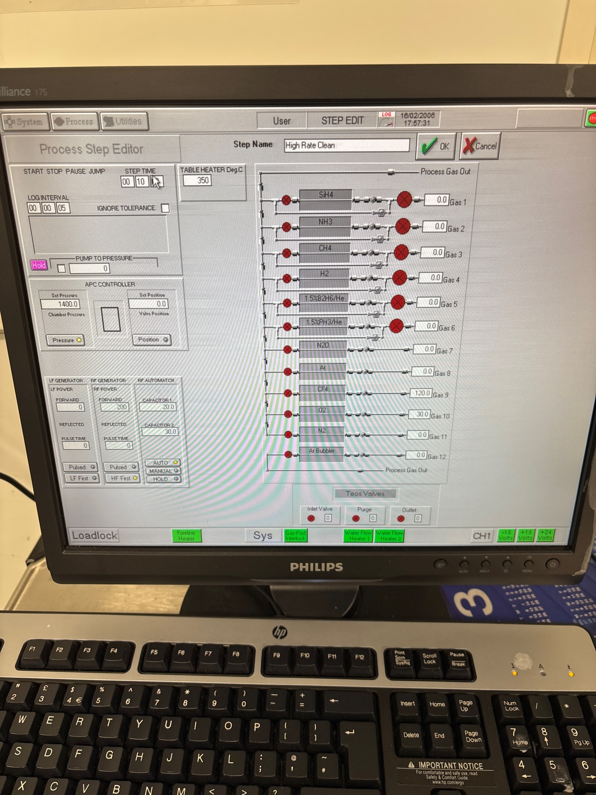
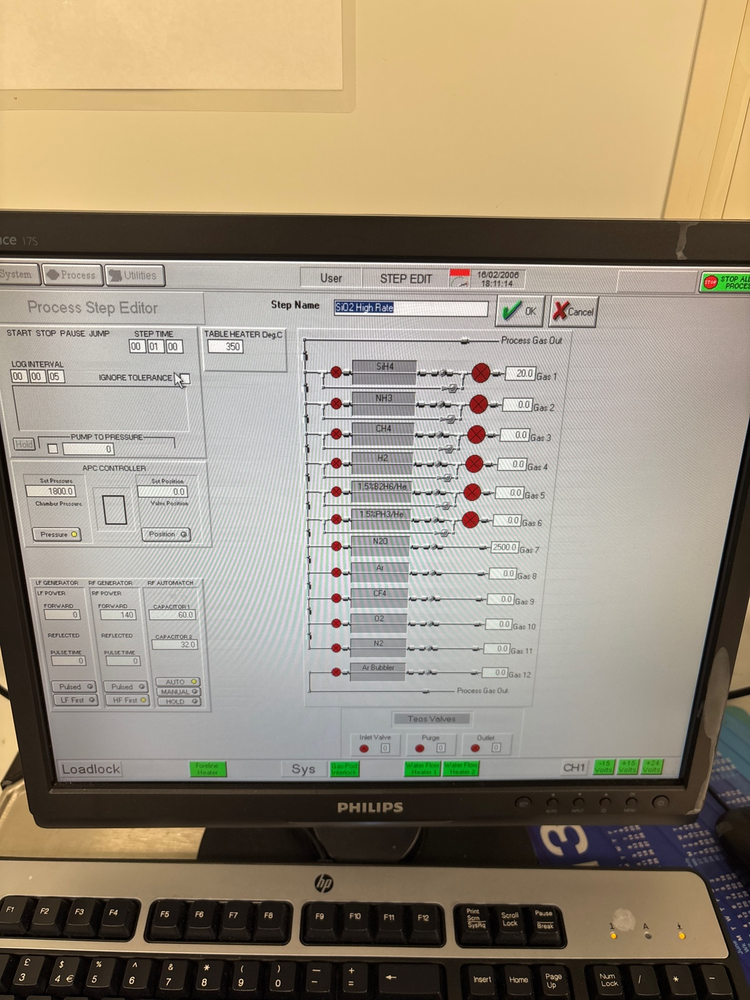

# 2025-05-13 square spiral fabrication
We found with the circular spirals that it is really hard to focus the top imaging setup, as there is not enough distance with long and straight poling.  So we are now doing square spirals, which have nice straight regions.  Below is our GDS

[pad5 pass1 (negative).gds](https://resv2.craft.do/user/full/c10b6666-b4fd-53a0-9177-1696a144b2d8/doc/EA6C0ECF-76D7-4B91-93C9-9589827AA665/5D8FE2DD-E516-42E2-87FB-7D9D9CA1B483_2/l9uQRcoEnvV0ba6d6caDvwby4ASyG4iXtj1p3laS01oz/pad5%20pass1%20negative.gds)

[pad5 pass1 (positive).gds](https://resv2.craft.do/user/full/c10b6666-b4fd-53a0-9177-1696a144b2d8/doc/EA6C0ECF-76D7-4B91-93C9-9589827AA665/E9AC5DB9-596A-465A-BD7C-F22AFD259E3A_2/VYgPCVhD4rqZoIrbQpjDy1xP1fWwB9sAb65AZnPTrZEz/pad5%20pass1%20positive.gds)

I am starting with RCA clean and will then move onto pad oxide (500 nm)

During RCA clean

### Pad oxide

Before clean

We do 1 minute season, and 2 minute high rate oxide deposition.  

Before season

Before dep 1

Before dep 2

### Sputtering 

Load pressure for first sputtter

During first sputter

Load of second wafer

During second

### Photolithography

Spin recipe

Baking at 90 for a minute

Before exposure

53, 0

Before developing

We use recipe 4

### Etching

### Oxford 82

We clean 82 for 8 mins. We do 50 second descum. 

Before clean

Before descum

We wet etch next

### Wet etch 

22:13 we move on. We do 3 mins

The piece looks pretty good. Microscope image is taken.

Removing the edge

## Oxford 100

### Seasoning

I am pre cleaning 100 for 10 mins. I will the season for 5 mins and etch for 7. Make sure to remove the edge bead

Before clean

Before season

During season

### Main

We do 7 mins etching.

CHF3 SiN etch recipe.

Before etch

Main run. We do 7 mins.

We etched like 

He flow is good.

Venting the load lock now.

We take microscope image

We see a bit of flakes but not that much. Let’s see how much of this will be left after cleaning. 

### Cleaning

We do 15 mins.

22:49 Starting.

Finished.

## Cr wet etch

We do 20 mins of etching + BOE 15 sec.

The flakes still remain.

## PECVD smooth oxide deposition

Top oxide dep is 9 + 8 mins. We want to characterize this a bit.

We have 370 nm pad oxide left. This fit indicates that Cr is properly gone.

We have 370 nm of top oxide left. The SiN layer on the side should be around a similar thickness. 

Dep rate is 2.75 nm / sec. With 17 mins of deposition, we expect to get 17*2.75*60=2,805 nm of SiO2. The thickness of the top oxide will be 2800 + 370=3,170 nm

### Cleaning 

We do 5 mins of pre cleaning. In the past run, we did 17 mins of total deposition of smooth oxide. 

### Seasoning

23:44 2 mins seasoning, starting.

23:51 Venting started.

### Main run

We do 9 mins oxide dep.

23:53 Starting.

0:08 venting.

We got 1880 nm of top oxide

### Cleaning

11 mins.

### Seasoning

0:26 2 mins. Seasoning.

0:33 Finished.

### Main run 2

0:35 second round of smooth oxide deposition. 8 mins.

0:49 Completed．

0:50 Cleaning. 20 mins. 

We have 3.2 um of oxide in total.

## Oxford 100 for oxide thinning

According to the note from [2025-04-18 Etching Full Spiral Device with CHF3/O2/N2 recipe](craftdocs://open?blockId=57996FC7-96C4-412F-9D45-00B42342483C&spaceId=c10b6666-b4fd-53a0-9177-1696a144b2d8), the etch rate of the normal oxide etch is 138 nm / min. This is 138/60=2.3 nm/sec. We did 14.5 min of etching, corresponding to 138*14.5=2,001 of etching. In experiment, we saw that this etches down like 2.2 um. 

### Seasoning

0:36 Starting.

0:39 2 mins seasoning run. Extending a bit from the last time [2025-04-18 Etching Full Spiral Device with CHF3/O2/N2 recipe](craftdocs://open?blockId=57996FC7-96C4-412F-9D45-00B42342483C&spaceId=c10b6666-b4fd-53a0-9177-1696a144b2d8) where we did 1.5 mins.

0:39 Wafer transferred.

### Main run

0:58 Wafer transferred.

He flow is a bit high.

1:12 Somehow the He flow has come down.

1:15 Finished.

There is a bit of non-uniformity but probably acceptable. 

Ellipsometry measurement

Thickness varies a bit depending on the position.

750 nm

Taking another point.

720 nm closer to the center.

Taking another point.

We have roughly 700 to 750 nm of top oxide.

### Cleaning

1:20 20 mins starting.

## PECVD again to thicken the oxide

Dep rate:  (1880 - 370)/9=167.778 nm/ min

We want to get roughly 350 nm of extra oxide. This means 350/168=2.0833 mins of deposition. 0.08*60=4.8 seconds. This is 2 mins 5 seconds of deposition.

### Seasoning 2 mins

1:28 Starting.

1:34 Finished

### Main run

1:37 Starting.

1:44 Venting.

Cleaning 14 mins.

We got 1.05 um of top oxide so this is good.

2:03 PECVD cleaning done. Calling a day.

---

### RTA

During anneal

Before anneal

During anneal

We will also toss one piece at at 925 C just for fun.

Calibrating 925

During run

---

[`Wed, May 14`](day://2025.05.14) [`Ryotatsu Yanagimoto`](craftdocs://users?id=aa2c0de3-4c5f-8aaf-eaf7-3b949f6279ad) 

# Photoconductor deposition with PECVD

Following [2025-04-18 Etching Full Spiral Device with CHF3/O2/N2 recipe](craftdocs://open?blockId=57996FC7-96C4-412F-9D45-00B42342483C&spaceId=c10b6666-b4fd-53a0-9177-1696a144b2d8), we do 20 mins cleaning for 2 mins seasoning and 32 mins deposition. We aim at depositing 6 um of SRN.

## Pre cleaning

5 mins

16:17 Finishes.

## Seasoning 1

2 mins. We use SRN 8 recipe.

16:20 Starting.

16:27 Finished.

The color of the witness sample is good.

## Main run 1

32 mins.

16:30 Starting

17:07 Finished. The wafers look good.

The thickness looks okay.

## Cleaning 1

20 mins cleaning.

17:13 running.

17:33 Done.

## Seasoning 2

2 mins.

17:35 Starting. We load a witness sample.

17:43 Finished.

## Main run 2

17:45 Starting. We do 32 mins SRN 8.

Plasma is lighting up okay.

18:32 Finished.

## Cleaning 2

18:34 Starting.

18:58 Finished.

## Seasoning 3

Moving on to seasoning.

19:00 Seasoning. Started.

19:07 Finished.

## Main run 3

19:10 Starting.

19:48 Finished.

## Cleaning 3

19:50 Starting.

40 mins cleaning.

# ITO deposition with PVD75

This is the 800 C chip.

This is 925 C.

20:09 Pumping.

Updating the labels.

20:51 Pressure low enough.

20:53 Plasma starting

20:56 Zero out the sensor.

Aiming at 0.2 kA

Closing the shutter at 0.2 kA.

Surface resistance is like 50 kOhm. A bit large but fine.

800 C

---