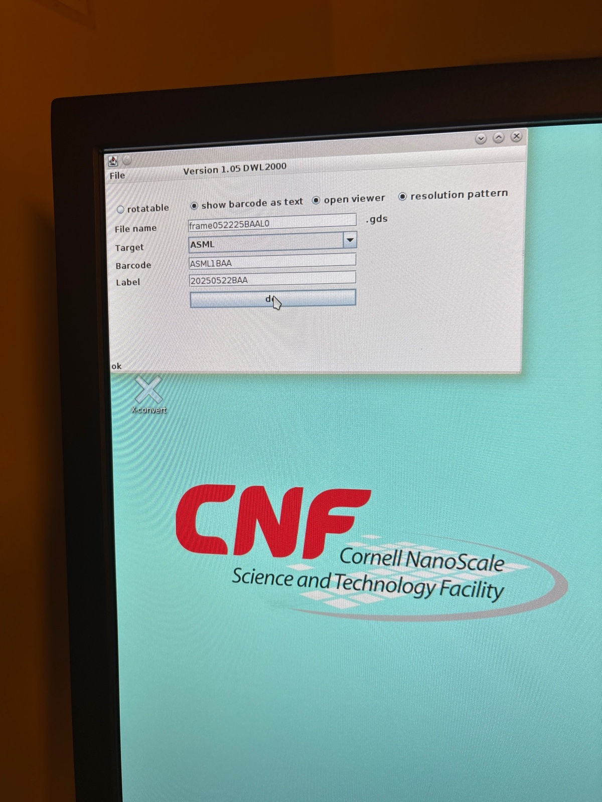
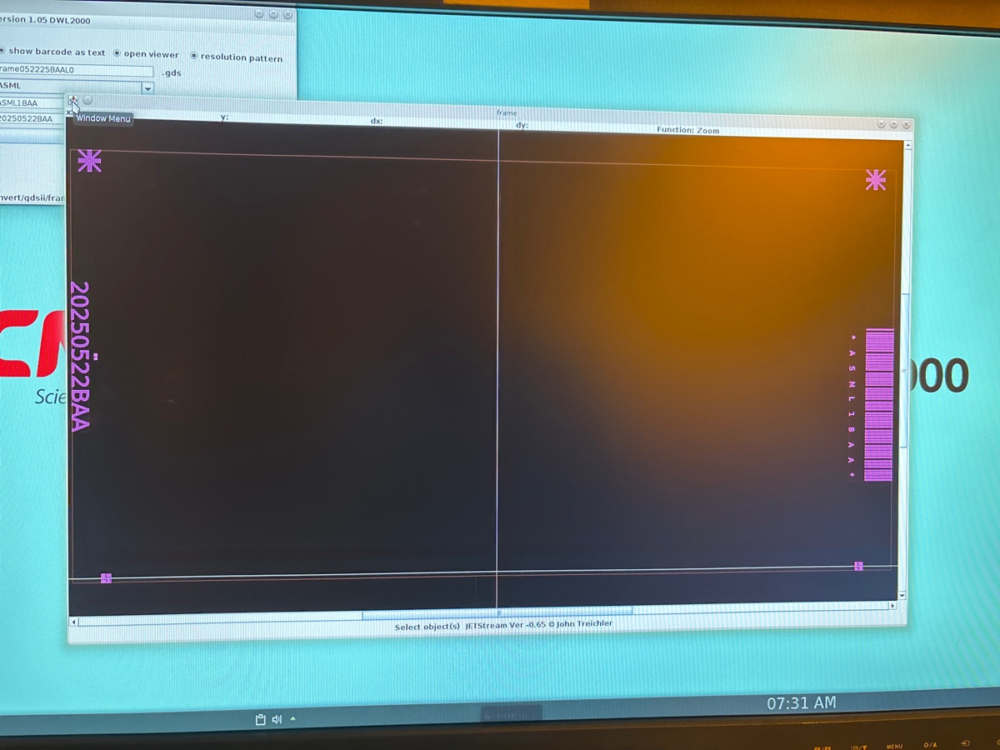
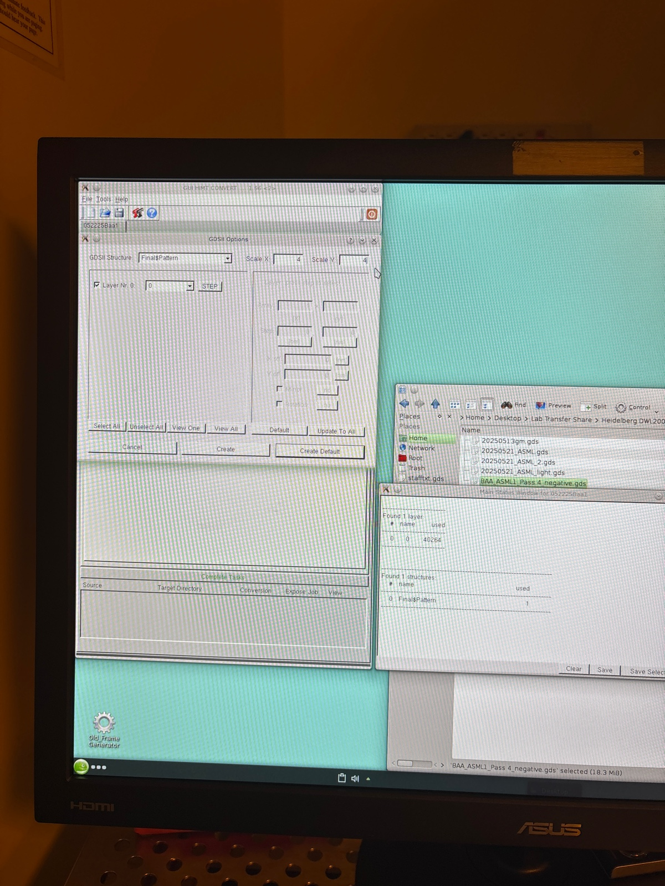
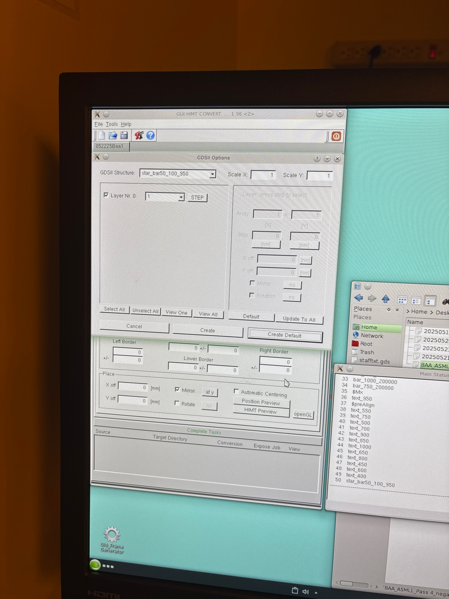

# 2025-05-22 asml mask and wafer fabrication
Below is the GDS file we are using 

[ASML1 Pass 4 (negative).gds](https://resv2.craft.do/user/full/c10b6666-b4fd-53a0-9177-1696a144b2d8/doc/998CCF97-B873-4106-885A-7604A839FCD0/244651BC-B0C0-4A17-86DF-54FC322986E8_2/v7aPEWZzUUCOKUtzGBDZ3QxJCyiqqJVxBd6bylEzMxcz/ASML1%20Pass%204%20negative.gds)

Below is a smaller file

[ASML1 Pass 4 (negative) medium.gds](https://resv2.craft.do/user/full/c10b6666-b4fd-53a0-9177-1696a144b2d8/doc/998CCF97-B873-4106-885A-7604A839FCD0/E6254342-D8D1-434C-B63F-6F1F21FD7699_2/iONi2iiuvH3gl5pEavw8iaOYEGQyLxJKGj7GNzs53BEz/ASML1%20Pass%204%20negative%20medium.gds)

Just fewer points

[ASML1 Pass 4 (negative) small.gds](https://resv2.craft.do/user/full/c10b6666-b4fd-53a0-9177-1696a144b2d8/doc/998CCF97-B873-4106-885A-7604A839FCD0/BA76FD56-8678-47B3-839A-210A3F5EE426_2/5Y5INv8zxYKys9SAbM0tRfGyGKUlYeROIjsaVZ4xHi0z/ASML1%20Pass%204%20negative%20small.gds)

It seems I can’t reduce memory size by much more

### DWL 2000

To generate frame

Adding our file

Loading frame

Merging files.  This seems to take a really long time

We have error

It’s in the manual

Make sure to reduce the polygon size when saving the file on klayout

Make this a frame

Opening preview

Conversion started

Vacuum is on now

Expose

12:55 The process seems to have finished.

Etching mask

After etching

We now resist strip for 15 mins in each

Now we dry rinse the mask

Nice and dry

---

# Training of ASML

## Gamma

Move the switch to the up position. 

The switches are usually off so turn them on when using the tool.

Put a dummy wafer to the first slot. This seasons the system.

Also for the developer.

The flat has to point towards the user.

Load carrier

Select sequence

Choose 1002

Start sequence

ARC is done

1003

If we don’t like the ARC, we need to use the ECO clean to get rid of the ARC. Just over etch it.

Now turn off the N2 switch.

Clean the backside to get rid of photoresist.

## ASML

Flat at the bottom

File has to be on the scratch directory 

Go to job definition

Go to scratch 

Now this thing does not write on the edge

Alignment definition. This will be not for us yet.

Alignment strategy 

Image definition

Here we define the sectors of the image. Then, we distribute them

We can shoot only one image per cell

Layer layout

Get rid of optical prealignment

The tool remembers all the data from the previous layers. Each layer corresponds to one stage of the lithography process.

Cr side down, starts up.

This is the step that changes the dose parameters

It’s a gas laser

---

# Photolithography

We use the one in the front.

# ASML job

Job definition

Modify job

We have no notch

Accept

Cell structure

0.6 + 4.195/2 + 7.265/2=6.33 

ASML1BAA

11.01 - 4.105/2=8.958 

\-11.01+4.195+0.6+7.265/2=-2.583 

9.515-7.836/2=5.597 

Image distribution

We now set energy

We need to copy the job via the utility!

# Resist coating

N2 switches on

Running ARC

# Operating ASML

Loading the wafer

# Development

# Etching

## Oxford 81

We pre clean for 5

Descum 90 sec

Before etch

During

## Oxford 100

We run 10 min clean

Before season

During season

Before main etch

We also remove the edge bead

During 

Profilometer

## Cr wet etch

We do 3 mins wet etch.

Somehow, we saw white smoke like thing coming out when we dipped it to BOE. My best guess is it’s the ARC residue. Hopefully, the descum run will clean this up.

After long etch, we are doing 1 minute mild descum to remove any remaining ARC

We also did another post BOE dip just to be safe

### Takachi

We preclean for 6 mins. We are using this tool because the PECVD is down

We season with gap fill for 1 minute

Computer claims it deposits at 70 nm/min

Now for wafer dep

During

First Ellipsometery

I effectively got 1 um of oxide. We need a bit more. I still fail at fitting the part with SiNx

No season

Before second deposition

While I can’t see how much oxide we have left on top, I suspect, after this deposition, it is around 2200 nm at least.  So lets etch off 1200 nm of oxide.  We know the baseline oxide etch goes at 170 nm/min, so we etch for 7 minutes.  We can pre-season for 3.  We will then RTA and call it a night.

During

After this one

From this, we suspect we put down 2200 nm of oxide.  Assume we have at least 300 nm left, we want to etch down 1500.  This means 8.5 mins of etching.  

Below is the best I seem to be able to get on full wafer

### Oxford 100

Pre season (it is already clean)

Before etch

During etch

After

So I etched 1600 nm. Quite a bit. I will probably ask Ryo to put an additional 200 nm of oxide on unless I get a good large fit

Finally got it. So we slightly over etched

### RTA

I will try the full wafer. I slowed down the ramp in case of cracking 

During calibration

During anneal

After

While it is hard to see, it looks like things had some stress issues around the waveguides

