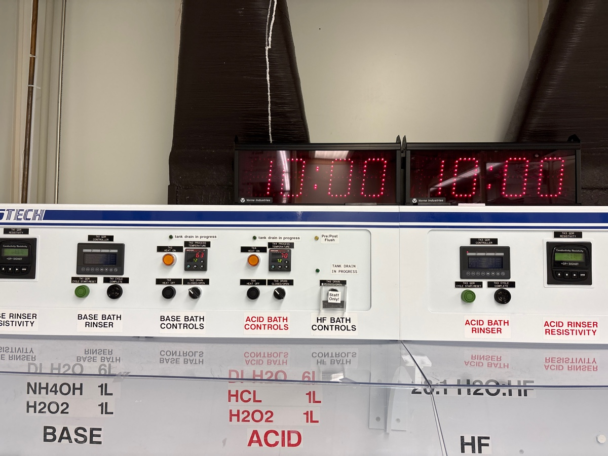
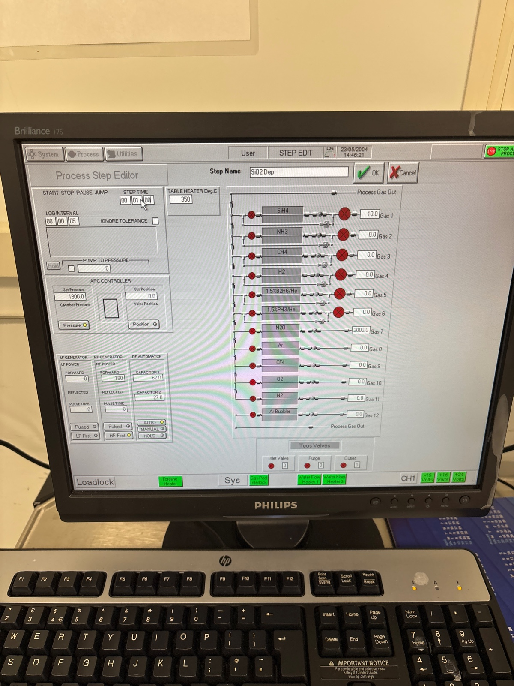

# 2025-05-23 asml fabrication pass 2
In our first ASML fabrication run, we seem to have broke our waveguides.  There are two likely explainations:

1. We did not remove ARC when removing edge bead, which means that we contaminated the wafer during the BOE dip
2. We annealed with Takachi oxide, which can’t handle higher tempuratures

Today, we will try to rectify these issues.  I will make new wafers, and be more systematic about testing loss as we go.  We will follow the same proceedure as before, which is:

1. RCA clean
2. 500 nm of pad oxide with 3 mins smooth deposition
3. Cr sputtering for 1210 seconds at 7 mTorr
4. ASML with existing recipe, dose 15 mJ/cm2, arc and 600 nm of DUV resist.  Develop and coat using gamma.  Make sure to use edge removal
5. Descum for 1:45.  
6. Cr hard mask etch for 3.5 mins
7. Oxford 100 CHF3/O2/N2 etch for 7 mins with 5 min season
8. 20 min Cr mask removal and 15 seconds BOE dip
9. 9+8 min smooth oxide deposition (in seperate steps)
10. 12.5 oxide thinning using CHF3/O2 recipe.

Below is Oscar’s recommendation for ARC removal

We can even use 2 mins.  

### Mask prep

Just finished RCA clean

Before season (Jeremy cleaned when he was fixing tool)

During season (we changed to smooth deposition becayse we hope this will slightly reduce roughness

Before deposition 

During deposition 

Before second deposition

During second deposition 

During sputter 1

During sputter two

# Resist coating

Dummy in slot 1

We do ARC first

Noting N2 is on

ARC coating started

Now PR coating 

Start sequence now

Finished.

Turning off the N2

### ASML

Read the mask

First, we run edge clear

During first run

Before main

During main

# Development 

Turning N2 on

After development, no edge bead

### Etching

82 pre clean

100 pre clean

We will descum for 2 mins just to be safe

Before 100 season

Inspection after descum

After Cr etch

Before etch

During etch

Depth after etch

After Cr strip, I do some Ellipsometer

In trench

With mask

# PECVD

## Seasoning 1 min

Seasoning smooth oxide recipe

Last user cleaned it well.

19:50 Starting.

19:59 Finished

## Main run 9 mins

20:02 Loading the wafer.

After

We got 1.5 um, to be expected

## Cleaning 10 mins

Clean done

## Seasoning 2 1 mins

## Main run 2 8 mins

During

### Oxford 100 thinning

We expect 3.4 um of oxide at the end.  So we want to etch down 2.4 um.  This means etching for 14 mins.  For square spiral, we etched for 14 mins, and started with 3.2 (we used a different pad oxide).  Lets see the final, but plan for 14.  

Before season (I already left chamber clean).  I season for 2 mins.  

During

We will do 13.5 to be extra cautious 

Before

During

Almost spot on thickness

### Loss test room temp

I used 10 x objective with EDFA. 1570 is the wavelength 

Straight one

3.2 mW for 84 mW in

Straight two

3 mW

Middle square spiral 

120 uW

Middle circle spiral

230 uW 

Looks decent enough. We will try RTA now

### RTA test

I spin cleaned the test wafer

Calibration

During main run

Small explosion 

### Loss on RTA

Using 10 X objective, Edfa, and 1570

Straight 1

5.3 mW for 94 mW in

Straight 2

5.9 mW

Square medium 

1.6 mW

Circular medium

1.7 mW

Fast adibatic 

6.2 mW

Fast hump

3 mW

Fast hump 2

3.6 mW

So it does seem that having the structures does increase loss, which is a bit unfortunate.

### Main RTA

I cleaved and spin cleaved new pieces

Below is calibration of RTA

Main run

Before

During

# PECVD for SRN deposition

We start with some pre cleaning, just 5 mins.

Previous user.

16:36 Venting

## Pre cleaning: 5 mins

16:37 Starting.

16:47 Finished.

## Seasoning 1: 2 mins

16:49 Starting

16:55 Finished

The color of the sample looks good.

## Main run 1: 32 mins

17:00 Starting

During

17:36 Finished

The colors of the samples look good.

## Cleaning 1: 20 mins

17:39 Starting

18:02 Finished

## Seasoning 2: 2 mins

18:05 Starting

18:11 Finished

The color of the sample looks okay.

## Main run 2: 32 mins

18:15 Starting.

18:52 Venting.

## Cleaning 2: 20 mins

18:54 Cleaning started

19:18 Finished.

## Seasoning 3: 2 mins

We load a witness sample,

19:20 Started.

19:27 Finished. The color looks good.

## Main run 3: 32 mins

19:30 Starting.

20:06 Finished.

20:07 Venting.

## Cleaning 3: 20 mins

20:10 starting.

# ITO deposition

20:39 starting

Try to make waveguides 1.7 long

### Loss sanity check at end

Medium square

1.76 mW (so same as baseline)

