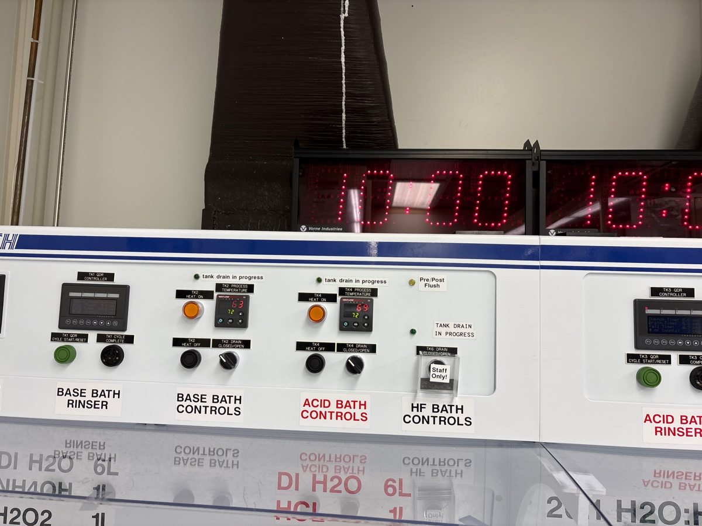
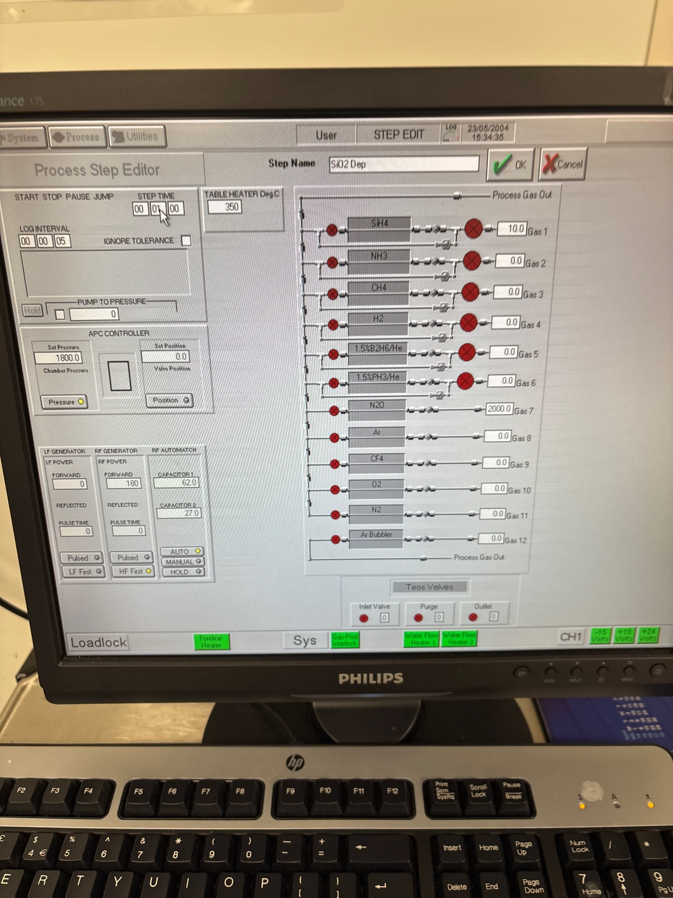
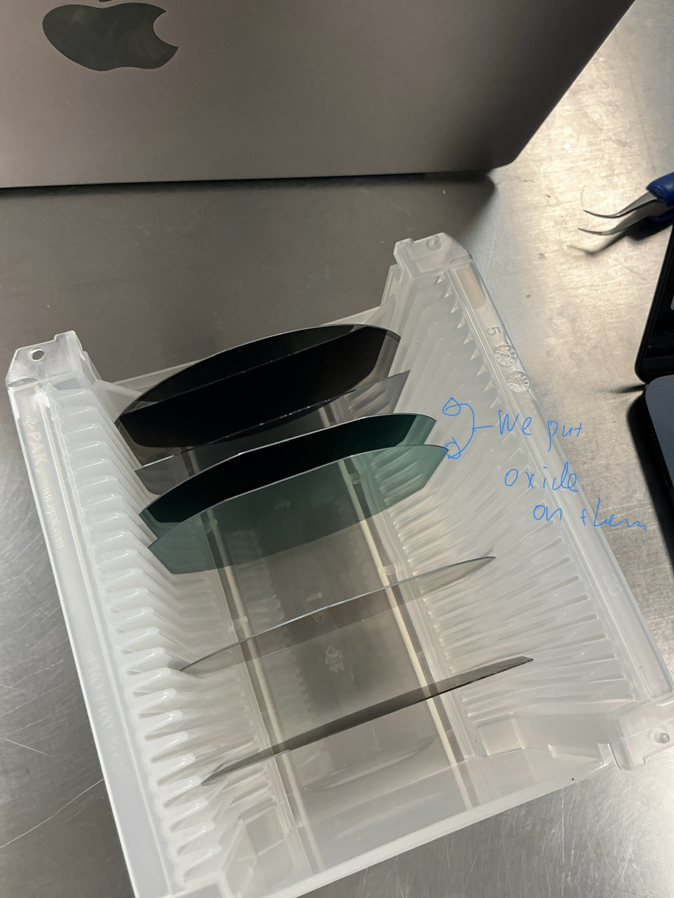

# 2025-05-23 oxide hard mask testing
We are interested in creating an oxide hard mask as a way to open up the furnance tubes to our process and maybe reduce loss.  We really want to use this current study to test the baseline loss of these types of proceedures.  We will start with thermal oxide wafer and RCA clean.  I will then deposit an additional 800 nm ox bottom oxide to make sure we have no substrate loss.  Smooth oxide deposits at 165 nm/min, so we deposit smooth oxide for 5 mins.  This will reduce bottom oxide roughness.  

We want 800 nm of core.  This means we deposit **SRN 4 for 20 mins and SRN 3 for 24 mins.**  We will then put another 1 um of top oxide on, which requires 6 mins of smooth oxide deposition.  

Just finished RCA clean

Before season

This is smooth oxide.

## First oxide deposition 5 mins

We start from the one on the top

Now finished

15:52 Venting

Done

## Second oxide deposition 5 mins

We take the one from the lower slot

15:55 Starting.

During

Ellipsometery after

## Cleaning 15 mins

Made a mistake of running am oxide recipe. Jumping the process to the end.

## SiN seasoning for SiN 4 2 mins

16:38 Seasoning started.

16:46 Finished

## SiN 4 main run 20 mins

The carrier color looks a bit off..

After deposition, below is Ellipsometer

Back wafer is 4

## Cleaning 20 mins

Cleaning 20 mins

## Seasining SiH3 2 mins

17:46 Starting. 2 mins.

## Main run 24 mins

Left over wafer

After

3 is in front, 4 is in back

## Cleaning 15 mins

Because the dep rate was low, we do a quick cleaning.

As a reconfirm for top cap, smooth deposited at 166 nm/min.  So if we want 1000 nm, we dep for 6 mins

### Top mask oxide deposition

Before season (no middle clean)

Before 3 cap

During

After

Roughly worked, though index of SRN is a bit all over the place

Before 4 dep

During

After

We are not all good to move onto lithography. We will use the same resist recipe as yesterday, but we will create a new job for the ASML.  I see no need to expose the funky straight sections.  We can just expose lots of medium and long spirals.  after descum, I probably expect 400-500 nm of resist left (we can check on the profilometer).  We will use 1:45 as the descum just to save some resist (and this is what Oscar uses anyway). We want to etch 1 um of oxide, so we run the CHF3/O2 recipe for 6 mins.  We then want to etch 750 nm of nitride, so we use the nitride etch for 3-4 mins.  We will use 3 to start, and hopefully there will be a small amount of nitride left for us to get etch selectivity with.  We will use YES ecoclean to remove resist after oxide etching  

# ASML lithography

# Creating ASML job

[`Sat, May 24`](day://2025.05.24)

We use 8.5 mm width

Defining images

# Gamma coating

We make the order dummy, 4, 3.

This is 4

This is 3

N2 on

Load carrier

Moving to resist coating

We put 600 nm resist

# Running ASML

4 goes to the bottom. 3 goes to the second to bottom

We point the major flat towards bottom

We first do edge bead removal

Somehow the tool didn’t like it

Main run

Before developing

# Etching

## Oxford 82

### Cleaning 5 mins 

18:18 Starting.

18:28 Finished

### Descum

Taking the wafers from the developper

This is 4

We start from SiN 4 wafer. 1 mins 30 sec descum.

18:36 finished

Done. Next is SiN 3.

After

18:40 Evacuating the chamber

450 nm of resist

18:42 Starting 1 min and 30 sec descum on SiN3.

18:44 Finished.

## Oxford 100

### Cleaning

Clean for 6 mins

Seasoning for 3 mins

### Main run

6 mins to clear oxide

During

After etch on 4

Not very deep

We will try 5 now and see result

Before 3 etch

During

12 min clean

After etch on 3

Not a tonne higher

It seems we have a bit of left over oxide

We now do 2 mins of nitride etch season

During season

3 min etch on 4

After etch on 4

1100 depth

It is quite difficult to get good ellipsometer

It seems we went 300 deep into bottom oxide, so we over etched a bit

3 again on 3 to be safe

After etch on 3

1100 again, so we still cleared

### Oxide capping

Before season

Finished RCA. Doing 7 mins smooth on 4

After

Before 3 dep

## Loss Test

We would like to measure the loss of these waveguides.  We should measure at room temp and using the normal 800 C anneal.  Given that we effectively flood exposed the entire wafer, we should not expect any stress explosions.  Left cleave off a third of each wafer, cleave some room temp waveguides off of that, and use the remainer of that third for annealing.  We will then go back to the lab to test

Calibrating RTA

Before running

3 top, 4 bottom

No explosions

### Loss test in lab

Edfa 10 x objective at 1570

SRN 4 annealed

Straight 1 

2.25 mW in for 91 mW 

Straight 2 

2 mW

Medium square spiral

320 uW

Long circle spiral

120 uW

I re ran these. Straight got 2.2 mW and long spiral got 120 uW

Not annealed SRN 4

Straight 1

3.1 mW

Straight 2

3.2 mW

Medium square

800 uW

Long spiral

700 uW

I double checked the straight ones. I truly can only get 3.2. Other local straights had 2.4. It is possible these straights had bad cleaving. Either way, I think not-annealed have lower loss

Annealed 3

Straight 1

3.5 mW

Straight 2

3.4 mW

Medium square

1.1 mW

Long circlar spiral 

1 mW

Not annealed 3

Straight 1

2.8 mW

Straight 2

2.8 mW

Medium square 

220 uW

Long circular

230 uW

If the waveguide are 2cm long, then the Long spiral is 7.8 cm long and the medium square is 7.1.  Effectively the same, though it seems like the square should have a bit more loss.  We will just compare the two straight to the long

Calculations of loss

[2025-05-25 Cutback Loss Measurement for Hard Mask.pdf](https://resv2.craft.do/user/full/c10b6666-b4fd-53a0-9177-1696a144b2d8/doc/2CD36593-7807-4D67-A7B8-95C31E790CEF/327D552A-0F11-4DB3-A3B9-80843699EC33_2/0zFcn9HRPvSUQZ1SEVSF33DENZwrbCCnSV9yo8FBqlAz/2025-05-25%20Cutback%20Loss%20Measurement%20for%20Hard%20Mask.pdf)

Below is a chart of what we have measured:

|                 | SVM (ASML) | Takachi SiNx | SRN2.7             | SRN 3 (ASML) | SRN 3.5 | SRN 4 (ASML) |
| --------------- | ---------- | ------------ | ------------------ | ------------ | ------- | ------------ |
| Room Temp       | 1.95       | 2.3          | high               | 1.87         | 2.4     | 1.1          |
| Annealed at 800 | 0.94       | high         | high (but less so) | 0.86         | 1.14    | 2.15         |

While the above loss measurements are not perfect, I have a few general conclusions from this and SVM ASML tests:

1. Takachi films seem to struggle with RTA.  Given that Aaron has annealed them in the tubes, my suspision is that it is a thermal shock issue.  Nonetheless, I feel no huge need to continue using Takachi oxides when the PECVD oxides work fine
2. It does seem that ASML reduces loss (probably by 30-40%).  So we should use it on final devices.  
3. I am less certion about how useful the oxide hard mask was.  The plus side is that the best wafers were prepared that way.  Judging by the difference between SVM (ASML + Cr) and SRN 3 (ASML + oxide), I generally feel like oxide did not help reduce by a tonne.  Of course, this is not a perfectly apples to apples comparison, as the SRN 3 material was different and the waveguides were narrower (meaning it could have seen some roughness from the top).  Given some of the selectivity issues, I am not in an urgent rush to push the oxide side of things
4. It seems that index is quite important.  Annealing low-index films helps, while annealing a higher index film eventually causes more loss.  This could partially explain the Takachi result and why SVM at 1100 C was not great (though that proceedure probably had other flaws, like no oxide capping for a while).  So, if we pursue higher tempurature anneals, we should consider using lower index SiNx films to start
5. I think furnance annealing SVM at 800 C is a good idea.  The longer anneal should simply help it more.  

For etch rate characterization, we can simply look at the relative heights of our resist, oxide, and nitride after etching.  If we were simply etching oxide on both sides, that is considered dead time.  I know we were pretty close to the ideal etching time for CHF3/O2, so we can kinda infer from that.

We started with a resist mask that was 450 nm thick.  I suspect we over etched the descum a bit, as we should have started with 600 nm of resist.  I would suspect ARC and resist have similar etch rates, though I could be wrong

After CHF3/O2 etch, we had about 700 nm side wall.  I am assuming all the resist was gone and we chewed a bit on only oxide and niride for the end of the etch.  I am assuming these have similar etch rates.  This means a selectivity of 1.5:1 oxide to resist

After CHF3/O2/N2 etch, we had 1100 nm side wall.  I am assuming at the end we chewed on only oxide.  This means an etch selectivity of 1.55:1 nitride to oxide.  

So the total estimated resist:nitride selectivity of this process is roughly 2.25.  So we are actually not that far from what we want.  We only need a bit more resist and we should be good.  I would prefer the etch stop on oxide is not so close to the nitride.  

It is still a bit hard to guess at the etch rates for the nitride etch, as we never landed with purely nitride remaining.  Nonetheless, we can probably take an estimate given how much was left.  Keep in mind the ellipsometer measurements were far from perfect.

After CHF3/O2 oxide etch for 5 mins, we estimate that 100 nm of oxide is left.  This means, for the exposed oxide, we etched 900 nm.  So the etch rate is 180 nm/min, which is relatively consistent with prior expectations.  Using our estimated selectivity, we guess that we etch DUV resist at 120 nm/min.  

After 3 min nitride etch, we etched through 200 nm of oxide and 750 nm of nitride.  We can say, from selectivity, that 200 nm of oxide is equal to 300 nm of nitride.  So we etched ~1um of nitride in 3 mins, which is consistent with previous understandings.  This means we etch nitride at 330 nm/min.  Using previous etch selevtivity, we then etch oxide at 220 nm/min.  So below are the useful etch rates

| Etch Recipe        | Resist Rate (nm/min) | Oxide Rate (nm/min) | Nitride Rate (nm/min) |
| ------------------ | -------------------- | ------------------- | --------------------- |
| CHF3/O2 oxide      | 120                  | 180                 | \-                    |
| CHF3/O2/N2 nitride | \-                   | 220                 | 330                   |

Again, these are rough guesses on SRN 3 (so the rates may vary a bit for SVM), but this is a good starting point.