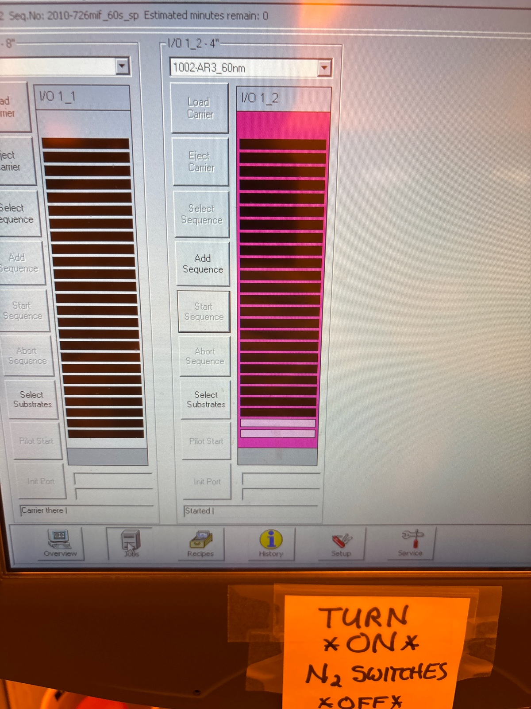

# 2025-05-30 furnance anneal planning and experiment
We have now succeeded in reducing loss using ASML.  This is because we were effectively able to reduce edgewall roughness.  Now, we want to focus more on thermal treatments of the wafer.  While this is not confirmed, I have the suspision that the performance of a film after furnace annealing is somewhat dependent on the starting index of the film.  The idea is we want the index of the film, after annealing, to be as close to stoichiometric as possible.  This means, for higher tempurature anneals, we want the starting index to be quite low.  There are two things that would be interesting to test here:

1. Whether furnace anneals are better than RTA
2. Whether higher tempuratures do have the possiblity of helping reduce loss further

The first is easy to test.  We just put some pieces into furnace tube and anneal at 800 C.  I am not sure what the best proceedure here is.  We could either do an Oscar style anneal where we load at tempurature, slowly let the lid close, and anneal at 800 for an hour.  The plus there is that is cheaper.  The minus is that we run the risk of stress cracking from coefficent of thermal expansion mismatch (as the heating is still rather rapid) and 1 hr of annealing might not be enough.  The alternative is we load at 300 C, heat to 800 C over an hour, and anneal for 3 hours (and cool over night).  We currently have the following in storage:

1. SRN 2.7 Cr mask and MLA
2. SRN 3 oxide mask and ASML
3. SRN 3.5 Cr mask and MLA
4. SRN 4 oxide mask and ASML
5. Takachi Cr mask and MLA

We can also make another SVM wafer, which will use Cr mask and ASML.  We don’t have perfect baselines of absolute loss values, but we will be able to see how the relative loss values of all these processes change.  This is because we took 800 C RTA measurements on all of these processes.  I definately think this should give us a fair comparison, as we will see which processes see by what percentage loss goes down.  We are not concerned with the raw loss values.  Only the relative percentage change.  

From Gui and Oscar, it seems that we ought to do the longer version of 800 C annealing just to be safe.  So lets do a 1.5 hr ramp from 300 C to 800 C.  Lets then do 3 hrs at 800 C.  This should give us a good idea of what we are dealing with.

After that, using whatever pieces we have left, we should do roughly the same thing, but go to 1100C.  We should just use N2 anneals or Ar anneals.  No O2 should be added, as that will just oxidize stuff.  We should at least spin clean all the pieces before we do any high tempurature anneals.  The general intuition is this should be better than RTA.  If 1100 C works, then we can make some new waveguides for 1150 C.  Before we do the anneal, we may want to make some new SVM waveguides.  We can just mass print the previously successful spirals using the same recipe we used on the hard mask pieces.  

### Lithography

ARC coating

DUV coating

ASML

We read the mask

Input output in batch data

Before clear

During

Before pattern

During

Development

I think we undex expose, did not seem to remove everything

In future, we should use dose of 20

### Etching

7 min pre clean of 100

5 min pre clean of 82

Let’s descum for 2 mins

100 season

Descum makes all well

During season

2 mins Cr etch

Under microscope 

Generally looks good. Few areas under dark field that don’t reflect

Before etch

During etch

After etch

100 nm shorter than usual, but it’s ok

We now Cr etch for 20 mins and BOE dip for 30 seconds (just to make stuff more clean).  Aaron said in the future we could use the TFT RCA clean to clean stuff that had Cr.  For now, lets keep things consistent.  I will then do 10 mins of smooth oxide to cap the structure.  

### PECVD Capping

we run 10 minute clean

Before 1 min season

We will do 10 min cap deposition 

### Annealing

The pieces I labelled are those I spin cleaned

Set points

The recipe we want to run

Before run

Loading

SVM back, 4 middle, 3 front

Takachi front, 2.7 middle, 3.5 back

We load fast at 15. I don’t suspect any stress issues with loading this fast 

During load

Ramp has started

Further along during ramp

During anneal

A day later 

### Loss measurement

We used second setup 1570 EDFA. There was no visable cracking after annealing. 10 x objective 

56 mW in, though this is a pretty wide beam. Efficiency in may not be great

SRN 3.5

Straight 1

600 uW 

Straight 2

600 uW

Straight 3

500 uW

Spiral 1

120 uW

Spiral 2

140 uW

Spiral 3

230 uW. I think I did the earlier ones wrong

Spiral 4 (longest one)

115 uW

For the calculation, I only used the spiral 3 number.  We generally can guess the loss is around 1 dB/cm

SRN 2.7

Straight 1

11 uW

Straight 2

12 uW

Straight 3

9 uW

Spiral 1

Too lossy to find

Still just very high, which is what we got earlier

Takachi

Straight 1

2 uW

Straight 2

1 uW.

Generally, this one is still impossible 

Still very high, which is what we got earlier

SRN 3

Straight one

830 uW

Straight two

830 uW

Medium circle

330 uW

Medium square 

270 uW

Middle straight 1

679 uW

Middle straight 2

770 uW

Long square

160 uW

Long circle

230 uW

We compare square and circle spirals as the same (adjusting for lenght, but no distinctino for curvature).  Overall, this is good

SRN 4

Straight 1

235 uW

Straight 2

190 uW

Straight 3

200 uW

Medium circle

8 uW

Medium square

3.5 uW

SVM

Straight 1

600 uW

Straight 2

382 uW

Straight 3

500 uW

Straight 4

600 uW

Straight 5

180 uW

Medium circle

25 uW

Large square

6.6 uW

Large circle

39 uW

Middle straight 1

710 uW

Middle straight 2

535 uW

Middle straight 3

750 uW

Middle straight 4

540 uW

Long square 2

3.4 uW

Long circle 2

Can’t find

Despite all the points we took, I just decided to compare long circle to straight.  I would agree SVM felt lossy.  This is not a perfect apples to apples with SRN3, as SRN 3 probably suffers more from scattering losses.  The main point is SVM only works with RTA, not furnace anneals.  I could not possibly start to explain why.  Below is a pdf of the calculations

[2025-06-02 Cutback Loss Measurement 800 C Furnace Anneal.pdf](https://resv2.craft.do/user/full/c10b6666-b4fd-53a0-9177-1696a144b2d8/doc/E4A73334-2077-4950-97FF-CEC97FC3F260/E7EF9359-D5E3-49D2-96AE-0089C21E2273_2/SZXztmG1ZeRy9piUhgtc7OJFZDZ9qjRpBPex2r0m6DAz/2025-06-02%20Cutback%20Loss%20Measurement%20800%20C%20Furnace%20Anneal.pdf)

Below are results for RTA and Furnace annealing

| Film Recipe | SRN2.7 (Cr + MLA) | SRN3 (oxide + ASML) | SRN3.5 (Cr + MLA) | SRN4 (oxide + ASML) | Takachi (Cr + MLA) | SVM (Cr + ASML) |
| ----------- | ----------------- | ------------------- | ----------------- | ------------------- | ------------------ | --------------- |
| Room Temp   | high              | 1.87                | 2.4               | 1.1                 | 2.3                | 1.95            |
| 800 RTA     | high              | 0.86                | 1.14              | 2.5                 | high               | 0.94            |
| 800 Furnace | high              | 0.82                | 1.22              | 3.2                 | high               | 1.984           |

As for next steps, we could just use this time to go straight to 1100 C anneal.  I would all (maybe not Takachi only because I literally know the films are already broke) into the tube.  I have the most hope for SRN2.7 or SRN3.  Even though SRN2.7 is broke now, I have hope that annealing further might revive it.  SRN 3 is not broke at the moemnt, but it might break during anneal.  This would give us a very small window where we could finesse working films out of the PECVD and into the furnace tubes.  I suspect SRN4, SRN3.5, and SVM will all get worse, but given they are mostly broken anyway, no point in not going higher.  If something works at 1100C, then I have confidence we could go all the way up to 1150 C.  Another reason I want to put SVM in is to see if 2um can survive the anneal (even if loss is low, I wanna see if cracks form on a fully etched wafer).  

Obviously, I am not crazy about doing this annealing and long deposition proceedure for each wafer.  That being said, we really only need to do it for the last ones.  We can still characterize new GDS files on SVM and get things close to perfect there, which allows us to save a lot of time.

### 1100 C anneal

---

[`Mon, Jun 2`](day://2025.06.02)

Furnace anneal

We use this

Select the right file

We use N2 anneal

Zone 4 matters

Download to tymcon

Select N2 annealng

Now we log onto the tool

Run the recipe 

2 is pause. Stop auto

Pause then menu

3 for manual

Speed 

Make the load speed fast

Unloading now 

Full wafer load

We have, from front to back, 3, 4, SVM

Front

3.5 front, 2.7 back

Load and unload at 21 ipm

We are now ramping

If the step does not move forward, do hold step run

I stopped the anneal 20 mins early, stepped, and let it cool overnight

After cooling over night

We now unload

No obvious and visable signs of cracking, which is good

### 1100 C preliminary lost test

We use 1550 laser (not santec) no edfa and 10 x objective. So we will not have a tonne of power. 7.5 mW in

SRN 3

Straight 1

66 uW

Straight 2

95 uW

Straight 3

91 uW

Straight 4

72.4 uW

Long square 

55 uW 

Long circle

50 uW

Medium circle

53.5 uW

Medium square

33 uW

Let’s try one more die, as the data above is a bit strange

If we compare straight to long square

If we compare straight to long circle

Straight to medium circle

Straight to medium square

I would say a loss probably below 0.5 dB/cm from the average above.  

Die 2

Medium square

38 uW

Medium circle

42 uW

Straight 1

82 uW

Straight 2

100 uW

Straight 3

85 uW

Straight 4

94 uW

Long square

36 uW

Long circle

55 uW

Not fully consistent, but maybe a bit better 

Comparing straight to small circle to long square.

0.5 feels like a good estimate still

Die 3

Long circle

26 uW 

Long square

22 uW

Straight 1

40.5 uW

Straight 2

105 uW

Straight 3

75 uW 

Straight 4

100 uW ignore the upper lower values. The power meter was mounted in correctly 

Medium circle

105 uW

Medium square

45 uW

These numbers are very much all over the place, but generally indicate very low loss

SVM

Straight 1

8 uW

Straight 2

6.5 uW

Straight 3

8 uW

I can’t find any more, but we know that it is possible to get light through

SRN 3.5 

Straight 1

44 uW

Straight 2

63 uW

Straight 3

65 uW

Straight 4

60 uW

Spiral 1

12 uW

Spiral 2

12 uW

Spiral 3

11 uW

Spiral 4

0.7 uW

It effectively seems that SRN3.5 has its loss go slightly up from annealing.  Either way, SRN3 is the best 

SRN 2.7

Can’t find anything

SRN 4

Can’t find anything

