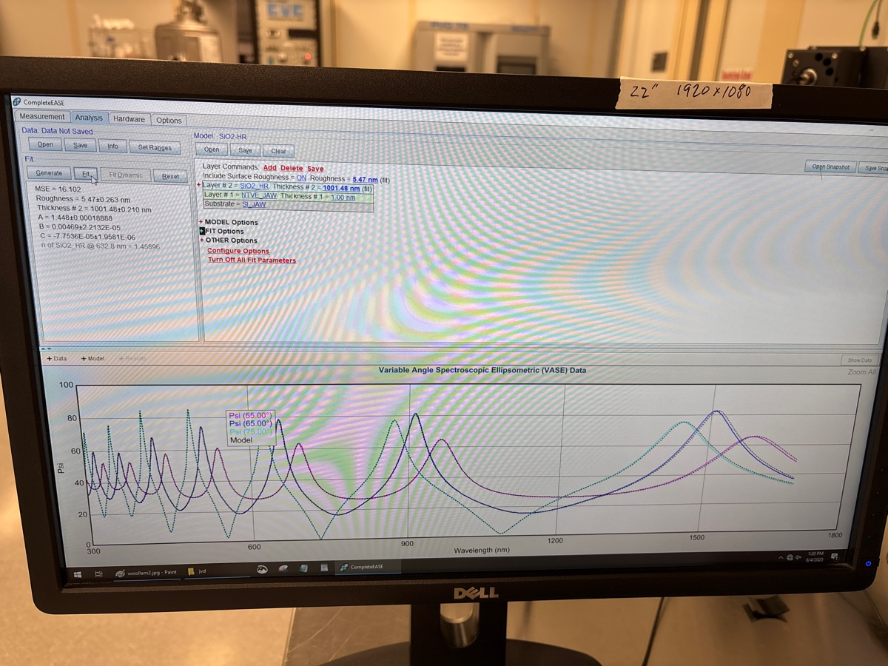
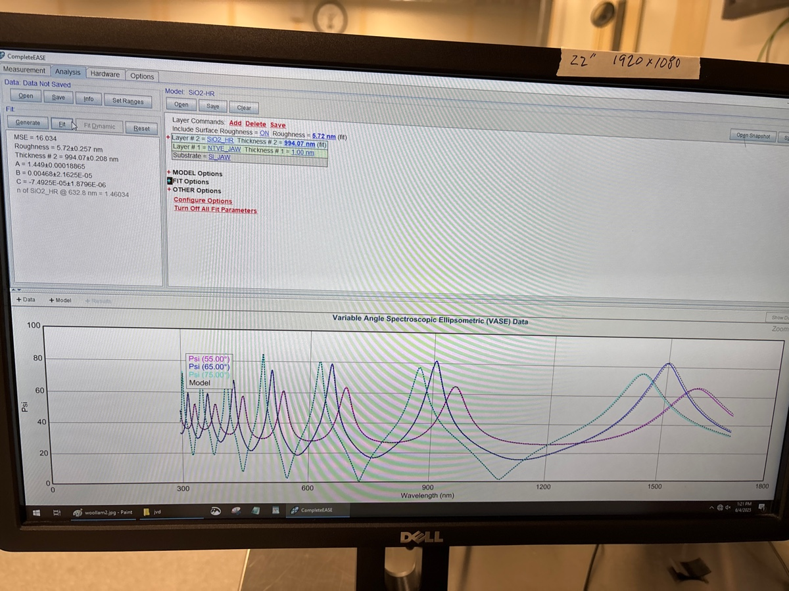

# 2025-06-04 srn3 deposition for future processing
From our annealing results, it seems that we can get SRN3 to have less than 0.5 dB/cm loss at 1550 if we anneal at 1100 C.  This is a pretty useful result, as it means we can make really high perfomance waveguides in the future for very long poling distances.  Given that we are in a bit of a lull experimentally (where we are simply running some very long scans), it seems reasonable to start fabricating some new SRN3 wafers.  We can store these in the background so we can use them for final devices when the time comes.  

We found, from previous tests, that SRN2.7 is generally bad and SRN3.5 is worse than SRN3.  SRN4 is broke by annealing.  Obviously, these results are not perfect, but they generally give the impression that there is a narrow silane flow window of SiNx recipes from in-house PECVD that will work to give us low loss.  We could either just deposit one SRN3 wafer, or try to deposit a couple wafers with 2.9, 3, 3.1.  Eventually, we want to anneal these films at 1150, which I think it fairly achievable.  The one thing we have not proved is that 2um etched films will work.  We have technically only showed that 800 nm thick films work.  I generally believe 2um should work, as SVM showed no obvious cracking and I am not convinced annealing caused other issues.  But still.  

We are going to deposit 2um of SRN3, with the knowledge that it will probably densify to 1.7-1.8 after annealing.  We previously found that 24 mins gives us 750 nm.  This means, for 2um, we deposit at 31.25 nm/min, so we deposit for 64 mins.  Personally, I am of the belief that we should not break up the deposition, as that could add a weird layer in the middle.  We would only need to clean for 20 mins, as the deposition rate is so slow.  Lets deposit for **65 mins** just to be safe.

Afterwards, we will put on 500 nm of oxide.  I have not yet decided if we want to try Cr hard mask or oxide hard mask.  The advantage of Cr is I know it will work.  The advantage of a hard mask is that it will allow us to go to 1150-2000 C (making our device more broadband) and it is the way we fabricated the preivous round.  With the 800 nm thick ASML resist, I feel like we should be able to etch through everything, but I could be wrong.  Given the high tempuratures we are going to, I really want all the SiNx to be etched away, as I don’t want any possible stress issues.  From our previous characterizations, we can probably assume (after coating ARC and 800 nm of DUV), we will have 650-700 nm of resist.  We previously did 1:30 descum and lost 150 nm of resist.  We could probably make that 1:15 to try to get some more resist, but that might be risky.  Lets assume 650 nm of resist.  We then have a 120 nm/min etch rate on resist, and 180 nm/min etch rate on oxide.  This means we can etch 1 um of oxide.  This is not enough.  At some level, we really just want a differnet oxide etch chemistry.  Either way, this justifies my hestitation.

Per Jeremy, we can use the CH2F2 etch we used to use with resist and oxide.  He says it is a very clean etch in that situation and gives twice the selectivity, making the whole scheme possible.  

We are doing two wafers. Check that we have thermal oxide on both

Check ellipsometry of previous 3 and 4 films just in case I got something confused

3 below

4 below

4 has more peaks, so I believe I was right. I can also check filmetrics

3

4

Not super convincing. I think the best test is color. Below is Takachi annealed

Below are 3 and 4, 4 bottom 

We expect 4 and Takachi to have similar index

During RCA

### Pecvd

Pre clean for 10 mins

Before season

During season

Before main dep

It is going a bit short, I forgot to use hour notation

So we still need extra 6 mins. I think wafer should be clean throughout if we just do two stels

Below is before extra 6

During

Ellipsometer 

Index seems uniform

Index is slightly lower, but there are not perfect fits.  Looking at old data from oxide capping definately confirms this.  

Before season

While the other films were a tad thick, I say we stick with the same recipe

Before dep

During second run

I am going to do top oxide capping another day and RCA beforehand.  We do this with SVM anyway, so it’s no big deal. Back wafer is 2, which still needs ellipsometry

I transfered these ewafers to the SVM box.  They were found at the back of the DON box.

Wafer 2 ellipsometry

