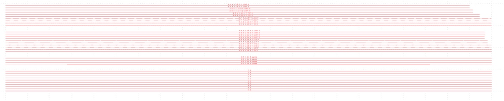
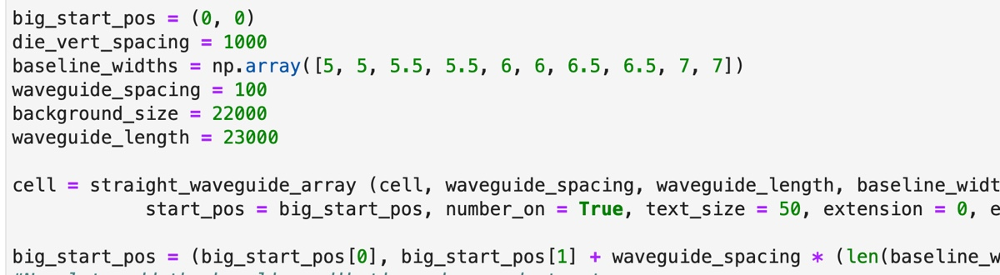
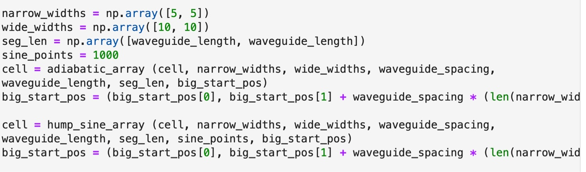
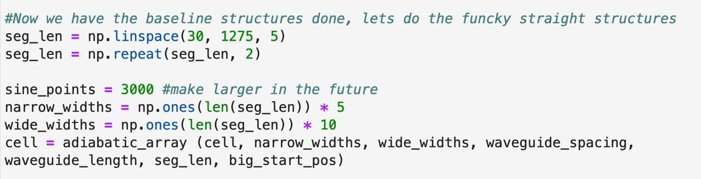
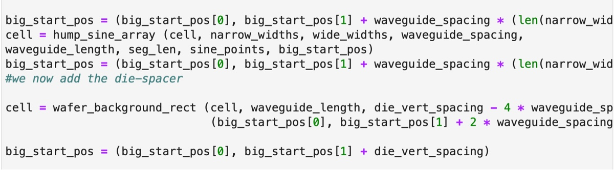
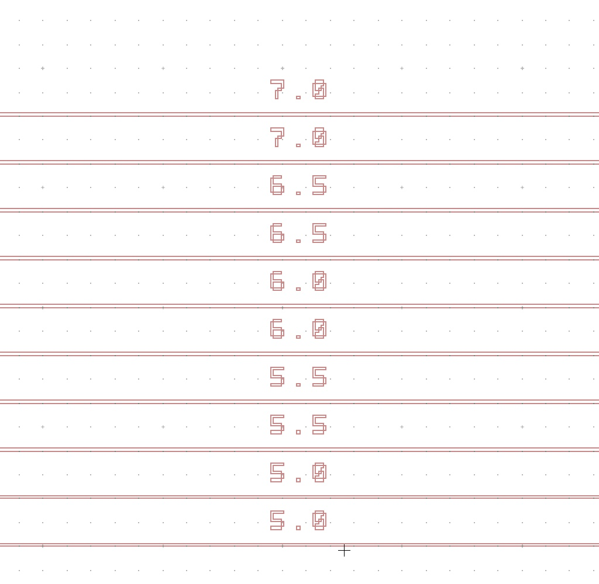

# 2025-06-05 poling funky waveguides
[`Thu, Jun 5`](day://2025.06.05)

# Background

We fabricated programmable waveguides with various sidewall structures. See [2025-05-23 ASML fabrication pass 2](craftdocs://open?blockId=EDF9A93B-EEAF-4542-9EB6-A51B5A4C40BB&spaceId=c10b6666-b4fd-53a0-9177-1696a144b2d8). We have tested spiral geometries from the same run in [2025-05-15 Square spiral waveguide characterizations](craftdocs://open?blockId=EC932AAF-E076-4FCE-B026-A7604C272D83&spaceId=c10b6666-b4fd-53a0-9177-1696a144b2d8) [2025-05-31 Testing long spiral waveguides](craftdocs://open?blockId=1B977761-6950-430A-AD3A-BC4428FDAEEF&spaceId=c10b6666-b4fd-53a0-9177-1696a144b2d8). Now we test the funky waveguides.

[ASML1 Pass 3 (positive).gds](https://resv2.craft.do/user/full/c10b6666-b4fd-53a0-9177-1696a144b2d8/doc/ECAB3CA7-2287-4192-8EFB-A10B8E774F44/C8C8EB91-EA47-4A72-8A28-D077722A8321_2/5qBlAkFlmxv8VyE9DEJRmx4lrAboJFiYcm5L2ogsbU4z/ASML1%20Pass%203%20positive.gds)

First straight

Long adibatic, then long hump

Lots of periods of adiabatic waveguides

Lots of humps

Around the bottom section, we have straight waveguides.

We will start from these guys. 

Bottom two are adiabatic linear chirp. The top two are sinusoidal modulation. Both of them have a long period of modulation.

N is the narrowest region. W is the widest region. P is the period. 

The last section is composed of sinusoidal ones.

# Plan

We should start poling from the straight waveguides. Because the average width of the waveguide in the hump region is (5 + 10)/2 = 7.5, it makes sense to test the 7 um wide straight waveguide to get a sense for the nominal poling period. 

We will then move to the slow adiabatic chirp waveguide. Let's work on the linear one first. The aim is to (1) maximize the SHG for a CW input, and (2) show that we can tailor the QPM grating to get a nice transfer function. We should always take a data alongside a naive poling.

# Preparation

We engrave an ID of the chip. 2025-05-23 #1 straight 

We also need to put back an anamorphic prism

After coupling into straight 7 with edfa and asphere, we get 6.5 mW

# Alignment

We use ELMO for alignment

# CW SGH on the straight 7 um waveguide

## Baseline with EDFA at 1570 nm

Using EDFA, we take a baseline.

Taking a fine scan

We realize that the signal level is better when we use 10 Hz bias, instead of 5 Hz. We switch the frequency for the plots below.

We align the imaging setup further. Also, there is a chance that the + electrode was casting shadow. Fixed the issue and moving on.

As we see a side-robe on the longer side, we set the poling period to the short side and maximize the signal.

Didn't quite work out. We part on the longer side now.

Doing the same again.

This is roughly what we converge to.

## Santec 1570 nm

We take away the EDFA.

Signal from Santec is well visible but a bit weak. Were using 6 Vpp and 10 Hz.

## Power measurment through the straight waveguide

We measure the power of light in and out,

And power out

## Wavelength scan

# Summary for [`Thu, Jun 5`](day://2025.06.05)

We finished testing the straight waveguide, getting baseline measurement results. Important takeaways:

- The image focus is reasonably good in the longitudinal dimension. Probably it is best not to touch it when sliding in a new waveguide.
- If there's issues with power, only move the illumination in the transverse direction withr respect to the waveguide.
- The frequency of the bias voltage is now 10 Hz. Let's stick to this number.
- The SHG conversion efficiency is not bad, but also not the highest. It is likely due to the relatively bad coupling. 
- To normalize such effects, always take power measurement with wavelength scan for each waveguide.
- A natural next step would be to slide in a new waveguide, repeat parts of these measurements (you can copy and paset cells) as if the waveguide were "normal", to get baseline results. Then, move onto optimizations.

# Adianatic waveguide

(you can continue here [`Ben Ash`](craftdocs://users?id=d9d2fbda-3d0b-154c-637c-be9f41830cae))

As a baseline, we find that (out of the long adiabatic waveguide), there is ~13 mW with EDFA.  I am honestly very impressed with this level of transmision.  Below is a baseline scan with 1570 of the poling period.  Obivously there is going to be a bit of a weird spectrum, and we will then have to figure out how best to do this.

We see an objectively very wide poling region.  This is somewhat to be expected, as the waveguide has a large variety of widths.  We also notice that the height of the signal is rather low.  Again, this is to be expected, as each poling period only effectively poles a small region.

To get a rough idea of what the real poling structure looks like, we are just going to do a phase-pp scan of the entire waveguide length.  This should just tell us the general shape, which we can fit to later once we have some intuition.  There is probably a fair argument that we should use quadratic fits to check that we are working in the ideal regime, as waveguide should not matter at all for the region we are poling.

Below is the poling from one of these phase-pp scans

The beginning is off because there is not enough signal.  But the ending section looks more like a V (which is kinda what we expect

So, when we parameterize a nicer fit, our free parameters are middle position in x, top poling period, slope.  Alas, this is still a large space.  I can kinda fit for center x by intuition about the poling structure, as I can look at the GDS file and know what it is.  In the future, if we make more chips like this, we should put markers for where the middle is to make our life easier.  The first and more important thing for us to figure out is how do make the phase continuous.  The basic idea is we want to have the phase be continuous at any boundary between poling structures

I am going to code a quick correction algorithm for the first few points (though they could struggle from a lack of illumination)

Space

further along

space

While we wrote code to make the phase continuous, it does not seem to be working.  We don’t seem to get as much signal as we would like and even when we scan the poling period piece by piece (using the phase inference method), we just don’t see much signal.  Honestly, a bit of a pain.  I am going to take power measurements and move onto the sine hump waveguides.  I will just do pp-phase scans of those.  I was hoping the phase-inference method would work, as that would be the easiest way to move onto poling with a structure whose poling period more closely followed the geometry of the waveguide.  I am also mildly annoyed that this waveguides seem so narrow.

Poling of hump waveguide

Lets part at 14.9 um and optimize the couping a bit more.  We will then run the optimization scheme.

When I run forward pass with zoomed in scan (26 points)

When I run forward pass with zoomed-out scan

So the zoomed out scan is actually better.  How about that.  Below is the poling as a function of position for zoomed in and zoomed out scan

It seems zooming-in too much gives extra noise.  So I still feel like we should get something that looks smooth.

I think the biggest issue I am having is I can’t seem to “see” the ideal shape of the poling structure.  I would expect it to smoothly transition around, but it seems to not do that.  Some of this could be the limited poling region we have compared to the length of the waveguide change.  I will move to some of the faster varying waveguides just to see if we get a more useful-looking shape.  We expect that we can pole 7 mm, so lets go to the longer adiabatic waveguides.  We can work down from there

Above is spectrum from 1400 period chip.  Lets do 20 secions and scan from 13 to 16.  We are now running the scan, we will see what we come up with.  I see no reason to add extra sections later (so the multiplication factor will be 1).  Lets just zoom in the pp scan a bit

You can definately start to see periodicity.  To make this better, we would simply need more points.  We are now going to try something that might be a bit faster.  We are going to use our intuition that the poling structure should be smooth to slowly optimize the poling.  The main idea is we take a very detailed scan of the first section of the waveguide, lock-in, and then do much smaller phase-poling period scans.  Each time we optimize, we only scan around the previous section’s optimal point.  This is because the ideal poling period should not have moved too much

Below is 40 point brute force scan

This is definately a reasonable poling structure, though it is a tad annoying that we see slightly less signal.  It is also not much better than the perturbative optimizer for a similar number of points

Below is the transfer function with the useful poling pattern

Below is the transfer function with a naive poling pattern

