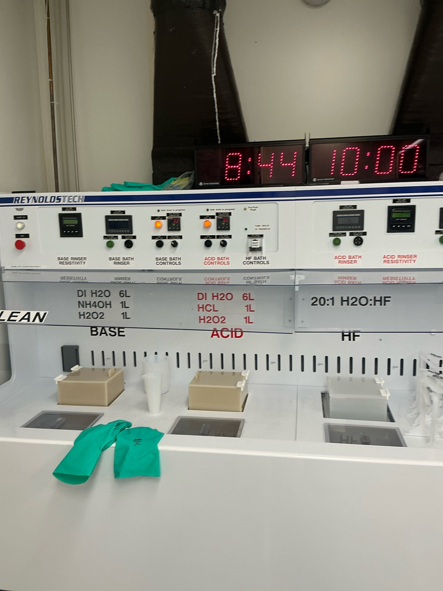
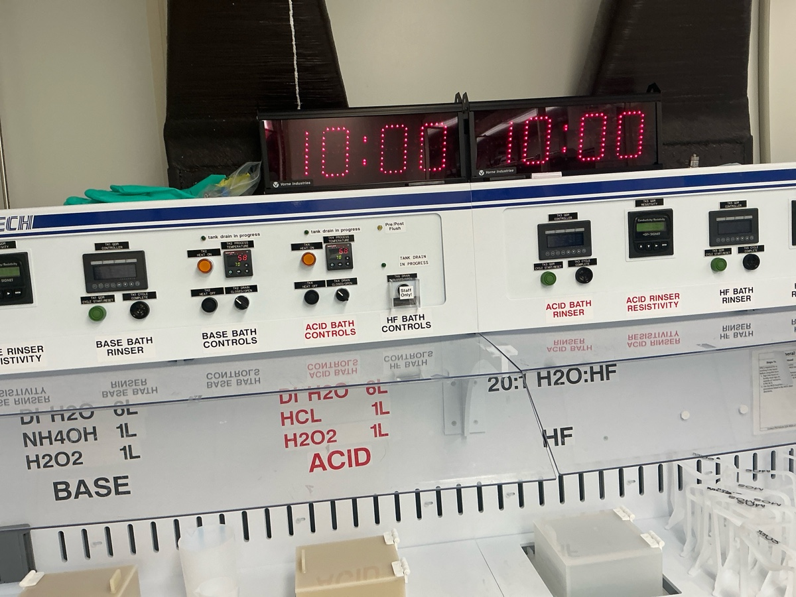
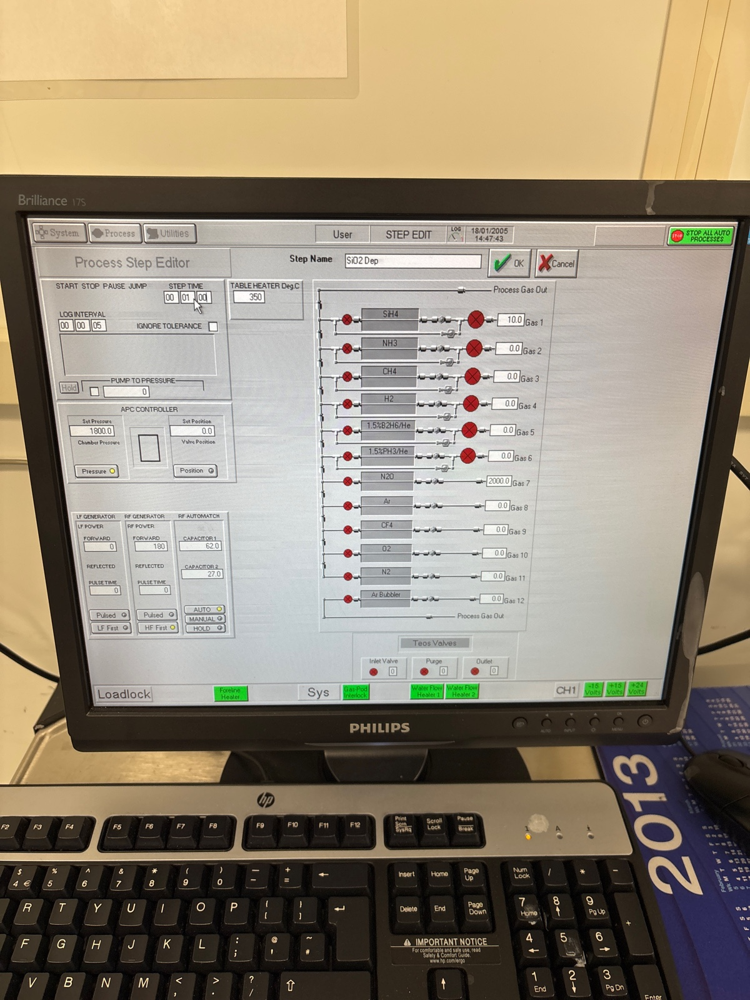

# 2025-06-11 fabrication of tapered waveguides
While we have shown super linear scaling over large distances, we seem to be struggling with sub-optimal scaling (closer to linear instead of quadratic) for the ending regions of our waveguides.  This makes Ryo and I suspect that there is some multi-modeness issue causing the SHG signal to couple to higher order spatial modes at bends.  Because different modes don’t interfere, we will get suboptimal scaling.  Below is the newly designed GDS file that I want to use

[Pad6_Pass4_negative_final.gds](https://resv2.craft.do/user/full/c10b6666-b4fd-53a0-9177-1696a144b2d8/doc/B16CDCC7-668F-4E65-8CDB-EA3E4F8A3D3E/BDF390B4-A58D-4D05-9BA3-0E59A122C7F5_2/AZN0HE6yWicokidN0SBzkPvoflEH13xww0B0SrqHj8Ez/Pad6_Pass4_negative_final.gds)

In this file, we taper things from 6 → 2 or 6 → 3 um wide bends, with differnet poling distances

# Preparing wafers

We received a new batch of wafers from SVM. They have 2 um PECVD SiN on 1 um of thermal oxide. The substrate is conductive Si.

15:15 RCA cleaning them.

We process 4 of these wafers,

# Pecvd

Before season

## Main run 1 for 500 nm

We do 3 mins of smooth oxide deposition.

This should give us roughly 500 nm of SiO2.

16:02 Finished.

16:05 Finished.

## Main run 2 for 500 nm

16:14 Finished.

Venting.

## Cleaning 10 mins

## Seasoning 

We do 2 mins of seasoning.

Made a mistake of running this without setting the time. We jump through.

## Main run 3 for 1.5 um of oxide

9 mins smooth oxide.

Starting now.

17:01 Finished.

Finishes.

## Cleaning

17:03 Starting.

## Seasoning　

[`Ben Ash`](craftdocs://users?id=d9d2fbda-3d0b-154c-637c-be9f41830cae) run the seasoning

## Main run 4 for 1.5 um oxide

We use this wafer. The other processed wafer has been moved to the ASML step [2025-05-23 Oxide Hard Mask Testing](craftdocs://open?blockId=122F1589-6CC0-4921-B10C-DEEA9900CD36&spaceId=c10b6666-b4fd-53a0-9177-1696a144b2d8)

9 mins smooth oxide

17:41 Finished.

## Cleaning

We do 20 mins cleaning.

### AJA

Sputter recipe

Pressure at load

During first wafer

Pressure at load for 2

During second wafer

### Lithography

Our recipe

We use 1805

During 90 bake for 1 min

New nominal focus. Still use 53 as dose

Development

We use recipe 4

# Oxford 82 for descum

Venting the chamber 

We realized that no Cr etch is left. We call it a day. We will need to run descum and Cr etch tomorrow.

The next day, we resume where we left off.  I am running 10 min preclea of the 100

We will descum for 1:30

Before season for 4 mins on 100

We then do the full etch for 7 mins

Took 2 mins to Cr etch 

During etch

I forgot to remove edge bead, so we are going to do a quick clean clean before acid etching

Some gunk on wafer

we now do Cr etch for 20 mins and BOE dip for 20 seconds

After

Waveguides look un effected by dust. Probably just water or edge bead issues

### Oxide Capping

We first cleanf or 10 mins.  We do oxide deposition for 9 and 8 mins

Before season 1

Before dep 1

Before dep 2

We do 8 mins smooth oxide dep

Cleaning 10 mins

### Oxide Thinning

We now do season of the 100 for two mins (I left it clean).  We then etch for 13.5 minutes like last time.

Before seasoning

Edges are comically dirty

We now do 13.5 mins of etching

During etch

After

This is less than I expected. We should have around 2000, though I am going to check the sides now

No idea why the middle had so little. Mate we should put like 2 mins of smooth on again

Another central spot

We, def less. We probably over etched a bit. Either way, we can at least do RTA

During calibration

During main run

# PECVD

We add some extra oxide. We do 2.5 mins of smooth oxide.

## Oxide dep 

After cleaning.

14:52 Starting.

## Cleaning

We do 5 mins cleaning.

Starting

## Seasoning

15:14 Seasoning start.

## SRN deposition

32 mins starting now.

16:01 Venting

## Cleaning 40 mins

After PVD

