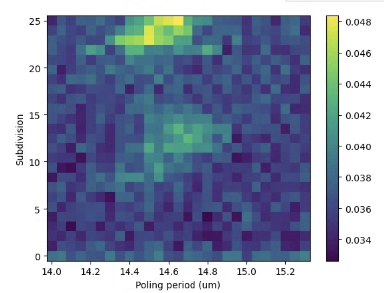
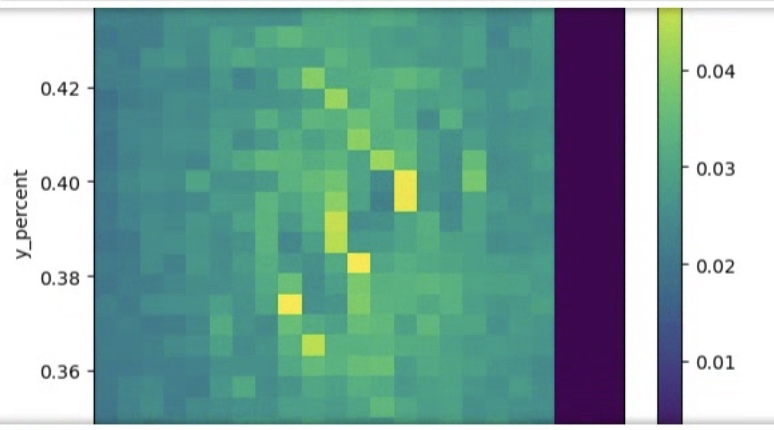
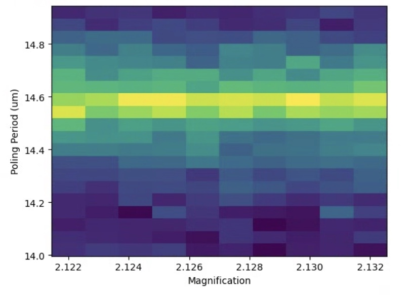

# 2025-06-14 tapered spiral test for quadratic scaling
When testing previous spirals, we found that the quadratic scaling seems to stall half way through.  Our suspiscion is that this is caused by multi-modeness in the middle of the waveguide in the second harmonic.  If that is the case, we need to have a more narrow waveguide in the middle to prevent this.  We recently fabricated (using the MLA and a Cr hard mask) such a wafer.  We put 2um of SRN ontop.  We now test said waveguide to see what we can get

Below is a theta division scan

We use the pulsed laser with no filter.  I admit, this is not a tonne of power.  Lets decrease the number of divisions (as this is 2 turns afterall).  This waveguide is a bit tough, as we don’t see a tonne of signal.  A bit hard to say if this is because the low voltage, thin SRN, or something else.  We are currently using 2.5 V, but we might want to make it 3 soon.  Half the issue is each subdivision is rather short.

I would like to try my best to make these waveguides work before we spend lots of money on a new mask (which cost $600 for DWL2000, mask, and holder).

The centering and scaling were hard, as we did not get a lot of signal.  The best we got was below

These are not great, I admit.  Below is our rescan.  My best hope is EDFA and strong interference can help bail me out later 

A bit more signal at least.  Lets switch to CW and continue.

So it seems that the first section of poling did not work. There are a few options:

1. We did not couple correctly 
2. Maybe this specific waveguide is broken
3. We don’t have enough SRN
4. The new SVM nitride just does not work

I feel like 1 is the easiest to test, though I am not super confident.  We did send the pulsed laser in and did not feel there was much room to improve.  2 is a bit hazy, but again, it would not be terribly hard to test.  While 3 is a solid explaination, our first devices had 3 V (this one has 6) and 3 um of SRN.  Its hard to see how that worked and this does not.  4 is nearly impossibly to diagnose.  It is also a bit scary, as we have never tried to pole in-house stuff (so it is unclear if we even have a good replacement).  I don’t think loss is the issue, as we are still getting mW out of the spirals.  While we don’t get as much as the ASML oxide hard mask waveguides, we still get ~60% as much.

Lets first check coupling, and we will then move onto a new waveguide.  We can also up the voltage and just break this one.

Quick loss test on the bottom waveguide

Edfa 10 X main setup

Straight 1

3.8 mW

Straight 2

3.4 mW

Straight 3

5.2 mW

Euler spiral

63 uW

Circle medium

200 uW

Die 2

Straight 1

4.3 mW

Staight 2

5 mW

Straight 3

4.5 mW

Euler spiral

12 uW

Medium circle

0.5 mW

Top waveguide

Die 1

Straight 1

0.7 mW

Straight 2

1 mW

Straight 3

0.3 mW

Straight 4

4.1 mW

Straight 5

4.7 mW

Straight 6

4 mW

Euler spiral

100 uW

Medium circle

4 uW

Die 2

Medium circle 

11 uW

Euler spiral

nW scale

Die 3

Bottom was taper width of 3 and shorter taper length (200 um).

Top has taper width of 2 um and shorter length (200 um).