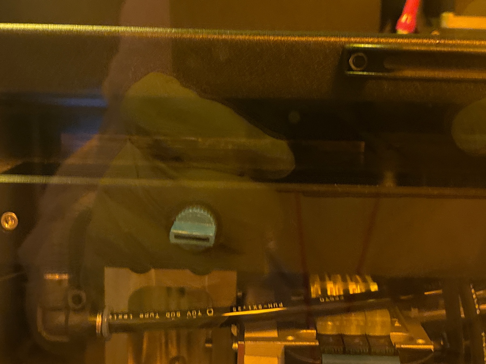
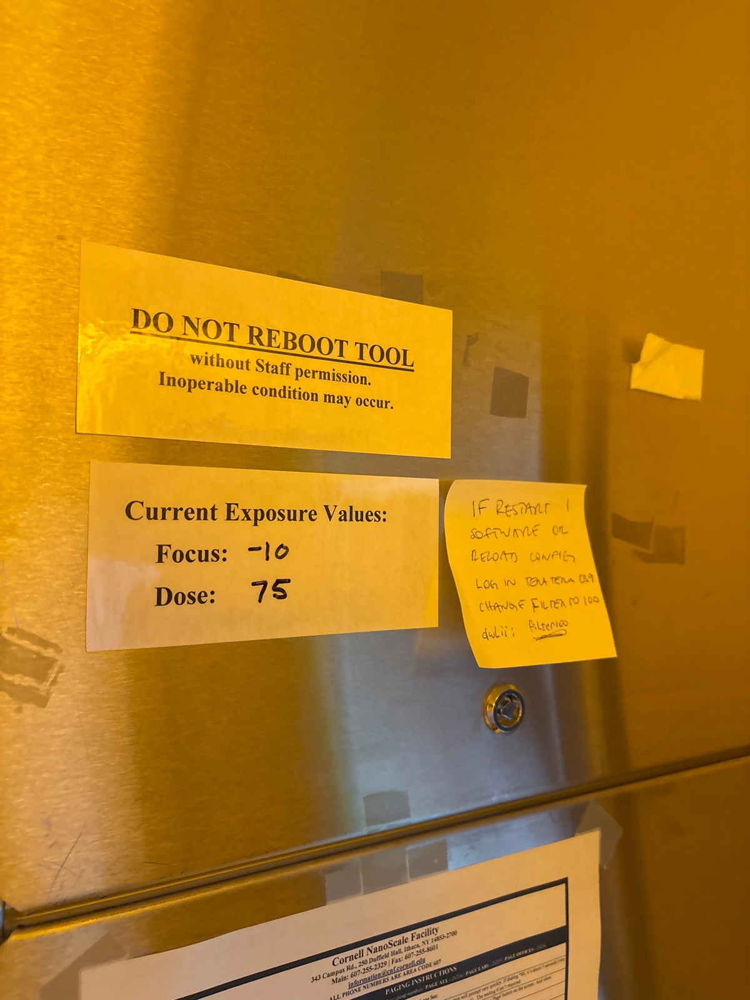
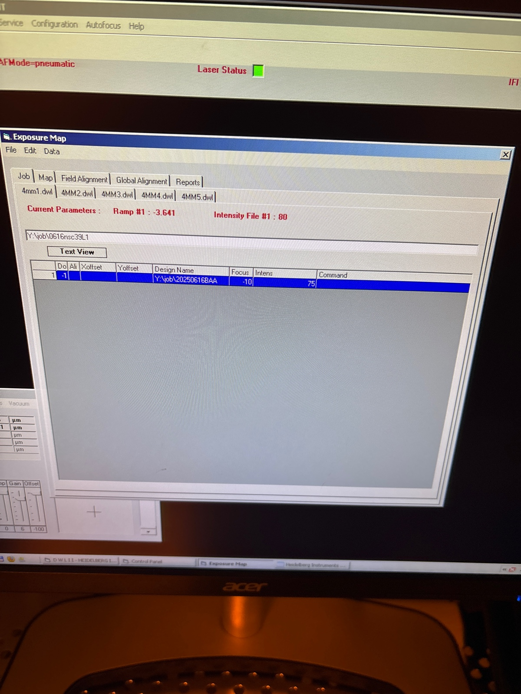
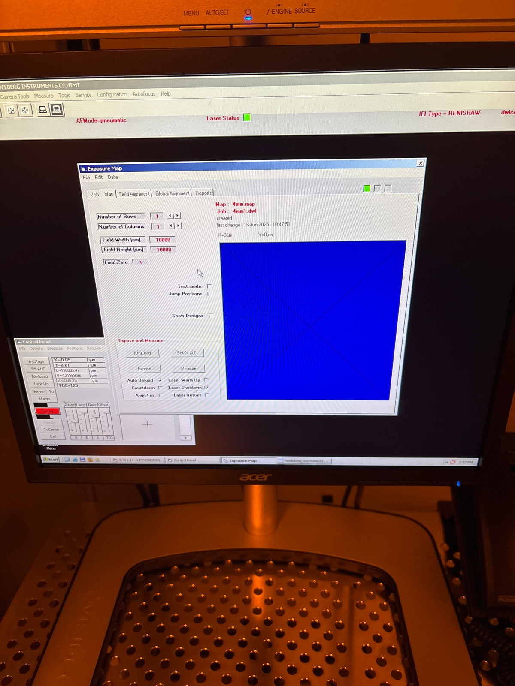

# 2025-06-16 second asml fabrication for tapered loss measurement
We previously tried to fabricate tapered waveguides using the MLA.  In addition to the mistake of not removing the edge bead, we seem to see very high loss.  We know the staright sections have the same transmission as the ASML (they should be almost uneffected by roughness because of the way that the MLA writes).  So the high level of increased loss is really only an issue because of the taper.  We roughly suspect that the sidewall roguhness is very high (or there are stitching errors).  Because the tapered region is very small, the waveguide mode can really feel these effects.  So we are going to make a new ASML mask for tapered spirals (attached GDS below), and fabricate new waveguides using oxide hard mask to test loss.  I am using oxide hard mask primarily because the recipe is not perfected yet in terms of final oxide thickness, but we know it shold give very good loss (from measurement on previous ASML devices using the older mask).  

[ASML2_Pass1_Negative_Final.gds](https://resv2.craft.do/user/full/c10b6666-b4fd-53a0-9177-1696a144b2d8/doc/28A12122-DB8C-4E6F-9774-C520338398A5/AD55F93C-1A5F-44DF-BAC6-8F75D5B527CB_2/N9Lt3ooYVxW7QAEOzCAIMkYYCAXK141lNlJOb8mgqoMz/ASML2_Pass1_Negative_Final.gds)

On the mask, we designed a couple of features.  Firstly, we have a default bottom alignment region which we will stitch to other top regions.  The dies are roughly the same size, but we should make sure to extend the bottom one a bit to make it line up as I want (as I want plenty of cleaving distance).  My main worry is about stress explosions as this point, so I really want to expose most of the wafer if possible.

We expect the 3um tapered region to work best (refer to simulat overlap integral results below).

We also have some longer waveguides at 2um in case they work, but these are a bit optional by comparison.  We have everywhere roughly 3 mm of taper region on the spirals.  We have some adiabatic waveguides at the bottom that very from the widths we use, so hopefully these will reveal if there are any issues with taper loss.  We also have a non-tapered euler spiral at the bottom for alignment.  

### DWL 2000

Before exposure

During exposure 

Before developing the resist 

Before etching Cr

Run dry rinse and mask is ready

### ASML job

Die distribution

Image definitions (I made the bottom a bit big, which is fine, as there will still be Cr to cover up)

Layout

### Photolithography

We are going to use the hard mask recipe.  We found last time that there was a lot of resist left over.  So we are going to use the 600 nm resist recipe instead of the 800 nm resist recipe

Before arc on hard mask

Before photoresist

We read the mask

New edge clear recipe

During edge clear

Before main run

During

Before developing 

### Etching

We run 5 min pre clean on 82 and 10 min pre clean on 100

We run 1:20 descum

1 min season

We will still do 9:30 min etch so none of the polymer hits the oxide. I still see a small amount of arc left, so I am going to do 25 more seconds descum

We also setup the job slightly wrong, as there is no continuity between straight regions

the extra 25 seconds did not get rid of the faint streaks of arc.  I think we had a bad coating or something.  We can insepct more after the etch and see how bad it is.  My worry is this will add a scattering site.

During oxide etch

We still have stability issues during etch. Should do closer inspection. Our He flow is also very high.

We run a 12 min post clean

Ellipsometery 

Microscope 

Effect of remaining arc

2um

3um

we run 3 min SiNx etch season

we now do 6 min SiNx clean

Before etch

During etch

After

### RTA

Calibration

During run

While we normally put oxide cap on first before annealing, we have annealed shortly after etching in the past with no loss issues.  The PECVD is down right now, so that is why I am skipping that step.  I worry if I let things sit for too long, dust might collect.  When it comes to arc issues, lots of dies in the middle are ok.  We probably have issues with 20-30%

After

The bottom ones are a bit annoyed by the arc issue, but there are definitely enough for a loss measurement.

### Loss test

Edfa 10x 1570

Straight 1

3.5 mW

Straight 2

3 mW 

Straight 3

3.3 mW

Slow wide adiabatic 

1.2 mw

fast wide adiabatic

very small

slow narrow adiabtic

0.2 mW

fast narrow adiabatic

3 uW

Keep in mind the above numbers could be due to unfortunate cleaving positions

Small Circle

0.3 mW

Large Circle and Euler Spiral could not be found

Die 2 (3um)

Euler Spiral

360 uw

Straight 1

3.2 mW

Straight 2
3 mw

Straight 3

2.8 mW

Wide Slow Adiabatic

0.8 mW

Wide Fast Adiabatic

0.85 mW

Narrow Slow Adiabatic

150 uW

Narrow Fast Adiabtic

110 uW

Short Circle

200 uW

Long Circle

44 uW

This is indicative of some higher propagation loss in the 6um wide region

2um (completed with 4X objective, so powers should be ~4x larger)

Straight 1

1 mW

Straight 2

1.2 mW

Straight 3

0.9 mW

Wide slow adiabatic

0.6 mW

Wide fast adiabatic

0.3 mW

Narrow slow adiabtic

160 uw

Narrow fast adbiabtic

80 uW (328 with 10X)

We are now using 10X

Euler

750 uW

Short Circle

# SEM

