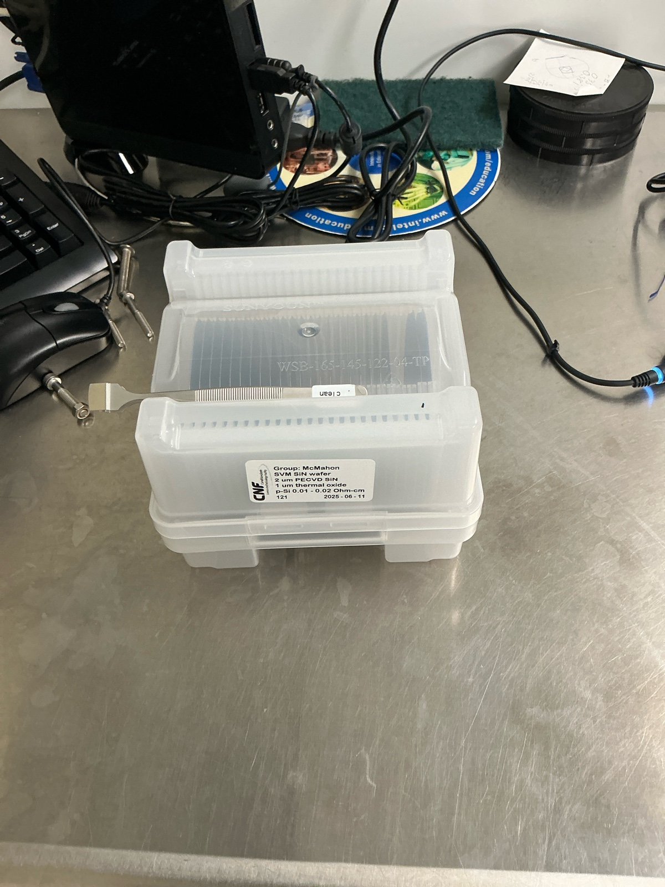
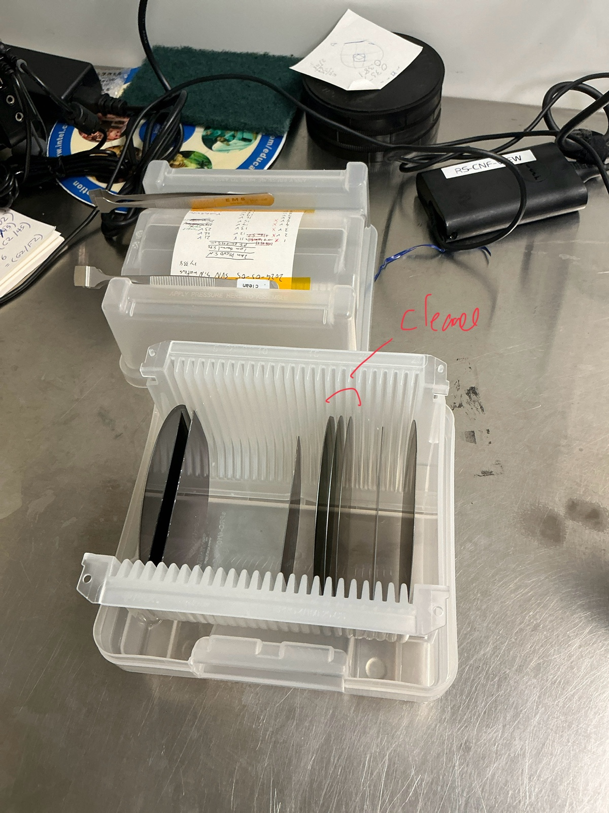
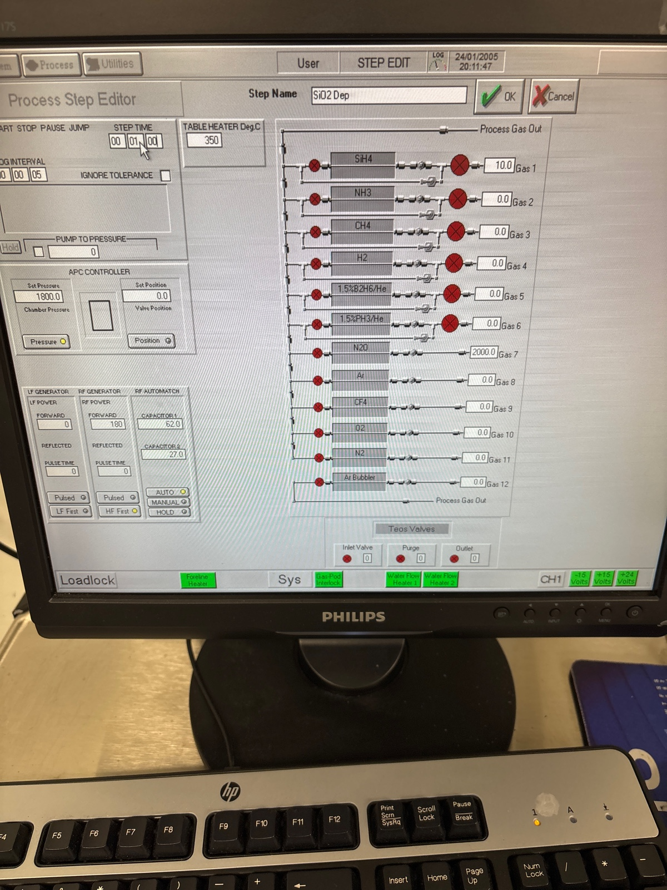

# 2025-06-17 retake asml for tapered waveguide loss using asml
[`Tue, Jun 17`](day://2025.06.17)

We previously tried to fabricate waveguides using low-loss ASML waveguides.  We seem to have failed.  The two reasons we guess is because there were issues with the ARC resist and we did not oxide cap before RTA.  We suspect this left a lot of dirt on our wafer.

We run RCA cleaning of SVM wafers

We use 3 of them

Started RCA cleaning 13:13

15:56 Running HF dip. 15 seconds.

We do another 15 second dip 3 hrs later

### PECVD

We do a 5 min pre clean and a 1 minute season.  For our oxide, we do 9 minutes

Before season

Before dep 1

Before season 2

Before dep 2

Before season 3

Before dep 3

### Photolithography

Before arc

Before photoresist

We read the mask

Before edge clear

During edge clear

Before explore

During exposure 

Before developing 

### Etching

We run 5 min clean on 81 and 5 min on 100

While I don’t see any issues with arc, I will descum for 1:30 to be safe

1 min season on 100

We will still do 9:30 etch, as I like that it leave a bit of oxide leftover

During

He flow is rather high on wafer backing

We run a 12 min post clean

Ellipsometery 

Nicely repeatable

Resist looks a bit rough.  Another important comment is, if this roughness is transferred to the oxide, the oxide capping should smoothen it out a bit.  This could have been part of the problem the other day

I am still decently sure this is resist. We will see resist after nitride etch. Maybe thicker resist was better

Before nitride season

We now do 6 min nitride etch.  We will see if roughness is gone after

During

After

In truth, I have no idea how much justice these images do to my stuff.  Eiuther way, I will do an 11 minute oxide cap on top. The end dimensions of our waveguide are not crazy, so I am a bit surprised we are having these issues

### Pecvd

We do 10 min pre clean

Before 1 min season

We will do an 11 minute cap

At the very least I hope the euler spiral ends up being good.  If that is the case, we have some sanity check on-chip.

### RTA

Calibration

During main

### Loss test

Main setup, 1570, 10x 90 mW in

Hard mask straight 1

6 mW

3 um no RTA

Straight 1

1.2 mW

Straight 2

1.2 mW

Straight 3

1.3 mW

Euler

17 uW

Middle region

2 mW

Short circle

3.5 uW

Long circle

Too low

3 um RTA

Straight 1

1 mW

Straight 2

1.3 mW

Straight 3

1.2 mW

Euler

19 uW

Middle

4 mW

Short circle

Could not find

