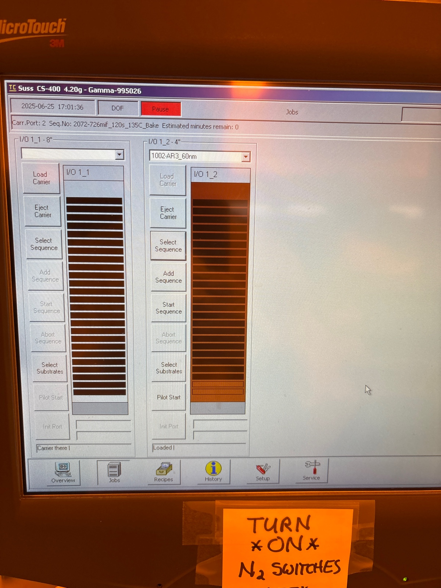
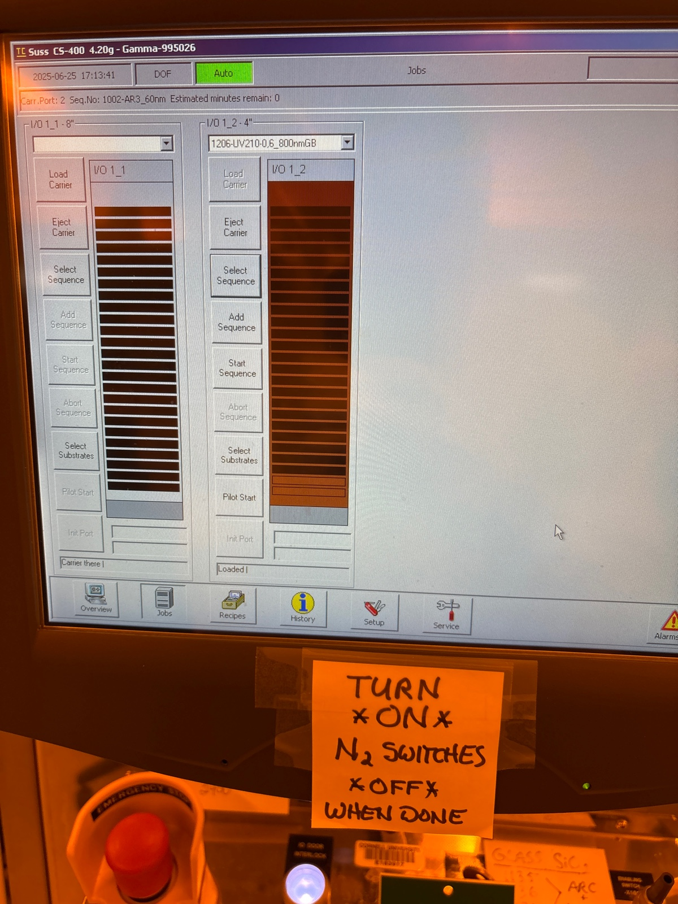
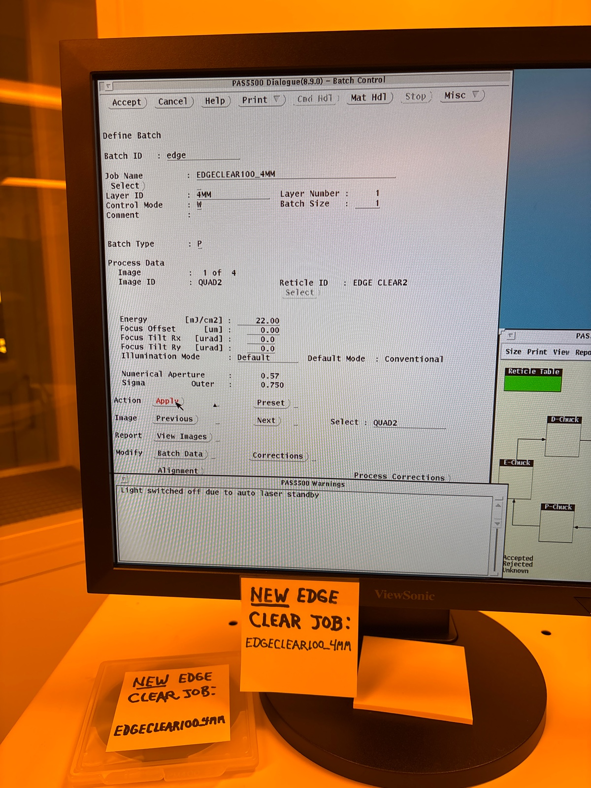

# 2025-06-25 further baseline loss test for tapered and origonal pattern
We are still having issues with Loss in the tapered waveguides.  The losses are still a couple of dB/cm, far higher than the 0.5 dB/cm we expect.  We are going to try to exactly replicate our previously working oxide hard mask on the new SVM wafers that gave us 0.5 dB/cm.  If this does not work, I am biased towards either blaming the tools in the CNF, or simply say this new SVM is just bad.  I really don’t have a great reason to suspect this is going to work, but hey, we did it before, and nanofab should be reproducible.  We can add some eco clean and piranha steps if we want, but that should not make a huge difference (it should theoretically only help). 

The hope from this baseline is that it would somehow help us to understand whether one of the tools is broken, and hopefully give us a baseline understanding of the SVM loss, as we could not simply use the longer spirals as a more reliable baseline.  Maybe we could at least compare spiral losses on the two wafers to see how bad the taper is.

### Photolihography of baseline wafer

Before arc

Before resist

Before edge clear

During edge clear

Before main run (using exact same recipe as before)

I adjusted both doses. They did not start out the same, so past device might have different waveguide widths for medium and long

During run

Before developing

Images of tapered mask

### Etching

We do a 5 min preclean of 82 and 100.  We only need to descum one wafer.  WE spinly spin dried the other

Before seasoning oxide of 1

1:20 descum

We now do 9.5 minute etch

During

We will do eco and piranha clean

We do 11 min clean on 100

We do 2 min strip on eco clean

Seems to be going

During piranha

After

Spot on etch, and the numbers check out 

Everything looks very clean.  I have not noticed any issues with these oxide etches either

Before second oxide etch

During

We run ecoclean again

During second piranha clean

Let’s do 2 minute season for nitride etch

We do a 6 minute etch on the tapered wafer

During etch

Given the amount of O2 flow and the fact that we did not clean there last time, I am good going straight to the cap.  I will take images beforehand.  I will clean chamber for 6 minute

After

2 min season for the next wafer

Before second etch

During etch

Inspection after etch

### PECVD

We start a 10 minute pre clean

Before first season

Before dep

We now do an 8 minute clean. Hopefully these will end around the same time

Before second season

Before second dep

### RTA

Calibration

Before main

During

### Loss test

We use edfa 10x main setup at 1570. Input power is 76 mW

Normal RTA die 2

Straight 1

5.9 mW

Straight 2

6.7 mW

Straight 3

5.3 mW

Straight 4

5.2 mW

Straight 5

5.3 mW

Large circle

2.3 mW

Large square

2 mW

Medium square

0.7 mW (weird output shape)

Medium circle

Could not find (might have cleave by accident)

Got a bit dangerously close to the edge on the previous chip

Die 2 of normal RTA

Straight 1 

6.5 mW

Straight 2

5.6 mW

Straight 3

6.7 mW

Straight 4

5.2 mW

Medium square

2.8 mW

Medium circle

2.5 mW

Large circle

2.4 mW

Large square

Could not find

Tapered 3 um RTA

Straight 1

6.3 mW

Straight 2

4.5 mW

Straight 3

7 mW

Straight 4

5.3 mW

Euler

3.2 mW

Short circle

2.7 mW

Long circle

2.1 mW

Die 2

Straight 1

5.5 mW

Straight 2

5.1 mW

Straight 3

5.1 mW

Long wide adiabatic

4.9 mW

Short wide adiabatic 

4.1 mW

Long narrow adiabatic

2 mW

Short narrow adiabatic 

2.6 mW

Euler

3.4 mW

Short circle

3 mW

Long circle

2.3 mW

Tapered 2um RTA

Straight 1

6.5 mW

Straight 2

5.7 mW

Straight 3

5.4 mW

Straight 4

6.4 mW

Euler

3.3 mW

Long wide adiabatic

4.8 mW

Short wide adiabatic

5.6 mW

Long narrow adiabatic

4.6 mW

Short narrow adiabatic

Low

Short Circle

2.2 mW

Long circle

1 mW 

Die 2 (use middle one)

Straight 1

5.8 mW

Straight 2

5 mW

Straight 3

5.8 mW

Straight 4

4.8 mW

Long wide adiabatic

4.4 mW

Short wide adiabatic

5 mW

Long narrow adiabatic

4.3 mW

Short narrow adiabatic

4.8 mW

Euler

2.8 mW

Short circle

2.8 mW

Long circle

1 mW

Below are the results.  We are going to use the circular spirals to calculate the loss.  I am going to do the brute force calculation of the euler and adiabatic waveguide averages to get a sense of the variability there

Average Euler:
(2.8 + 3.3 + 3.4 + 3.2) / 4 = 3.2 mW.  Fairly consistent across waveguides, where the difference can be a bad job on my end of bad cleaving

Average Long Wide adiabatic

(4.4 + 4.8 + 4.9) / 3 = 4.7 mW

Average Short Wide adiabatic

(5 + 5.6 + 4.1) / 3 = 4.9 mW

Average Long Narrow adiabatic

(4.3 + 4.6 + 2) / 3 = 3.6 mW

Average Short Narrow adiabatic

(4.8 + 2.6) / 2 = 3.7 mW

While there are not perfect calculations, the rough guess is that the width of the waveguide matters a lot more than the period of the taper (at least at the moment).  So we can make the tapered regions a bit shorter.

Now lets calculate the loss of each of the structures:

Normal RTA

I just used the straight and long circle from both waveguide dies I tested

Tapered 3um using normal calculation

Roughly in agreement, so we know the 3um taper using this exposure process is roughly lossless

Tapered 2um using normal calculation

This case is a bit more tricky, as we do notice an increase (by quite a bit) for the loss from straight to spiral.  We see it a bit with 3um, but not as much.  Anyway, the key here is that we can now see the effect (which is decently substantial), from the taper.  With our lithography proceedure, we still expect that we have 2-2.5 um wide waveguide.  This is not that narrow, so I am not the happiest about this.  Lets try to redo the tapered calculations using the baseline loss from the 1 → 2 (which can treat the taper as some normal insertion loss).  We can guess the tapered region as roughly normal.

Using revised calculation method:

3um taper

2um taper

The taper length is probably causing a slight over estimate, as I am counting the full length of the tapered region plus the middle narrow region.  It is a lower bound for the loss in the narrow region, but it gives the useful impression.  It is nice to see that the losses for the linear regions are all incely in alignment.  It is also good that the 3um is roughly not noticing the narrowness.  But the 2um wide waveguides (which are in reality between 2 and 2.5 um because I am slightly underexposing).  