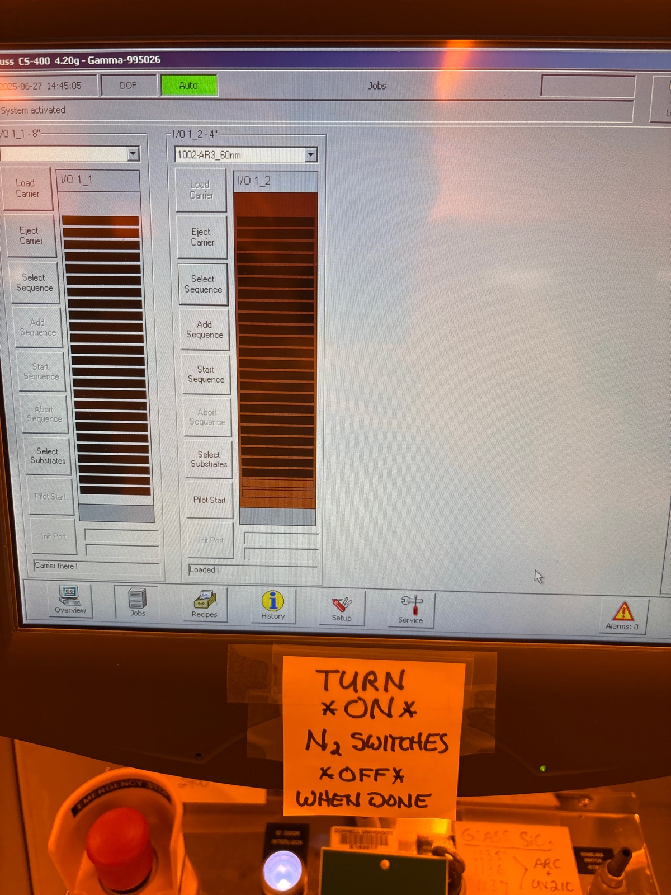
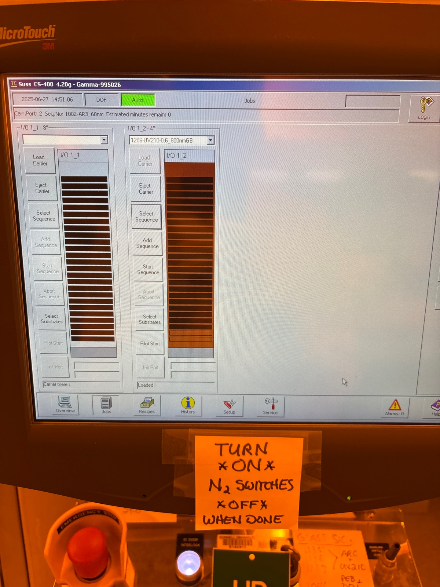
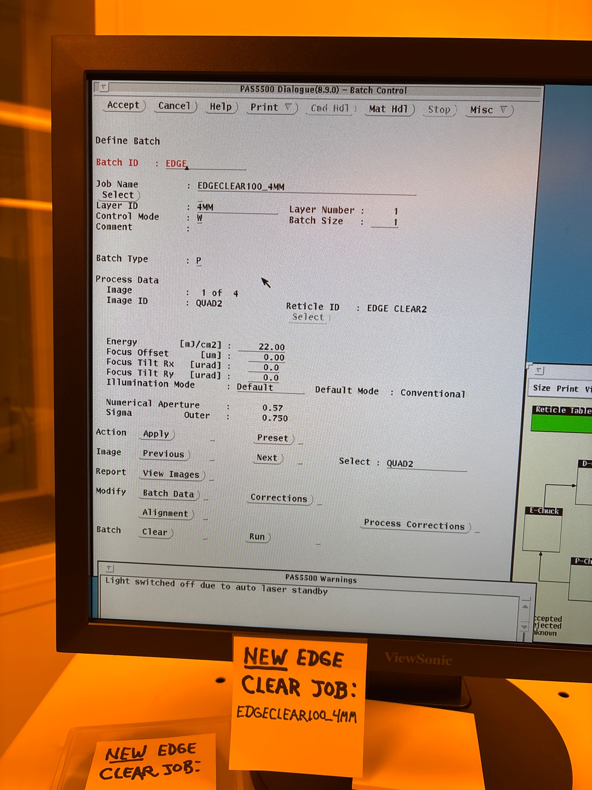

# 2025-06-27 stripping oxide hard mask
We seem to have confirmed that we can make low-loss waveguides using oxide hard mask on tapered structures.  The goal now is to see whether we can strip the oxide hard mask off at the end (or at least make the structure look pretty).  The main concern is that our structures seem to have this annoying mushroom shape, and this does not look nice when we are trying to do capping.  We will try to do a BOE dip in this study and see what effect it has.  Below is the fab proeedure:

1. 800 nm of DUV reist and exposure with the tapered structures with 20 mJ of power.  I am not sure exactly what the feature size is here
2. After development, descum for 1:20.
3. We know we etch ~1400 nm of oxide in 9.5 mins.  This means we etch oxide at 148 nm/min.  We want to etch through 900 nm of oxide, so we etch for 6 minutes.  
4. We run Piranha and eco clean
5. We etch the nitride for 5:15 minutes, as we really would prefer to not over etch much.  
6. We dip in BOE for 1 minute (cleave wafer up here too so we can see wht happens after several different dips

We will take SEM images after to see what we get

### Photolithography

Before arc

Before resist

Before Edge Clear

During

Before main pattern

Changed all doses to 20

During

Before developing 

### Etching

We preclean 81 and 100 for 5 mins. We then do a 1:20 descum on 81 and a 1 min season on the 100

Before oxide season

Before descum

If the SiNx etch gets rid of 700 nm of oxide in 6 mins, it etches oxide at 116 nm/min.  We then know it etches SiNx at ~ 500 nm/min.  Ie, pretty fast.  Again, this is a bit guessy, so I still say we stick wtih 5:30 - 5 min etch just to be safe.

Before oxide etch

During oxide etch

We now run an 8 minute clean.

Now, 5 mins on EcoClean

During

Before piranha

Before nitride season

After piranha

Ellipsometer was taken, but I am assuming I had some resist left.  I don’t think I over etched.  Lets do 5:15 SiNx etch

Before

During

After

 

Ellipsometery 

Profilometer

Another piece

This piece was more from the edge, so there could be some etch difference. Still, it is tough to tell whether I have much oxide left

Another center piece

After 1 min BOE

The rough conclusion here is we did not have enough top oxide. It seems, as best, we had 100 ish nm left. This is probably why we could not see it in SEM. Or the BOE did not really remove the oxide. Let’s leave a chip in BOE for 10 mins and see what we get

I don’t think 1 minute of BOE did much is the conclusion. I don’t think we lacked for oxide, as ellipsometry and the Profilometer numbers could not agree if that were the case

After 10 mins

To be honest, I can’t really say I have learned much so far.  The things I know or have issues with are below:

1. It seems that nitride does not etch very fast.  If we trust Aaron and Yongqi’s numbers that oxide etches at ~130 nm/min, then we expect that SiN etches at ~20 nm/min.  This could still cause roughness, but we can say over a minute that very little changes
2. We notice very little difference between 1 min BOE and no BOE.  One challenge of this measurement is it was done on different chips, so there might have been some difference in etch depth as a function of position.  That being said, if we truly had 100 nm of oxide left, I feel like we should notice some difference in profilometer
3. From the ellipsometer and profilometer results, I am rather confident we have ~100 nm of SiN (as the ellipsometer could not fit without it).  Profilometer is a direct measurement, so I would suspect we do have ~2100 nm of height after SiNx etch.  So the tough thing is that we expect 200 nm of oxide, but can’t detect it yet
4. SEM images were inconclusive.  They were taken from different parts of the wafer, so the height measurement might not be useful.  I was not able to see any top cap, but at 100 nm thick, it might be hard to get a strong contrast.
5. The only thing I saw in the SEM is a small lip that might indicate an oxide.
6. We over exposed, causing our waveguides to be 1 um narrower than spec

I think the next best thing to do is take one chip, and do all the measurements (aside from SEM) after 30 second BOE dips.  This would allow me to easily detect any changes.  If I don’t notice anything after this, we might want to fabricate a new wafer with a slightly thicker top oxide.

Before etching 

After 30 seconds

After 1 minute

After 1.5 minute

After 2 minute

Results

Below are SEM images

No BOE

1 min BOE

Waveguides are also ~1um too narrow.  Below are some next steps before we do final SRN3 fabrications:

1. Check dose.  It seems that 22 gives us a 1000 nm too narrow (though this was 500 nm in the past). Lets do something that is a dose of 16-17.  I don’t mind a bit thinner, but not too much thinner.  We can also adjust the dose size for the thin and thick waveguides.
2. Check loss with and without BOE strip just to check that everything is ok.  Cap in the meantime as well and take SEM images just to check all the geometry looks normal
3. Try etching on SVM wafer with slightly thicker oxide just to make sure

I generally feel like 3 is probably a waste.  I am fairly confident I can do that, and ultimately nothing will tell me the exact recipe I should use on SRN 3 to get the exact depths I want.  I have a pretty good intuition in my opinion.  I think 2 is the most important.  It is a bit of a bummer that the wafer is no longer full, as it might be a bit tough to clean.  Acetone and IPA are fine, but not really enough in my opinion.  

