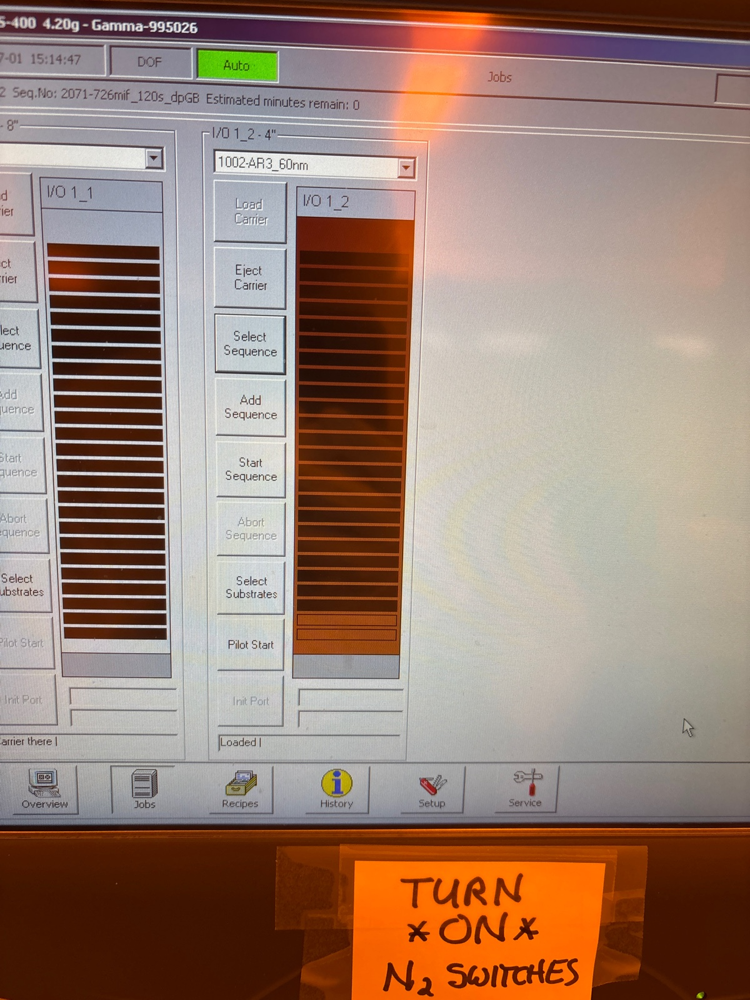

# 2025-07-01 svm final tapered waveguide full fabrication
We already know how to make low-loss SVM waveguides with teh taper.  So we will just follow that fabrication procedure.  Below are the steps (we already have hard mask coating)

1. Use ARC and thick resist on gamma.  Expose on ASML using slightly lower dose of 18
2. Descum for 1:20 on 82
3. Etch for 6 mins using oxide etch on 100.  Pre clean for 5-10 mins and season for 1 minute
4. 5 mins eco clean + piranha
5. clean 100 for 8 mins, season nitride etch for 2 mins, and etch for 5:15 mins
6. Use piranha, then BOE for 45 seconds.  You can do another piranha after
7. cap with 9+8 smooth oxide, and thin
8. cleave, then RTA at 800 C for 5 mins
9. SRN8 photoconductor deposition

### Photolithography

Before arc

Before resist

Before edge

During exposure

Before main

Changed all doses to 18

Before developing

### Etching

We start 10 minute clean on 100 and 5 min on 82

Before descum

Before 100 oxide season

Now lets do 6 minute oxide etch

During

We now run a 10 minute clean

After

During eco clean

Before season for nitride

During

Before piranha

Before nitride etch

During

We run 10 minute clean

After

We roughly seem to have cleared nitride.

Now 30-40 second BOE

Before second piranha clean

After

### Top oxide

Before first season

During

Before first

During

Before second season

Before second dep

During

I run a 5 minute pre clean on the 100

After capping

We suspect that we started with ~1000 nm, and nothing ontop because of BOE strip.  We therefore want to etch ~1600 nm to get the right thickness.  Using the CHF3/O2 recipe, we expect to etch at roughly 160 nm/min.  This means we want to etch for roughly 10 minutes

Before seasoning

During

Before main

During

15 minute post clean

After

Almost spot on.

We do a quick piranha clean for good measure

Calibration of RTA

Before

Because of outgassing explosions, we also did a post spin clean.  Everything looks rather clean now

### Top depositions

We start 10 minute clean 

Before season on oxide

We are going to do an additional 40 seconds of smooth oxide just to make sure we have enough cap.  We can use this as the season for the SiNx deposition.  From the past, we did 32 minute runs + 19 minute cleans to get 2um.  We season for 1 min each time (except the first, where oxide counts as the season.

Before extra cap deposition

After, we can see oxide filling up explosion hole

Before first SRN

During

We had issues with RF. Will try cleaning and seasoning again. We canceled dep 20 seconds in, so I don’t think it mattered much

Let’s do 5 minute clean and then season for 1 minute.  I guess this goes to show that oxide and nitride don’t play nice together.  In the meantime, we can do a quick ellipsometry measurement

Fit is not great, but we do seem to have more oxide. 

Before season

Still has matching issues

While the tool is being fixed, we are going to run a quick loss measurement just to make sure everything is alright

2um tapered RTA (only 1 die)

Edfa 1570 10x main setup with 81 mW in

Straight 1

6.3 mW

Straight 2

6.3 mW

Straight 3

5.9 mW

Euler

3.4 mW

Short circle

4.3 mW

Long circle

2.5 mW

We seem good

---

[`Tue, Jul 8`](day://2025.07.08)[`Ryotatsu Yanagimoto`](craftdocs://users?id=aa2c0de3-4c5f-8aaf-eaf7-3b949f6279ad) 

# PECVD for SRN deposition

## Seasoning

13:59 Starting

2 mins

Finished.

## Main 1

32 mins

14:11 Starting.

14:49 Finished.

## Cleaning 1

20 mins

14:51 Starting

15:15 Finished

## Seasoning 2

2 mins

15:17 Starting

## Main 2

32 mins

15:28 start

16:07 Finished.

## Cleaning 2

20 mins

16:09 Starting

16:33 Finished.

## Seasoning 3

2 mins

16:45 finished

## Main 3

32 mins

16:46 Starting

17:24 Finished

## Cleaning 3

45 mins

Before ITO

End of sputter

At very very end

Ellipsometery of SRN 8 witness sample

