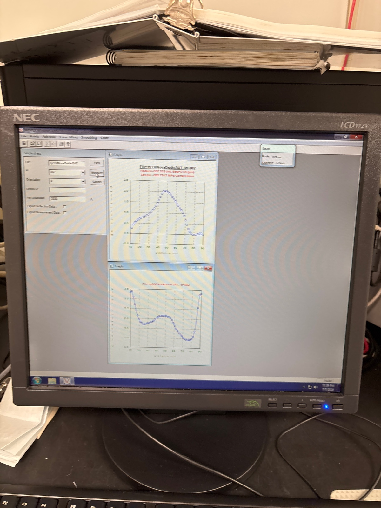
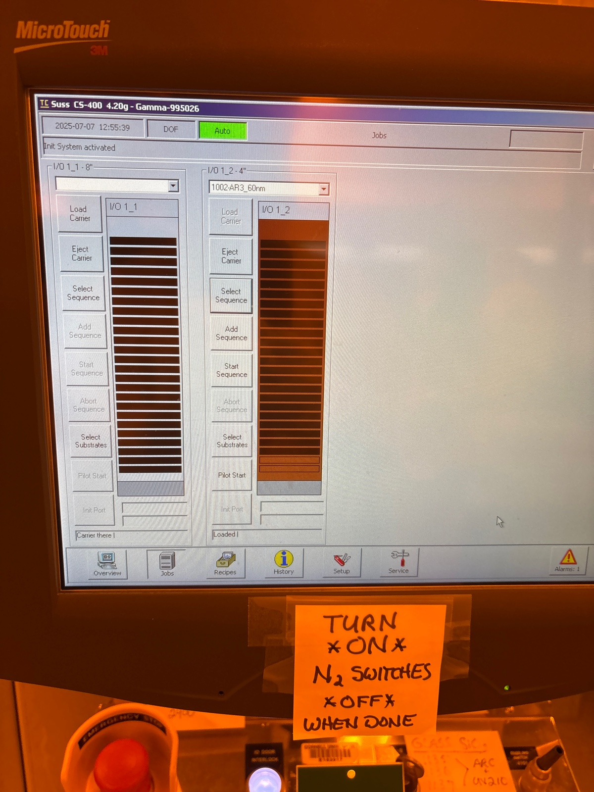
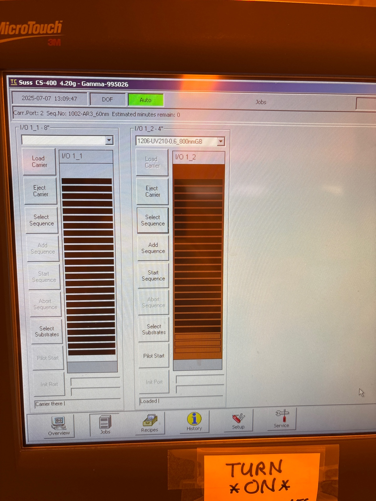

# 2025-07-07 etching and annealing 2um srn3 wafers
We failed in our previous attempt to do lithography on SRN3 wafers because the wafers had a lot of compressive bow.  We have succeeded in addressing this issue using quick 400 C RTA runs, and have two new wafers:

1. SRN3 with negligable bow
2. SRN3 with 50 um tensile bow

The second wafer might be a bit tricky to use, but in theory, at least the first should work.  We will try to fabricate waveguides at least on 1 and anneal at 1100C.  We will then test loss ot make sure this process works, and then try 1200 C.  If the lithography machines accept the wafers, we should be good to go.

Confirmation of workable stress

### Photolithography

Before ARC

Back wafer was successful 

Front wafer was also successful 

Before resist (back on top, but together)

Before edge clear

During first wafer

During second wafer

Before main run (all doses at 18)

During first wafer

During second wafer

Before development

### Etching

I started a 5 min pre clean on the 82 and a 6 minute preclean on the 100

Before 100 season

Before descum

During

Only takes 50 seconds to clear arc if we trust color

We next do 6:40 minutes of oxide etch

Before first oxide etch

During

We run 8 minute clean

After oxide etch

Before eco clean

During

Plasma is on

Before piranha

Before second 100 season

During

Before season 100

During 

I have not noticed any stability issues so far.

We now run 10 minute clean 

During second eco clean

We run piranha on second wafer

Before first nitride season

During

We are going to do 5:30 to clear nitride, just to be safe

Before first nitride etch

After

Model is a bit absurd, so we probably cleared

Before second season

Before second etch

During second etch

We now piranha clean both wafers, do 40 seconds BOE, and piranha again. After that, onto the top cap

### Top cap deposition and etching

We performed a 5 minute pre clean of the chamber

Before first season

During

We do an 9 + 8 deposition, with a 10 minute clean and reseason in the middle.  We do this for both wafers.  We then etch for 9:30 mins (or a bit less) after.  

Before dep 1

During

we now run 10 minute post clean

Before season 2

During

Before second dep

During

After

We want to go down 1.8 um

I did a 5 min pre clean on 100

Before season

During

We now etch for 9.5 mins

During

After

The waveguides themselves look beautiful, but there is a bit of a spectle around.  This is probably a product of all the etching.  This does not worry me

We run 20 min clean

Before first season on second wafer

Before first dep

During

We run 10 minute clean

Before second season

During

Before second dep

During 

Before second 100 season

Before second etch

During

After

### Annealing

We have two wafers ready for annealing.  We are definately going to anneal at 1100 C, as it is comparitively cheap to do.  We still have something to learn here.  While we have already suceeded at annealing 800 nm thick waveguides, as we have seen in the past, thicker is a new beast.  While I have good reason to believe this will work, there is no good reason not to be absolutely sure.  We will do a 4 hour anneal at 1100 C using an N2 carrier gas.  We will ramp up for 2 hours and cool over night.  While it is not strictly nessesary for us to RCA clean for this 1100 C anneal, we will to keep total consistency

If that works, we would then like to try a 1200 C anneal.  We would use the same timing just for consistency (though I would imagine that a bit longer is probably better).  Again, we will RCA before and leave it to cool over night or something like that.  I think the best use of our current wafer is to anneal one at 1100 C, cleave a small piece off, and if it works, use the rest as normal devices.  If the 1100 C wafer works, we try annealing the other at 1200 C.  If it does not work, we can use that reserve wafer with an RTA process or something like that.

### 1100 C

During RCA of 1100

Our recipe on Tymcon

We are ramping

Sometime in middle

I skip now

For cool down

At unload

After

While it may be hard to see, the wafer is very very warped

Not much loss of oxide

Under microscope

### Loss test 1100 C

Main setup edfa 10X objective 1570 input. 82 mW in. 2um die

Straight 1

6 mW

Straight 2

7.1 mW

Straight 3

6.1 mW

Straight 4

6.6 mW

Straight 5

6 mW

Euler

3.9 mW

Short circle

3.9 mW

Long circle

2.3 mW

While the narrow loss looks high, this is highly dependent on one point, which could be wrong.  Either way, I am fairly confident loss is low, though this is not much lower than SRN3.  Or, it feels like it is on the same order

### 1200 C

As RCA got started

Our recipe in tymcon, note we are using the Ar anneal like lipson

They loaded and unloaded at higher temps, and annealed for 11 hrs. This is a bit much for us 

Wafer going in

During ramp

At end

We will cool down over night

After

Ellipsometery 

Microscope

A but hard to focus because of the warp. The wafer is also shockingly reflective. Waveguides don’t seem to have cracked, which is good. Now we cleave

### 1200 loss test

Edfa main setup 1570 10X objective. 2 um taper. 83 mW input

Straight 1

6.8 mW

Straight 2

7.3 mW

Straight 3

8.3 mW

Straight 4

7.4 mW

Euler

4.3 mW

Small circle

5.5 mW

Long circle

3 mW

We effectively don’t indicate a much higher or lower loss in the bend region, but the weird thing is that we don’t seem to see much lower loss than the 1100 C chips, even though the power we are getting out is much higher.

---

# PECVD

Before PECVD, we do acetone bath

## Seasoning 1

15:06 Starting. 1 min. SRN8

## Main run 1

32 mins.

15:49 Finished.

## Cleaning 1

We do 20 mins cleaning.

## Seasoning 2

16:22 Starting

## Main run 2

16:30 Starting

17:08 Finishing

## Cleaning 2

42 mins cleaning to comply with the rule.

We keep the order of the pieces when putting in the box.

Before last season

Before last main

During

At the end of ITO

At very very end

