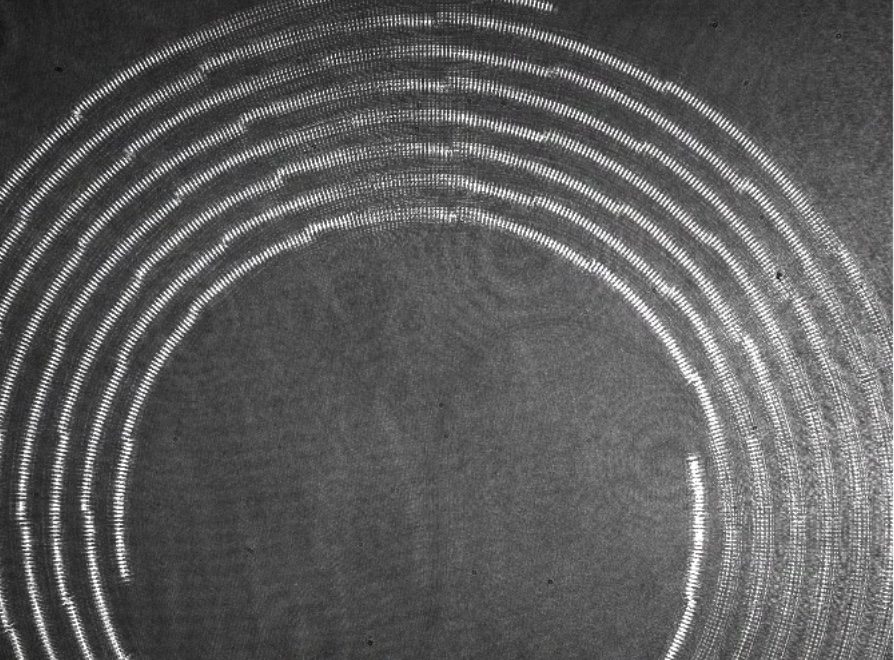

# 2025-07-15 1200 c, 8cm tapered spiral poling
We recently finished fabricating what promises to be our most interesting spiral yet.  The main advantge of this spiral is it is fairly broadband when compared to previous generations of spirals, has lower loss of ~0.3 dB/cm (because of the 1200 C annealing), and is quite long.  So this might be the closest we get to publication-quality data.  We will follow our previous preocedure of aligning the setup using the pulsed laser and then switching to CW so we can show the quadratic scaling.

Below is our flat baseline on the 8cm spiral

Camera image is clipping a bit, but this is fine

2D scan below for pulsed positioning (a future comment is we might want the cirular poling scans just to narrow down the best poling period a bit better)

This just looks and feels a bit off.  I am going to try a better alignment by hand

We are getting better, but I think the scale is a bit off.  Lets do a quick scale and poling period scan so we can lock in more there.  This should be an iterative process.  I am convinced one of these two is a bit off, as our optimized spirals are just skewing to one side.  I saw we really do this optimization process right, as we will save a lot of time later with it

Run a bit longer still.  Our poling guess was good.  We just need to see where the best mag is, and do a bit more iterating there.

Lets iterate one more time.  I would like to see if there is some point where great magnification starts to hurt.  I can’t see the bottom of the spiral, so I am trusting the image I have.  Next, I will do another position scan.

It is interesting that the best spot seems to be ever more to the right, by enough where I don’t think I am encountering noise (as the stuff on the left looks objectively lower).  The image looks good too.  Maybe Ryo’s baseline is just not great.  I am going to use that demag, recenter, and then run my scans.  I think I can take fewer poling period points as well

That does not look quite right, so I did more hand fitting and I am trying again.

The above image on the right (from camera), is actually still hand fit.  I am just gonna trust my gut on this.  We should also make dr 55

The above is nice to see as there is a point where this gets worse.  I will do one larger magnification scan, and I will then do a round-a-bout scan

Lets do one more position scan, see what we get, and then move to the round-a-bout scan

I did just end up hand aligning to the above position.  Below are the parameters

Now we round-a-bout

While the data is a bit noisey, we can clearly see the trend.  That being said, it does seem like we took too many cross sections.  I will run another scan with fewer just to see

There is not too much dispersion of the poling period.  I am going to place the default spiral on, check that it is centered, and then switch to EDFA

Below are images of the aligned image

So long as we make the dr a bit larger (55), things work

We just can’t make the spiral a tonne larger in the future.  It was also interesting that we could not really notice loss in our earlier round-a-bout scan.  Either way, lets switch to EDFA.

78 mW out of EDFA (keep in mind, this is a new santec, which seems to have slightly lower power).  7.5 mW coming out of the waveguide with asphere lens.  We apply 5 V to the chip

I upped the voltage to 6.  I could not manually get the signal to be a tonne better

The output just feels a bit weak.  I think this is a polarization issue.  

We are getting better

For now, we will consiter ourselves contented with this result at 7 volts

Now lets run interference on teh first subsection, make sure it works, then get the longer scan going

We clearly have some interference, but the output signal is a bit weaker than I would like.  Either way, lets get the full scan going, with 35 partitions.  We also process the chip for scans at a rate of 5 paritions an hour (roughly).  This is just a nice thing to know for future timing.  We have also seen nice interference for the first 10 so far.  

The first go did not have the adjust function set properly, so the data was not good.  I am doing it again with the adjust function.  The starting scale was 20 mV, so hopefully the scope adjusts accordingly.  I just confirmed it later switched to 40 mW.  This second scan seems to be going well so far

after

Scaling is not as good as we hoped

Lets try the second

Full Distance

So the scalings are really not great.  I really do feel like the photogalvanic effect is to blame.

Above is what we get when we simply sum the constributino during optimization of each part

If we fulter out a few point points at the beginning (as above has no filter).  I filter out 6 points below

We actually get an exceedingly nice scaling.  So the real issue is photogalvanic effect.  I am going to do a quick (long time) scan to see if this parasitic effect goes down with totally on illummination.  I just want to see what the time constant is.

Second image is after a couple hours

After ~30 minutes, we do see a nice decrease of this effect.  I am still hoping for more to go away, but it is a start.  It has still gone down with more time, but an obvious concern right now is how (if at all possible), can we make the signal look nicer?  In the past, we played the two tricks below:

1. SPSA optimization.  This could still work here, as the PGE photons should not dominate over the wanted SHG.  Still, it will be nearly impossible to show nice quadratic scaling with this
2. Similar to above, but instead of SPSA, we do the slow re-optimization scans.  These are nice in the sense that there is a good analytic reason things work, and it usually only improves the signal.  Still, this does not really deal with the PGE problem

Possible ways to deal with the PGE problem are:

1. Bright illumination for a while.  This should give us a uniform PGE signal everywhere.  We can filter out the begninning points on the waveguides when doing fits.  Mitigates the issue.
2. UV flood exposure, in the hope that the UV light will excite and release the trapped charges.
3. Maybe we can adjust the phase of our poling pattern to utilize the PGE.  Make it constructively intsead of destructively interfere.  Just a trick to get more signal.  PGE is mostly acting like a screening effect, so there should be an optimial point roughly pi out of phase with our current spot

Above is the full decay of photogalvanic with time.  Lets try another quadratic scaling test

Quad scaling after is really bad though.  So blanket illumination was not the trick

A scan a couple minutes later was even worse.  Feels like something broke.  Just don’t know what yet.

We realized we loss electrical contact, but we now have it back (below is applying 5 volts)

The raw signal is still graet, but it is unfortunate that the scaling is not great.  I still just think we are getting some weird interference effects.

One idea Ryo had was we pump the waveguide with the pulsed laesr.  Hopefully the SCG will scatter the PGE poling such that it is no longer giving us a weird bias.  We should also pump with the normal santec in the future, as less power means less PGE

When we pump

We left the pump going for 10 minutes.  We will next do scaling for normal santec (no edfa).

I did not notice any substantial loss of red light after 10 mins, so the waveguide is pretty hardy

With no edfa, we have 16 mW of 1570 out of laser. Roughly 1 mW out of chip with basic alignment.  Below is the resultant scaling with no extra reoptimization of poling pattern (though I am assuming the pattern should mostly be the same, as I doubt I misaligned things that much).

Scaling at the end is very strong.  This looks very good.  There are still some kinks, so lets do some optmization scans overnight.

I am also going to reduce the voltage to 4.5 just to be careful with breakdown.  Overnight, I am going to do the brute force scans.  Ideally, we should have a smaller finesse because of the full spiral getting poled.  We will see if it works.  My worry is the perturbtation to some points may not be large enough.  We will try SPSA later.

We still have roughly the same scaling at the end, which is nice.  I feel like this one looks a bit cleaner at the end, but worse at the beginnining.  I feel like this second optimization really only benifited the second half more, and hurt the beginning.  Not that I can fully say why.  

Next, we should probably try some SPSA optimizations.  It seems to be going well, getting the signal from 0.045 to 0.054.  Below are the hyper parameters I used.

This trained on the scan reoptimization I did last night, but I get the sense that, when done correctly, this is faster and better than that. In the future, we should do fewer iterations, and more perturbations.  It seems to learn in 30ish steps what to do.  I would also make the decrease of the learning rate a bit faster (or start with a slightly lower learning rate).  Below are loss results after SPSA optimization

Quad Scaling

While we have the time, lets quickly check whether we can change the phase of everything and get an even better result

It seems like we can constructively interference with PGE!!! So lets redo scaling with that.  I now rerun the quadratic scaling to see if this added phase adjustment helps

Now lets do transfer functions and call it quits.  Hopefully the PGE is not changing too much as we do this.  An interesting point is we should perhaps optimize with the EDFA, and then turn to santec, which should allow us to get a strong poling and PGE.  Extra free chi2!!!  The above plots filter out the first 100 points, so roughly the first half of the waveguide is still not super linear (or rather, the fit is bad in log-log).  

A FWHM of 1.3 nm.  A bit bigger than before with 5 cm on SVM.  I don’t fully know why at the moment.  Perhaps that scan was too course.  Below is the naice transfer function

Lets do back to our quadratic scaling from before.  There is a fair argument that we should be a bit better about subtracting the DC bias.  We noticed these issues as well in the past when it comes to conductivity scans.  We can create a seperate variable that (before converting to log-log scale), we subtract the minimum value of the plot.  There will still probably be some filtering, but much less.

Ya, so the super linear part is literally just the loss.  Above filters 10 points.  I am pretty happy with the above result as it comes, so it really shows we can get superlinear scaling over the entire waveguide.

Above is the scan for dark (no illumination, just PGE).  Effectively, naive is dominated by PGE

Now lets do some pulse shaping.  We have 2.1 mW of power with 10 X and emlo. We will have to revamp the code a bit to get this to work, but it should not be too hard

For early spectral engineering, below is one of the good plots we get

The issue is there is a very strong background signal, as shown below with the background

This wavelength peak is almost exactly aligned with where we would expect it from PGE.  So I say we switch chips, and create a new craft document, and do this a bit more rigorously.