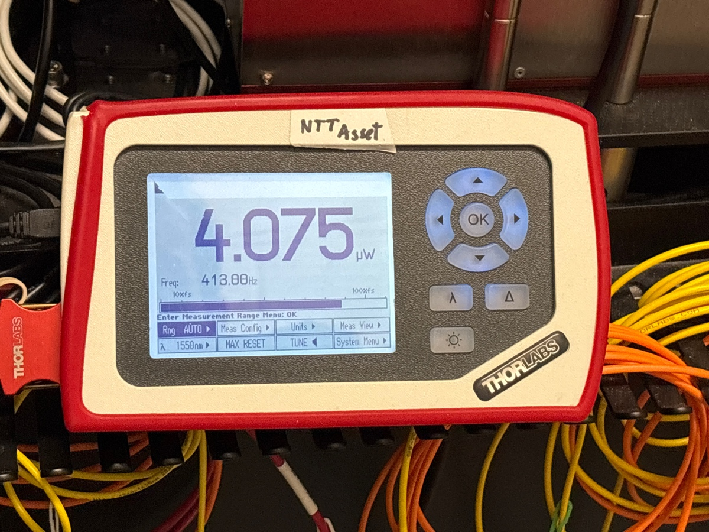
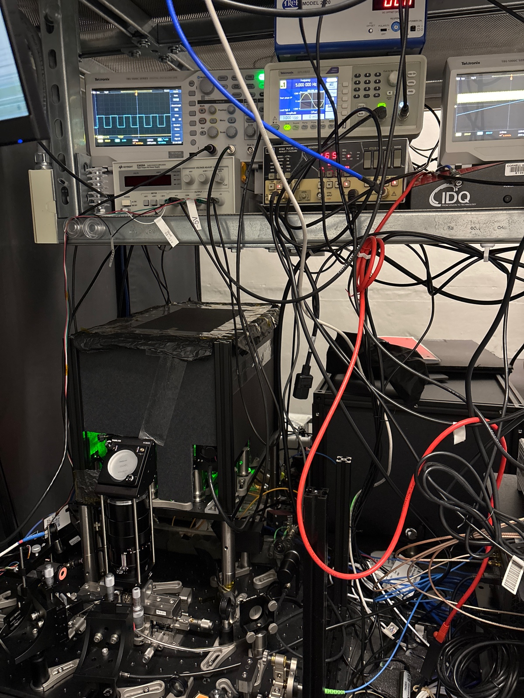
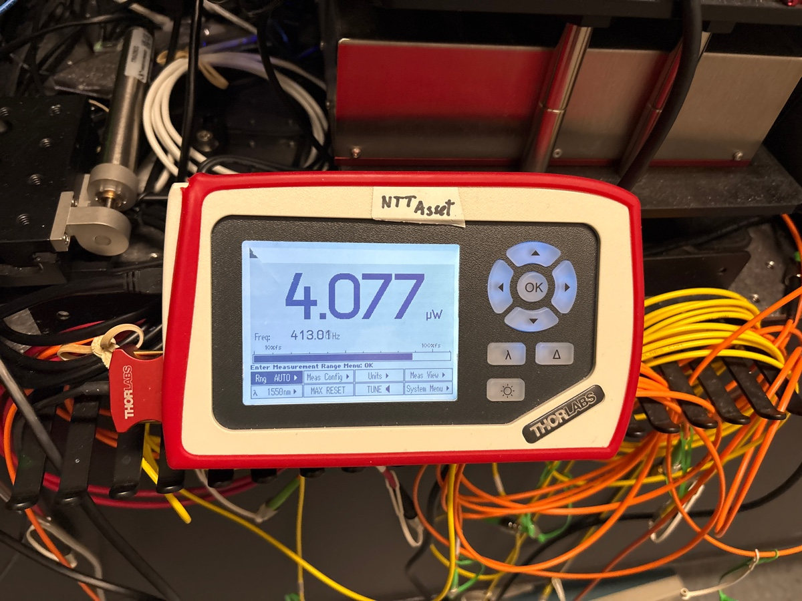
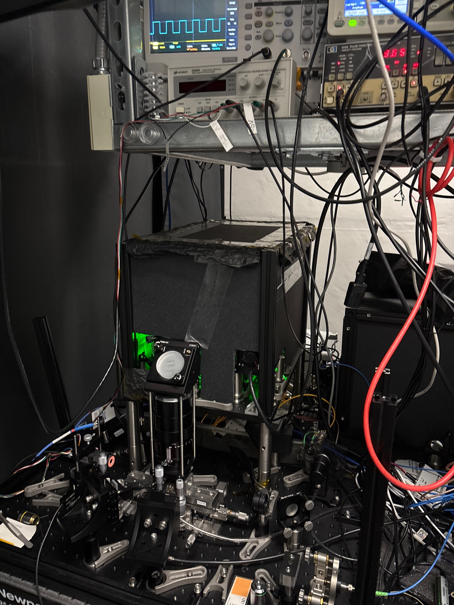
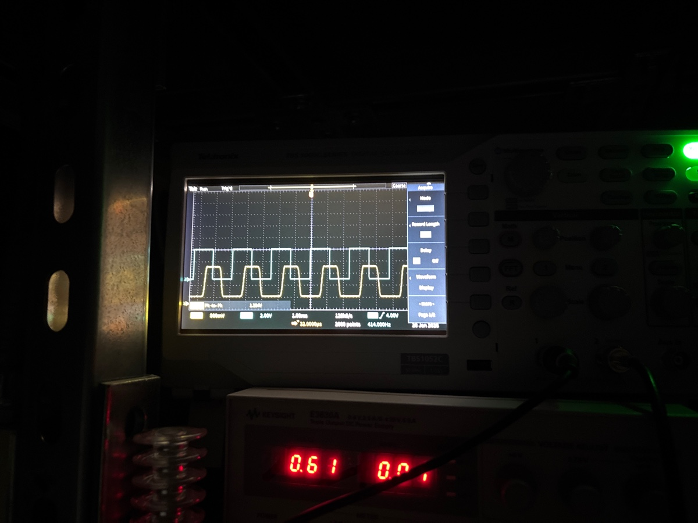
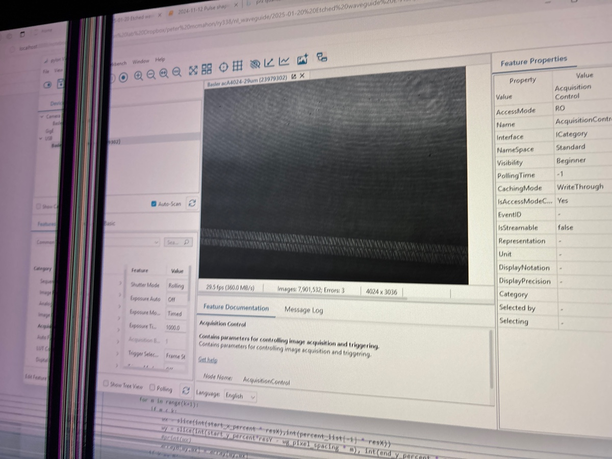

# 2025-1-27 cw output from etched bent waveguides 1
Using the etched bent waveguides, we hope to learn a bit about adjusting the phase of different parts of the poling structure to show quadratic phase increase.  

So I am having a lot of difficulty seeing signal. Below is what I have for power of CW laser with everything running

I don’t see any signal though. Now, when I plug the 

With the pulsed laser in

I checked both signals with the card and we are good

Now we see signal

I am poling the length of one waveguide

My intuition here is that the setup is aligned, but something else is amiss. I am going to do a quick poling period scan, but I believe the crux issue here has to do with phase matching

I am also coupling 1600

No signal, with zoomed in picked

Notice y scale is a bit different 

Before, we found the ideal poling period to be 14.6. We are now going to scan around that

Pitifully weak signal, could not see anything that did not look like noise. Let’s try to slowly vary poling distance 

What we see

Nothing useful yet.  I think the next best thing to do is pole a small length of waveguide and scan the poling period there

Still no dice

This is a bit surprising to me, as we are literally poling a bent waveguide.  One possibility is that the material loss is higher than we think, and doing 3cm is the issue here.

No dice on other waveguide

Lets try a scan over a wider array of values.  While I know Ryo says we should increase the integration time, I can’t see anything with my eyes, which is the more concerning part.  I just don’t get why we have so little signal.  I don’t even think loss is a good explaination, as we saw nearly linear increase of SHG using pulsed light.  So I admit to being a bit dumb founded

Nothing for shorter region

Ok, so this is still strange.  Next, lets do poling over wider range of poling periods.

Still nothing.  Honestly, very surprising.  Next, lets try to do some longer poling periods.  Maybe we just moved way off the beaten track

For the upper limit

Below are Ryo’s old results

From this, I would tend to believe that we should look much more closely at the 1600 range with 12.5 as the poling period.  That being said, we did just scan that area and see nothing.  Keep in mind, he did this on a straight waveguide.  But something else that should be noted is that Ryo did not see a crazy shift in poling period.  Here is a link to his note for future reference: [https://tdwg.craft.me/etOAf7NIpUAmHx](https://tdwg.craft.me/etOAf7NIpUAmHx).

Below is the Loss plot for bent waveguide

I measured on the order of 0.8 mW coming out with fan turned off.  So it seems like we are close.  Plus, we are definately working near an optimal wavelength (of 1600), so I am now quite confused

Below is the plot as well for long poling of different straight waveguide.

The point here is to say that I don’t have a good hypothesis for why this is happening.  I checked electrical contact (and most importantly, I already saw SHG with the pulsed laser anyway).  I think a key point here is that we are always below the noise threshold.

1600 power

We loose some power going down to 1570, but this may still work

Nope on 1570

We saw maximum SHG before at 790, so maybe try 1580

Still no dice

Set the phase correctly, to make sure things are really overlapping correctly.  Add more samlpes in code.  Do extra integration.  More dark shielding, and increase the gain.  Power meter screen is pretty bad.  Easier to scan poling period than wavelength

So far, fine scan of poling period has not yielded any useful results.  This is really quite surprising.  For reference, our scan is from 14.5um to 14.75um with 4000 points.  This means a fineness of scan of 0.0000625 um.  For reference, Ryo’s previous scans had a fineness of 0.04 um.  So we are definately doing fine.  While we can expand the range of poling periods, I am really not sure that will help.  I just don’t understand why I see nothing.  Maybe just try a different waveguide? There is nothing that should make a bent waveguide so fundamentally different than a straight waveguide.  Shoot, we should just try to couple into a straight waveguide and see if we can reproduce the earlier results.  It might also be possible that are coupling into weird modes.  

For reference, our expected dispersion is below

It is definately possible that we are coupling into really fat waveguides.  Our waveguides go from 4 to 7 um wide.  It is possible that we are just coulping into an annoyingly fat waveguide or something else is amiss.  I say we try to couple into a new bent waveguide if these continue to not work

Looking at Ryo’s earlier results, it is important to look closely at them

Notice, that his large poling scan went from 12.3 to 12.7 for pulsed light.   My current scan goes from 14.5 to 14.75.  The second measurement is more consistent with Ryo’s CW experiment.  Now, I have done very large scans, but the idea is still there.  I still say we go to the narrower waveguide just to get closer to what we know already works.  It might also give me some needed practice aligning the system.  Because it is easy, I am going to setup a Santec programmable sweep for a poling period of 14.62

No Dice on longer poling scan

While it is course, the wavelength sweep did not do me much good either.  

So we have a few options.  Firstly, we can try to up the applied voltage a bit and refine alignment.  While I don’t love the hypothesis, it might just be possible that we are not efficently getting power out of the waveguide.  For this, we would have to still use CW light.  I would still assume that poling of 14.62 is roughly right.  I would also use 1580.  This distinction comes from the fact that pulsed light has much higher peak power.  

So as it turns out, the above measurements suck.  Someone turned the PMT off, so I was not collecting anything anyway

Still no more luck here.  

Lets really try to get the alignment to be optimal, and then if we get nothing, we can then try to do a different waveguide

An extra scan where I confirmed everything was working

At this point, we focus on alignment

Starting power before any alignment (no back objective focusing)

Input power

After visual inspection, I know I am coupling into the 5.5 um waveguide.  I also know the top of the pylon camera view is the beginning of the waveguide, and the part I have been poling thus far.  