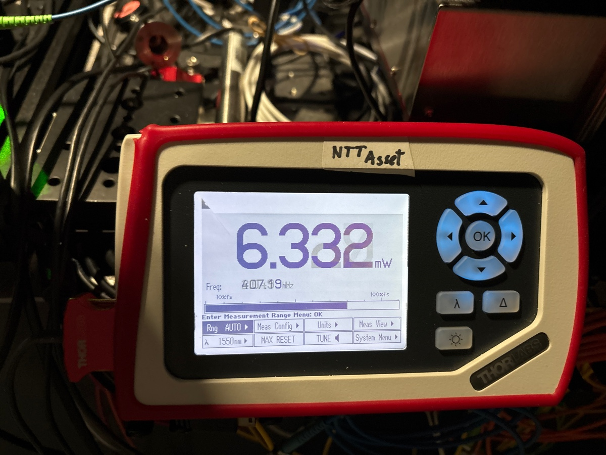
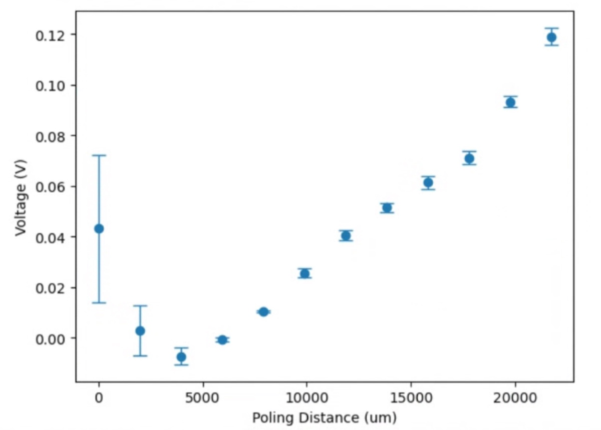
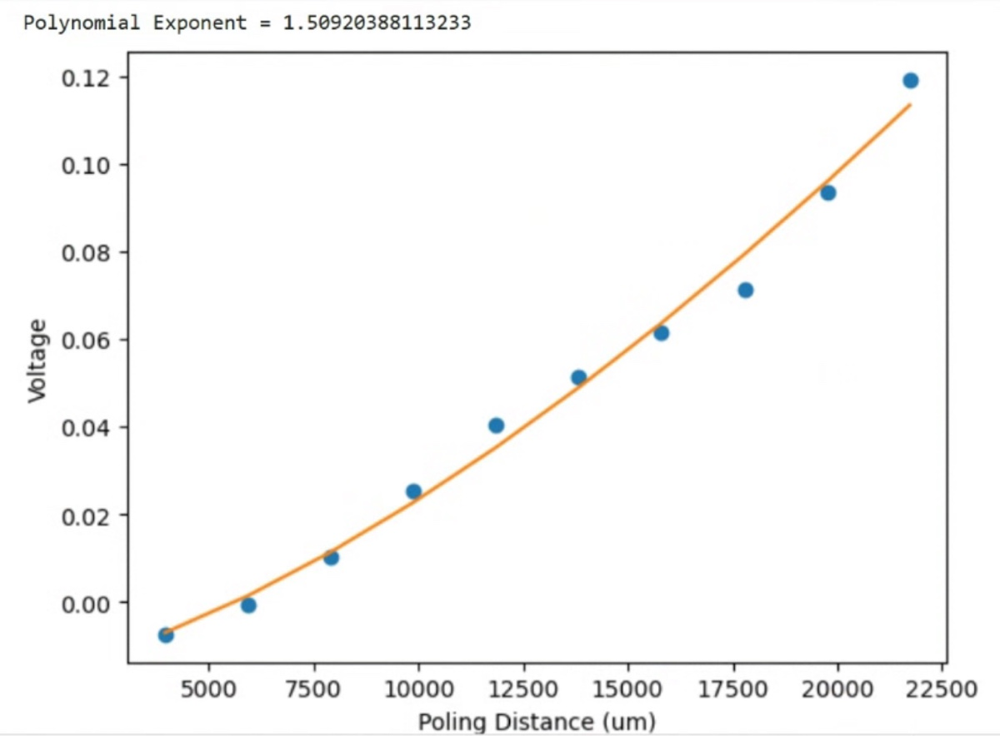
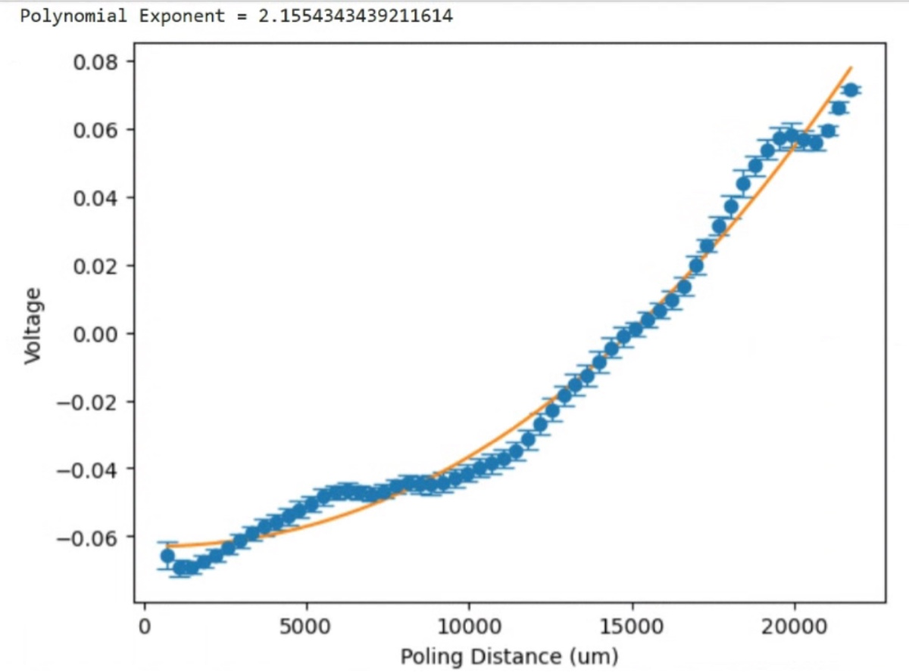

# 2025-2-17 perturbative and piecemeal approuch to quadratic scaling 1
This is a follow up study to the preivous efforts to show quadratic scaling of the SHG on the snake etched waveguides.  Firstly, we did not plug in the EDFA correctly last time, so we used the right fibers this time.  Below is the maximum output power that we could achieve.

Now, we will run a scan similar to how we ended the last document.  First, we will find the optimal phase for each of the top two branches (assuming the bottom is zero). We will then do a phase-poling period sweep of each waveguide branch, and once the optimal condition is found, we will update the optimal conditions and sweep other areas.  By doing this scan many times over, we might converge to some optimal solution.  My only concern is how repeatable everything will be, so we will need to use a somewhat high n_itr.  We could also start to partition the waveguide into more chuncks and keep doing this

The other option, which Ryo proposed, is to randomly perturb the waveguide parameters (so phase and poling period).  If the perturbation is good, we accept it, elsewise we reject it.  This might be a faster way, though it feels like it may not actually be super repeatable or converging to the global max (instead of local max).

As a quick note on the first perutrbation experiments.  It seems like the code is working, only that we are not really seeing any positive effect from perturbation increasing signal.  I also find there is some RC constant memory for the device to loose the grating

We are going to try another scan with longer time between iterations and change of direction (start top right instead of top left).  I am also going to increase the number of points

Below are some early results from perturbation optimiazation

Ryo’s inclanation is that I am not leaving nearly enough time between the data collections, seeing the the oscilloscope takes 15 seconds to average new power.  So I should make n_itr 1 and leave 15 seconds between data points.  We could kinda see this earlier as well

Above is the baseline scan using much longer step time to allow the oscilliscope to do a full average.  Now we will try to do perturbation again

It still feels like we have stability issues.  I am going to try some of the earlier versions for size

By picking a different point from the optimization, I get slightly better scaling, but not insanely better.  At some level, I am tempted to do a stability test, but first I want to do more perturbations and see if that improves anything.

It seems like the perturbative approuch is going backwards.  Honestly, this is pretty disappointing.  I am going to do a few more scans but I think we should focus on stability and homodyne detection

So funny enough, with fewer points, some of the earlier optimal sections are not bad.  I will increase point count and try again

I want to do this scan a couple more times to understand my varience

We have some huge error bars.  We are now doing a stablity test by turning on a pattern, leaving it be for 30 seconds, taking data, and doing the same for a totally off pattern.  We will do this 60 times, so this tests stablity over an hour

Video during scan

[Video from Library.mov](https://resv2.craft.do/user/full/c10b6666-b4fd-53a0-9177-1696a144b2d8/doc/EDA775BB-E2CC-497F-84DB-B77D257B6C40/2B2B728C-D268-445C-98D8-681B4D65B385_2/mrqrg3QaVZhsKkNJMMpGbLh2lbyJyDU3tIAvuS7URM8z/Video%20from%20Library.mov)

Below is the stability plot

A few quick notes. Please start scan on top left and go to bottom right, as that is how the setup is oriented

Below is angle scan by the way:

