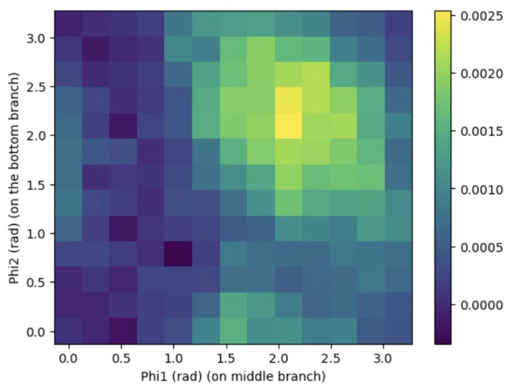
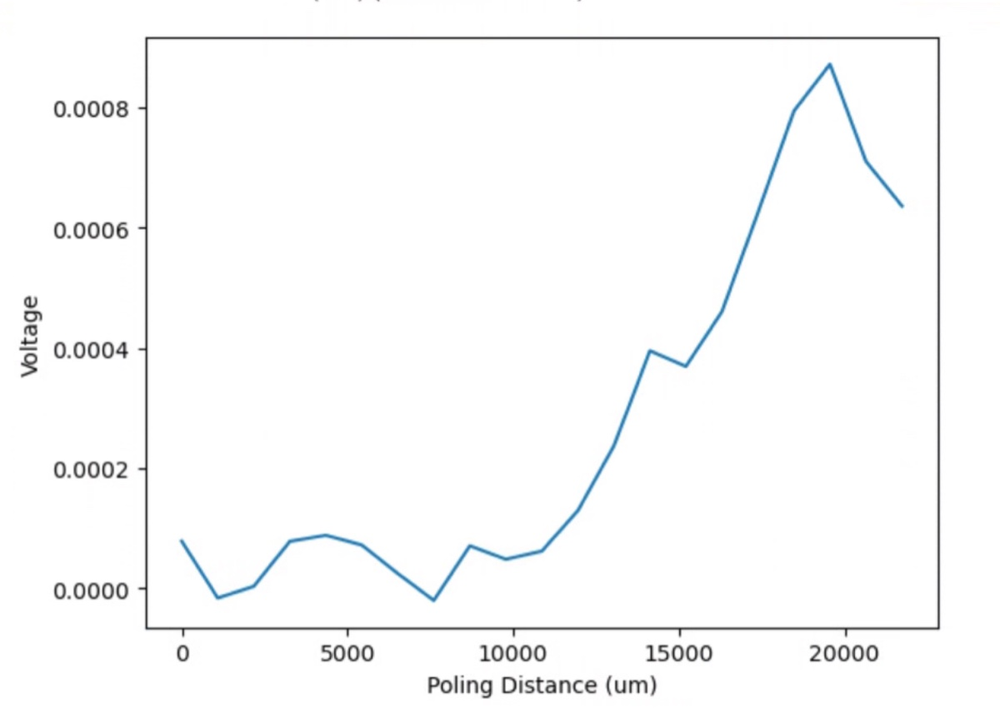
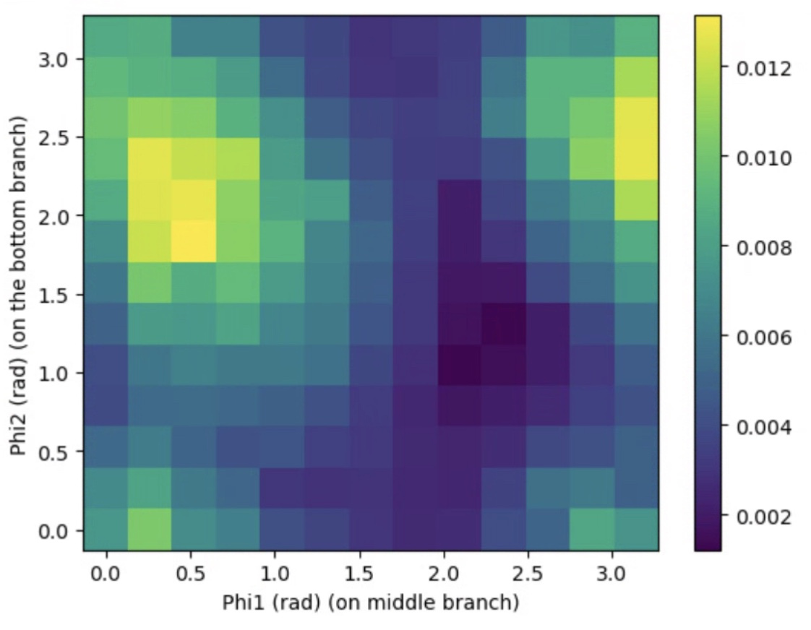
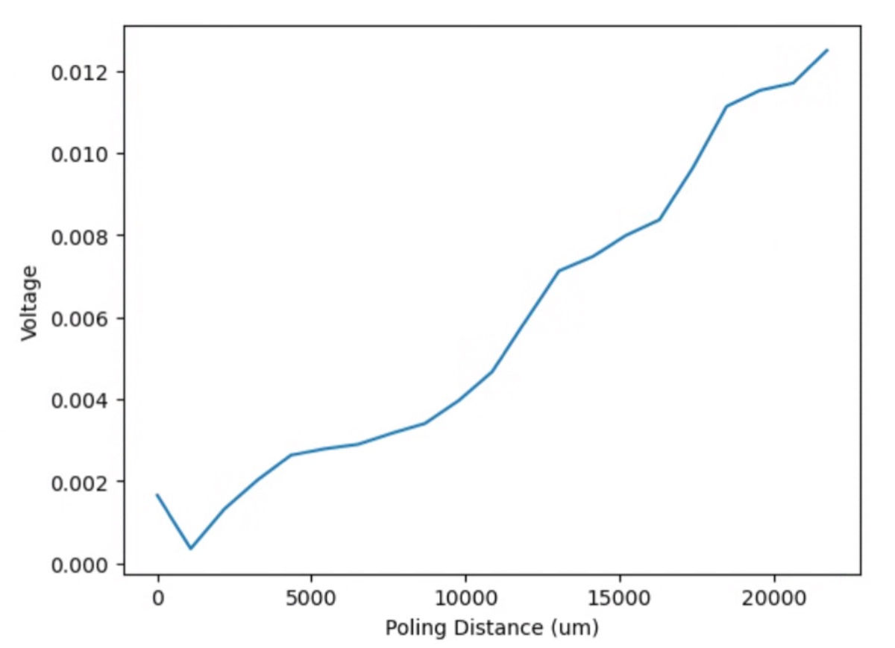
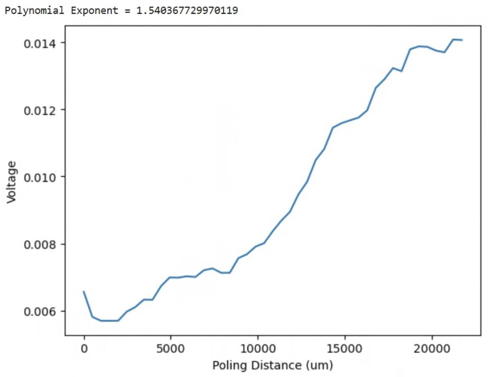
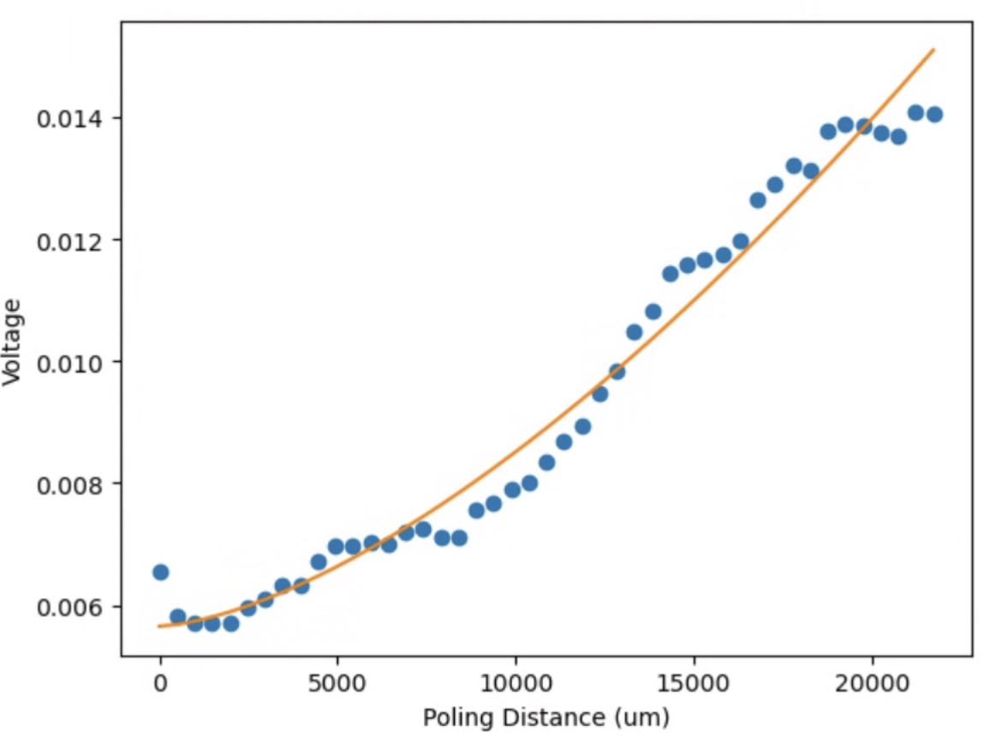

# 2025-2-9 quadratic scaling of shg for etched bent waveguides
Now comes the fun part.  We are going to try to show quadratic scaling as we increasing the poling amplitude.  To do this, we are going to have to optimize the phase and poling period for each additional poling amplitude increase.  This may be hard, as short poling amplitude may not give us much signal.  

We are trying two methods at doing this, the quick and the thorough.  For the quick method, we are doing to do a three branch phase scan and find the optmial phases for the two lower waveguide.  We are then doing to increase the poling distance using the correct phases.  It should also be noted that we will increase the poling distance along the path of light flow, so each waveguide’s poling amplitude increase will occur in opposite directions as we go down the waveguide.

The longer option is to subdivide each waveguide into 3-4 pieces.  We then scan the poling period and phase of each waveguide as we add each successive bit.  Once we find the optimal poling period and phase, we move onto the next part.  This is definately a full parameter sweep, but I am worried that some of the early signals will be so weak that the first few points will kinda be BS.  It will also take a lot longer, as I am introducing poling period as a fully new degree of freedom.

Below is the first scan for the quick method, showing both the optimized phase and the output signal for increased poling amplitude.

pp = 14.825

The factor of 3 less signal is merely a coding mistake.  I can see some quadratic curve from the second two waveguides, but nothing from the first.  It is also a bit werid that I seem to see some destructive interference at the end, which I would not expect.  Lets try the other poling period

pp = 14.015

This is a bit more like it.  I am going to do a more thorough scan of the poling amplitude and do a curve fitting to see what our current exponent is.  For the curve below, n_itr = 5 and n_samples = 7, so it is pretty accurate

For reference, below is the form of our polynomial function

I am going to do one last really long scan and then move to the longer version

Another annyoing dip.  I almost suspect that wehn I go off the computer (or it sleeps), that causes the issue

I am going to do a quick extra few phase optimization scans followed by a more detailed poling scan.  I think I will generally find that this will get me an exponent of 1.6-1.7.  This looks fairly similar to what I had earlier as well.  Below is a zoom-in scan

Below is what we got before

At some level, this makes a bit more sense, so we are going to do another larger scan

The exponent is 1.6

Trying again, (as the previous one had weak signal).  Now 1.44.  The main issue is the end seems ot saturate a bit, and there seem to be some regions with a lot less efficency.  So that is an issue.  Anyway, I feel like the poling period scan will help.  Below is the result after doing the very long scan

It is just surprising to me that these poling period scans don’t converge as much.  The phase scans give very strong data, but poling period not so much.  It is weird that you can almost see destructuve interference.  Ryo had a good idea that we should try to quadratically and linearly chirp the poling periods for each waveguide to optimize, so that is what I am going to do.

I got more power from the laser using a fiber amplifier, with new average power using power meter as

Almost a factor of 3 better. I eventually got it up to 3.1.  There is probably still more room for improvement, but I feel as though I am in the sensitive regime where too much fiddling can destroy things

I also increased applied voltage to 12.5 and LED current to 4.325