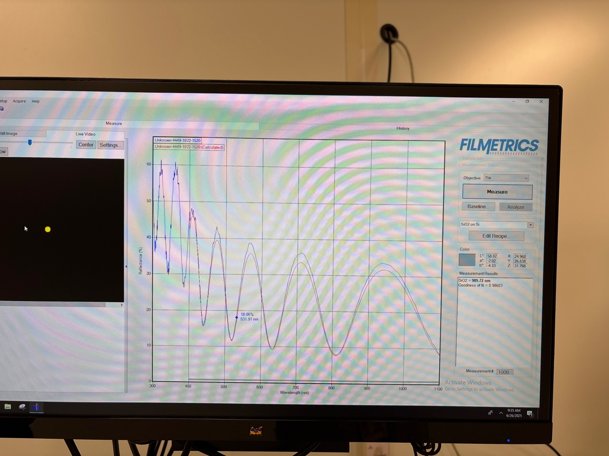
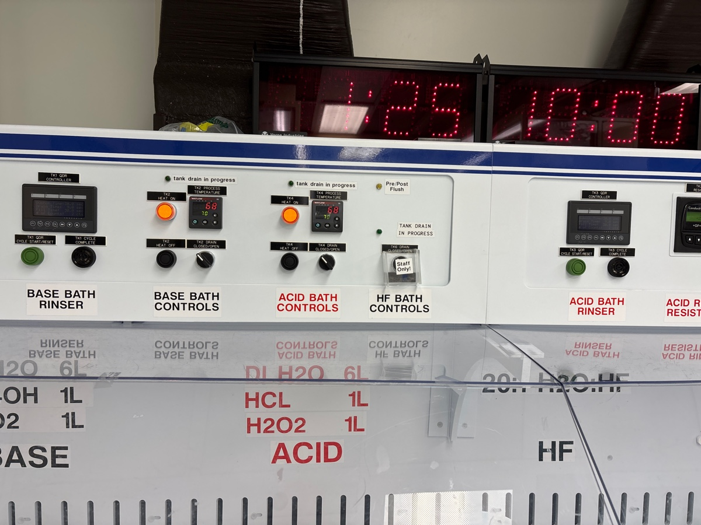
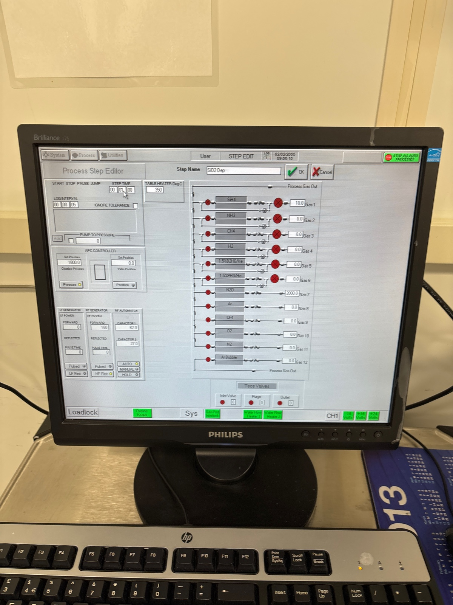
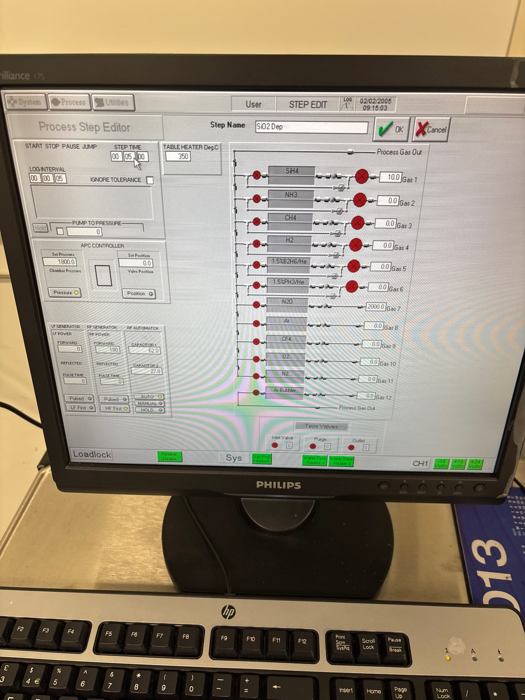

# 2025-6-26 wafer preparation for future mask improvements
It seems that our recent issues with loss have mostly sorted themselves out.  I am not quite sure why, but I am certain I will write down my thoughts in more detail in a future note.  I am just going to make some new wafers that I can use to test hard mask improvment recipes and test loss on.  One will be a thin SRN3 wafer (as a dummy), and the others with be SVM with a thinner top oxide mask.

### Cleaning and deposition

Check that guis wafer is indeed 1 um of oxide

During RCA clean

Before season

Before bottom dep

During

After 

Before season

During season

Before Main run

During

After

Before top cap season

We now do 6 minutes of top cap oxide to get 1 um

Before capping

During

Third wafer from front is today’s

### Wafers for further hard mask

Below are three SVM nitride wafers during RCA clean

Temp is a little low at start, but it’s ok

For thickness, we have ~700 nm of oxide left after etching.  I say we simply deposit 1000 nm of top oxide.  This means ~6 minutes of deposition.  In the past, I did 9 to get 1500, so this makes sense

We now do a 1 minute season

Before first dep

Run again on another wafer

Last one (I doubt flaking will kill a hard mask)

After capping

