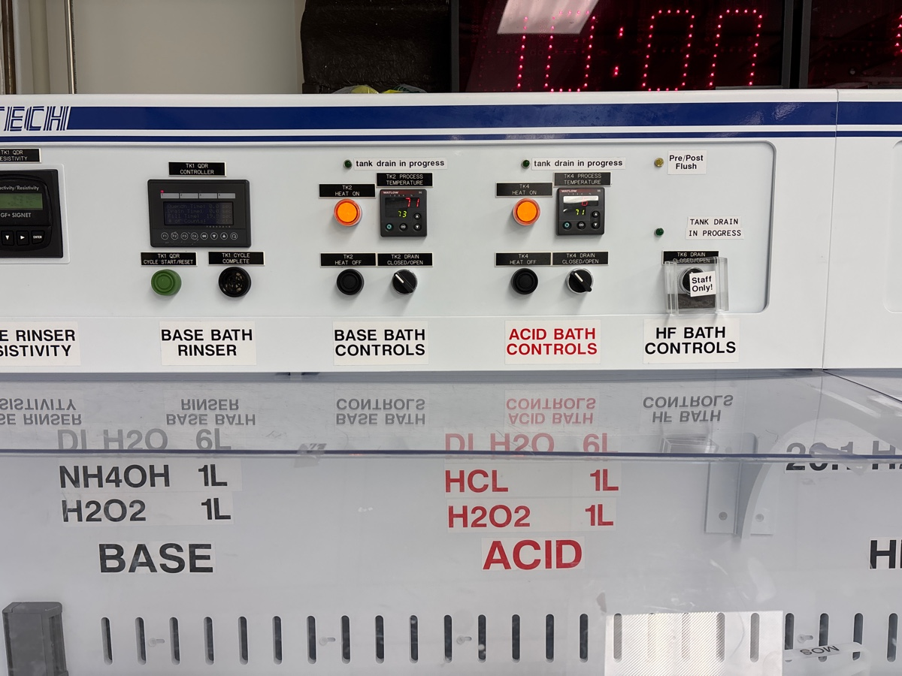

# 2025-7-1 srn3 cap and stress test
We sem to have converged onto the optimial device fabrication scheme for our final 1D nonlinear waveguide devices.  We have confirmed that the tapers do not cause much extra loss and that BOE dips to remove the oxide hard mask also do not increase loss.  We know the final oxide hard mask recipe we should use as well. We already have SRN3 wafers in waiting, which have ~2100 um of SRN3.  This is almost exactly what we had from SVM.  Below is the procedure I say we follow:

1. RCA clean and cap oxide deposition.  We deposit cap oxide for 6:35 to get ~1100 nm using the smooth recipe on PECVD
2. Spin coat ARC and 800 nm of DUV resist.  We found that a dose of 20 is a bit of an over exposire, so lets use a dose of 18. Develop after with Gamma
3. Descum for 1:20 using 81/82. 
4. Clean 100 for 5-10 mins, run a 1 minute season, and etch the oxide for 6:40 mins.  Do Ecoclean for 5 minutes and piranha.  Check depth after in profilometer and ellipsometer.
5. Clean 100 for 8 minutes, season for 2 minutes, and do a 5:25 etch to clear nitride. After etch, BOE dip for 45 seconds. Run ecoclean + piranha as well if you want
6. Deposit capping oxide with 9 minute smooth deposition.
7. RCA clean and do 1100 C anneal.  Ramp anneal for 2 hours and run main anneal for 5 hours.

We will be making two wafers.  One will be used for 1100 C anneal today, and the other for 1200 C anneal in the future.  While there is some legitimate debate as to whether it is best to put an oxide cap ontop, I am going to do that for now.  For one, this will help get rid of any hydrogen in my PECVD oxide.  More importantly, it will proect the waveguides from contamination.  In theory, no cap might be better because it would not create surface trap sites for defects and might allow the material surfaces to smoothen more.  But for now, we play it conservative.  We are making two wafers because we are paranoid about the etching process not working again in the future for no reason at all.  

### RCA and hard mask deposition

I was following JVD as he moved my stuff around for me.

I am running 10 minute clean on PECVD.  Will do 1 minute season next

Before seasoning

Before first deposition

During

We now do an 8 minutes clean

Before second season

Before second dep

During

After

### Photolithography 

Before ARC

We are going to process both wafers together during this run

Run failed, and it won’t take my wafers. I am going to strip the arc from the one wafer that was coated 

Below is the bow

Color changed as I stripped arc

Other wafer

So there are fairly compressive wafers

Below is the thinner 800 nm wafer (which worked in the past)

The end point, as sad as it is to say, is that SRN3 at 2um is simply too stressy.  I don’t think this can be fully blamed on the oxide, as the SRN3 is quite compressive.  The solution instead seems to be to make the SRN more tensile.  This should be possible with some short anneals.  We are going to take some of the SRN3 wafers and do some RTA.  We can start at 400 C and work up in steps of 100 C.  We will dwell at max temp for 5 mins.  The hope is this can help correct the wafer bow.  Elsewise, we do SVM and make a waveguide that can test the taper.

### RTA

400

Calibrating

During

After

No signs of cracking

If you noticed, stress already cahnged sign.  Lets do another at 400 just to see what happens

During

After 

Other orientation

I am going to plot the bow below

Below are the things we learned:

1. The gamma needs wafers with minimal wafer bow to operate correctly. Garry claims we want low bow compressive ideally
2. The SRN3 (with oxide cap) start with very huigh compressive bow at 90 um.  This makes me suspect that the SRN3 (after deposition) is somewhat compressive
3. RTA seems to change the material stack (most likely the SRN3 layer), such that it is more tensile.  
4. The index of refraction does not change much as we increase the RTA time, but the bow does.  So they are somewhat decoupled
5. It seems the bow changes with RTA time.  We get the most change at the beginning.

It seems we should use the other SRN3 wafer and anneal for 200 seconds at 400 C.  This should give us something functional.  

Baseline measurement of the SVM bow with oxide cap (as a target)

We are have a baseline now

Front wafer in box is the one that we did RTA to.

We want to make the back wafer work as a final device right now.  Based on our above characterization, lets try 180 seconds in RTA on that wafer to see if we get the right stress.  Below is the baseline bow measurement

Calibration

During main

After

Re clean in piranha, starting with back